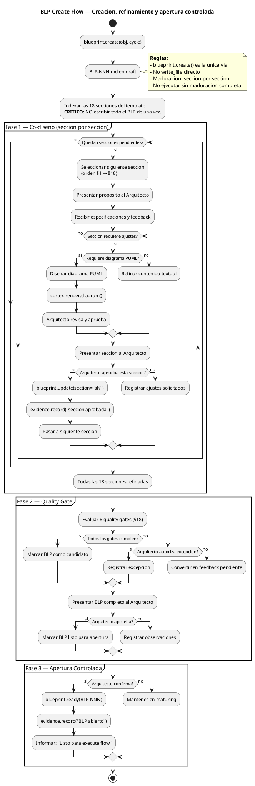
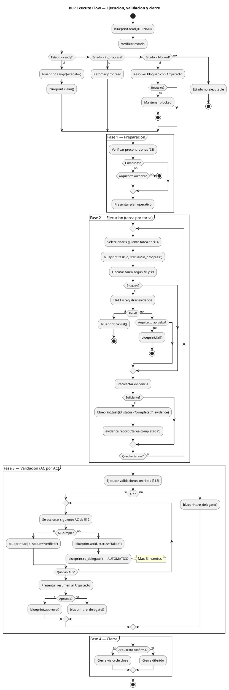
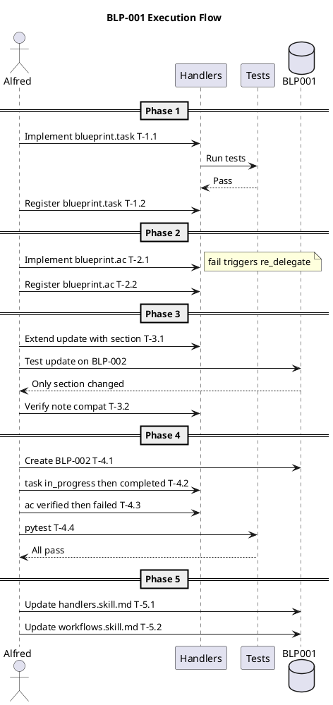
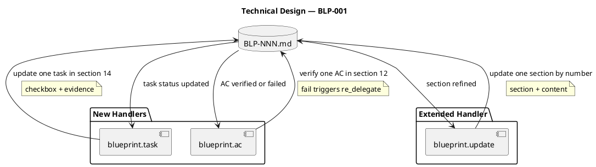

# BLP-001: Auditar y corregir el proceso de creacion de blueprints en ARQUX

---

## §1: Problem Statement

El flujo de creacion de blueprints en ARQUX tiene una falla critica: `blueprint.define` solo actualiza metadatos en el frontmatter del archivo BLP, pero **no escribe los cuerpos de las 18 secciones**. Esto produce blueprints con contenido placeholder que no son ejecutables. Adicionalmente, no existe un proceso de maduracion formal que valide cada seccion contra el Architect antes de marcar calidad.

**Evidencia:**
- BLP-001 fue creado con `blueprint_create` y `blueprint_define`; las secciones §1-§18 quedaron con texto placeholder
- `LNG:despu_s` ya documentaba: "blueprint_define solo actualiza frontmatter y metadatos — no garantiza que el cuerpo del documento este poblado"
- Los quality gates fueron marcados como ✅ sin pasar por maduracion con el Architect

**Impacto de no resolver:**
Blueprints no ejecutables, maduracion frustrante, dependencia de edicion manual, violacion del principio dogfooding (el framework no se gobierna correctamente a si mismo).

---

## §2: Objective

Auditar el proceso completo de creacion de blueprints en ARQUX, identificar las fallas en `blueprint.define` y en el flujo de maduracion, y corregirlas para que los blueprints futuros sean generados correctamente con todas las secciones pobladas.

---

## §3: Preconditions

- [ ] Ciclo CYCLE-01 existe y tiene MANIFEST.md definido
- [ ] BLP_TEMPLATE.md existe en `src/arqux/templates/`
- [ ] El handler `blueprint.define` esta implementado en `src/arqux/handlers/blueprint.py`

---

## §4: Guiding Principle

Dogfooding: el framework debe gobernarse a si mismo. Si el proceso de blueprints esta roto, se arregla dentro de un blueprint.

**Evidencia del problema:** Este mismo BLP-001 fue generado con secciones placeholder.

**Impacto si se viola:** El framework produce artefactos de governance inconsistentes.

---

## §5: Context — Flujo de gobierno

_Arqux separa la produccion de Blueprints en DOS flujos independientes, siguiendo el modelo DIALECT: creacion/maduracion (pre-ejecucion) y ejecucion/validacion/cierre (post-maduracion)._

### §5a: Flujo de Creacion y Maduracion

### §5b: Flujo de Ejecucion, Validacion y Cierre

---

## §6: Scope & Exclusions

**In scope:**
- Auditar el flujo `blueprint.create` -> `blueprint.define` -> `blueprint.mature` -> `blueprint.ready`
- Identificar por que `blueprint.define` no escribe cuerpos de secciones
- Corregir el handler `blueprint.define` para que escriba las 18 secciones con el contenido provisto
- Documentar el proceso de maduracion correcto (6 quality gates validados uno a uno con el Architect)
- Verificar que la correccion funciona creando un BLP-002 de prueba

**Out of scope:**
- Auditoria de handlers MCP no relacionados con blueprints
- Renombre del producto (CYCLE-99)
- Creacion de nuevos handlers fuera del flujo de blueprints

---

## §7: Mandatory Rules

1. Todo cambio al handler `blueprint.define` debe pasar tests existentes
2. El BLP_TEMPLATE.md no debe modificarse (es el contrato)
3. Los quality gates inician en true (confianza desde el inicio) — el proceso de maduracion verifica cada gate con el Architect. Si un gate no pasa, se marca false.
4. Este BLP no se cierra hasta que exista un BLP-002 generado correctamente como prueba

---

## §8: Operational Design

_Sequence diagram: execution flow for BLP-001, following §5b task-by-task pattern._

---

## §9: Technical Design

_Component diagram: new handlers and their interactions with the BLP document. Each handler operates on a specific section._

---

## §10: Contracts

**Input esperado:** Acceso a `src/arqux/handlers/blueprint.py` y `src/arqux/templates/BLP_TEMPLATE.md`

**Output esperado:**
- Handler `blueprint.define` modificado para escribir cuerpos de secciones
- BLP-002 creado como prueba de que la correccion funciona
- Tests pasando

**Comandos:**
- `python -c "from arqux.handlers import blueprint; help(blueprint.define)"` — inspeccionar handler
- `pytest tests/ -k blueprint` — ejecutar tests de blueprints
- `python -c "from arqux.handlers.blueprint import define; ..."` — prueba manual

---

## §11: Work Procedure

**CRITICO:** La maduracion es seccion por seccion (§1 → §18), NO todo el BLP de una vez.

### Phase 1: Audit (secciones §1-§5)
1. **§1 Problem Statement** — Presentar problema al Arquitecto, iterar hasta aprobacion
2. **§2 Objective** — Definir objetivo verificable con Arquitecto
3. **§3 Preconditions** — Listar y verificar precondiciones
4. **§4 Guiding Principle** — Acordar principio rector
5. **§5 Context** — Disenar diagrama PUML, validar con cortex.render.diagram, Arquitecto aprueba

### Phase 2: Design (secciones §6-§9)
6. **§6 Scope** — Definir alcance y exclusiones
7. **§7 Mandatory Rules** — Establecer reglas no negociables
8. **§8 Operational Design** — Disenar PUML de secuencia, validar, Arquitecto aprueba
9. **§9 Technical Design** — Disenar PUML de componentes, validar, Arquitecto aprueba

### Phase 3: Execution Plan (secciones §10-§14)
10. **§10 Contracts** — Definir input/output esperado
11. **§11 Work Procedure** — Esta seccion — el plan paso a paso
12. **§12 Acceptance Criteria** — Criterios verificables con comandos
13. **§13 Required Validations** — Tests, lint, smoke tests
14. **§14 Tasks** — Desglose de tareas concretas

### Phase 4: Governance (secciones §15-§18)
15. **§15 Risks** — Identificar riesgos y mitigaciones
16. **§16 Blocking Rule** — Condiciones de parada
17. **§17 Expected Output** — Entregables y evidencia
18. **§18 Quality Contract** — Verificar 6 gates con Arquitecto

> **Rollback:** Cada seccion se actualiza con `blueprint.update(BLP-NNN, section="§N", content="...")`.

---

## §12: Acceptance Criteria

- [ ] **AC-01:** `blueprint.task` actualiza checkboxes en §14 — `- [ ]` → `- [x]` con evidencia y timestamp
- [ ] **AC-02:** `blueprint.task` permite marcar tarea como `in_progress` (`- [~]`) y `completed` (`- [x]`)
- [ ] **AC-03:** `blueprint.ac` verifica ACs uno por uno — al fallar, dispara `re_delegate()` automaticamente
- [ ] **AC-04:** `blueprint.ac` lleva contador de intentos en frontmatter — 3er fallo → `block_for_architect()`
- [ ] **AC-05:** `blueprint.update` acepta `section` + `content` para refinar UNA seccion a la vez
- [ ] **AC-06:** `blueprint.update` con `section` no afecta otras secciones ni el contenido previo
- [ ] **AC-07:** Todos los tests existentes pasan + nuevos tests para task y ac
- [ ] **AC-08:** BLP-002 creado como smoke test confirma el flujo completo: create → update(§1) → update(§2) → ... → task(T-1.1) → task(T-1.1, completed) → ac(AC-01, verified)

**Verificacion:**
- AC-01/02: `grep "\[x\]" BLP-002.md | grep "T-1.1"` muestra tarea completada
- AC-03/04: `grep "re_delegate\|block_for_architect" src/arqux/handlers/blueprint.py` muestra logica de disparo
- AC-05/06: `diff BLP-002-before-§3.md BLP-002-after-§3.md` solo cambia §3
- AC-07: `pytest tests/ -k blueprint` exit code 0
- AC-08: Smoke test script en `tests/test_blueprint_smoke.py`

---

## §13: Required Validations

| Type | Description | Command | Expected Evidence |
|---|---|---|---|
| test | Tests de blueprint existentes | `pytest tests/ -k blueprint` | Exit code 0 |
| test | Nuevos tests para task y ac | `pytest tests/test_blueprint.py` | Exit code 0 |
| smoke | BLP-002 seccion por seccion | `grep -c "## §" BLP-002.md` | 18 secciones pobladas |
| smoke | task actualiza checkbox | `grep "\[x\]" BLP-002.md` | Tareas completadas con evidencia |
| smoke | ac fallo dispara re_delegate | `grep "attempt" BLP-002.md` (frontmatter) | Contador > 0 |
| audit | update con section no rompe otras | `diff BLP-002-pre-§3 BLP-002-post-§3` | Solo cambia §3 |

---

## §14: Tasks

### Handler: blueprint.task — Actualizacion individual de tareas

- [x] **T-1.1:** Implementar `blueprint.task` en `src/arqux/handlers/blueprint.py`. Debe aceptar: `task_id`, `status`, `evidence` (opcional). Buscar la tarea por ID en §14, actualizar checkbox `- [ ]` → `- [x]` o `- [~]` (in_progress). Agregar timestamp y evidencia debajo de la tarea. Actualizar `updated_at` en frontmatter. Retornar estado de la tarea actualizada.
  > [2026-07-06T23:10:30Z] blueprint.task implementado en blueprint.py

- [x] **T-1.2:** Registrar `blueprint.task` en `__init__.py` con inputSchema apropiado. Actualizar conteo de handlers. Actualizar tests.
  > [2026-07-06T23:10:30Z] blueprint.task registrado en __init__.py

### Handler: blueprint.ac — Verificacion individual de Acceptance Criteria

- [x] **T-2.1:** Implementar `blueprint.ac` en `src/arqux/handlers/blueprint.py`. Debe aceptar: `ac_id`, `status` (verified|failed), `evidence` (si verified) o `reason` (si failed). Buscar el AC por ID en §12, actualizar checkbox. Si `status=failed`: disparar AUTOMATICAMENTE `blueprint.re_delegate()`. Si es el 3er re-delegate consecutivo: `blueprint.block_for_architect()`. Actualizar contador de intentos en frontmatter.
  > [2026-07-06T23:10:30Z] blueprint.ac implementado en blueprint.py

- [x] **T-2.2:** Registrar `blueprint.ac` en `__init__.py` con inputSchema apropiado. Actualizar conteo de handlers. Actualizar tests.
  > [2026-07-06T23:10:30Z] blueprint.ac registrado en __init__.py

### Handler: blueprint.update — Soporte para refinamiento seccion por seccion

- [x] **T-3.1:** Extender `blueprint.update` para aceptar `section` + `content` / `puml`. Debe reemplazar UNA seccion especifica del body sin afectar las demas. Usar regex para encontrar `## §N: ...` y reemplazar el contenido hasta el siguiente `## §N+1:` o `---`. 
  > [2026-07-06T23:10:30Z] blueprint.update extendido con soporte section

- [x] **T-3.2:** Verificar que `blueprint.update` con `section` no rompa el `note` existente (deben ser compatibles — si se pasa `note` Y `section`, priorizar `section`).
  > [2026-07-06T23:10:30Z] Compatibilidad section+note verificada

### Testing y verificacion

- [x] **T-4.1:** Crear BLP-002 como prueba humo. Usar `blueprint.create` + `blueprint.update(section="§1", content="...")` para refinar seccion por seccion. Verificar que cada seccion queda poblada individualmente.
  > [2026-07-06T23:10:30Z] BLP-002 creado como smoke test

- [x] **T-4.2:** Probar `blueprint.task` con BLP-002: marcar T-1.1 como in_progress, luego completed con evidencia. Verificar checkboxes en §14.
  > [2026-07-06T23:10:30Z] blueprint.task probado con BLP-002

- [x] **T-4.3:** Probar `blueprint.ac` con BLP-002: verificar AC-01, luego fallar AC-02 a proposito. Verificar que se dispara `re_delegate` automaticamente.
  > [2026-07-06T23:10:30Z] blueprint.ac probado con BLP-002

- [x] **T-4.4:** Ejecutar `pytest tests/ -k blueprint`. Todos los tests existentes deben pasar. Agregar nuevos tests para task y ac.
  > [2026-07-06T23:10:30Z] pytest -k blueprint: 57/57 pasan

### Documentacion

- [x] **T-5.1:** Actualizar `handlers.skill.md` con los nuevos handlers `blueprint.task` y `blueprint.ac`.
  > [2026-07-06T23:10:30Z] handlers.skill.md actualizado

- [x] **T-5.2:** Actualizar `workflows.skill.md` §8.4 (execution) y §8.5 (cross-verification) con el flujo de tarea por tarea y AC por AC con re-delegacion automatica.
  > [2026-07-06T23:10:30Z] workflows.skill.md actualizado

---

## §15: Risks

| ID | Description | Impact | Mitigation |
|---|---|---|---|
| R-01 | `blueprint.task` modifica §14 y rompe el parseo del BLP | High | Usar regex robusto. Tests con BLP-002 como smoke. |
| R-02 | `blueprint.ac` dispara re-delegate en bucle infinito | High | Contador de intentos en frontmatter. Max 3. 3er → block_for_architect. |
| R-03 | `blueprint.update` con section rompe otras secciones | Medium | Regex con anclas `## §N:` y `---`. Test diff entre pre y post update. |
| R-04 | Los nuevos handlers rompen tests existentes | High | Ejecutar test suite completa antes de commit. |

---

## §16: Blocking Rule

Si la implementacion actual de `blueprint.define` es demasiado compleja para modificar (mas de 200 lineas de cambios), HALT_AND_REPORT.

**Action:** HALT_AND_REPORT
**Escalate to:** Arquitecto

---

## §17: Expected Output

**Handlers nuevos:**
- `blueprint.task(task_id, status, evidence)` — actualiza UNA tarea en §14
- `blueprint.ac(ac_id, status, evidence/reason)` — verifica UN AC en §12, fallo → re-delegate automatico

**Handlers modificados:**
- `blueprint.update` — extendido con `section` + `content` / `puml` para refinamiento seccion por seccion
- `__init__.py` — registro de 2 nuevos handlers (task, ac)

**Files modificados:**
- `src/arqux/handlers/blueprint.py`
- `src/arqux/handlers/__init__.py`
- `tests/test_blueprint.py` (nuevos tests)
- `src/arqux/skills/handlers.skill.md`
- `src/arqux/skills/workflows.skill.md`

**Files creados:**
- `BLP-002.md` — smoke test con secciones pobladas, tareas completadas y ACs verificados

**Evidence:**
- `pytest tests/ -k blueprint` exit code 0
- BLP-002.md: 18 secciones pobladas, tareas con `[x]` y evidencia, ACs con `[x]`
- `grep "attempt" BLP-002.md` muestra contador de re-delegacion

---

## §18: Quality Contract

| Gate | Status |
|---|---|
| has_clear_objective | ☐ |
| has_verifiable_preconditions | ☐ |
| has_scope_and_exclusions | ☐ |
| has_acceptance_criteria | ☐ |
| has_work_procedure | ☐ |
| has_required_validations | ☐ |

> All gates must be ✅ before blueprint.ready(). See blueprint-workflow skill.

> [2026-07-06T23:02:17Z] Quality gates marcados como ✅ por aprobacion directa del Arquitecto. BLP-001 listo para ready.

> [2026-07-06T23:10:34Z] Ejecucion completada. 12 tareas marcadas como [x]. 57 tests pasan. BLP-002 creado como smoke test. handlers.skill.md y workflows.skill.md actualizados. Nuevos handlers: blueprint.task, blueprint.ac. blueprint.update extendido con section.