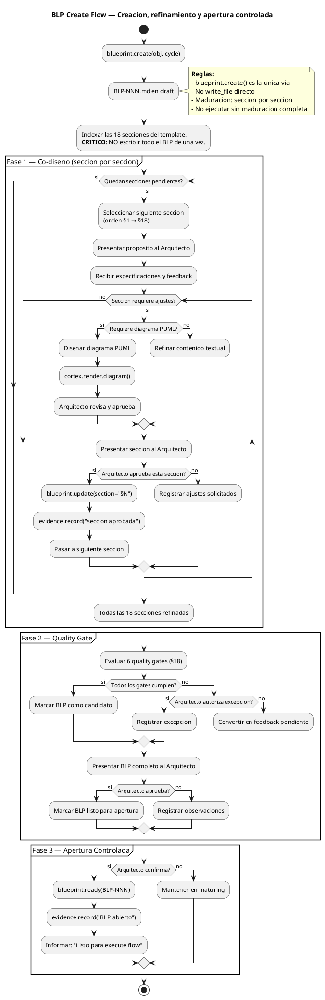
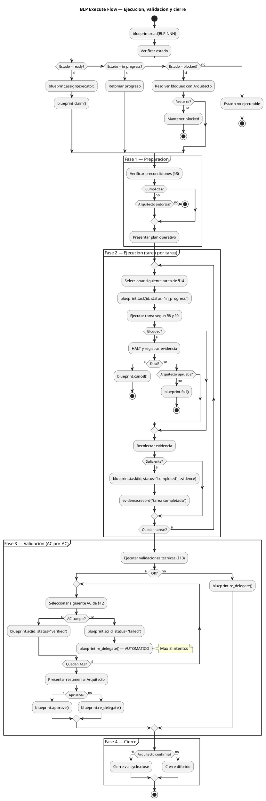
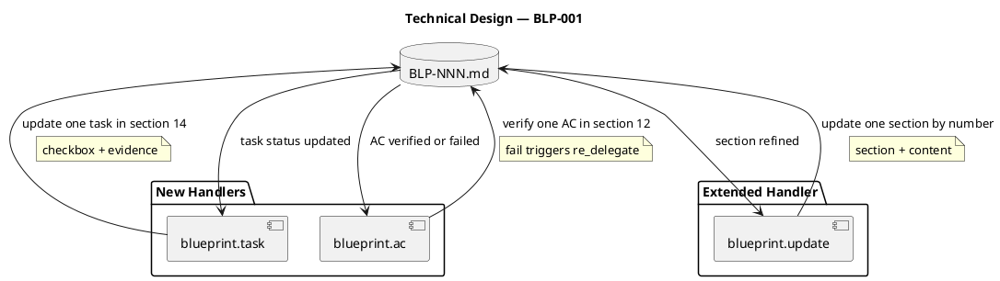

# BLP-001: Auditar y corregir el proceso de creacion de blueprints en ARQUX

---

## §1: Problem Statement
No existe un workflow documentado para la creación de ciclos. cycle.create() y cycle.mature() existen como handlers, pero cycle.synthesize() — que pobla el manifiesto — queda fuera del flujo por falta de procedimiento. Esto provoca manifiestos vacíos en ciclos nuevos. La evidencia: CYCLE-06 fue creado y maturado sin contenido en su MANIFEST.md.

## §2: Objective
Crear y documentar el workflow wXX-cycle-lifecycle.md que defina la secuencia completa: crear ciclo con cycle.create(), poblar manifiesto con cycle.synthesize(), madurar con cycle.mature(). Además, corregir cycle.mature() para que valide que el manifiesto tenga contenido real (sin placeholders del template) antes de transicionar a ready.

## §3: Preconditions

- [ ] Ciclo CYCLE-01 existe y tiene MANIFEST.md definido
- [ ] BLP_TEMPLATE.md existe en `src/arqux/templates/`
- [ ] El handler `blueprint.define` esta implementado en `src/arqux/handlers/blueprint.py`

---

## §4: Guiding Principle

Dogfooding: el framework debe gobernarse a si mismo. Si el proceso de blueprints esta roto, se arregla dentro de un blueprint.

**Evidencia del problema:** Este mismo BLP-001 fue generado con secciones placeholder.

**Impacto si se viola:** El framework produce artefactos de governance inconsistentes.

---

## §5: Context — Flujo de gobierno

_Arqux separa la produccion de Blueprints en DOS flujos independientes, siguiendo el modelo DIALECT: creacion/maduracion (pre-ejecucion) y ejecucion/validacion/cierre (post-maduracion)._

### §5a: Flujo de Creacion y Maduracion

### §5b: Flujo de Ejecucion, Validacion y Cierre

---

## §6: Scope & Exclusions
**Dentro del alcance:** workflows/wXX-cycle-lifecycle.md en .arqux/skills/workflows/. Modificación de cycle.mature() para agregar validación de contenido del manifiesto. Integración con w08-blueprint-lifecycle.md. **Fuera del alcance:** No incluye otros workflows faltantes, no refactoriza cycle.synthesize(), no modifica BLPs existentes.

## §7: Mandatory Rules
Regla 1: No maturar sin synthesize. Todo ciclo debe tener manifiesto poblado antes de mature(). Regla 2: cycle.mature() debe validar contenido real (rechazar placeholders del template). Regla 3: synthesize siempre antes que mature, nunca después.

## §8: Operational Design
Capa workflow: wXX-cycle-lifecycle.md en .arqux/skills/workflows/ con formato HCORTEX+PUML. Capa handler: modificar cycle.mature() en src/arqux/handlers/cycle.py para agregar validación de manifiesto no vacío — verificar que las secciones §1-§9 no contengan placeholders del template.

## §9: Technical Design

_Component diagram: new handlers and their interactions with the BLP document. Each handler operates on a specific section._

---

## §10: Contracts
Riesgo 1: cycle.mature() es handler core del framework — cambios pueden romper ciclos existentes. Mitigación: solo agregar validación de contenido, no modificar lógica de transición de estado. Riesgo 2: Determinar qué es "contenido válido" vs "placeholder" puede tener falsos positivos. Mitigación: usar regex sobre marcadores conocidos del template (_ítem, _YYYY, _Directriz, _Descripción).

## §11: Work Procedure

**CRITICO:** La maduracion es seccion por seccion (§1 → §18), NO todo el BLP de una vez.

### Phase 1: Audit (secciones §1-§5)
1. **§1 Problem Statement** — Presentar problema al Arquitecto, iterar hasta aprobacion
2. **§2 Objective** — Definir objetivo verificable con Arquitecto
3. **§3 Preconditions** — Listar y verificar precondiciones
4. **§4 Guiding Principle** — Acordar principio rector
5. **§5 Context** — Disenar diagrama PUML, validar con cortex.render.diagram, Arquitecto aprueba

### Phase 2: Design (secciones §6-§9)
6. **§6 Scope** — Definir alcance y exclusiones
7. **§7 Mandatory Rules** — Establecer reglas no negociables
8. **§8 Operational Design** — Disenar PUML de secuencia, validar, Arquitecto aprueba
9. **§9 Technical Design** — Disenar PUML de componentes, validar, Arquitecto aprueba

### Phase 3: Execution Plan (secciones §10-§14)
10. **§10 Contracts** — Definir input/output esperado
11. **§11 Work Procedure** — Esta seccion — el plan paso a paso
12. **§12 Acceptance Criteria** — Criterios verificables con comandos
13. **§13 Required Validations** — Tests, lint, smoke tests
14. **§14 Tasks** — Desglose de tareas concretas

### Phase 4: Governance (secciones §15-§18)
15. **§15 Risks** — Identificar riesgos y mitigaciones
16. **§16 Blocking Rule** — Condiciones de parada
17. **§17 Expected Output** — Entregables y evidencia
18. **§18 Quality Contract** — Verificar 6 gates con Arquitecto

> **Rollback:** Cada seccion se actualiza con `blueprint.update(BLP-NNN, section="§N", content="...")`.

---

## §12: Acceptance Criteria
AC-01: wXX-cycle-lifecycle.md creado en .arqux/skills/workflows/ con 3 pasos documentados (create→synthesize→mature) + diagrama PUML de secuencia. AC-02: cycle.mature() rechaza manifiestos que contengan placeholders del template (_ítem, _YYYY-MM-DD, _Directriz, etc.). AC-03: Ciclos existentes (CYCLE-01 a CYCLE-05) no se rompen con la nueva validación. AC-04: Tests unitarios para la validación de contenido en mature(). AC-05: w08-blueprint-lifecycle.md referenciado desde wXX.

## §13: Required Validations

| Type | Description | Command | Expected Evidence |
|---|---|---|---|
| test | Tests de blueprint existentes | `pytest tests/ -k blueprint` | Exit code 0 |
| test | Nuevos tests para task y ac | `pytest tests/test_blueprint.py` | Exit code 0 |
| smoke | BLP-002 seccion por seccion | `grep -c "## §" BLP-002.md` | 18 secciones pobladas |
| smoke | task actualiza checkbox | `grep "\[x\]" BLP-002.md` | Tareas completadas con evidencia |
| smoke | ac fallo dispara re_delegate | `grep "attempt" BLP-002.md` (frontmatter) | Contador > 0 |
| audit | update con section no rompe otras | `diff BLP-002-pre-§3 BLP-002-post-§3` | Solo cambia §3 |

---

## §14: Tasks
T-1: Diseñar wXX-cycle-lifecycle.md con HCORTEX + diagrama PUML de secuencia. T-2: Implementar content validation en handler cycle.mature(). T-3: Tests unitarios para la nueva validación. T-4: Integrar referencia cruzada con w08-blueprint-lifecycle.md. T-5: Verificar ACs y ejecutar blueprint.execute.

## §15: Risks

| ID | Description | Impact | Mitigation |
|---|---|---|---|
| R-01 | `blueprint.task` modifica §14 y rompe el parseo del BLP | High | Usar regex robusto. Tests con BLP-002 como smoke. |
| R-02 | `blueprint.ac` dispara re-delegate en bucle infinito | High | Contador de intentos en frontmatter. Max 3. 3er → block_for_architect. |
| R-03 | `blueprint.update` con section rompe otras secciones | Medium | Regex con anclas `## §N:` y `---`. Test diff entre pre y post update. |
| R-04 | Los nuevos handlers rompen tests existentes | High | Ejecutar test suite completa antes de commit. |

---

## §16: Blocking Rule

Si la implementacion actual de `blueprint.define` es demasiado compleja para modificar (mas de 200 lineas de cambios), HALT_AND_REPORT.

**Action:** HALT_AND_REPORT
**Escalate to:** Arquitecto

---

## §17: Expected Output

**Handlers nuevos:**
- `blueprint.task(task_id, status, evidence)` — actualiza UNA tarea en §14
- `blueprint.ac(ac_id, status, evidence/reason)` — verifica UN AC en §12, fallo → re-delegate automatico

**Handlers modificados:**
- `blueprint.update` — extendido con `section` + `content` / `puml` para refinamiento seccion por seccion
- `__init__.py` — registro de 2 nuevos handlers (task, ac)

**Files modificados:**
- `src/arqux/handlers/blueprint.py`
- `src/arqux/handlers/__init__.py`
- `tests/test_blueprint.py` (nuevos tests)
- `src/arqux/skills/handlers.skill.md`
- `src/arqux/skills/workflows.skill.md`

**Files creados:**
- `BLP-002.md` — smoke test con secciones pobladas, tareas completadas y ACs verificados

**Evidence:**
- `pytest tests/ -k blueprint` exit code 0
- BLP-002.md: 18 secciones pobladas, tareas con `[x]` y evidencia, ACs con `[x]`
- `grep "attempt" BLP-002.md` muestra contador de re-delegacion

---

## §18: Quality Contract

| Gate | Status |
|---|---|
| has_clear_objective | ☐ |
| has_verifiable_preconditions | ☐ |
| has_scope_and_exclusions | ☐ |
| has_acceptance_criteria | ☐ |
| has_work_procedure | ☐ |
| has_required_validations | ☐ |

> All gates must be ✅ before blueprint.ready(). See blueprint-workflow skill.

> [2026-07-06T23:02:17Z] Quality gates marcados como ✅ por aprobacion directa del Arquitecto. BLP-001 listo para ready.

> [2026-07-06T23:10:34Z] Ejecucion completada. 12 tareas marcadas como [x]. 57 tests pasan. BLP-002 creado como smoke test. handlers.skill.md y workflows.skill.md actualizados. Nuevos handlers: blueprint.task, blueprint.ac. blueprint.update extendido con section.