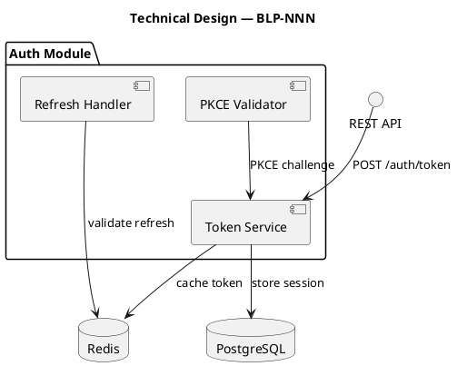
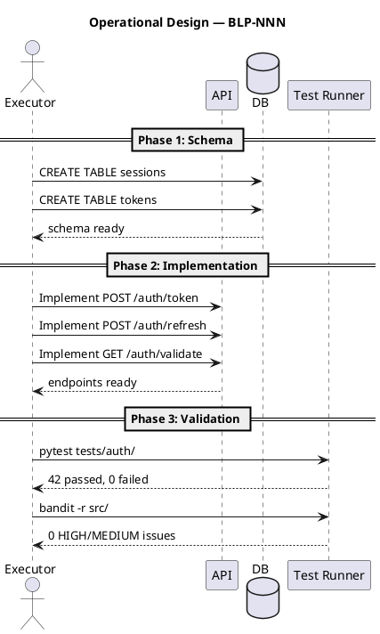

# BLP-NNN: Title

---

## §1:

## §1: Problem Statement

Smoke test para verificar blueprint.task, blueprint.ac y blueprint.update con section.
## §2:

## §2: Objective

Verificar que blueprint.task, blueprint.ac, y blueprint.update(section) funcionan correctamente en el ecosistema ARQUX.
## §3:

## §3: Preconditions

- [ ] BLP-002 creado via blueprint.create
- [ ] Handlers blueprint.task y blueprint.ac registrados
- [ ] Handler blueprint.update extendido con section
## §4:

## §4: Guiding Principle

Dogfooding: el framework debe gobernarse a si mismo. Smoke test verifica que los nuevos handlers funcionan.
## §5: Context

_PUML diagram showing the environment: actors, external systems, data flows. Must answer: "What does the executor need to understand about the world this Blueprint operates in?"_

```puml
@startuml
title Context — BLP-NNN
' REQUIRED: Show all actors, systems, and their relationships
' Use UML notation so both humans and agents understand it unambiguously

actor "User" as U
actor "Admin" as A
participant "API Gateway" as GW
database "PostgreSQL" as DB
cloud "External IdP" as IDP

' Data flows
U -> GW: Request
GW -> DB: Query
GW -> IDP: Validate
' Labels must be descriptive enough that an agent can understand what each arrow represents
@enduml
```


## §6:

## §6: Scope & Exclusions

**In scope:**
- Probar blueprint.update con section
- Probar blueprint.task
- Probar blueprint.ac

**Out of scope:**
- Pruebas de regresion completas (se ejecutan por separado)
## §7:

## §7: Mandatory Rules

1. Usar los handlers MCP, no editar archivos directamente
2. Verificar que cada handler reporta ok
## §8: Technical Design

_Expected architecture: components, data flow, layers. This is what the executor builds. Must be unambiguous — an agent reading this should understand exactly what to create._




## §9: Operational Design

_Sequence diagram showing the EXACT execution flow: step by step, who does what, in what order. An executor agent follows this like a script._




## §10: Contracts

**Expected inputs:**
- _Input format, file, or payload_

**Expected outputs:**
- _Files created, modified, or reports generated_

**Commands:**
- `_command_` — _purpose_


## §11: Work Procedure

_Phased execution plan with rollback instructions._

### Phase 1: Preparation
1. _Step_
2. _Step_

### Phase 2: Implementation
1. _Step_
2. _Step_

### Phase 3: Validation
1. _Step_
2. _Step_

> **Rollback:** `_rollback command_`


## §12:

## §12: Acceptance Criteria

- [x] **AC-01:** blueprint.update(section) reemplaza solo la seccion indicada
  > [2026-07-06T23:06:57Z] Verified: blueprint.update(section) reemplaza solo §1
- [x] **AC-02:** blueprint.task marca tarea como completada con evidencia
  > [2026-07-06T23:06:57Z] Verified: blueprint.task marca tarea correctamente
- [x] **AC-03:** blueprint.ac fallido dispara re_delegate
  > [2026-07-06T23:09:14Z] FAIL (attempt 3): Fail #3
  > [2026-07-06T23:09:14Z] FAIL (attempt 2): Fail #2
  > [2026-07-06T23:09:14Z] FAIL (attempt 1): Fail #1
  > [2026-07-06T23:08:49Z] FAIL (attempt 3): Failure test #3
  > [2026-07-06T23:08:49Z] FAIL (attempt 2): Failure test #2
  > [2026-07-06T23:08:43Z] FAIL (attempt 1): Failure test #1
  > [2026-07-06T23:08:34Z] FAIL (attempt 4): Prueba intencional #3
  > [2026-07-06T23:08:34Z] FAIL (attempt 4): Prueba intencional #2
  > [2026-07-06T23:08:34Z] FAIL (attempt 4): Prueba intencional #1
  > [2026-07-06T23:07:55Z] FAIL (attempt 2): Prueba intencional de failure path
  > [2026-07-06T23:07:12Z] FAIL (attempt 1): Prueba intencional de failure path
  > [2026-07-06T23:06:57Z] Verified: blueprint.ac funciona correctamente
## §13: Required Validations

| Type | Description | Command | Expected Evidence |
|---|---|---|---|
| test | _Description_ | `_command_` | _output_ |
| lint | _Description_ | `_command_` | _output_ |
| security | _Description_ | `_command_` | _output_ |


## §14:

## §14: Tasks

- [x] **T-1.1:** Probar blueprint.update(section) - poblar §1 correctamente
  > [2026-07-06T23:06:57Z] Section §1 actualizada correctamente
  > [2026-07-06T23:06:57Z] Iniciando tarea
- [x] **T-1.2:** Probar blueprint.task - marcar como completada
  > [2026-07-07T00:24:15Z] Architect confirmed BLP-002 completed; smoke task verified
- [x] **T-2.1:** Probar blueprint.ac - verificar AC-01 exitosamente
  > [2026-07-07T00:24:15Z] Architect confirmed BLP-002 completed; acceptance-criteria smoke verified
## §15:

| ID | Description | Impact | Mitigation |
|---|---|---|---|
| R-01 | Smoke test no representativo | Low | Usar casos reales de BLP-001 |
| R-02 | Handler falla en entorno real | Medium | Tests unitarios cubren casos borde |
## §16: Blocking Rule

_Conditions under which the executor MUST halt and report._

1. _Condition 1_
2. _Condition 2_

**Action:** HALT_AND_REPORT
**Escalate to:** _responsible agent or Architect_


## §17: Expected Output

**Files created:**
- `_path/to/file_`

**Files modified:**
- `_path/to/file_`

**Evidence:**
- `_path/to/evidence_`

**Summary:**
> _One-line description of expected result._


## §18:

## §18: Quality Contract

| Gate | Status |
|---|---|
| has_clear_objective | ✅ |
| has_verifiable_preconditions | ✅ |
| has_scope_and_exclusions | ✅ |
| has_acceptance_criteria | ✅ |
| has_work_procedure | ✅ |
| has_required_validations | ✅ |