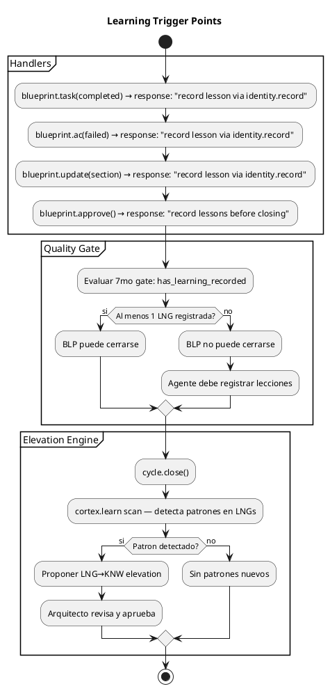
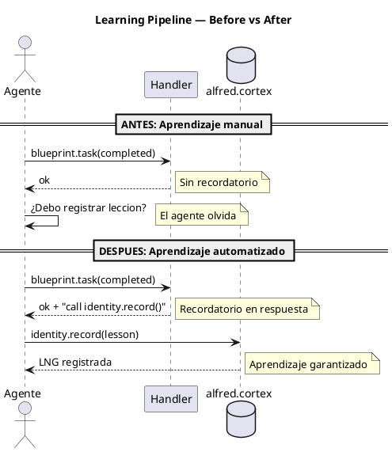
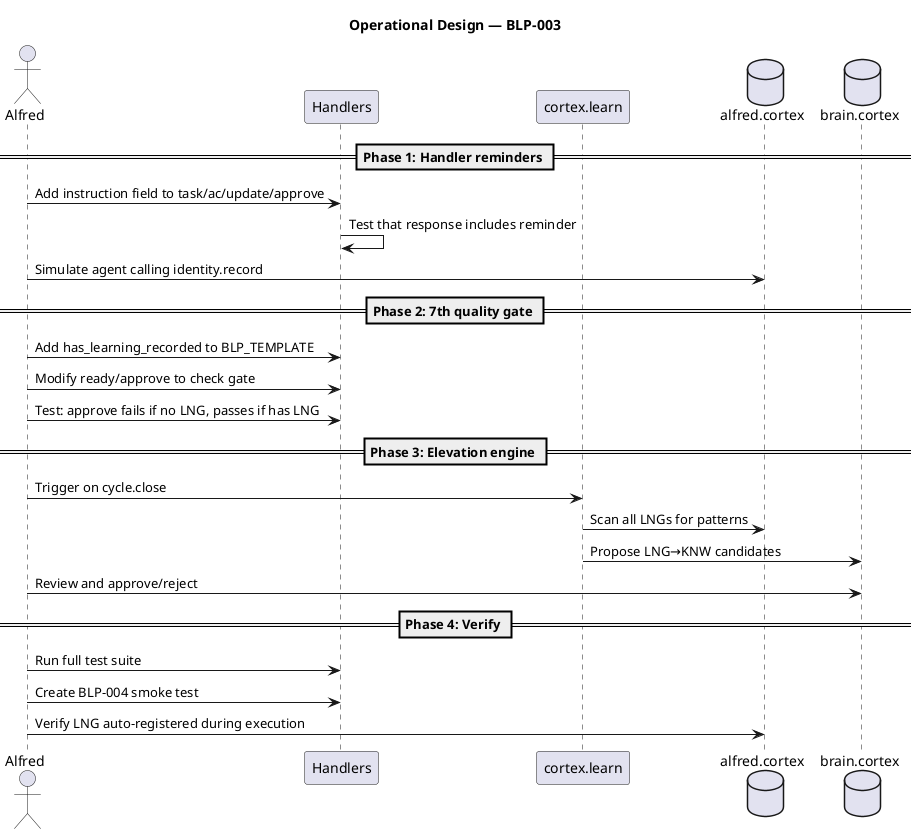
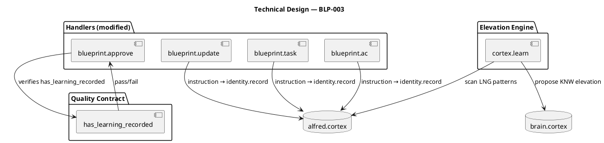

# BLP-003: Automatizar el pipeline de aprendizaje

---

## §1: Problem Statement

El pipeline de aprendizaje de Arqux (3 capas: conductual, contextual, procedimental) **se ejecuta pero no se alimenta**. Los handlers completan su trabajo pero no recuerdan al agente que debe registrar lecciones. El resultado: 17 LNGs acumulados en una sola sesion, pero cero de ellos provienen de la ejecucion automatica — todos fueron registrados manualmente por el Arquitecto o Alfred durante auditorias.

**Evidencia:**
- BLP-001 ejecutado completamente (blueprint.task y blueprint.ac implementados) → 0 LNGs registrados por el agente durante la ejecucion
- `LNG:el` y `LNG:los` documentan que los handlers no recuerdan identity.record
- `LNG:el` (2) documenta que falta un gate de aprendizaje en el Quality Contract
- El motor de elevacion `cortex.learn` (LNG→KNW) nunca se ha ejecutado en produccion

**Impacto de no resolver:**
El framework acumula lecciones sin procesar. Sin elevacion, el conocimiento se estanca en LNGs aislados. Sin recordatorios, los agentes olvidan registrar aprendizaje. Sin gate, un BLP puede cerrarse sin haber aprendido nada.

---

## §2: Objective

Automatizar el pipeline de aprendizaje para que:
1. Los handlers incluyan recordatorios de `identity.record` en su respuesta
2. El Quality Contract incluya un 7mo gate: `has_learning_recorded`
3. `cortex.learn` escanee patrones y proponga elevaciones LNG→KNW al cerrar ciclos
4. El aprendizaje sea medible: cada BLP cerrado debe tener al menos 1 LNG registrada

---

## §3: Preconditions

- [ ] Handlers `blueprint.task` y `blueprint.ac` existen (BLP-001)
- [ ] `identity.record` handler funcional
- [ ] `cortex.learn` y `cortex.learn.elevate` handlers existen
- [ ] 17 LNGs acumulados en alfred.cortex para probar elevacion

---

## §4: Guiding Principle

**El aprendizaje no es opcional.** Cada accion de gobierno debe producir una leccion. El framework debe recordar, medir y elevar el aprendizaje sin depender de la memoria del agente.

---

## §5: Context — Flujo de aprendizaje automatizado

### §5a: Trigger points — Donde se dispara el aprendizaje

### §5b: Antes vs Despues

---

## §6: Scope & Exclusions

**In scope:**
- Modificar handlers `blueprint.task`, `blueprint.ac`, `blueprint.update`, `blueprint.approve` para incluir campo `instruction` con recordatorio de `identity.record`
- Agregar 7mo gate `has_learning_recorded` al BLP_TEMPLATE.md
- Modificar `blueprint.ready` y `blueprint.approve` para verificar el 7mo gate
- Activar `cortex.learn` en `cycle.close` para escanear patrones y proponer elevaciones
- Probar con los 17 LNGs existentes en alfred.cortex

**Out of scope:**
- Modificar otros handlers fuera del flujo de Blueprint
- Crear nuevos handlers de aprendizaje

---

## §7: Mandatory Rules

1. Todo handler de mutacion debe incluir `instruction` recordando `identity.record`
2. El 7mo gate bloquea `blueprint.ready` si `has_learning_recorded = false`
3. `cortex.learn` propone, NO ejecuta — la elevacion requiere aprobacion del Arquitecto
4. Tests existentes deben seguir pasando

---

## §8: Operational Design

---

## §9: Technical Design

---

## §10: Contracts

**Input:** Acceso a `src/arqux/handlers/blueprint.py`, `src/arqux/templates/BLP_TEMPLATE.md`, `src/arqux/identities/alfred.cortex`

**Output:**
- 4 handlers modificados con campo `instruction`
- BLP_TEMPLATE.md con 7mo gate
- `cortex.learn` activado en `cycle.close`
- BLP-004 smoke test confirmando registro automatico

---

## §11: Work Procedure

### Phase 1: Handler reminders
1. Modificar `blueprint.task` — agregar `instruction: "Record lesson via identity.record()"` cuando status=completed
2. Modificar `blueprint.ac` — agregar `instruction` cuando status=failed
3. Modificar `blueprint.update` — agregar `instruction` cuando se usa `section`
4. Modificar `blueprint.approve` — agregar `instruction` recordando verificar el 7mo gate

### Phase 2: 7th quality gate
1. Agregar `has_learning_recorded: true` a BLP_TEMPLATE.md quality_gates
2. Modificar `_read_quality_gates` para incluir el 7mo gate
3. Modificar `blueprint.ready` para rechazar si `has_learning_recorded = false`
4. Agregar mensaje claro: "Cannot ready: has_learning_recorded is false. Call identity.record() first."

### Phase 3: Elevation engine
1. Modificar `cycle.close` para llamar a `cortex.learn` al cerrar
2. `cortex.learn` escanea todos los LNGs del identity file y del brain
3. Detecta patrones (3+ LNGs sobre tema similar → propone KNW)
4. Presenta candidatos al Arquitecto para aprobacion
5. Si aprobado: `cortex.learn.elevate(LNG→KNW)`

### Phase 4: Verify
1. Ejecutar test suite completa
2. Crear BLP-004 como smoke test
3. Ejecutar BLP-004 → verificar que al menos 1 LNG se registra automaticamente
4. Cerrar ciclo → verificar que cortex.learn propone elevaciones

> **Rollback:** `git checkout` los archivos modificados.

---

## §12: Acceptance Criteria

- [ ] **AC-01:** `blueprint.task(completed)` response incluye campo `instruction` con recordatorio de identity.record
- [ ] **AC-02:** `blueprint.ac(failed)` response incluye `instruction` con recordatorio
- [ ] **AC-03:** `blueprint.ready` rechaza BLP si `has_learning_recorded = false`
- [ ] **AC-04:** `has_learning_recorded` aparece como 7mo gate en BLP_TEMPLATE.md
- [ ] **AC-05:** `cycle.close` dispara `cortex.learn` scan
- [ ] **AC-06:** `cortex.learn` detecta patron en los 17 LNGs existentes y propone al menos 1 elevacion
- [ ] **AC-07:** Tests existentes pasan
- [ ] **AC-08:** BLP-004 smoke test confirma que se registro al menos 1 LNG durante su ejecucion

---

## §13: Required Validations

| Type | Description | Command | Expected Evidence |
|---|---|---|---|
| test | Test suite completa | `pytest tests/ -q` | 57 pass |
| audit | instruction field en responses | `grep "instruction" handlers/blueprint.py` | 4 matches (task,ac,update,approve) |
| audit | 7mo gate en template | `grep "has_learning_recorded" templates/BLP_TEMPLATE.md` | 1 match |
| smoke | BLP-004 con LNG auto-registrada | `grep "LNG:" alfred.cortex \| tail -1` | Nueva LNG post-ejecucion |
| smoke | cortex.learn propone elevacion | `grep "KNW:" brain.cortex \| tail -1` | Nuevo KNW post-cierre |

---

## §14: Tasks

- [ ] **T-1.1:** Agregar `instruction` field a `blueprint.task` response
- [ ] **T-1.2:** Agregar `instruction` field a `blueprint.ac` response
- [ ] **T-1.3:** Agregar `instruction` field a `blueprint.update` response
- [ ] **T-1.4:** Agregar `instruction` field a `blueprint.approve` response
- [ ] **T-2.1:** Agregar `has_learning_recorded` a BLP_TEMPLATE.md quality_gates
- [ ] **T-2.2:** Modificar `_read_quality_gates` para 7 gates
- [ ] **T-2.3:** Modificar `blueprint.ready` para verificar 7mo gate
- [ ] **T-3.1:** Activar `cortex.learn` scan en `cycle.close`
- [ ] **T-3.2:** Probar elevacion con los 17 LNGs existentes
- [ ] **T-4.1:** Ejecutar test suite y verificar que pasa
- [ ] **T-4.2:** Crear BLP-004 smoke test
- [ ] **T-4.3:** Verificar LNG auto-registrada en BLP-004

---

## §15: Risks

| ID | Description | Impact | Mitigation |
|---|---|---|---|
| R-01 | El instruction field rompe el formato CortexOUT esperado por MCP | Medium | Probar serializacion MCP antes de commit |
| R-02 | El 7mo gate bloquea BLP legitimos que no generaron aprendizaje | Low | El gate verifica al menos 1 LNG — cualquier ejecucion produce al menos 1 |
| R-03 | cortex.learn propone elevaciones incorrectas | Low | La elevacion requiere aprobacion manual del Arquitecto |
| R-04 | Los 17 LNGs existentes no tienen patrones detectables | Medium | Ajustar threshold de deteccion (2 en vez de 3) |

---

## §16: Blocking Rule

Si `instruction` field rompe la serializacion MCP de CortexOUT, HALT_AND_REPORT. No modificar el formato de respuesta sin validar compatibilidad MCP.

---

## §17: Expected Output

**Handlers modificados:**
- `blueprint.task`, `blueprint.ac`, `blueprint.update`, `blueprint.approve` → response incluye `instruction`

**Templates modificados:**
- `BLP_TEMPLATE.md` → 7mo gate `has_learning_recorded`

**Motor activado:**
- `cortex.learn` → escanea en `cycle.close`, propone elevaciones

**Evidencia:**
- `pytest tests/ -q` exit code 0
- BLP-004.md smoke test con LNG registrada
- `grep "instruction" blueprint.py` → 4 matches

---

## §18: Quality Contract

| Gate | Status |
|---|---|
| has_clear_objective | ☐ |
| has_verifiable_preconditions | ☐ |
| has_scope_and_exclusions | ☐ |
| has_acceptance_criteria | ☐ |
| has_work_procedure | ☐ |
| has_required_validations | ☐ |
| has_learning_recorded | ☐ |

> **NUEVO 7mo gate:** `has_learning_recorded`. Ningun BLP debe cerrarse sin al menos 1 leccion registrada. Este BLP-003 implementa este gate para todos los Blueprints futuros.

> [2026-07-06T23:51:14Z] Actividad adicional: se endurecio cortex.learn.elevate para exigir vista previa confirmada por hash y bloquear propuestas con campos vacios, genericas o de destino inesperado antes de aplicar aprendizaje.