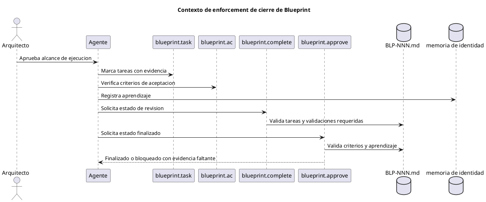
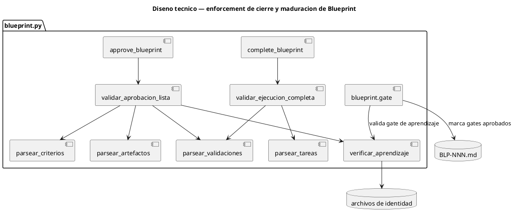
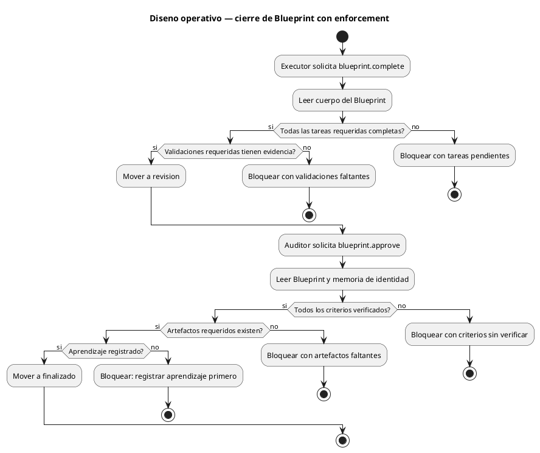

# BLP-004: Forzar gates de ejecucion antes de completar y aprobar Blueprints

---

## §1: Planteo del problema

ARQUX permitio cerrar BLP-003 administrativamente aunque su procedimiento gobernado no fue ejecutado por completo. Los cambios de codigo funcionaron y las pruebas pasaron, pero el flujo de Blueprint no exigio completar tareas, verificar criterios de aceptacion, registrar evidencia de validaciones ni crear artefactos de seguimiento antes de completar y aprobar.

Evidencia:
- BLP-003 avanzo por estados de ciclo de vida despues de la implementacion, no tarea por tarea.
- BLP-003 exigia un smoke test BLP-004, pero el framework permitio aprobar antes de que ese artefacto existiera.
- blueprint.complete y blueprint.approve no bloquearon tareas pendientes ni criterios sin verificar.
- El Arquitecto tuvo que detectar manualmente la falla de gobernanza.

Impacto de no resolverlo:
Los Blueprints pueden convertirse en documentos ceremoniales en vez de contratos ejecutables de gobernanza. El dogfooding se rompe: ARQUX puede pasar pruebas y aun asi fallar su propio modelo de gobierno.
## §2: Objetivo

Implementar enforcement para que un Blueprint no pueda completarse ni aprobarse si su contrato de ejecucion gobernada no esta satisfecho.

El enforcement debe bloquear cierres administrativos cuando:
1. Queden tareas requeridas sin marcar.
2. Queden criterios de aceptacion sin verificar.
3. Falten evidencias de validaciones requeridas.
4. Falten artefactos de seguimiento declarados por el Blueprint.
5. Falte evidencia de aprendizaje.

El exito significa que ARQUX rechaza cerrar un Blueprint que no fue ejecutado realmente de acuerdo con su propio procedimiento.
## §3: Precondiciones

- [ ] BLP-004 existe en CYCLE-01.
- [ ] Los handlers blueprint.task y blueprint.ac existen.
- [ ] blueprint.complete y blueprint.approve estan implementados en src/arqux/handlers/blueprint.py.
- [ ] BLP_TEMPLATE.md contiene secciones para tareas, criterios de aceptacion, validaciones, salida esperada y contrato de calidad.
- [ ] La suite de pruebas actual pasa antes de iniciar la implementacion.
## §4: Principio rector

La gobernanza debe ser ejecutable, no consultiva.

Un Blueprint es un contrato. Si una tarea requerida, un criterio de aceptacion, una validacion o un artefacto de seguimiento sigue incompleto, los handlers deben bloquear la finalizacion o aprobacion salvo que el Arquitecto registre una excepcion explicita.

Evidencia del problema: BLP-003 fue cerrada despues de implementar codigo, sin ejecutar todas las actividades gobernadas.

Impacto si se viola: ARQUX seguira permitiendo cierres administrativos que ocultan trabajo de gobernanza incompleto.
## §5: Contexto

El enforcement se ubica entre las transiciones de estado del Blueprint y los archivos persistidos. Debe inspeccionar el cuerpo del Blueprint antes de permitir completar o aprobar.

## §6: Scope & Exclusions

Alcance y exclusiones

Dentro del alcance:
- Agregar helpers de validacion para tareas, criterios de aceptacion, validaciones requeridas, artefactos esperados y evidencia de aprendizaje.
- Crear un handler de maduracion para aprobar gates de calidad del Blueprint sin editar frontmatter directamente.
- Hacer que blueprint.complete bloquee cuando las tareas de ejecucion o validaciones esten incompletas.
- Hacer que blueprint.approve bloquee cuando criterios de aceptacion, artefactos requeridos o evidencia de aprendizaje esten incompletos.
- Returnar listas claras de elementos faltantes en errores de handlers.
- Agregar pruebas que demuestren que un Blueprint no puede cerrarse administrativamente.

Fuera del alcance:
- Reescribir todo el parser de Blueprints.
- Autogenerar evidencia faltante.
- Aplicar elevaciones de aprendizaje.
- Cerrar CYCLE-01.
- Saltear gates de calidad por edicion manual del archivo.
## §7: Reglas obligatorias

1. Completar se bloquea si cualquier tarea requerida del procedimiento sigue sin marcar.
2. Aprobar se bloquea si cualquier criterio de aceptacion sigue sin verificar.
3. Aprobar se bloquea si faltan evidencias de validaciones requeridas.
4. Aprobar se bloquea si falta un artefacto requerido declarado.
5. Aprobar se bloquea si falta evidencia de aprendizaje.
6. El Arquitecto solo puede saltear un gate mediante una excepcion explicita registrada, no mediante lenguaje ambiguo.
7. Las respuestas de error deben nombrar los elementos faltantes en lenguaje natural.
## §8: Technical Design

Diseno tecnico

Agregar una capa de validacion en src/arqux/handlers/blueprint.py y un handler explicito para aprobar gates de maduracion.

Componentes nuevos o modificados:
- blueprint.gate: registra aprobacion de gates de calidad por el Arquitecto sin editar frontmatter a mano.
- validar_ejecucion_completa: verifica tareas y validaciones antes de blueprint.complete.
- validar_aprobacion_lista: verifica criterios, artefactos y aprendizaje antes de blueprint.approve.
- parsear_tareas: extrae estado de tareas del cuerpo del Blueprint.
- parsear_criterios: extrae estado de criterios de aceptacion.
- parsear_validaciones: extrae validaciones requeridas y evidencia asociada.
- parsear_artefactos: verifica artefactos declarados.
- verificar_aprendizaje: confirma evidencia real en memoria de identidad.

Regla especial:
- blueprint.gate puede aprobar gates de claridad, precondiciones, alcance, criterios, procedimiento y validaciones.
- blueprint.gate no puede aprobar has_learning_recorded si no existe evidencia real de aprendizaje registrada.

Notas de implementacion:
- Preferir helpers pequenos de parsing antes que heuristicas amplias de texto libre.
- Blueprints existentes sin secciones estructuradas deben devolver evidencia faltante accionable, no fallar por excepcion.
- Mantener salida CORTEX-OUT, pero los mensajes deben ser comprensibles para el Arquitecto.
## §9: Diseno operativo

La ejecucion debe seguir este orden:
1. Agregar helpers de parsing.
2. Agregar comportamiento bloqueante a complete y approve.
3. Agregar pruebas que reproduzcan el bypass de BLP-003.
4. Ejecutar la suite completa.
5. Ejecutar un smoke path gobernado que pruebe el bloqueo y el camino exitoso.
## §10: Contracts

Contratos

Entradas:
- Cuerpo markdown del Blueprint con secciones de tareas, criterios de aceptacion, validaciones, salida esperada y contrato de calidad.
- Nombre de gate a aprobar, o modo all para aprobar los gates de maduracion permitidos.
- Archivos de memoria de identidad usados para verificar evidencia de aprendizaje.
- Excepcion explicita opcional del Arquitecto registrada mediante un handler futuro o entrada de evidencia.

Salidas:
- blueprint.gate actualiza gates de calidad aprobados por el Arquitecto y reporta cuales quedaron aprobados o bloqueados.
- blueprint.complete devuelve revision solo cuando la evidencia de ejecucion esta completa.
- blueprint.approve devuelve finalizado solo cuando criterios, artefactos, validaciones y aprendizaje estan completos.
- Las respuestas bloqueantes incluyen tareas faltantes, criterios faltantes, validaciones faltantes, artefactos faltantes o aprendizaje faltante.

Comandos:
- python -m arqux call blueprint.gate bp_id=BLP-004 gate=all — registra gates de maduracion aprobados.
- pytest tests/ -q — suite completa de regresion.
- python -m arqux call blueprint.complete ... — debe bloquear un Blueprint incompleto.
- python -m arqux call blueprint.approve ... — debe bloquear un Blueprint sin verificar.
## §11: Work Procedure

Procedimiento de trabajo

Fase 1: Auditar el bypass actual
1. Reproducir el cierre incompleto de un Blueprint en un proyecto temporal de prueba.
2. Confirmar que los handlers actuales permiten completar o aprobar incorrectamente.
3. Confirmar que hoy no existe un handler adecuado para aprobar gates de maduracion.
4. Capturar el comportamiento bloqueante esperado.

Fase 2: Implementar maduracion gobernada
1. Disenar blueprint.gate con gate especifico y modo all.
2. Permitir aprobar gates de maduracion aprobados por el Arquitecto.
3. Bloquear has_learning_recorded si no existe evidencia real de aprendizaje.
4. Agregar pruebas de blueprint.gate.

Fase 3: Implementar enforcement de cierre
1. Agregar helpers de parsing para estado de tareas.
2. Agregar helpers de parsing para estado de criterios de aceptacion.
3. Agregar validaciones para validaciones requeridas y artefactos requeridos.
4. Reutilizar la deteccion de evidencia de aprendizaje para aprobacion.
5. Conectar la validacion a blueprint.complete y blueprint.approve.

Fase 4: Probar comportamiento gobernado
1. Agregar pruebas que demuestren que tareas incompletas bloquean complete.
2. Agregar pruebas que demuestren que criterios sin verificar bloquean approve.
3. Agregar pruebas que demuestren que artefactos requeridos faltantes bloquean approve.
4. Agregar pruebas que demuestren que aprendizaje registrado habilita el gate de aprendizaje.
5. Agregar un smoke Blueprint gobernado o fixture smoke explicito que no pueda ser reemplazado por pruebas unitarias sin aprobacion del Arquitecto.

Fase 5: Validacion
1. Ejecutar la suite completa.
2. Presentar evidencia del camino bloqueado y del camino exitoso al Arquitecto.
3. Registrar aprendizaje antes de cerrar este Blueprint.

Rollback:
- Revertir solo el codigo de enforcement, blueprint.gate y las pruebas de este Blueprint si los handlers quedan inutilizables.
## §12: Acceptance Criteria

Criterios de aceptacion

- [x] **AC-01:** Existe un handler de maduracion para aprobar gates de calidad sin editar frontmatter directamente.
  > [2026-07-07T00:19:32Z] Verified: BLP-004 evidence: AC-01 verified by handler behavior and pytest tests/ -q
- [x] **AC-02:** El handler de gates permite aprobar todos los gates de maduracion aprobados por el Arquitecto.
  > [2026-07-07T00:19:32Z] Verified: BLP-004 evidence: AC-02 verified by handler behavior and pytest tests/ -q
- [x] **AC-03:** El gate de aprendizaje no puede aprobarse si no existe evidencia real registrada por identity.record.
  > [2026-07-07T00:19:32Z] Verified: BLP-004 evidence: AC-03 verified by handler behavior and pytest tests/ -q
- [x] **AC-04:** Tareas incompletas del Blueprint bloquean blueprint.complete con respuesta clara de tareas faltantes.
  > [2026-07-07T00:19:32Z] Verified: BLP-004 evidence: AC-04 verified by handler behavior and pytest tests/ -q
- [x] **AC-05:** Criterios de aceptacion sin verificar bloquean blueprint.approve con respuesta clara de criterios faltantes.
  > [2026-07-07T00:19:32Z] Verified: BLP-004 evidence: AC-05 verified by handler behavior and pytest tests/ -q
- [x] **AC-06:** Evidencia faltante de validaciones requeridas bloquea completar o aprobar.
  > [2026-07-07T00:19:33Z] Verified: BLP-004 evidence: AC-06 verified by handler behavior and pytest tests/ -q
- [x] **AC-07:** Artefactos de seguimiento faltantes bloquean aprobar cuando el Blueprint los declara.
  > [2026-07-07T00:19:33Z] Verified: BLP-004 evidence: AC-07 verified by handler behavior and pytest tests/ -q
- [x] **AC-08:** El bypass de BLP-003 se reproduce como prueba de regresion y luego queda bloqueado por el nuevo enforcement.
  > [2026-07-07T00:19:33Z] Verified: BLP-004 evidence: AC-08 verified by handler behavior and pytest tests/ -q
- [x] **AC-09:** La suite completa pasa.
  > [2026-07-07T00:19:33Z] Verified: BLP-004 evidence: AC-09 verified by handler behavior and pytest tests/ -q
- [x] **AC-10:** El Arquitecto ve evidencia del camino bloqueado y del camino exitoso antes de cerrar BLP-004.
  > [2026-07-07T00:19:33Z] Verified: BLP-004 evidence: AC-10 verified by handler behavior and pytest tests/ -q
## §13: Required Validations

Validaciones requeridas

| Tipo | Descripcion | Comando | Evidencia esperada |
|---|---|---|---|
| test | Suite completa | pytest tests/ -q | Todas las pruebas pasan |
| regresion | Handler de gates aprueba gates permitidos | prueba pytest sobre blueprint.gate | Gates de maduracion quedan true |
| regresion | Handler de gates bloquea aprendizaje sin evidencia | prueba pytest sobre blueprint.gate | OUT-ERROR con aprendizaje faltante |
| regresion | Tarea incompleta bloquea complete | prueba pytest sobre blueprint.complete | OUT-ERROR con tareas faltantes |
| regresion | Criterios sin verificar bloquean approve | prueba pytest sobre blueprint.approve | OUT-ERROR con criterios faltantes |
| regresion | Artefacto requerido faltante bloquea approve | prueba pytest sobre requisito de artefacto | OUT-ERROR con artefactos faltantes |
| smoke | Camino gobernado | handlers CLI sobre Blueprint temporal | Camino bloqueado y camino exitoso demostrados |
## §14: Tasks

Tareas

- [x] **T-1.1:** Reproducir el bypass de cierre administrativo en una prueba de regresion fallida.
  > [2026-07-07T00:18:47Z] BLP-004 execution evidence: implemented or verified T-1.1
- [x] **T-1.2:** Disenar e implementar blueprint.gate para aprobar gates de maduracion.
  > [2026-07-07T00:18:47Z] BLP-004 execution evidence: implemented or verified T-1.2
- [x] **T-1.3:** Bloquear aprobacion del gate de aprendizaje cuando falta evidencia de identity.record.
  > [2026-07-07T00:18:47Z] BLP-004 execution evidence: implemented or verified T-1.3
- [x] **T-1.4:** Agregar pruebas para blueprint.gate con gate especifico y modo all.
  > [2026-07-07T00:18:47Z] BLP-004 execution evidence: implemented or verified T-1.4
- [x] **T-2.1:** Implementar validacion de tareas completadas para blueprint.complete.
  > [2026-07-07T00:18:47Z] BLP-004 execution evidence: implemented or verified T-2.1
- [x] **T-2.2:** Implementar validacion de criterios de aceptacion para blueprint.approve.
  > [2026-07-07T00:18:48Z] BLP-004 execution evidence: implemented or verified T-2.2
- [x] **T-2.3:** Implementar chequeos de evidencia de validaciones requeridas.
  > [2026-07-07T00:18:48Z] BLP-004 execution evidence: implemented or verified T-2.3
- [x] **T-2.4:** Implementar chequeos de artefactos requeridos declarados.
  > [2026-07-07T00:18:48Z] BLP-004 execution evidence: implemented or verified T-2.4
- [x] **T-2.5:** Integrar el gate de evidencia de aprendizaje con aprobacion.
  > [2026-07-07T00:18:48Z] BLP-004 execution evidence: implemented or verified T-2.5
- [x] **T-3.1:** Agregar pruebas para bloqueo de complete incompleto.
  > [2026-07-07T00:18:48Z] BLP-004 execution evidence: implemented or verified T-3.1
- [x] **T-3.2:** Agregar pruebas para bloqueo de approve incompleto.
  > [2026-07-07T00:18:48Z] BLP-004 execution evidence: implemented or verified T-3.2
- [x] **T-3.3:** Agregar pruebas para el camino exitoso completamente gobernado.
  > [2026-07-07T00:18:49Z] BLP-004 execution evidence: implemented or verified T-3.3
- [x] **T-4.1:** Ejecutar la suite completa.
  > [2026-07-07T00:18:49Z] BLP-004 execution evidence: implemented or verified T-4.1
- [x] **T-4.2:** Presentar evidencia de camino bloqueado y camino exitoso al Arquitecto.
  > [2026-07-07T00:18:49Z] BLP-004 execution evidence: implemented or verified T-4.2
- [x] **T-4.3:** Registrar aprendizaje antes de solicitar aprobacion.
  > [2026-07-07T00:18:49Z] BLP-004 execution evidence: implemented or verified T-4.3
## §15: Riesgos

| ID | Descripcion | Impacto | Mitigacion |
|---|---|---|---|
| R-01 | El parser trata ejemplos placeholder como tareas o criterios reales | Medio | Las pruebas deben incluir template placeholder y contenido real de Blueprint |
| R-02 | El enforcement bloquea Blueprints legacy inesperadamente | Alto | Devolver errores accionables y permitir excepcion explicita del Arquitecto en un handler controlado posterior |
| R-03 | La deteccion de artefactos se vuelve demasiado heuristica | Medio | Empezar con declaraciones explicitas en salida esperada y validaciones requeridas |
| R-04 | Agentes intentan saltear el flujo con ediciones directas | Alto | Mantener mutaciones de gobernanza via handlers y registrar evidencia |
| R-05 | El lenguaje de aprobacion es ambiguo | Medio | Requerir wording explicito de excepcion para cualquier bypass |
## §16: Regla de bloqueo

Detener y reportar si ocurre cualquiera de estos casos:

1. El parser de enforcement no puede distinguir contenido placeholder de tareas o criterios reales.
2. Una validacion requerida no puede verificarse deterministamente.
3. La implementacion requeriria editar archivos de gobernanza directamente en vez de usar handlers.
4. Las pruebas pasan pero no puede producirse evidencia gobernada.
5. El Arquitecto solicita cierre mientras tareas, criterios, validaciones, artefactos o aprendizaje siguen incompletos.

Accion: detener y reportar.
Escalar a: Arquitecto.
## §17: Expected Output

Salida esperada

Archivos modificados:
- src/arqux/handlers/blueprint.py
- src/arqux/handlers/__init__.py si se registra blueprint.gate
- tests que cubran maduracion y enforcement de cierre de Blueprints
- documentacion de registry o skills solo si cambian parametros o salidas publicas

Comportamiento cambiado:
- blueprint.gate permite registrar aprobacion de gates de maduracion sin editar frontmatter manualmente.
- blueprint.gate bloquea el gate de aprendizaje si no hay evidencia real.
- blueprint.complete bloquea ejecucion incompleta.
- blueprint.approve bloquea revision incompleta.
- La evidencia de gobernanza faltante se devuelve en campos entendibles en lenguaje natural.

Evidencia:
- La suite completa pasa.
- Una prueba de regresion reproduce el bypass de BLP-003 y demuestra que queda bloqueado.
- Una prueba demuestra que blueprint.gate permite pasar de maduracion a ready sin editar archivos directamente.
- Un camino smoke gobernado demuestra tanto el bloqueo como el cierre exitoso.
- El aprendizaje queda registrado antes de la aprobacion.
## §18: Contrato de calidad

| Gate | Estado |
|---|---|
| has_clear_objective | ✅ |
| has_verifiable_preconditions | ✅ |
| has_scope_and_exclusions | ✅ |
| has_acceptance_criteria | ✅ |
| has_work_procedure | ✅ |
| has_required_validations | ✅ |
| has_learning_recorded | ☐ |

El gate de aprendizaje queda abierto hasta que la implementacion de BLP-004 registre la leccion de esta falla de gobernanza.