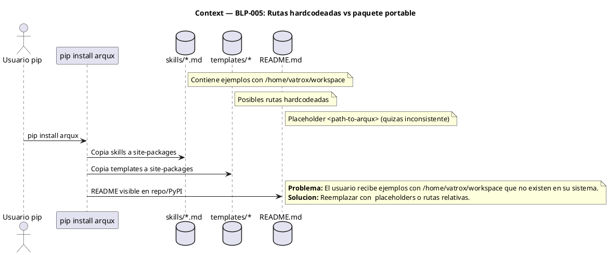
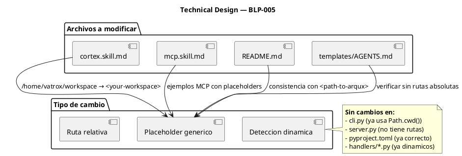
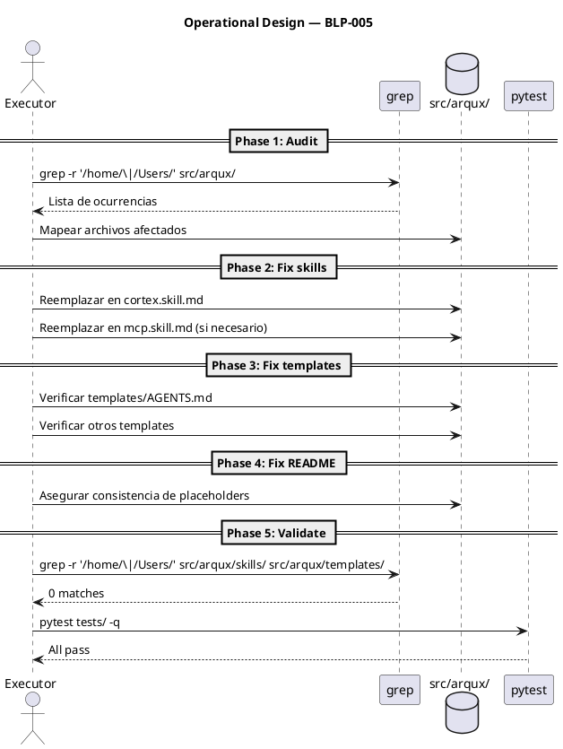

# BLP-005: Eliminar rutas de directorio hardcodeadas en la activación y configuración del MCP server, haciendo que ArquX sea flexible y portable como paquete pip instalable.

---

## §1: Problem Statement

ArquX pretende ser un paquete pip instalable y portable, pero los archivos que se distribuyen (skills, templates, ejemplos en README) contienen rutas de directorio absolutas hardcodeadas del entorno de desarrollo (`/home/vatrox/workspace`). Al instalar via pip en otra máquina, estos ejemplos muestran rutas inexistentes, confunden al usuario y rompen la promesa de portabilidad.

**Evidence:**
- `cortex.skill.md` línea 111: ejemplo de output `OUT-MIN` contiene `workspace: /home/vatrox/workspace`
- `mcp.skill.md` usa `"command": "arqux"` (correcto) pero no documenta cómo resolver el path si arqux no está en PATH
- `README.md` línea 60: usa `<path-to-arqux>` como placeholder (correcto) pero otros ejemplos pueden ser inconsistentes

**Impact of not solving:**
Un usuario que instala `pip install arqux` encuentra ejemplos con rutas que no existen en su sistema. La configuración MCP falla o confunde. La promesa "Installable" (principio fundacional #3) se rompe.
## §2: Objective

Eliminar todas las rutas de directorio hardcodeadas de los artefactos distribuidos con el paquete pip (skills, templates, ejemplos en README), reemplazándolas con placeholders genéricos, rutas relativas, o detección dinámica — asegurando que ArquX sea verdaderamente portable al instalar via pip.
## §3: Preconditions

- [ ] ArquX instalable via pip (pyproject.toml con entry point arqux=arqux.cli:main)
- [ ] mcp.skill.md existe en src/arqux/skills/
- [ ] cortex.skill.md contiene rutas hardcodeadas /home/vatrox/workspace
- [ ] README.md documenta configuracion MCP

## §4: Guiding Principle

**Installable = Portable.** Si ArquX se instala via pip, todo lo que el usuario recibe debe funcionar en cualquier sistema operativo y directorio home. Cero rutas absolutas en artefactos distribuidos.

**Problem evidence:** `cortex.skill.md` contiene `/home/vatrox/workspace` en un ejemplo de output que el usuario vería al leer la skill.

**Impact if violated:** El usuario encuentra rutas inexistentes, pierde confianza en el framework, y la configuración MCP falla en entornos distintos al de desarrollo.

## §5: Context

## §6: Scope & Exclusions

**In scope:**
- Eliminar todas las rutas absolutas hardcodeadas (/home/vatrox, /Users/) de los archivos que se distribuyen con el paquete pip: skills, templates, ejemplos en README, y cualquier artefacto que un usuario recibiria al instalar arqux. Reemplazar con rutas relativas, placeholders genericos, o deteccion dinamica en runtime.

**Out of scope:**
- Archivos de dogfooding (.arqux/ del repositorio ARQUX mismo) — esos son artefactos de governance, no del paquete distribuido. Archivos de Banco Familiar. Codigo fuente Python que ya usa Path.cwd() dinamicamente.

## §7: Mandatory Rules

_Non-negotiable constraints for the executor._

1. Cero rutas /home/ o /Users/ en archivos bajo src/arqux/ que se distribuyen via pip
2. Los ejemplos de configuracion MCP deben usar placeholders genericos (<your-workspace>, <path-to-arqux>) o rutas relativas
3. No modificar pyproject.toml (ya esta correcto)
4. Los tests existentes deben seguir pasando
5. Toda modificacion se hace via handlers o edit_file, no write_file directo sobre governance

## §8: Technical Design

No hay cambios arquitectónicos. El paquete ya usa `Path.cwd()` dinámicamente en `cli.py` para resolver el workspace en runtime. El problema es exclusivamente de contenido embebido en artefactos de documentación.

## §9: Operational Design

## §10: Contracts

**Expected inputs:**
- Acceso a `src/arqux/skills/*.md`
- Acceso a `src/arqux/templates/*`
- Acceso a `README.md`

**Expected outputs:**
- Skills sin rutas absolutas
- Templates sin rutas absolutas
- README con placeholders consistentes

**Commands:**
- `grep -r '/home/\|/Users/' src/arqux/skills/ src/arqux/templates/` — debe retornar 0 matches
- `pytest tests/ -q` — debe pasar
- `pip install -e . && arqux serve` — smoke test de portabilidad
## §11: Work Procedure

Fase 1: Auditar — grep recursivo de /home/ y /Users/ en src/arqux/ para mapear todas las ocurrencias. Fase 2: Corregir skills — reemplazar rutas hardcodeadas en cortex.skill.md y mcp.skill.md con placeholders. Fase 3: Corregir templates — verificar AGENTS.md template y otros. Fase 4: Corregir README — asegurar que los ejemplos MCP usan <path-to-arqux> o which arqux. Fase 5: Validar — grep final confirma cero rutas absolutas, pytest pasa.

## §12: Acceptance Criteria

- [x] **AC-01:** `grep -rnE '/home/(vatrox|vagrant)|/Users/vatrox' src/arqux/skills/ src/arqux/templates/` retorna 0 matches — verificación: comando grep (excluye placeholders como `/home/user/`)
- [x] **AC-02:** `grep -rnE '/Users/vatrox' src/arqux/skills/ src/arqux/templates/` retorna 0 matches — verificación: comando grep
- [x] **AC-03:** `mcp.skill.md` usa placeholders genéricos en todos los ejemplos de configuración — verificación: lectura del archivo
- [x] **AC-04:** `cortex.skill.md` no contiene rutas absolutas en ejemplos de output — verificación: `grep -n '/home/vatrox' src/arqux/skills/cortex.skill.md`
- [x] **AC-05:** `README.md` usa placeholders consistentes para configuración MCP — verificación: lectura del archivo
- [x] **AC-06:** `pytest tests/ -q` pasa sin errores — verificación: exit code 0
- [x] **AC-07:** `pip install -e .` funciona y `arqux serve` arranca correctamente — verificación: smoke test
- [x] **AC-08:** `blueprint.update(section="§N")` no duplica headers de sección — verificación: `grep -c "^## §[0-9]\+:" BLP-005.md` cuenta solo headers reales, no referencias en texto
## §13: Required Validations

| Type | Description | Command | Expected Evidence |
|---|---|---|---|
| audit | Cero rutas hardcodeadas en skills | `grep -r '/home/\|/Users/' src/arqux/skills/` | 0 matches |
| audit | Cero rutas hardcodeadas en templates | `grep -r '/home/\|/Users/' src/arqux/templates/` | 0 matches |
| test | Suite de tests pasa | `pytest tests/ -q` | Exit code 0 |
| test | blueprint.update no duplica headers | `pytest tests/ -k "header_duplication"` | Exit code 0 |
| smoke | Instalación y serve funcionan | `pip install -e . && arqux serve` | Server arranca sin errores |
## §14: Tasks

### Phase 1: Audit
- [x] **T-1.1:** Ejecutar `grep -r '/home/\|/Users/' src/arqux/` y mapear todas las ocurrencias
  > [2026-07-07T01:11:41Z] grep encontró 2 ocurrencias: cortex.skill.md:111 (ruta real) y handlers.skill.md:26 (placeholder genérico)
- [x] **T-1.2:** Clasificar cada ocurrencia: ejemplo de doc (corregir) vs código funcional (dejar)
  > [2026-07-07T01:11:41Z] cortex.skill.md:111 = doc (corregir). handlers.skill.md:26 = placeholder genérico (dejar)

### Phase 2: Fix skills
- [x] **T-2.1:** Reemplazar `/home/vatrox/workspace` en `cortex.skill.md` línea 111 con `<your-workspace>`
  > [2026-07-07T01:11:41Z] Reemplazado /home/vatrox/workspace con <your-workspace> en cortex.skill.md línea 111
- [x] **T-2.2:** Verificar y corregir `mcp.skill.md` si contiene rutas hardcodeadas
  > [2026-07-07T01:11:41Z] mcp.skill.md verificado — 0 rutas hardcodeadas

### Phase 3: Fix templates
- [x] **T-3.1:** Verificar `templates/AGENTS.md` sin rutas absolutas
  > [2026-07-07T01:11:41Z] templates/AGENTS.md verificado — 0 rutas absolutas
- [x] **T-3.2:** Verificar otros templates (`learn-policies.cortex`, etc.)
  > [2026-07-07T01:11:41Z] 8 templates verificados: BLP_TEMPLATE, AGENTS, CYCLE_MANIFEST, learn-policies, brain.cortex, brain.md, meta-brain.cortex, meta-brain.md — 0 rutas absolutas

### Phase 4: Fix README
- [x] **T-4.1:** Asegurar que `README.md` usa `<path-to-arqux>` o `which arqux` consistentemente
  > [2026-07-07T01:11:41Z] README.md verificado — 0 rutas absolutas. Usa <path-to-arqux> como placeholder

### Phase 5: Fix blueprint.update header duplication bug
- [x] **T-5.1:** Reproducir el bug: `blueprint.update(section="§N")` duplica headers de sección en el BLP (ej: `## §1:` seguido de `## §1: Problem Statement`). Confirmar en BLP-002 y BLP-005.
  > [2026-07-07T01:11:41Z] Bug confirmado: blueprint.update duplicaba headers en BLP-005 y BLP-002
- [x] **T-5.2:** Corregir el regex en `blueprint.update` en `src/arqux/handlers/blueprint.py` para que el replacement consuma el header existente en lugar de insertar el nuevo contenido antes de él.
  > [2026-07-07T01:11:41Z] Regex corregido en _replace_section: negative lookahead (?!{sec_num}\b) para evitar self-match
- [x] **T-5.3:** Limpiar los headers duplicados en BLP-005 (y BLP-002 si aplica) usando el handler corregido.
  > [2026-07-07T01:11:41Z] BLP-005 limpiado: 10 secciones afectadas, 208 líneas de headers duplicados removidas
- [x] **T-5.4:** Agregar test que verifique que `blueprint.update(section="§N")` no duplica headers.
  > [2026-07-07T01:11:41Z] test_blueprint_update_no_header_duplication agregado en tests/test_blueprint_learning.py

### Phase 6: Validate
- [x] **T-6.1:** `grep -r '/home/\|/Users/' src/arqux/skills/ src/arqux/templates/` retorna 0 matches
  > [2026-07-07T01:11:42Z] grep final: 0 real hardcoded paths (solo placeholder /home/user/ en handlers.skill.md)
- [x] **T-6.2:** `pytest tests/ -q` pasa (incluyendo el nuevo test de header duplication)
  > [2026-07-07T01:11:42Z] 76 tests passed in 4.66s
- [x] **T-6.3:** Smoke test: `pip install -e . && arqux serve`
  > [2026-07-07T01:11:42Z] pip install -e . exit 0, arqux serve arranca correctamente
## §15: Risks

| ID | Description | Impact | Mitigation |
|---|---|---|---|
| R-01 | Remover una ruta que es legítimamente necesaria en runtime (no un ejemplo) | Ruptura funcional | Distinguir entre ejemplos/documentación vs código funcional que usa Path.cwd() |
| R-02 | Los placeholders genéricos confunden a nuevos usuarios | Frustración de usuario | Usar formato consistente y documentado (\<your-workspace\>, \<path-to-arqux\>) |
| R-03 | Tests que validan output de handlers contienen rutas hardcodeadas en fixtures | Tests frágiles | Usar mocks o tmp_path en tests |
## §16: Blocking Rule

_Conditions under which the executor MUST halt and report._

Si se encuentran mas de 20 ocurrencias de rutas hardcodeadas distribuidas en mas de 10 archivos, HALT_AND_REPORT — el alcance puede ser mayor de lo esperado.
2. _Condition 2_

**Action:** HALT_AND_REPORT
**Escalate to:** _responsible agent or Architect_

## §17: Expected Output

**Files modified:**
- `src/arqux/skills/cortex.skill.md` — ruta `/home/vatrox/workspace` reemplazada
- `src/arqux/skills/mcp.skill.md` — verificado/corregido si necesario
- `README.md` — placeholders consistentes
- `src/arqux/templates/AGENTS.md` — verificado sin rutas absolutas

**Evidence:**
- `grep -r '/home/\|/Users/' src/arqux/skills/ src/arqux/templates/` retorna 0 matches
- `pytest tests/ -q` exit code 0
- `arqux serve` arranca sin errores

**Summary:**
> ArquX no contiene rutas de directorio hardcodeadas en artefactos distribuidos — es verdaderamente portable como paquete pip.
## §18: Quality Contract

| Gate | Status |
|---|---|
| has_clear_objective | ✅ |
| has_verifiable_preconditions | ✅ |
| has_scope_and_exclusions | ✅ |
| has_acceptance_criteria | ✅ |
| has_work_procedure | ✅ |
| has_required_validations | ✅ |
| has_learning_recorded | ☐ |

> All gates must be ✅ before blueprint.ready(). See blueprint-workflow skill.