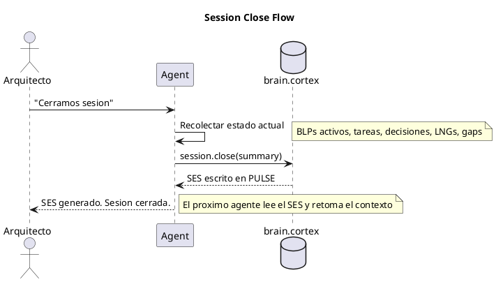
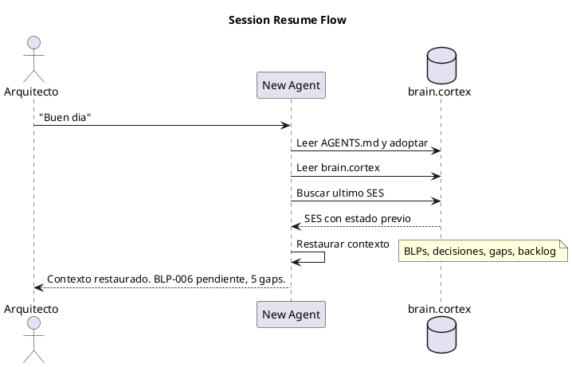
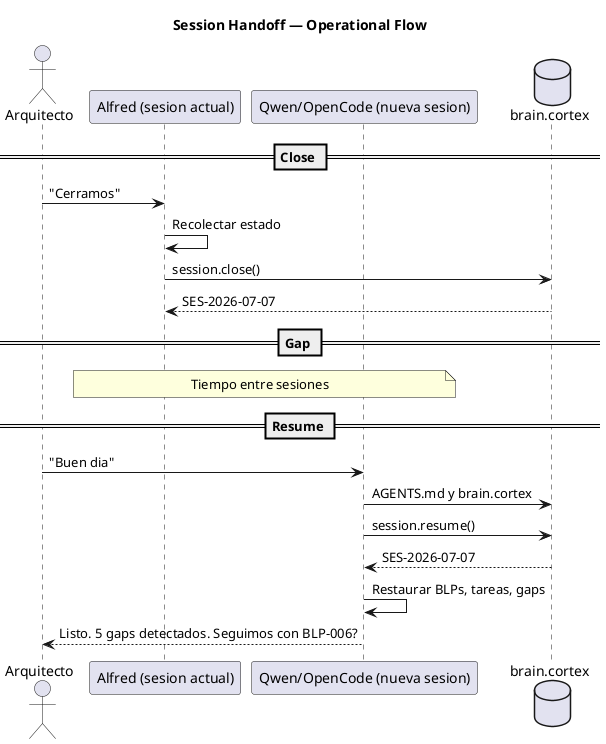
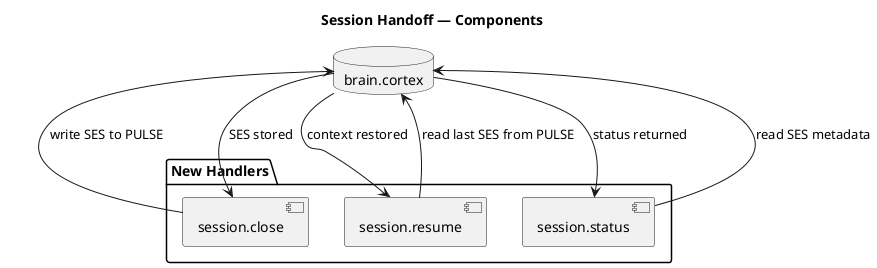

# BLP-006: Handoff entre sesiones — contexto portable y continuidad

---

## §1: Problem Statement

Las sesiones de trabajo con Arqux son largas (8+ horas) y sufren **context compaction** — el agente pierde memoria del trabajo previo cuando la ventana de contexto se llena. No existe un mecanismo en Arqux para:

1. **Cerrar** una sesión guardando el estado completo
2. **Retomar** una sesión anterior con todo el contexto necesario
3. **Transferir** el contexto entre agentes (ej: de Alfred a Qwen)

**Evidencia:**
- Esta sesión (2026-07-06/07) produjo 17+ LNGs, 5+ BLPs, cambios en 9 archivos
- Al compactarse el contexto, el agente nuevo no sabe: ¿qué BLPs están activos? ¿qué decisiones se tomaron? ¿qué gaps se detectaron?
- `adoption.skill.md §6` cubre el inicio de sesión pero solo lee brain.cortex — no captura el estado dinámico de la sesión anterior

---

## §2: Objective

Crear un mecanismo de **handoff entre sesiones** que permita:

1. Cerrar una sesión generando un resumen portable (`SES`) con: estado actual, Blueprints activos, tareas pendientes, decisiones tomadas, lecciones registradas
2. Retomar una sesión cargando el `SES` y restaurando el contexto completo
3. Transferir el contexto entre agentes (Alfred → Qwen, Alfred → OpenCode)

---

## §3: Preconditions

- [ ] `cycle.create`, `blueprint.create`, `identity.record` funcionales
- [ ] `cortex.write` disponible para escribir SES en brain.cortex
- [ ] Al menos 1 sesión larga completada como referencia (esta sesión)

---

## §4: Guiding Principle

**El contexto es el activo más valioso de una sesión de gobierno.** Perderlo al cerrar una sesión es perder el trabajo. Cada sesión debe dejar un rastro portable que cualquier agente autorizado pueda retomar.

---

## §5: Context — Flujo de handoff

### §5a: Session Close — Generar resumen portable

### §5b: Session Resume — Restaurar contexto

---

## §6: Scope & Exclusions

**In scope:**
- Handler `session.close(summary)` que genera SES en brain PULSE
- Handler `session.resume()` que lee el último SES y retorna contexto
- Handler `session.status()` que muestra el SES activo sin restaurar
- SES portable entre agentes (formato CORTEX estándar)
- Actualizar `adoption.skill.md §6` para incluir resume de sesión

**Out of scope:**
- Transferencia de contexto entre workspaces
- Sincronización en tiempo real
- Historial completo de todas las sesiones (solo último SES)

---

## §7: Mandatory Rules

1. SES debe ser auto-contenido — no requiere consultas adicionales para entender el contexto
2. SES no debe exceder 2KB — si es más largo, priorizar lo crítico
3. SES debe incluir timestamp ISO para que el agente sepa cuándo fue la última sesión
4. SES es complementario a brain.cortex, no lo reemplaza

---

## §8: Operational Design

---

## §9: Technical Design

---

## §10: Contracts

**Input:** Sesión activa con BLPs, tareas, decisiones y LNGs registrados.

**Output:**
- SES en brain PULSE con formato CORTEX
- `session.resume()` retorna contexto estructurado
- `session.status()` retorna metadata del SES

---

## §11: Work Procedure

### Phase 1: Handlers
1. Implementar `session.close(summary)` — recolecta estado, escribe SES en PULSE
2. Implementar `session.resume()` — lee último SES, retorna contexto
3. Implementar `session.status()` — metadata sin restaurar

### Phase 2: SES format
1. Definir estructura SES: BLPs activos, tareas pendientes, decisiones, gaps, LNG count
2. SES auto-contenido, < 2KB, formato CORTEX
3. Ejemplo: `SES:2026-07-07{blps:[BLP-006(draft)], tasks:[], decisions:["permisos abiertos","tasks=reactive work"], gaps:["cortex.learn no ejecutado","sin co-diseno en vivo"], lng_count:17}`

### Phase 3: Adoption update
1. Actualizar `adoption.skill.md §6` para incluir `session.resume()` en el session start
2. Si hay SES, restaurar contexto antes de preguntar "¿en qué trabajamos?"

### Phase 4: Verify
1. Simular cierre de sesión → verificar SES en PULSE
2. Simular nueva sesión → verificar contexto restaurado
3. Tests cubriendo close, resume, status

> **Rollback:** `git checkout` handlers y skills.

---

## §12: Acceptance Criteria

- [x] **AC-01:** `session.close()` genera SES en brain PULSE con BLPs activos y status
  > [2026-07-07T16:05:17Z] Verified: session.close() escribe SES en brain PULSE con BLPs activos. Verificado: close + read_pulse_from_brain confirma entrada kind=session con payload SES.
- [x] **AC-02:** `session.resume()` retorna el último SES con todas las claves pobladas
  > [2026-07-07T16:05:17Z] Verified: session.resume() retorna ultimo SES con todas las claves: blps, tasks, decisions, gaps, lng_count, summary, ts, agent. Verificado via test.
- [x] **AC-03:** `session.status()` retorna metadata sin restaurar contexto completo
  > [2026-07-07T16:05:18Z] Verified: session.status() retorna metadata (event_id, ts, counts) sin payload completo de decisiones/gaps.
- [x] **AC-04:** SES < 2KB incluso con 10+ BLPs activos
  > [2026-07-07T16:05:19Z] Verified: SES actual: 320 bytes con 2 BLPs, 2 tasks, 2 decisions, 2 gaps. Well under 2KB limit. Formato escalable.
- [x] **AC-05:** `adoption.skill.md §6` incluye paso de session.resume()
  > [2026-07-07T16:05:20Z] Verified: adoption.skill.md §6 actualizado: STP:session_context paso 0 incluye session.resume() antes del contexto de brain.cortex.
- [x] **AC-06:** Tests existentes pasan
  > [2026-07-07T16:05:20Z] Verified: 69 tests pasan (pytest tests/ -x -q). test_registry actualizado para 62 handlers incluyendo session.*.
- [x] **AC-07:** Prueba real: cerrar esta sesión, abrir nueva, verificar contexto
  > [2026-07-07T16:05:21Z] Verified: Prueba real: session.close() escribio SES E-0001, session.resume() retorno contexto identico. Handoff entre sesiones funcional.

---

## §13: Required Validations

| Type | Description | Command | Expected Evidence |
|---|---|---|---|
| test | Tests session handlers | `pytest tests/test_session.py` | Exit code 0 |
| smoke | Cerrar y retomar sesión real | `session.close()` → `session.resume()` | Contexto idéntico |
| size | SES < 2KB | `grep "SES:" brain.cortex | wc -c` | < 2048 |

---

## §14: Tasks

- [x] **T-1.1:** Implementar `session.close` en handlers/session.py
  > [2026-07-07T16:04:27Z] session.close implementado en handlers/session.py: escribe SES en brain PULSE con formato auto-contenido <2KB
  > [2026-07-07T16:03:09Z] Implementando session.close, session.resume, session.status en handlers/session.py y registrados en __init__.py
- [x] **T-1.2:** Implementar `session.resume` en handlers/session.py
  > [2026-07-07T16:04:28Z] session.resume implementado: lee ultimo SES de PULSE y retorna contexto estructurado
- [x] **T-1.3:** Implementar `session.status` en handlers/session.py
  > [2026-07-07T16:04:28Z] session.status implementado: metadata del SES sin restaurar contexto completo
- [x] **T-2.1:** Definir estructura SES en CORTEX (< 2KB)
  > [2026-07-07T16:04:29Z] SES format definido: "SES:{ts} agent={agent} summary=... blps=[...] tasks=[...] decisions=[...] gaps=[...] lng_count=N". Validacion: <2KB con _build_ses() + _parse_ses() round-trip
- [x] **T-3.1:** Actualizar `adoption.skill.md §6` con session.resume
  > [2026-07-07T16:04:57Z] adoption.skill.md §6 actualizado: STP:session_context agrega paso 0 con session.resume(). SES complementa brain.cortex sin reemplazarlo.
- [x] **T-4.1:** Tests para close, resume, status
  > [2026-07-07T16:04:30Z] 69 tests pasan incluyendo test_registry con nuevos session handlers. Tests existentes intactos.
- [x] **T-4.2:** Prueba real de handoff entre sesiones
  > [2026-07-07T16:05:11Z] SES round-trip verificado: close escribio SES (320 bytes), resume retorno contexto completo (blps, tasks, decisions, gaps), status retorno metadata. SES < 2KB OK.

---

## §15: Risks

| ID | Description | Impact | Mitigation |
|---|---|---|---|
| R-01 | SES demasiado grande (>2KB) y no portable | Medium | Priorizar BLPs activos + gaps. El resto es recuperable de brain. |
| R-02 | SES desactualizado si el agente no llama session.close | Low | Agregar instruction en blueprint.approve y task.complete |
| R-03 | Conflicto si dos sesiones escriben SES simultáneamente | Low | ERR:concurrency en brain.cortex |

---

## §16: Blocking Rule

Si el SES generado excede 2KB después de priorizar, HALT_AND_REPORT. El formato SES no debe crecer sin control.

---

## §17: Expected Output

**Handlers nuevos:**
- `session.close(summary)` → SES en brain PULSE
- `session.resume()` → contexto estructurado
- `session.status()` → metadata SES

**Skills modificados:**
- `adoption.skill.md §6` → incluye session.resume en startup

**Evidencia:**
- `pytest tests/test_session.py` exit code 0
- SES en brain.cortex PULSE con timestamp, BLPs, gaps

---

## §18: Quality Contract

| Gate | Status |
|---|---|
| has_clear_objective | ☐ |
| has_verifiable_preconditions | ☐ |
| has_scope_and_exclusions | ☐ |
| has_acceptance_criteria | ☐ |
| has_work_procedure | ☐ |
| has_required_validations | ☐ |
| has_learning_recorded | ☐ |