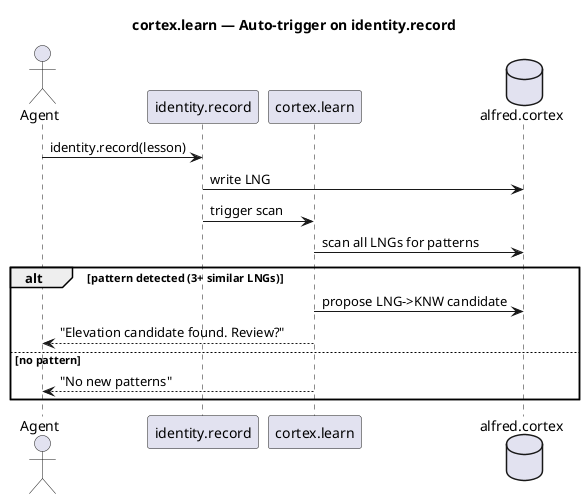
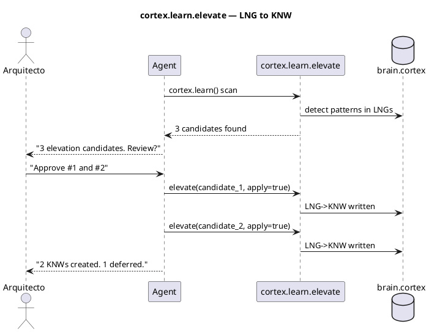
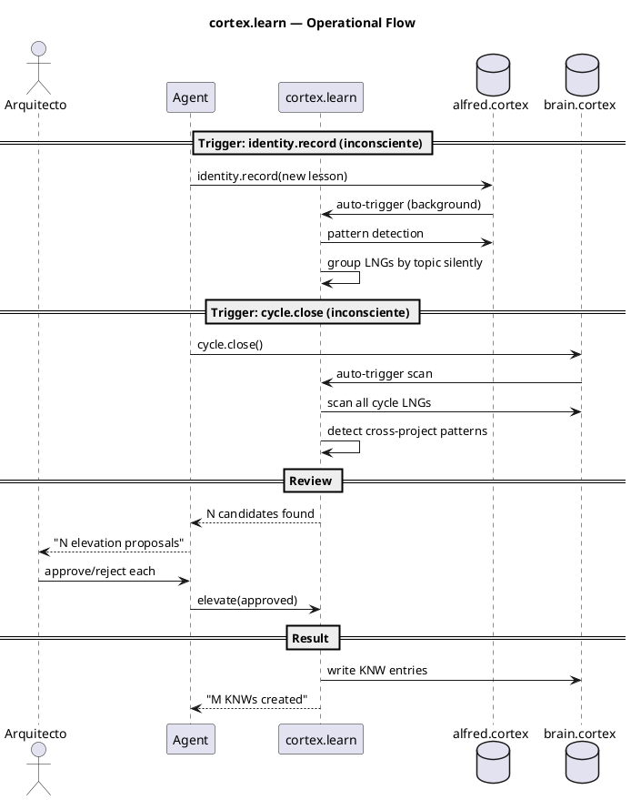
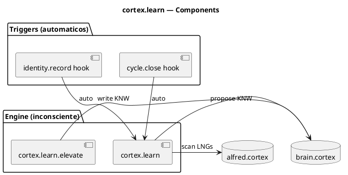

# BLP-007: Disparador periódico de cortex.learn — elevación LNG→KNW

---

## §1: Problem Statement

El motor de elevación `cortex.learn` existe pero **nunca se ejecuta en producción**. Durante CYCLE-01 se acumularon 17+ LNGs, pero cero fueron elevados a KNW. La sesión 2026-07-06/07 produjo lecciones valiosas que quedaron como materia prima sin refinar.

**Evidencia:**
- `alfred.cortex`: 13 LNGs acumulados, 0 KNW generados
- `brain.cortex`: 2 LNGs, 0 elevaciones
- `meta-brain.cortex`: 2 LNGs, sin consolidación
- BLP-003 implementó el `instruction` field y el 7mo gate, pero el motor de elevación sigue sin dispararse

---

## §2: Objective

Hacer que la elevación LNG→KNW sea **inconsciente** — opere en segundo plano sin intervención:

1. **Cada `identity.record`** — el motor escanea automáticamente sin que el agente lo sepa
2. **Cada `cycle.close`** — síntesis automática de todas las lecciones del ciclo
3. **Sin disparador manual** — si el sistema necesita que alguien recuerde ejecutarlo, está mal diseñado

El Arquitecto solo interviene para aprobar/rechazar elevaciones propuestas — nunca para recordar que el motor debe ejecutarse.

---

## §3: Preconditions

- [ ] `cortex.learn` handler existe
- [ ] `cortex.learn.elevate` handler existe
- [ ] 17+ LNGs acumulados en alfred.cortex para probar
- [ ] `identity.record` funcional (para trigger automático)

---

## §4: Guiding Principle

**El aprendizaje debe ser inconsciente.** El agente registra lecciones deliberadamente (`identity.record` es una acción consciente). Pero la elevación de LNG→KNW debe ocurrir sin que nadie tenga que recordar dispararla. Si tenemos que recordar que debemos aprender, entonces debemos aprender a recordar — y eso es trabajo del sistema, no del agente ni del Arquitecto.

El motor de elevación es como la memoria procedural humana: opera en segundo plano, detecta patrones sin esfuerzo consciente, y solo notifica cuando encuentra algo que merece atención.

---

## §5: Context — Flujo de elevación

### §5a: Trigger automático en identity.record

### §5b: Elevation flow

---

## §6: Scope & Exclusions

**In scope:**
- Trigger `cortex.learn` scan automáticamente después de cada `identity.record`
- Trigger `cortex.learn` scan al cerrar un ciclo (`cycle.close`)
- Handler `cortex.learn.scan` para ejecución bajo demanda
- Umbral: 3+ LNGs sobre mismo tema → candidate
- Presentar candidatos al Arquitecto para aprobación

**Out of scope:**
- Elevación automática sin revisión del Arquitecto
- NLP/semántica avanzada (detección por palabras clave)

---

## §7: Mandatory Rules

1. `cortex.learn` propone, NUNCA ejecuta — la elevación requiere aprobación explícita del Arquitecto
2. Umbral mínimo: 3+ LNGs sobre el mismo tema para proponer elevación
3. El scan es inconsciente — opera en segundo plano, no bloquea, no pide permiso
4. Sin patrón → silencio. Con patrón → notificación pasiva. Sin interrumpir.

---

## §8: Operational Design

---

## §9: Technical Design

---

## §10: Contracts

**Input:** LNGs acumulados en identity files y brain.cortex.

**Output:** KNW candidates con: topic, content, source LNGs, confidence score. Arquitecto revisa y aprueba/rechaza.

---

## §11: Work Procedure

### Phase 1: Auto-trigger hooks
1. Modificar `identity.record` para llamar a `cortex.learn` scan después de escribir LNG
2. Modificar `cycle.close` para llamar a `cortex.learn` scan antes de cerrar
3. Ambos triggers deben ser non-blocking (el scan falla → la operación principal sigue)

### Phase 2: Pattern detection
1. `cortex.learn` agrupa LNGs por keywords en el texto
2. Si 3+ LNGs comparten keywords → candidate
3. Generar propuesta KNW con topic, content, source LNGs

### Phase 3: Elevation
1. Presentar candidatos al Arquitecto (HCORTEX: tabla con topic, confidence, source)
2. Arquitecto aprueba/rechaza cada uno
3. `cortex.learn.elevate(candidate_id, apply=true)` escribe KNW en brain.cortex

### Phase 4: Verify
1. Probar con los 17+ LNGs existentes en alfred.cortex
2. Verificar que se generan candidatos
3. Aprobar al menos 1 elevación
4. Verificar KNW en brain.cortex

> **Rollback:** `git checkout` handlers modificados.

---

## §12: Acceptance Criteria

- [ ] **AC-01:** `identity.record` dispara `cortex.learn` scan automáticamente
- [ ] **AC-02:** `cycle.close` dispara `cortex.learn` scan automáticamente
- [ ] **AC-03:** Scan con 17+ LNGs existentes genera al menos 2 candidatos
- [ ] **AC-04:** `cortex.learn.elevate(candidate, apply=true)` escribe KNW en brain.cortex
- [ ] **AC-05:** Scan no bloquea la operación principal si falla
- [ ] **AC-06:** Tests existentes pasan

---

## §13: Required Validations

| Type | Description | Command | Expected Evidence |
|---|---|---|---|
| test | identity.record triggers scan | `identity.record(lesson)` → check scan output | Pattern detection ran |
| smoke | Scan on 17+ LNGs | `cortex.learn()` | 2+ candidates |
| smoke | Elevate one candidate | `cortex.learn.elevate(id, apply=true)` | KNW in brain.cortex |
| test | Tests pasan | `pytest tests/` | Exit code 0 |

---

## §14: Tasks

- [ ] **T-1.1:** Modificar `identity.record` para trigger `cortex.learn` scan
- [ ] **T-1.2:** Modificar `cycle.close` para trigger `cortex.learn` scan
- [ ] **T-2.1:** Implementar pattern detection en `cortex.learn`
- [ ] **T-2.2:** Umbral 3+ LNGs → candidate
- [ ] **T-3.1:** Verificar elevación con LNGs existentes
- [ ] **T-4.1:** Tests y smoke test

---

## §15: Risks

| ID | Description | Impact | Mitigation |
|---|---|---|---|
| R-01 | Scan bloquea identity.record y ralentiza operaciones | Medium | Scan asíncrono o post-hoc |
| R-02 | Falsos positivos (LNGs no relacionados agrupados) | Low | Arquitecto revisa antes de elevar |
| R-03 | 17 LNGs no producen candidatos (umbral muy alto) | Low | Bajar umbral a 2 si es necesario |

---

## §16: Blocking Rule

Si el scan bloquea `identity.record` por más de 2 segundos, HALT_AND_REPORT. El aprendizaje no debe degradar la operación.

---

## §17: Expected Output

**Handlers modificados:**
- `identity.record` → trigger cortex.learn scan
- `cycle.close` → trigger cortex.learn scan
- `cortex.learn` → pattern detection + candidate generation
- `cortex.learn.elevate` → LNG→KNW con apply=true

**Evidence:**
- KNW entries en brain.cortex generados desde LNGs
- Scan report con candidates detectados

---

## §18: Quality Contract

| Gate | Status |
|---|---|
| has_clear_objective | ☐ |
| has_verifiable_preconditions | ☐ |
| has_scope_and_exclusions | ☐ |
| has_acceptance_criteria | ☐ |
| has_work_procedure | ☐ |
| has_required_validations | ☐ |
| has_learning_recorded | ☐ |
