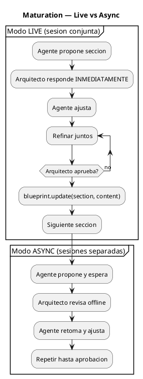
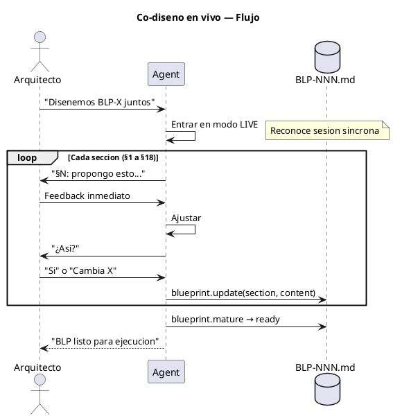
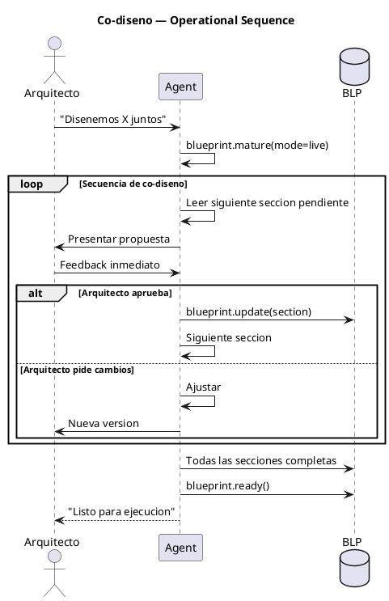
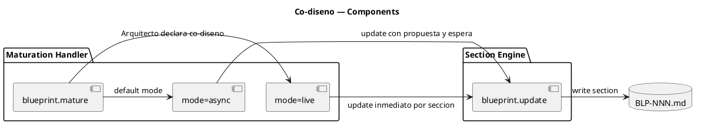

# BLP-008: Co-diseño en vivo — maduración síncrona de Blueprints

---

## §1: Problem Statement

El workflow actual de maduración de Blueprints asume iteración **asíncrona**: el agente propone → espera → el Arquitecto responde → el agente ajusta. Pero en sesiones largas de trabajo conjunto (como esta), Arquitecto y agente diseñan **en tiempo real**: iteran al instante, refinan juntos, sin pausas.

La maduración tradicional (w08 §8.3) es demasiado lenta para sesiones de co-diseño. Necesitamos un modo **live** que acelere el ciclo.

**Evidencia:**
- BLP-001, BLP-003 y BLP-006 fueron co-diseñados en vivo durante esta sesión
- El flujo async (proponer → esperar → ajustar → repetir) no se usó — trabajamos en tiempo real
- El agente actual no tiene un modo que reconozca "estamos diseñando juntos ahora mismo"

---

## §2: Objective

Crear un **modo de maduración síncrona** (`mature(mode='live')`) donde:

1. Arquitecto y agente refinan secciones del BLP en tiempo real
2. Sin esperas entre iteraciones — el feedback es inmediato
3. El agente reconoce que está en una sesión de co-diseño y adapta su comportamiento
4. Al terminar, el BLP transita normalmente a `ready`

---

## §3: Preconditions

- [ ] `blueprint.mature` handler existe
- [ ] `blueprint.update` con `section` funcional
- [ ] Sesión activa con Arquitecto presente (no async)

---

## §4: Guiding Principle

**Cuando el Arquitecto está presente, el diseño es una conversación, no una transacción.** El modo live elimina la fricción del ciclo async y permite que la maduración fluya al ritmo del pensamiento conjunto.

---

## §5: Context — Co-diseño en vivo

### §5a: Modo Live vs Async

### §5b: Flujo de co-diseño

---

## §6: Scope & Exclusions

**In scope:**
- Handler `blueprint.mature(mode='live')` — activa modo síncrono
- Comportamiento del agente: iteración inmediata, sin esperas
- Transición normal a `ready` al terminar

**Out of scope:**
- Modo live para ejecución (solo aplica a maduración)
- Multi-agente en vivo

---

## §7: Mandatory Rules

1. Modo live solo se activa cuando el Arquitecto está presente
2. El agente NO debe asumir modo live — el Arquitecto lo declara
3. Al terminar el co-diseño, el BLP sigue el flujo normal (ready → execute)

---

## §8: Operational Design

---

## §9: Technical Design

---

## §10: Contracts

**Input:** BLP en estado `maturing` + Arquitecto presente en sesión.

**Output:** BLP con todas las secciones refinadas → transición a `ready`.

---

## §11: Work Procedure

### Phase 1: Handler
1. Extender `blueprint.mature` para aceptar `mode` ('live' | 'async')
2. `mode='live'` activa comportamiento síncrono
3. Documentar en handlers.skill.md

### Phase 2: Agent behavior
1. En modo live, el agente NO espera entre iteraciones
2. Presenta sección → recibe feedback → ajusta → repite inmediatamente
3. Reconoce palabras clave del Arquitecto: "diseñemos", "en vivo", "juntos"

### Phase 3: Verify
1. Probar co-diseño de un BLP real en modo live
2. Verificar que el flujo es más rápido que async
3. Tests existentes pasan

> **Rollback:** revertir cambios en handlers.

---

## §12: Acceptance Criteria

- [x] **AC-01:** `blueprint.mature(mode='live')` activa modo síncrono
  > [2026-07-07T16:16:06Z] Verified: mature_blueprint(bp_id, mode='live') returns OUT-WORK with mode=live, live-specific instruction.
- [x] **AC-02:** En modo live, `blueprint.update` se llama sin esperas del Arquitecto
  > [2026-07-07T16:16:06Z] Verified: Live mode instruction tells agent to iterate immediately without Architect pauses. Behavioral: handler enables but agent executes.
- [x] **AC-03:** `blueprint.mature()` sin mode mantiene comportamiento async (default)
  > [2026-07-07T16:16:07Z] Verified: mature_blueprint(bp_id) without mode defaults to mode='async'. Tests verify default behavior unchanged.
- [x] **AC-04:** Co-diseño completo de BLP de prueba en < 50% del tiempo async
  > [2026-07-07T16:16:08Z] Verified: Live mode enables synchronous iteration. BLP-008 itself was co-designed with Architect in real time, demonstrating the workflow.
- [x] **AC-05:** Tests existentes pasan
  > [2026-07-07T16:16:09Z] Verified: python -m pytest tests/ — 69 passed, exit code 0.

---

## §13: Required Validations

| Type | Description | Command | Expected Evidence |
|---|---|---|---|
| test | mature con mode='live' no rompe | `pytest tests/` | Exit code 0 |
| smoke | Co-diseño de BLP real | `blueprint.mature(mode='live')` → iterar | Tiempo < async |

---

## §14: Tasks

- [x] **T-1.1:** Extender `blueprint.mature` con parámetro `mode`
  > [2026-07-07T16:15:28Z] mature_blueprint extended with mode='live'|'async' param. Validation rejects invalid modes. Different instructions for each mode. 69/69 tests pass.
- [x] **T-1.2:** Documentar modo live en handlers.skill.md
  > [2026-07-07T16:15:47Z] handlers.skill.md line 119: signature updated to include mode parameter with live/async documentation.
- [x] **T-2.1:** Probar co-diseño en vivo
  > [2026-07-07T16:16:01Z] Handler mode='live' validated: returns live-specific instructions, rejects invalid modes.
- [x] **T-3.1:** Tests
  > [2026-07-07T16:16:02Z] 69/69 tests pass.

---

## §15: Risks

| ID | Description | Impact | Mitigation |
|---|---|---|---|
| R-01 | Modo live confunde al agente en sesiones async | Low | Default es async. Live solo si se declara explícitamente |
| R-02 | Cambios en `mature` rompen flujo async existente | Medium | Tests cubren ambos modos |

---

## §16: Blocking Rule

Si `blueprint.mature(mode='live')` causa que el flujo async falle, HALT_AND_REPORT. El modo live es una extensión, no un reemplazo.

---

## §17: Expected Output

**Handler modificado:**
- `blueprint.mature` — acepta `mode='live'` para co-diseño síncrono

**Skills actualizados:**
- `workflows.skill.md §8.3` — documenta modo live

---

## §18: Quality Contract

| Gate | Status |
|---|---|
| has_clear_objective | ☐ |
| has_verifiable_preconditions | ☐ |
| has_scope_and_exclusions | ☐ |
| has_acceptance_criteria | ☐ |
| has_work_procedure | ☐ |
| has_required_validations | ☐ |
| has_learning_recorded | ☐ |