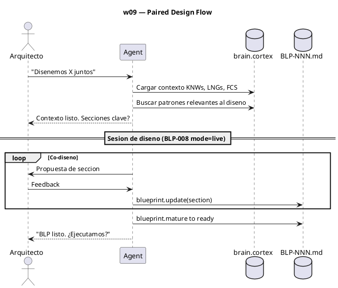
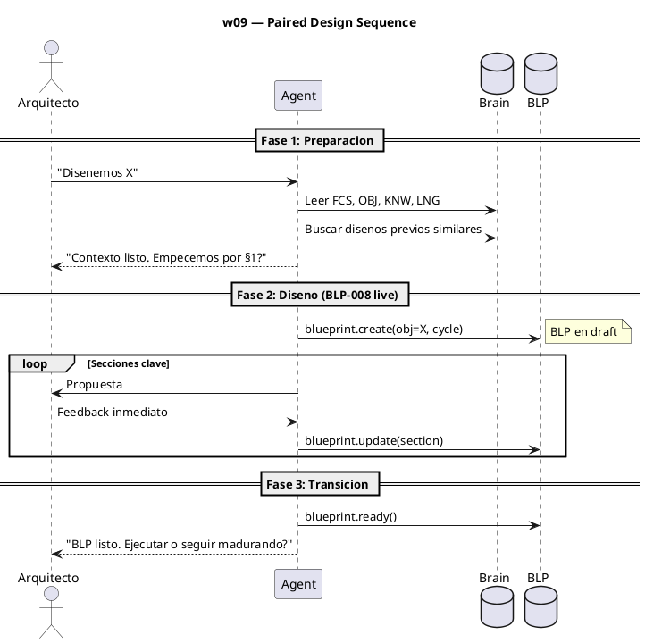
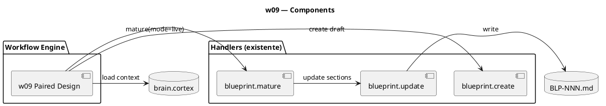

# BLP-009: Paired design — workflow formal para diseño conjunto

---

## §1: Problem Statement

No existe un workflow formal cuando Arquitecto y agente diseñan juntos. El proceso ocurre en la práctica — esta sesión es prueba de ello — pero no está documentado, no tiene handlers de soporte, y no está integrado en el ciclo de gobierno.

**Evidencia:**
- BLP-001, BLP-003, BLP-006, BLP-007, BLP-008 fueron diseñados en paired design
- El agente no sabe que está en una sesión de diseño conjunto hasta que el Arquitecto lo declara
- No hay transición formal de "diseño conjunto" → "Blueprint en maduración"

---

## §2: Objective

Crear **w09 — PAIRED DESIGN** como workflow canónico:

1. Arquitecto declara intención de diseño conjunto
2. Agente prepara contexto: brain.cortex, KNWs, LNGs relevantes
3. Sesión de diseño en vivo (usando modo live de BLP-008)
4. Output: BLP draft con secciones clave pre-llenadas
5. Transición a maduración normal o ejecución

---

## §3: Preconditions

- [ ] BLP-008 (modo live) implementado
- [ ] `blueprint.create` y `blueprint.update` funcionales
- [ ] AGENTS.md y workflows.skill.md accesibles

---

## §4: Guiding Principle

**El mejor diseño emerge de la conversación, no de la especificación previa.** El paired design captura el conocimiento tácito que surge cuando Arquitecto y agente piensan juntos. Formalizarlo como workflow garantiza que ese conocimiento no se pierda.

---

## §5: Context — Paired Design Flow

---

## §6: Scope & Exclusions

**In scope:**
- Nuevo workflow w09 en workflows.skill.md
- Fase de preparación (context loading)
- Fase de diseño (BLP-008 mode=live)
- Fase de transición (→ ready o execution)
- Documentación formal

**Out of scope:**
- Nuevos handlers (usa BLP-008 y handlers existentes)
- Multi-agente paired design

---

## §7: Mandatory Rules

1. Paired design requiere que el Arquitecto esté presente (no async)
2. El output mínimo es un BLP draft con §1, §2, §4, §6, §12 poblados
3. Si el Arquitecto se ausenta, la sesión se convierte en maduración async normal

---

## §8: Operational Design

---

## §9: Technical Design

---

## §10: Contracts

**Input:** Arquitecto declara intención de diseño conjunto + contexto de proyecto.

**Output:** BLP completo (18 secciones) o BLP mínimo (6 secciones clave) listo para maduración.

---

## §11: Work Procedure

### Phase 1: Document workflow
1. Agregar w09 a `workflows.skill.md`
2. Incluir DIAG (PUML) y STP (pasos)
3. Referenciar BLP-008 para el modo live

### Phase 2: Context preparation
1. Agente carga brain.cortex al iniciar paired design
2. Busca KNWs y LNGs relevantes al tema
3. Presenta resumen al Arquitecto antes de empezar

### Phase 3: Integration
1. w09 → BLP-008 (mode=live) → BLP draft
2. Transición: BLP ready → ejecución o más maduración

> **Rollback:** revertir workflows.skill.md.

---

## §12: Acceptance Criteria

- [ ] **AC-01:** w09 documentado en workflows.skill.md con DIAG y STP
- [ ] **AC-02:** Agente reconoce "diseñemos juntos" y carga contexto
- [ ] **AC-03:** Paired design produce BLP draft con mínimo 6 secciones pobladas
- [ ] **AC-04:** Transición correcta a BLP-008 mode=live
- [ ] **AC-05:** Tests de workflows pasan

---

## §13: Required Validations

| Type | Description | Command | Expected Evidence |
|---|---|---|---|
| doc | w09 en workflows.skill.md | `grep "w09" workflows.skill.md` | DIAG + STP presentes |
| smoke | Paired design real | Declarar "diseñemos X" → verificar BLP draft | 6+ secciones pobladas |

---

## §14: Tasks

- [ ] **T-1.1:** Escribir w09 en workflows.skill.md con DIAG y STP
- [ ] **T-1.2:** Documentar fases: preparación, diseño, transición
- [ ] **T-2.1:** Probar paired design con un BLP real
- [ ] **T-2.2:** Verificar transición BLP-008 mode=live

---

## §15: Risks

| ID | Description | Impact | Mitigation |
|---|---|---|---|
| R-01 | w09 se solapa con w08 (maduración normal) | Low | w09 es explícitamente síncrono, w08 es async |
| R-02 | Agente confunde "diseñemos" con "maduremos" | Low | Palabras clave distintas en triggers |

---

## §16: Blocking Rule

Si el agente inicia paired design sin el Arquitecto presente, HALT_AND_REPORT. Paired design requiere sesión síncrona.

---

## §17: Expected Output

**Skills modificados:**
- `workflows.skill.md` — nuevo w09 PAIRED DESIGN
- AGENTS.md — referencia a w09

**Workflow:**
- w09: preparación → diseño (BLP-008 live) → transición

---

## §18: Quality Contract

| Gate | Status |
|---|---|
| has_clear_objective | ☐ |
| has_verifiable_preconditions | ☐ |
| has_scope_and_exclusions | ☐ |
| has_acceptance_criteria | ☐ |
| has_work_procedure | ☐ |
| has_required_validations | ☐ |
| has_learning_recorded | ☐ |
