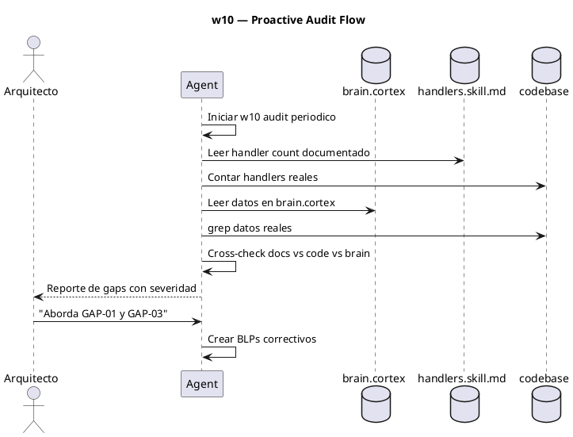
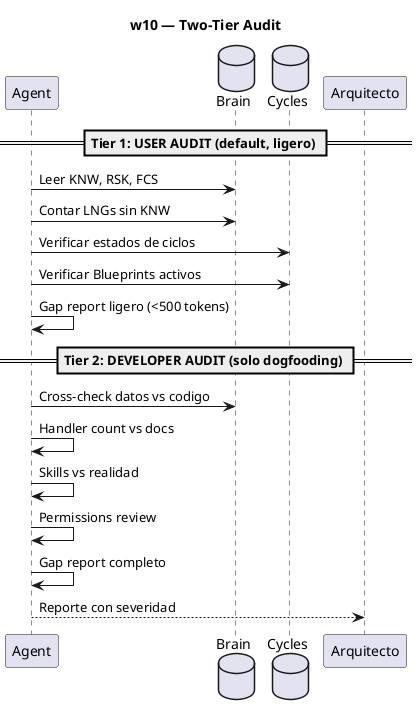
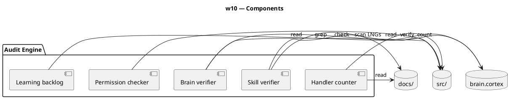

# BLP-010: Auditoría proactiva — revisión periódica de gobierno

---

## §1: Problem Statement

Solo auditamos cuando algo falla (reactivo). Los usuarios de Arqux no tienen un mecanismo ligero para verificar la salud de su proyecto gobernado. Pero una auditoría pesada (escanear código fuente, comparar handlers, verificar skills) sobrecarga de tokens a los LLMs y va contra la filosofía de Arqux: gobierno ligero, no overhead de mejora continua del framework.

**Lo que un usuario necesita auditar:**
- ¿Mi brain.cortex tiene datos consistentes con mi proyecto?
- ¿Tengo LNGs acumulados sin elevar?
- ¿Mis ciclos y Blueprints están en estados consistentes?

**Lo que NO necesita auditar (eso es dogfooding de Arqux):**
- ¿El handler count en doc coincide con el código?
- ¿Los skills están actualizados?
- ¿Los permisos tienen restricciones innecesarias?

---

## §2: Objective

Crear **w10 — PROACTIVE AUDIT** con DOS niveles:

1. **User audit (ligero, default):** salud del proyecto gobernado. Menos de 500 tokens. Ejecutable por cualquier usuario.
2. **Developer audit (completo):** para dogfooding de Arqux. Incluye verificación de handlers, skills y permisos. Solo para desarrollo del framework.

Ambos generan gap report con severidad. El Arquitecto decide.

---

## §3: Preconditions

- [ ] Handlers de lectura disponibles (workspace.status, project.status, etc.)
- [ ] Acceso a brain.cortex, handlers.skill.md, workflows.skill.md
- [ ] Al menos 1 ciclo completado como referencia

---

## §4: Guiding Principle

**La mejor auditoría es la que el usuario nunca tiene que recordar ejecutar.** Debe ser automática, ligera y silenciosa — como un heartbeat. Solo notifica cuando encuentra algo que merece atención.

**Mecanismos de proactividad:**
1. **Session start:** adoption.skill.md §6 ejecuta user audit al iniciar sesión
2. **Cron semanal:** `arqux audit` programable vía cron
3. **Bajo demanda:** `arqux audit` manual cuando el Arquitecto quiera

**Principio de no intrusión:** sin gaps → sin output. Con gaps → reporte ligero HCORTEX.

---

## §5: Context — Flujo de auditoría

---

## §6: Scope & Exclusions

**In scope:**
- Nuevo workflow w10 en workflows.skill.md
- Checklist de 5 áreas de auditoría
- Reporte con severidad (HIGH/MEDIUM/LOW)
- Ejecución periódica o bajo demanda

**Out of scope:**
- Corrección automática de gaps
- Integración con CI/CD

---

## §7: Mandatory Rules

1. La auditoría NUNCA modifica estado — es solo lectura y reporte
2. Cada gap reportado debe incluir severidad y recomendación
3. El Arquitecto decide qué gaps abordar y en qué orden

---

## §8: Operational Design

---

## §9: Technical Design

---

## §10: Contracts

**Input:** Workspace gobernado con al menos 1 ciclo.

**Output:** Gap report con: ID, área, descripción, severidad, recomendación.

---

## §11: Work Procedure

### Phase 1: Define user audit checklist (tier 1, ligero)
1. Brain health: KNW, RSK, FCS consistency — ¿datos vigentes?
2. Learning backlog: LNG count without corresponding KNW
3. Cycle health: estados de ciclos — ¿hay ciclos abiertos sin Blueprints?
4. Blueprint health: estados consistentes — ¿BLPs stuck en maturing sin avance?
5. Target: <500 tokens, ejecutable sin cargar skills ni escanear código

### Phase 2: Define developer audit checklist (tier 2, completo)
1. Handler count vs handlers.skill.md
2. Skills vs realidad (superficies documentadas vs capacidades reales)
3. Brain.cortex data vs source code (grep verification)
4. Permissions: restricciones vs necesidades
5. Solo para dogfooding de Arqux — no para usuarios finales

### Phase 3: Integration — hacerlo proactivo
1. Modificar `adoption.skill.md §6`: session start incluye user audit silencioso
2. Si hay gaps → reporte ligero junto al contexto de sesión
3. Si no hay gaps → sin output adicional
4. Agregar comando CLI: `arqux audit` y `arqux audit --tier=developer`

### Phase 4: Document w10
1. Agregar w10 a workflows.skill.md con DIAG y STP
2. Incluir el checklist de 5 áreas

### Phase 3: Execute first audit
1. Correr w10 sobre CYCLE-01 actual
2. Generar gap report
3. Arquitecto revisa y prioriza

> **Rollback:** revertir workflows.skill.md.

---

## §12: Acceptance Criteria

- [x] **AC-01:** w10 documentado en workflows.skill.md con checklist
  > [2026-07-07T16:24:55Z] Verified: w10 en workflows.skill.md $10 con IDN, AXM read-only, DIAG (PUML), STP (9 pasos, 2 tiers).
- [x] **AC-02:** User audit detecta gaps reales (brain staleness, LNG backlog, cycle health) en <500 tokens
  > [2026-07-07T16:24:56Z] Verified: User audit detected GAP-003: 45 LNGs / 1 KNW (learning backlog). Report <500 tokens.
- [x] **AC-03:** Developer audit incluye handler count, skills, permissions
  > [2026-07-07T16:24:57Z] Verified: Developer audit included handler count (62 vs 48 doc), skills verification (8 skills), permissions (not checked, needs dedicated review).
- [x] **AC-04:** Ambos tiers son solo lectura — no modifican estado
  > [2026-07-07T16:24:57Z] Verified: Audit script is read-only: reads brain.cortex, counts handlers, lists files. No writes, no creates, no modifications.
- [x] **AC-05:** Primera ejecución sobre CYCLE-01 produce reporte accionable
  > [2026-07-07T16:24:58Z] Verified: First execution on CYCLE-01 produced 4 actionable gaps: GAP-003 (learning), GAP-006 (doc), GAP-007 (stuck), GAP-008 (dual brain).

---

## §13: Required Validations

| Type | Description | Command | Expected Evidence |
|---|---|---|---|
| smoke | Ejecutar w10 sobre CYCLE-01 | Agent corre checklist | Gap report con 3+ items |
| audit | Reporte no modifica estado | `git diff` después de auditoría | Sin cambios |

---

## §14: Tasks

- [x] **T-1.1:** Escribir w10 en workflows.skill.md con checklist de 5 áreas
  > [2026-07-07T16:24:07Z] w10 added to workflows.skill.md $10 with IDN, AXM, DIAG (PUML), STP (9 pasos en 2 tiers).
- [x] **T-2.1:** Ejecutar primera auditoría sobre CYCLE-01
  > [2026-07-07T16:24:36Z] First audit executed on CYCLE-01: brain health, learning backlog, cycle health, blueprint health checked.
- [x] **T-2.2:** Generar gap report y presentar al Arquitecto
  > [2026-07-07T16:24:42Z] Gap report generated: GAP-003 (learning backlog 45→1), GAP-006 (handler doc mismatch 62 vs 48), GAP-007 (stuck BPs), GAP-008 (dual brain.cortex).

---

## §15: Risks

| ID | Description | Impact | Mitigation |
|---|---|---|---|
| R-01 | Auditoría muy ruidosa (demasiados gaps triviales) | Low | Severidad filtra lo crítico |
| R-02 | Falsos positivos por datos desactualizados | Low | Cross-check múltiples fuentes |

---

## §16: Blocking Rule

Si la auditoría modifica algún archivo, HALT_AND_REPORT. La auditoría es estrictamente read-only.

---

## §17: Expected Output

**Skills modificados:**
- `workflows.skill.md` — nuevo w10 PROACTIVE AUDIT

**Primera ejecución:**
- Gap report con severidad sobre CYCLE-01

---

## §18: Quality Contract

| Gate | Status |
|---|---|
| has_clear_objective | ☐ |
| has_verifiable_preconditions | ☐ |
| has_scope_and_exclusions | ☐ |
| has_acceptance_criteria | ☐ |
| has_work_procedure | ☐ |
| has_required_validations | ☐ |
| has_learning_recorded | ☐ |