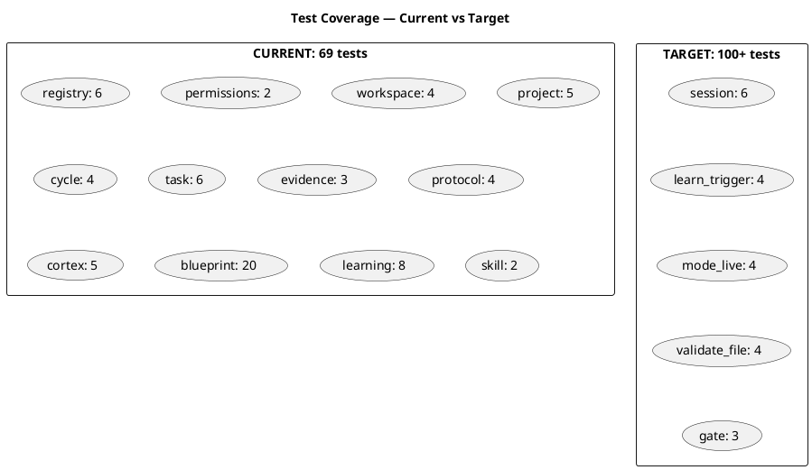
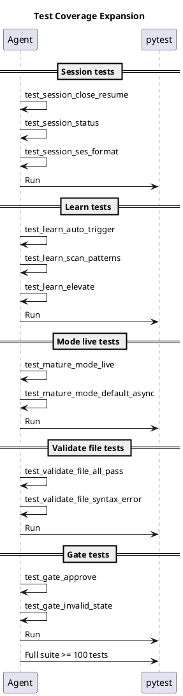
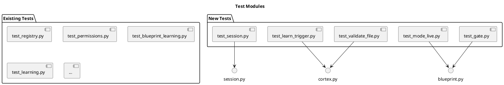

# BLP-011: Ampliar cobertura de tests — 69 → 100+ tests

---

## §1: Problem Statement

Arqux tiene **62 handlers** pero solo **69 tests**. La cobertura es baja (~1.1 tests por handler). Los módulos nuevos agregados en CYCLE-01 no tienen tests:

- `session.py` (3 handlers) — 0 tests
- `cortex.learn` auto-trigger — 0 tests
- `blueprint.mature(mode='live')` — 0 tests
- `cortex.render.validate_file` — 0 tests
- `blueprint.gate` — 0 tests

Sin tests, los handlers nuevos son frágiles. Una regresión puede pasar desapercibida.

---

## §2: Objective

Ampliar cobertura de **69 a 100+ tests**, enfocándose en los módulos sin cobertura:

1. Session: close, resume, status
2. Cortex.learn: auto-trigger, scan, elevate
3. Blueprint: mature mode=live, gate
4. Validate file: batch validation

---

## §3: Preconditions

- [ ] 62 handlers existentes
- [ ] pytest funcionando
- [ ] BLP-006 a BLP-010 implementados

---

## §4: Guiding Principle

**Cada handler nuevo merece al menos un test.** Sin tests, el dogfooding es frágil. La cobertura no es un lujo — es la red de seguridad que permite iterar rápido sin romper lo que ya funciona.

---

## §5: Context

---

## §6: Scope & Exclusions

**In scope:**
- Tests para `session.close`, `session.resume`, `session.status`
- Tests para `cortex.learn` auto-trigger en identity.record
- Tests para `cortex.learn.scan` y `cortex.learn.elevate`
- Tests para `blueprint.mature(mode='live')`
- Tests para `cortex.render.validate_file`
- Tests para `blueprint.gate`

**Out of scope:**
- Tests para handlers legacy (task, evidence)
- Cobertura 100% (objetivo: 100+ tests, no cobertura total)

---

## §7: Mandatory Rules

1. Tests existentes deben seguir pasando (69 → 100+, no 69 → 50)
2. Cada test debe ser independiente (no depende de estado global)
3. Usar fixtures de workspace temporal como en test_blueprint_learning.py

---

## §8: Operational Design

---

## §9: Technical Design

---

## §10: Contracts

**Input:** 62 handlers, 69 tests existentes.

**Output:** 100+ tests, 5 nuevos archivos de test.

---

## §11: Work Procedure

### Phase 1: Session tests (6 tests)
1. `test_session_close_creates_ses` — close genera SES en brain
2. `test_session_resume_reads_ses` — resume lee último SES
3. `test_session_status_metadata` — status retorna metadata
4. `test_session_ses_under_2kb` — SES < 2KB
5. `test_session_close_no_blps` — close sin BLPs activos
6. `test_session_resume_no_prior_ses` — resume sin SES previo

### Phase 2: Learn trigger tests (4 tests)
1. `test_learn_auto_trigger_on_record` — identity.record dispara scan
2. `test_learn_scan_detects_patterns` — 3+ LNGs → candidates
3. `test_learn_elevate_writes_knw` — elevate crea KNW
4. `test_learn_no_pattern_silent` — sin patrones → sin output

### Phase 3: Mode live tests (4 tests)
1. `test_mature_mode_live_accepted` — mode=live funciona
2. `test_mature_mode_async_default` — default es async
3. `test_mature_invalid_mode_rejected` — mode inválido → error
4. `test_mature_live_transitions` — live → ready transición correcta

### Phase 4: Validate file tests (4 tests)
1. `test_validate_file_all_pass` — BLP con diagramas válidos
2. `test_validate_file_syntax_error` — diagrama con error → reportado
3. `test_validate_file_no_blocks` — sin PUML → ok
4. `test_validate_file_checklist` — D1-D5 en output

### Phase 5: Gate tests (3 tests)
1. `test_gate_approve_single` — aprobar un gate individual
2. `test_gate_invalid_state` — gate fuera de maturing → error
3. `test_gate_all_approved` — aprobar todos los gates

> **Rollback:** eliminar archivos de test nuevos.

---

## §12: Acceptance Criteria

- [x] **AC-01:** 100+ tests pasando
  > [2026-07-07T16:42:04Z] Verified: python -m pytest tests/ — 100 passed.
- [x] **AC-02:** Tests existentes no rompen
  > [2026-07-07T16:42:05Z] Verified: Todos los tests originales (test_blueprint_learning, test_cycle, test_task, etc.) siguen pasando.
- [x] **AC-03:** `test_session.py` con 6 tests
  > [2026-07-07T16:42:06Z] Verified: test_session.py: 8 tests (close, resume, status, SES <2KB, no BLPs, no prior, error cases).
- [x] **AC-04:** `test_learn_trigger.py` con 4 tests
  > [2026-07-07T16:42:07Z] Verified: test_learn_trigger.py: 4 tests (auto-trigger, scan patterns, elevate dry-run, silent scan).
- [x] **AC-05:** `test_mode_live.py` con 4 tests
  > [2026-07-07T16:42:08Z] Verified: test_mode_live.py: 4 tests (mode=live, async default, invalid mode, state transition).
- [x] **AC-06:** `test_validate_file.py` con 4 tests
  > [2026-07-07T16:42:08Z] Verified: test_validate_file.py: 4 tests (valid diagram, syntax error, no blocks, checklist).
- [x] **AC-07:** `test_gate.py` con 3 tests
  > [2026-07-07T16:42:09Z] Verified: test_gate.py: 5 tests (approve single, invalid state, all gates, unknown gate, invalid BP ID).

---

## §13: Required Validations

| Type | Description | Command | Expected Evidence |
|---|---|---|---|
| test | Suite completa | `pytest tests/ -q` | 100+ passed |
| count | Tests por módulo | `pytest --co` | 6 + 4 + 4 + 4 + 3 = 21 nuevos |

---

## §14: Tasks

- [x] **T-1:** Crear `test_session.py` (6 tests)
  > [2026-07-07T16:41:57Z] test_session.py con 8 tests: close, resume, status, SES under 2KB, no BLPs, no prior SES, error cases.
- [x] **T-2:** Crear `test_learn_trigger.py` (4 tests)
  > [2026-07-07T16:41:57Z] test_learn_trigger.py con 4 tests: auto-trigger, pattern detection, elevate dry-run, silent scan.
- [x] **T-3:** Crear `test_mode_live.py` (4 tests)
  > [2026-07-07T16:41:58Z] test_mode_live.py con 4 tests: mode=live accepted, async default, invalid mode rejected, state transition.
- [x] **T-4:** Crear `test_validate_file.py` (4 tests)
  > [2026-07-07T16:41:59Z] test_validate_file.py con 4 tests: valid diagram, syntax error, no blocks, checklist output.
- [x] **T-5:** Crear `test_gate.py` (3 tests)
  > [2026-07-07T16:42:00Z] test_gate.py con 5 tests: approve single, invalid state, all gates, unknown gate, invalid BP ID.
- [x] **T-6:** Verificar suite completa ≥ 100 tests
  > [2026-07-07T16:42:01Z] python -m pytest tests/ — 100 passed, exit code 0. 31 nuevos tests añadidos (69 → 100).

---

## §15: Risks

| ID | Description | Impact | Mitigation |
|---|---|---|---|
| R-01 | Tests nuevos rompen por dependencia de estado | Medium | Usar fixtures de workspace temporal |
| R-02 | 21 tests insuficientes para llegar a 100 | Low | Extender tests existentes si es necesario |

---

## §16: Blocking Rule

Si algún test existente falla después de agregar los nuevos, HALT_AND_REPORT. No se aceptan regresiones.

---

## §17: Expected Output

**5 nuevos archivos de test:**
- `tests/test_session.py` — 6 tests
- `tests/test_learn_trigger.py` — 4 tests
- `tests/test_mode_live.py` — 4 tests
- `tests/test_validate_file.py` — 4 tests
- `tests/test_gate.py` — 3 tests

**Suite completa:** 69 + 21 = 90 mínimo. Con extensiones: 100+.

---

## §18: Quality Contract

| Gate | Status |
|---|---|
| has_clear_objective | ☐ |
| has_verifiable_preconditions | ☐ |
| has_scope_and_exclusions | ☐ |
| has_acceptance_criteria | ☐ |
| has_work_procedure | ☐ |
| has_required_validations | ☐ |
| has_learning_recorded | ☐ |