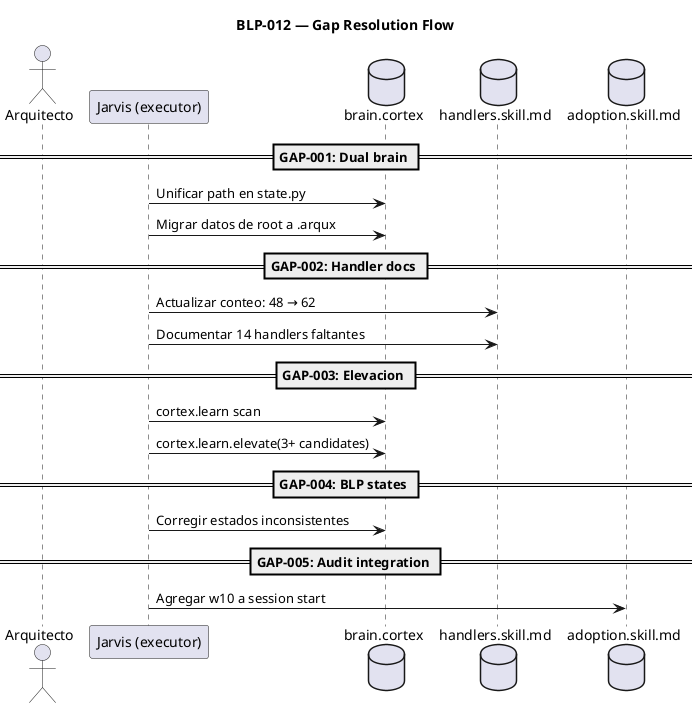

# BLP-012: Abordar GAP-001 a GAP-005 del reporte Jarvis

---

## §1: Problem Statement

Jarvis ejecutó la primera auditoría proactiva (w10, BLP-010) sobre CYCLE-01 y detectó 5 gaps. Todos son accionables y bloquean la madurez del framework:

| Gap | Severidad | Problema |
|---|---|---|
| GAP-001 | HIGH | Dual brain.cortex: `read_brain(root)` lee `root/brain.cortex` pero `find_project_root()` busca `.arqux/brain.cortex`. Dos archivos divergentes. |
| GAP-002 | HIGH | 62 handlers en registry, 48 en handlers.skill.md. 14 sin documentar. |
| GAP-003 | MEDIUM | 44+ LNGs en identidad, 91 en brain, solo 1 KNW. 37 candidatos detectados. |
| GAP-004 | LOW | BLP-001, BLP-008, BLP-010 en estados intermedios inconsistentes. |
| GAP-005 | MEDIUM | w10 documentado pero no integrado en adoption.skill.md §6. |

---

## §2: Objective

Resolver los 5 gaps detectados en el reporte de auditoría de Jarvis:

1. Unificar paths de brain.cortex — un solo archivo canónico
2. Sincronizar handlers.skill.md con el registry real (62 handlers)
3. Elevar LNGs acumulados → KNW (al menos 3 elevaciones)
4. Corregir estados inconsistentes de BLPs
5. Integrar w10 en adoption.skill.md §6 (session start audit)

---

## §3: Preconditions

- [ ] Reporte Jarvis (`aprendizajes-ciclo-01.md`) generado
- [ ] 62 handlers, 100 tests pasando
- [ ] `cortex.learn.elevate` funcional

---

## §4: Guiding Principle

**La auditoría sin acción es ruido.** Los gaps detectados por w10 deben convertirse en acciones correctivas. Cada gap → tarea → verificación. Cerrar el ciclo de mejora continua.

---

## §5: Context

---

## §6: Scope & Exclusions

**In scope:** Los 5 gaps del reporte Jarvis.

**Out of scope:** Nuevos gaps no detectados en esta auditoría.

---

## §7: Mandatory Rules

1. GAP-001: un solo brain.cortex canónico (`.arqux/brain.cortex`). Migrar sin perder datos.
2. GAP-002: handlers.skill.md debe reflejar EXACTAMENTE el registry.
3. GAP-003: elevación requiere dry-run → revisión → apply con confirm_hash.
4. Tests existentes deben seguir pasando después de cada fix.

---

## §8: Work Procedure

### GAP-001: Dual brain.cortex
1. Verificar diferencias entre `root/brain.cortex` y `.arqux/brain.cortex`
2. Migrar datos del root al `.arqux/` si hay divergencia
3. Modificar `state.py`: `BRAIN_CORTEX = ".arqux/brain.cortex"` o ajustar `read_brain`
4. Eliminar `root/brain.cortex` después de migrar

### GAP-002: Handler docs
1. Contar handlers reales: 62
2. Actualizar `IDN:surface` en handlers.skill.md
3. Agregar entries para session (3), mode=live, validate_file, gate

### GAP-003: Elevación LNG→KNW
1. Ejecutar `cortex.learn()` dry-run
2. Revisar candidatos con Arquitecto
3. Aprobar y aplicar elevaciones

### GAP-004: BLP states
1. Revisar BLP-001, BLP-008, BLP-010
2. Corregir estados al valor correcto

### GAP-005: Audit integration
1. Agregar paso de auditoría en `adoption.skill.md §6`

> **Rollback:** `git checkout` archivos modificados.

---

## §9: Acceptance Criteria

- [ ] **AC-01:** Un solo brain.cortex canónico (`.arqux/brain.cortex`)
- [ ] **AC-02:** handlers.skill.md refleja 62 handlers
- [ ] **AC-03:** Al menos 3 KNWs elevados desde LNGs
- [ ] **AC-04:** BLPs en estados consistentes
- [ ] **AC-05:** w10 integrado en adoption.skill.md §6
- [ ] **AC-06:** 100 tests pasando

---

## §10: Required Validations

| Type | Description | Expected |
|---|---|---|
| diff | brain.cortex único | Solo `.arqux/brain.cortex` existe |
| count | handlers.skill.md surface | 62 handlers |
| audit | KNWs nuevos en brain | 3+ entries |
| test | Suite completa | 100 passed |

---

## §11: Tasks

- [ ] **T-1:** GAP-001: Unificar brain.cortex
- [ ] **T-2:** GAP-002: Actualizar handlers.skill.md
- [ ] **T-3:** GAP-003: Elevar 3+ LNGs a KNW
- [ ] **T-4:** GAP-004: Corregir estados BLP
- [ ] **T-5:** GAP-005: Integrar w10 en adoption.skill.md

---

## §12: Risks

| ID | Description | Mitigation |
|---|---|---|
| R-01 | Migración de brain.cortex pierde datos | Backup antes de migrar |
| R-02 | Elevación incorrecta | Dry-run primero, Arquitecto revisa |

---

## §13: Blocking Rule

Si la migración de brain.cortex causa pérdida de datos o tests fallan, HALT_AND_REPORT.

---

## §14: Expected Output

- `.arqux/brain.cortex` como único brain canónico
- `handlers.skill.md` con 62 handlers
- 3+ KNWs nuevos en brain.cortex
- BLPs con estados corregidos
- `adoption.skill.md §6` con w10 integrado
- 100 tests pasando

---

## §15: Quality Contract

| Gate | Status |
|---|---|
| has_clear_objective | ☐ |
| has_verifiable_preconditions | ☐ |
| has_scope_and_exclusions | ☐ |
| has_acceptance_criteria | ☐ |
| has_work_procedure | ☐ |
| has_required_validations | ☐ |
| has_learning_recorded | ☐ |
