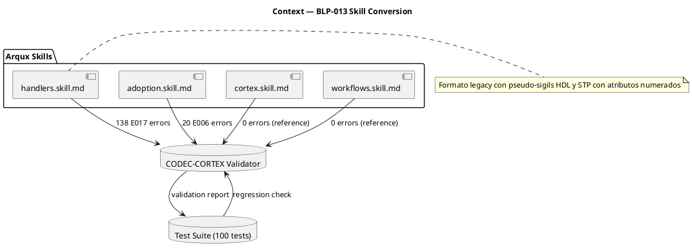
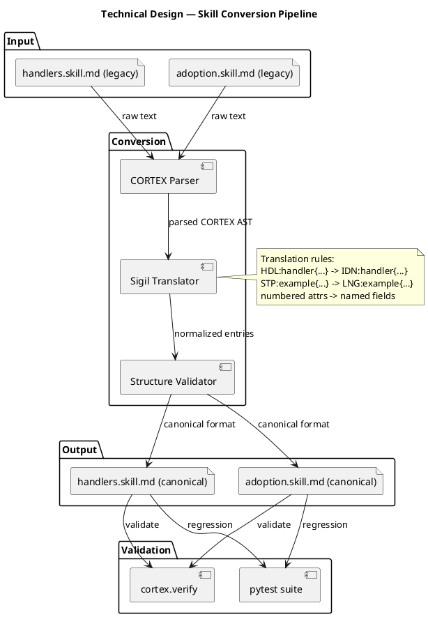
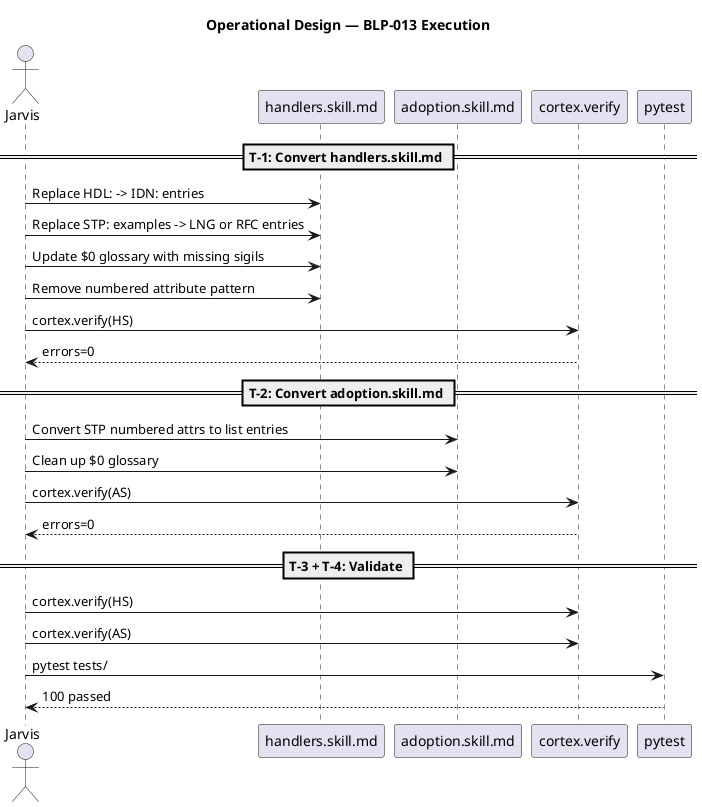

# BLP-013: Convertir skills a CORTEX canónico — eliminar errores de validación en handlers.skill.md y adoption.skill.md

---

## §1: Problem Statement

Dos skills del framework (handlers.skill.md y adoption.skill.md) usan un formato no-estándar que el validador CODEC-CORTEX rechaza. handlers.skill.md produce 138 errores E017 (líneas no parseables) y adoption.skill.md produce 20 errores E006 (atributos inválidos). Aunque los tests pasan y la funcionalidad no se ve afectada, la deuda técnica impide usar cortex.verify como herramienta de calidad en estos archivos y bloquea la evolución futura de los skills.
## §2: Objective

Convertir handlers.skill.md y adoption.skill.md a formato CORTEX canónico, eliminando todos los errores de validación E017/E006 sin perder contenido funcional. Servir como referencia para conversión futura de otros skills.
## §3: Preconditions

_What must exist or be true BEFORE execution begins. Each precondition must be verifiable._

- [ ] _Precondition 1 — verifiable via command or inspection_
- [ ] _Precondition 2 — verifiable via command or inspection_

## §4: Guiding Principle

**La validación estructural no es opcional.** Si cortex.verify reporta errores en un skill, esos errores deben resolverse antes de considerar el skill maduro. Ignorar errores de validación acumula deuda técnica que impide la evolución automatizada del framework.

**Problem evidence:** handlers.skill.md produce 138 errores E017, adoption.skill.md produce 20 errores E006. Ambos skills son pilares del framework.

**Impact if violated:** Los skills no podrán ser procesados por herramientas CODEC-CORTEX, bloqueando migración futura a formatos canónicos y evolución asistida.

## §5: Context

## §6: Scope & Exclusions

**In scope:** handlers.skill.md y adoption.skill.md en src/arqux/skills/. Solo formato, no contenido.

**Out of scope:** Otros skills (cortex.skill.md, identities.skill.md, etc.) a menos que tengan errores similares. No se modifica la lógica de negocio ni los handlers.
## §7: Mandatory Rules

1. Cero pérdida de contenido: cada handler (62) y cada paso de adopción debe estar presente después de la conversión.
2. cortex.verify después de cada skill convertido — no esperar al final.
3. Los tests (100) deben pasar igual antes y después — validación funcional.
4. El formato de salida debe seguir exactamente la convención de cortex.skill.md (canónico).
## §8: Technical Design

## §8: Technical Design

## §9: Operational Design

## §9: Operational Design

## §10: Contracts

**Expected inputs:**
- src/arqux/skills/handlers.skill.md (141 líneas, formato legacy con 138 errores)
- src/arqux/skills/adoption.skill.md (86 líneas, formato legacy con 20 errores)
- src/arqux/skills/cortex.skill.md (formato canónico de referencia)

**Expected outputs:**
- handlers.skill.md convertido a CORTEX canónico, 0 errores E017/E006
- adoption.skill.md convertido a CORTEX canónico, 0 errores E017/E006

**Commands:**
- `cortex.verify(path)` — validar cada skill después de conversión
- `python -m pytest tests/ -q` — verificar regresión
## §11: Work Procedure

### handlers.skill.md
1. Analizar estructura actual: pseudo-sigils HDL, STP con atributos numerados, ejemplos como STP
2. Agregar sigils faltantes al glosario $0: HDL, STP como alias o convertirlos a sigils canónicos
3. Reemplazar cada HDL:handler{...} por entry estándar con sigil apropiado
4. Reemplazar cada STP:ejemplo{...} por entries estándar (RFC o nota)
5. Validar con cortex.verify después de cada cambio mayor

### adoption.skill.md
1. STP:detect/discover/adopt/govern/session_context usan atributos numerados (1:"...", 2_governed:"...")
2. Convertir cada numbered attribute a entries de lista estándar CORTEX
3. Validar con cortex.verify

### Ambos
- Preservar todo el contenido textual
- Mantener $0 glossary actualizado
- Ejecutar tests completos al finalizar
## §12: Acceptance Criteria

- **AC-01:** handlers.skill.md pasa cortex.verify sin errores E017/E006
- **AC-02:** adoption.skill.md pasa cortex.verify sin errores E017/E006
- **AC-03:** 100 tests existentes siguen pasando
- **AC-04:** Contenido funcional preservado (mismos handlers listados, mismos pasos de adopción)
## §13: Required Validations

| Type | Description | Command | Expected Evidence |
|---|---|---|---|
| validate | handlers.skill.md CORTEX compliance | `cortex.verify(src/arqux/skills/handlers.skill.md)` | valid=true, 0 E017/E006 |
| validate | adoption.skill.md CORTEX compliance | `cortex.verify(src/arqux/skills/adoption.skill.md)` | valid=true, 0 E017/E006 |
| test | Regression suite | `python -m pytest tests/ -q` | 100 passed |
| diff | Content preservation | `grep -c 'HDL:'` on output | 62 handlers |
## §14: Tasks

- [ ] T-1: Convertir handlers.skill.md a CORTEX canónico
- [ ] T-2: Convertir adoption.skill.md a CORTEX canónico
- [ ] T-3: Validar ambos skills con cortex.verify
- [ ] T-4: Ejecutar suite completa de tests
## §15: Risks

| ID | Description | Impact | Mitigation |
|---|---|---|---|
| R-01 | Conversión pierde contenido de algún handler | Handler no documentado → confusión operativa | Verificar conteo de HDL handlers antes/después (62) |
| R-02 | Formato canónico rompe el parser de skills en runtime | Framework no carga skills | Probar con test suite completa (100 tests deben pasar) |
| R-03 | Subtipo de sigil incorrecto (IDN vs HDL) | Confusión semántica en skills | Usar cortex.skill.md como referencia de formato exacto |
## §16: Blocking Rule

1. Si cortex.verify reporta más errores después de la conversión que antes → HALT_AND_REPORT
2. Si los tests existentes fallan después de la conversión → HALT_AND_REPORT
3. Si el conteo de handlers baja de 62 → HALT_AND_REPORT

**Action:** HALT_AND_REPORT
**Escalate to:** Alfred (governor) o Arquitecto
## §17: Expected Output

**Files modified:**
- `src/arqux/skills/handlers.skill.md` — convertido a CORTEX canónico
- `src/arqux/skills/adoption.skill.md` — convertido a CORTEX canónico

**Evidence:**
- `cortex.verify()` output para ambos skills: valid=true, 0 errores
- `pytest tests/ -q` output: 100 passed

**Summary:**
> Dos skills del framework convertidos de formato legacy a CORTEX canónico. 158 errores de validación eliminados. 62 handlers preservados. Contenido funcional intacto.
## §18: Quality Contract

| Gate | Status |
|---|---|
| has_clear_objective | ☐ |
| has_verifiable_preconditions | ☐ |
| has_scope_and_exclusions | ☐ |
| has_acceptance_criteria | ☐ |
| has_work_procedure | ☐ |
| has_required_validations | ☐ |
| has_learning_recorded | ☐ |

> All gates must be ✅ before blueprint.ready(). See blueprint-workflow skill.