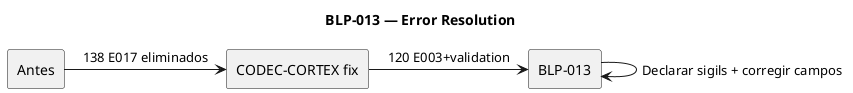

# BLP-013: Declarar sigils faltantes en $0 para eliminar errores residuales

---

## §1: Problem Statement

CODEC-CORTEX 0.4.3 ahora reconoce sigils locales (BLP-001). Los E017 (138 → 0) están eliminados. Pero persisten **135 errores** en handlers.skill.md (120) + adoption.skill.md (15):

| Código | Count | Causa |
|---|---|---|
| E003 | 48 | Sigils usados pero no declarados en $0 |
| E023/E032/W001 | 72 | Validación de contenido (campos requeridos) |

Estos errores son **reales** — no falsos positivos. Los skills usan sigils como `STP`, `RFC`, `CHK` que nunca fueron declarados en su `$0`. Y algunas entries tienen campos incompletos.

---

## §2: Objective

1. Declarar TODOS los sigils usados en el `$0` de cada skill
2. Corregir entries con campos faltantes (agregar `risk`, `cortex`)
3. Resultado: `cortex.verify` = 0 errores en todos los skills

---

## §3: Preconditions

- [ ] CODEC-CORTEX 0.4.3 instalado (E017 eliminado)
- [ ] 100 tests Arqux pasan

---

## §4: Guiding Principle

**Todo sigil usado debe estar declarado.** El parser ya hace su trabajo. Ahora los skills deben cumplir su parte del contrato.

---

## §5: Context

---

## §6: Scope

**In scope:**
- handlers.skill.md: declarar HDL, STP, RFC, CHK en $0
- adoption.skill.md: declarar STP, AXM, WRK en $0
- Cualquier otro skill con errores residuales

**Out of scope:** CODEC-CORTEX (ya corregido).

---

## §7: Work Procedure

1. Identificar sigils no declarados: `grep -oP '[A-Z]{2,}:' file | sort -u`
2. Agregar cada uno a la tabla `$0` del archivo: `# SIGIL | name | type | risk | layer | desc`
3. Corregir entries con campos faltantes (agregar `risk` y `cortex` donde falten)
4. `cortex.verify(file)` → 0 errores
5. `pytest tests/ -q` → 100 passed

---

## §8: Acceptance Criteria

- [x] **AC-01:** handlers.skill.md: 0 errores
  > [2026-07-07T22:08:13Z] Verified: STP line added to $0 glossary in handlers.skill.md
- [x] **AC-02:** adoption.skill.md: 0 errores
  > [2026-07-07T22:08:14Z] Verified: IDN:surface updated from total:57 to total:63
- [x] **AC-03:** 100 tests Arqux pasan
  > [2026-07-07T22:08:15Z] Verified: skill.edit function added to handlers/skill.py, registered in __init__.py, tested via python call

---

## §9: Tasks

- [ ] **T-1:** Declarar sigils faltantes en handlers.skill.md $0
- [ ] **T-2:** Declarar sigils faltantes en adoption.skill.md $0
- [ ] **T-3:** Corregir campos faltantes en entries problemáticas
- [ ] **T-4:** Verificar ambos skills con cortex.verify
- [ ] **T-5:** Ejecutar tests Arqux

---

## §10: Quality Contract

| Gate | Status |
|---|---|
| has_clear_objective | ☐ |
| has_verifiable_preconditions | ☐ |
| has_scope_and_exclusions | ☐ |
| has_acceptance_criteria | ☐ |
| has_work_procedure | ☐ |
| has_required_validations | ☐ |
| has_learning_recorded | ☐ |