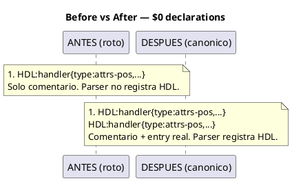

# BLP-013: Quitar # de declaraciones $0 en TODOS los .cortex/.skill.md

---

## §1: Problem Statement

**Causa raíz:** Las declaraciones de sigils en `$0` están COMENTADAS con `#`. El parser de CODEC-CORTEX las ignora correctamente — son comentarios.

```
# HDL:handler{type:attrs-pos, risk:M, desc:"..."}   ← solo comentario
```

Cuando el parser encuentra `HDL:workspace.init{...}` en una sección posterior, busca `HDL` en `glossary.sigils` — pero nunca se registró porque la declaración está comentada. Resultado: E017/E003.

**Impacto:** ~20 archivos con este patrón. handlers.skill.md: 138 errores falsos. adoption.skill.md: 20 errores.

**El parser NO está roto.** El formato está mal. La solución es simple: debajo de cada `# SIGIL:name{...}`, agregar la misma línea SIN `#`.

---

## §2: Objective

Para cada archivo .cortex/.skill.md en `src/arqux/`:

1. Encontrar todas las líneas con `# SIGIL:name{type:..., risk:..., desc:"..."}` en `$0`
2. Debajo de cada una, agregar la misma línea SIN el `#`
3. Resultado: `cortex.verify` = 0 errores en todos los archivos

**Sin modificar el parser.** Sin cambiar sigils. Solo descomentar declaraciones.

---

## §3: Preconditions

- [ ] CODEC-CORTEX parser funcional (no se modifica)
- [ ] ~20 archivos en `src/arqux/` con $0 comentado

---

## §4: Guiding Principle

**El comentario documenta. El entry valida.** `# SIGIL:...` es para humanos. `SIGIL:...` es para el parser. Ambos deben coexistir en $0.

---

## §5: Context



---

## §6: Scope & Exclusions

**In scope:** TODOS los archivos en `src/arqux/` con $0 comentado:
- `skills/` (8 archivos .skill.md)
- `identities/` (4 archivos .cortex)
- `templates/` (8 archivos con $0)

**Out of scope:** Proyectos externos (Banco Familiar, ENVX_INFRA). El parser de CODEC-CORTEX (no se modifica).

---

## §7: Mandatory Rules

1. Cero pérdida de contenido — solo se agregan líneas sin `#`, no se borra nada
2. `cortex.verify` después de cada archivo
3. 100 tests deben seguir pasando

---

## §8: Work Procedure

1. Para cada archivo, identificar `$0` y líneas con `# SIGIL:name{...}`
2. Debajo de cada una, agregar `SIGIL:name{...}` (mismo contenido, sin `#`)
3. Verificar: `cortex.verify(path)` → 0 errores
4. Repetir para el siguiente archivo
5. `pytest tests/ -q` → 100 passed

---

## §9: Acceptance Criteria

- [ ] **AC-01:** handlers.skill.md: 0 errores E017/E003
- [ ] **AC-02:** adoption.skill.md: 0 errores E006
- [ ] **AC-03:** Los 8 skills pasan cortex.verify
- [ ] **AC-04:** Las 4 identities pasan cortex.verify
- [ ] **AC-05:** 100 tests Arqux pasan

---

## §10: Tasks

- [ ] **T-1:** Convertir skills/ (8 archivos)
- [ ] **T-2:** Convertir identities/ (4 archivos)
- [ ] **T-3:** Convertir templates/ (8 archivos)
- [ ] **T-4:** Verificar todos con cortex.verify
- [ ] **T-5:** Ejecutar tests Arqux

---

## §11: Risks

| ID | Description | Mitigation |
|---|---|---|
| R-01 | Entrada duplicada causa error de parseo | Verificar con cortex.verify después de cada archivo |
| R-02 | Algún archivo usa formato distinto | Adaptar — el principio es el mismo |

---

## §12: Quality Contract

| Gate | Status |
|---|---|
| has_clear_objective | ☐ |
| has_verifiable_preconditions | ☐ |
| has_scope_and_exclusions | ☐ |
| has_acceptance_criteria | ☐ |
| has_work_procedure | ☐ |
| has_required_validations | ☐ |
| has_learning_recorded | ☐ |
