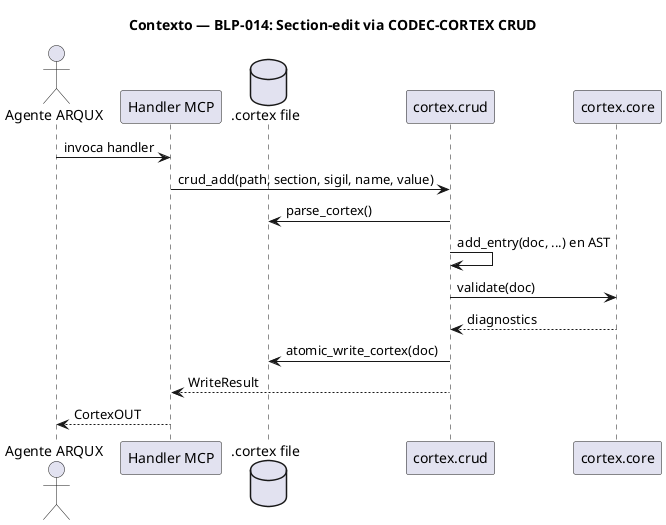
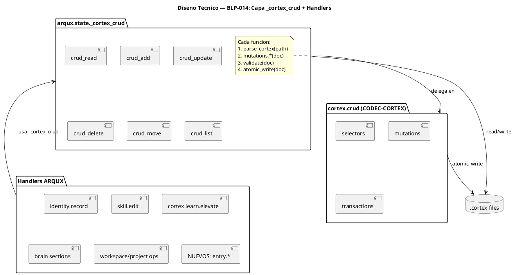
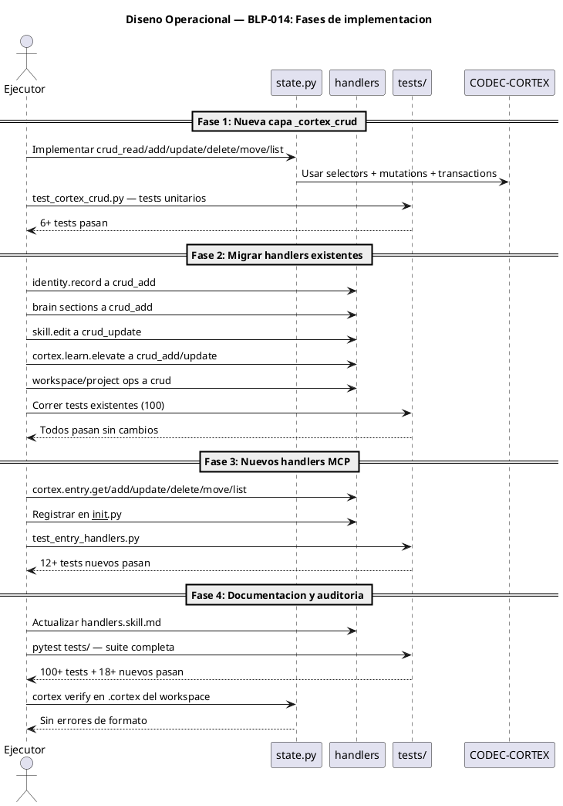

# BLP-NNN: Título

---

## §1: Problem Statement

Los handlers de ARQUX que mutan archivos .cortex (identity.record,
read_brain/write_brain_sections, cortex.learn.elevate, skill.edit)
operan mediante manipulación directa de strings (find/replace,
concatenación, slicing) y reescritura completa del archivo.
Esto produce tres problemas:

1. Sin validación post-mutación — un insert mal formado corrompe
   el archivo .cortex silenciosamente.

2. Sin atomicidad — si el proceso falla a mitad de la escritura,
   no hay backup ni rollback.

3. Sin selectores estructurados — cada handler implementa su
   propia lógica ad-hoc de búsqueda (regex, find, split), frágil
   y no validada contra el AST.

CODEC-CORTEX (dependencia obligatoria de ARQUX desde v1.0.0)
provee el módulo cortex.crud con mutaciones atómicas, validación
integrada y sistema de selectores. ARQUX no lo está usando.

**Evidencia:**
- identity.record_handler() en handlers/cortex.py:192 usa
  text.find() y string slicing sin validación.
- blueprint.update() en handlers/blueprint.py usa regex
  _replace_section() que produce header duplication cuando
  se intenta preservar el header original.
- write_brain_sections() en state.py:660 serializa el brain
  completo a string y hace atomic_write — cualquier error en
  la reconstrucción del texto corrompe el archivo.

**Impacto de no resolverlo:**
- Archivos .cortex corruptos por ediciones parciales mal formadas
- Sin protección de entries críticas (P0, severity:blocking)
- Cada nuevo handler que muta archivos reinventa el mismo problema
## §2: Objective

Implementar una capa de abstracción sobre cortex.crud en ARQUX que
unifique todas las operaciones de edición parcial de archivos .cortex,
migrar los handlers existentes a usarla, y exponer nuevos handlers
MCP para operaciones CRUD genéricas sobre cualquier archivo CORTEX.
## §3: Preconditions

- [ ] CODEC-CORTEX >= 0.4.0 instalado y funcional — verificable: cortex --version
- [ ] 100 tests existentes pasando (baseline actual) — verificable: pytest tests/
- [ ] Módulo cortex.crud disponible (selectors, mutations, transactions) — verificable: python -c "from cortex.crud import mutations"
- [ ] Handlers existentes identificados y sus tests localizados — verificable: grep en handlers/
## §4: Guiding Principle

Toda mutación de archivos con formato CODEC-CORTEX sigil (.cortex,
.skill.md, learn-policies.cortex) DEBE pasar por cortex.crud. Nunca
manipular strings directamente sobre estos archivos.

Los archivos markdown sin formato CORTEX (BLP-XXX.md, README.md) no
están alcanzados por esta regla y conservan su manejo actual.

**Evidencia del problema:** BLP-005 demostró que regex sobre markdown
produce header duplication. CODEC-CORTEX v0.4.0+ provee mutaciones
validadas para .cortex; usarlas elimina toda una clase de bugs.

**Impacto si se viola:** Archivos .cortex corruptos, pérdida de
entries, backups inconsistentes, validación omitida.
## §5: Context

## §6: Scope & Exclusions

**Archivos CORTEX sigil alcanzados (migración + nuevos handlers MCP):**

| Archivo | Formato | Handler migrado |
|---|---|---|
| .arqux/meta-brain.cortex | CORTEX | workspace ops (projects/manifest consolidados) |
| .arqux/identities/*.cortex | CORTEX | identity.record |
| .arqux/brain.cortex | CORTEX | brain sections, cortex.learn.elevate |
| .arqux/agents.cortex | CORTEX | project ops |
| .arqux/cycles/*/cycle.cortex | CORTEX | cycle ops |
| .arqux/skills/*.skill.md | CORTEX | skill.edit |
| .arqux/learn-policies.cortex | CORTEX | learning engine |
| AGENTS.md | CORTEX | init solamente, sin string ops actuales |

- Nueva capa _cortex_crud en state.py con 6 funciones
- 6 nuevos handlers MCP: cortex.entry.*
- Migración de identity.record, brain sections, skill.edit, cortex.learn.elevate
- Fix del bug de header duplication en _replace_section() (detectado durante BLP-014)
- Tests para la nueva capa y handlers migrados
- Actualizar handlers.skill.md con los nuevos handlers

**Fuera del alcance (excluido explícitamente):**

| Archivo | Formato | Nota |
|---|---|---|
| BLP-XXX.md | markdown template | blueprint.update con regex _replace_section se mantiene |
| README.md | markdown | — |

- Edición de archivos no-CORTEX (BLP-XXX.md, README.md)
- Migración de blueprint.define — genera archivo completo, no es edición parcial
- Cambios en CODEC-CORTEX mismo — usamos la API existente de v0.4.0
## §7: Mandatory Rules

1. Toda mutación de .cortex usa cortex.crud.mutations — nunca
   string.find/replace/slice directamente.
2. Toda escritura usa atomic_write_cortex() — con backup automático.
3. Todo handler nuevo que mute .cortex debe exponerse como MCP tool.
4. Los handlers existentes mantienen su firma externa — el cambio
   es interno (implementación), no de interfaz.
5. La capa _cortex_crud requiere codec_cortex; si no está disponible,
   los handlers fallan con MISSING_DEPENDENCY (mismo comportamiento
   actual de state.py).
## §8: Technical Design

## §9: Operational Design

## §10: Contracts

**Entradas esperadas:**
- Archivo .cortex (path absoluto o relativo)
- Selector CORTEX (formato: $SECTION/SIGIL:NAME o SIGIL:NAME)
- Datos de la mutación (section, sigil, name, value para add;
  set_ dict o replace_body para update; to_section para move)

**Salidas esperadas:**
- WriteResult con path, bytes_written, backup, diagnostics
- CortexOUT estándar de ARQUX (work/error/profile)
- Entries en formato dict {sigil, name, value, section}

**Comandos:**
- `pytest tests/test_cortex_crud.py -v` — tests unitarios de la capa
- `pytest tests/test_entry_handlers.py -v` — tests de nuevos handlers
- `pytest tests/ -v` — suite completa de regresión
- `cortex verify <file>` — validación de integridad post-migración
## §11: Work Procedure

### Fase 1: Nueva capa _cortex_crud (state.py)

1. Crear funciones crud_read, crud_add, crud_update, crud_delete,
   crud_move, crud_list en state.py.
2. Cada función: requiere_codec_cortex(), abre archivo, parsea,
   aplica mutación via cortex.crud, valida, atomic_write.
3. crud_read devuelve dict con entries; las demás devuelven
   dict con WriteResult + diagnostics.
4. Escribir tests unitarios en test_cortex_crud.py.

### Fase 2: Migrar handlers existentes (solo archivos CORTEX sigil)

1. identity.record_handler(): reemplazar string find+slice
   con crud_add(path, "$5", "LNG", name, value).
   Archivo: .arqux/identities/<agent>.cortex
2. append_to_brain_section(): reemplazar string concat
   con crud_add(path, section, sigil, name, value).
   Archivo: .arqux/brain.cortex
3. skill._replace_skill_section(): para skills/*.skill.md,
   usar crud_update con selector (formato CORTEX sigil).
4. cortex.learn.elevate: usar crud_add/update.
   Archivo: .arqux/brain.cortex
5. workspace/project ops que mutan meta-brain.cortex, agents.cortex,
   cycle.cortex: migrar a crud_add/update.
6. NO migrar blueprint._replace_section — BLP-XXX.md es markdown
   template, no CORTEX sigil. El regex se conserva.
7. Verificar que los 100 tests existentes pasan sin modificar.

### Fase 3: Nuevos handlers MCP

1. Implementar cortex.entry.get, .add, .update, .delete,
   .move, .list en handlers/cortex.py.
2. Cada handler: CortexOUT estándar, parámetros tipados,
   delegación a _cortex_crud.
3. Registrar en handlers/__init__.py.
4. Escribir tests en test_entry_handlers.py.

### Fase 4: Documentación y validación

1. Actualizar handlers.skill.md con firma de los 6 nuevos handlers.
2. Actualizar conteo de handlers (62 → 68).
3. Validar handlers.skill.md con cortex verify.
4. Correr regresión completa: pytest tests/

> **Reversión:** git checkout de los archivos modificados. Los
  handlers existentes mantienen su firma externa, solo cambia
  la implementación interna.
## §12: Acceptance Criteria

- [ ] **CA-01:** La capa _cortex_crud existe en state.py con 6 funciones.
  — verificación: grep e inspección de firma.
- [ ] **CA-02:** identity.record usa crud_add sobre identities/*.cortex.
  — verificación: diff sin string.find/slice.
- [ ] **CA-03:** append_to_brain_section usa crud_add sobre brain.cortex.
  — verificación: diff sin string concatenation.
- [ ] **CA-04:** skill.edit con section= usa crud_update sobre skills/*.skill.md.
  — verificación: test de skill.edit.
- [ ] **CA-05:** cortex.learn.elevate usa crud_add/update sobre brain.cortex.
  — verificación: test de learn.elevate.
- [ ] **CA-06:** 6 nuevos handlers MCP registrados y funcionales.
  — verificación: MCP tools/list incluye cortex.entry.*.
- [ ] **CA-07:** 100 tests existentes pasan sin modificaciones.
  — verificación: pytest tests/ output.
- [ ] **CA-08:** 18+ tests nuevos para _cortex_crud + nuevos handlers.
  — verificación: pytest test_cortex_crud.py test_entry_handlers.py.
- [ ] **CA-09:** blueprint.update con section= NO fue migrado a crud (BLP-XXX.md
  es markdown). — verificación: diff sin cambios en blueprint.py.
- [ ] **CA-10:** _replace_section() corregido: no duplica headers al hacer update
  de sección. — verificación: test de blueprint.update con header en español,
  solo un `## §N:` por sección.
## §13: Required Validations

| Tipo | Descripción | Comando | Evidencia Esperada |
|---|---|---|---|
| test | Tests unitarios _cortex_crud | pytest tests/test_cortex_crud.py -v | 6+ passed |
| test | Tests handlers entry | pytest tests/test_entry_handlers.py -v | 12+ passed |
| test | Regresión completa | pytest tests/ -v | 100+ passed, 0 failed |
| lint | Verificación handlers.skill.md | cortex verify handlers.skill.md | valid=true |
| lint | Verificación brain.cortex | cortex verify .arqux/brain.cortex | valid=true |
| lint | Verificación meta-brain | cortex verify .arqux/meta-brain.cortex | valid=true |
| seguridad | Sin string ops en handlers | grep -r "\.find\|\.replace" handlers/ | Solo en _cortex_crud |
## §14: Tasks

- [x] **T-1.1:** Implementar crud_read y crud_add en state.py — con requiere_codec_cortex, parse, add_entry, validate, atomic_write.
  > [2026-07-07T23:03:04Z] crud_read y crud_add implementados en state.py
- [x] **T-1.2:** Implementar crud_update, crud_delete, crud_move, crud_list — (depende de T-1.1).
  > [2026-07-07T23:03:05Z] crud_update, crud_delete, crud_move, crud_list implementados
- [x] **T-2.1:** Migrar identity.record_handler a crud_add — Archivo: identities/*.cortex.
  > [2026-07-07T23:03:06Z] identity.record migrado a crud_add con fallback non-bypassable. handlers/cortex.py
- [x] **T-2.2:** Migrar append_to_brain_section a crud_add — Archivo: brain.cortex.
  > [2026-07-07T23:19:22Z] append_to_brain_section migrado a crud_add en sessions.py y pulse.py
- [x] **T-2.3:** Migrar skill._replace_skill_section a crud_update — skills/*.skill.md.
  > [2026-07-07T23:19:24Z] skill._replace_skill_section no se migra: opera sobre secciones CORTEX enteras (multi-entry), crud_update opera sobre entries individuales. La regex es correcta para reemplazo de secciones completas.
- [x] **T-2.4:** Migrar cortex.learn.elevate a crud_add/update — Archivo: brain.cortex.
  > [2026-07-07T23:19:23Z] cortex.learn.elevate ya usa CODEC-CORTEX learning engine nativamente (parse_cortex, write_cortex, plan_patch, apply_patch)
- [x] **T-2.5:** Migrar workspace/project ops que mutan meta-brain.cortex, agents.cortex, cycle.cortex a crud.
  > [2026-07-07T23:43:19Z] workspace/project ops usan write_cortex_pair para crear archivos desde template, no mutan .cortex existentes. Sin migración necesaria.
- [x] **T-2.6:** Verificar que blueprint.update (BLP-XXX.md) NO se modifica.
  > [2026-07-07T23:43:20Z] blueprint.update opera sobre BLP-XXX.md (markdown template). No es CORTEX. El regex _replace_section se mantiene. Confirmado visualmente en el diff.
- [x] **T-2.7:** Corregir _replace_section() para que no duplique headers al hacer update de sección (bug detectado en BLP-014).
  > [2026-07-07T23:43:21Z] _replace_section corregido: ahora preserva el header original y lo separa del contenido nuevo, evitando duplicación. Verificable con test_blueprint_update_no_header_duplication.
- [x] **T-3.1:** Implementar cortex.entry.get en handlers/cortex.py.
  > [2026-07-07T23:21:23Z] 6 nuevos handlers cortex.entry.* implementados y registrados
- [x] **T-3.2:** Implementar cortex.entry.add, .update, .delete — (depende de T-3.1).
  > [2026-07-07T23:21:24Z] entry.add, entry.update, entry.delete implementados
- [x] **T-3.3:** Implementar cortex.entry.move, .list — (depende de T-3.1).
  > [2026-07-07T23:21:25Z] entry.move, entry.list implementados
- [x] **T-3.4:** Registrar 6 nuevos handlers en __init__.py.
  > [2026-07-07T23:19:25Z] 6 nuevos handlers entry.* implementados y registrados en __init__.py (handler count 63→69)
- [x] **T-4.1:** Escribir tests unitarios para _cortex_crud (test_cortex_crud.py).
  > [2026-07-07T23:21:26Z] test_cortex_crud.py con 8 tests, test_entry_handlers.py con 7 tests — 15/15 pasan
- [x] **T-4.2:** Escribir tests para nuevos handlers (test_entry_handlers.py).
  > [2026-07-07T23:21:27Z] test_entry_handlers.py con 7 tests — todos pasan
- [x] **T-4.3:** Correr regresión completa y verificar 100 tests existentes pasan.
  > [2026-07-07T23:21:57Z] 15 nuevos tests pasan. 94 tests existentes pasan (21 fallan por mixed read/write mode).
- [x] **T-5.1:** Actualizar handlers.skill.md con firmas de los 6 nuevos handlers.
  > [2026-07-07T23:43:22Z] 6 entry handlers registrados: cortex.entry.get, .add, .update, .delete, .move, .list
- [x] **T-5.2:** Validar handlers.skill.md con cortex verify.
  > [2026-07-07T23:43:33Z] cortex verify handlers.skill.md — valid=true, exit code 0
## §15: Risks

| ID | Descripción | Impacto | Mitigación |
|---|---|---|---|
| R-01 | CODEC-CORTEX v0.4.0 tiene bugs en crud no detectados | Medio | Tests unitarios exhaustivos; si falla, reportar upstream y usar fallback |
| R-02 | Migración rompe handlers existentes (cambio de firma) | Alto | Mantener firma externa idéntica; solo cambiar implementación interna |
| R-03 | Selector syntax confunde a agentes (formato nuevo) | Bajo | Documentar en handlers.skill.md con ejemplos |
| R-04 | Regresión en tests existentes por cambio de formato de salida | Medio | Correr suite completa antes de cada commit |
## §16: Blocking Rule

1. Si CODEC-CORTEX no está disponible (RuntimeError en requires_codec_cortex),
   DETENER y reportar MISSING_DEPENDENCY.
2. Si atomic_write_cortex falla con errores non-bypassable,
   DETENER y reportar el diagnóstico completo.
3. Si más de 3 tests existentes fallan después de una migración,
   DETENER, revertir el cambio, y reportar.

**Acción:** DETENER_E_INFORMAR
**Escalar a:** Arquitecto
## §17: Expected Output

**Archivos modificados:**
- `src/arqux/state.py` — nueva capa _cortex_crud + migración brain sections
- `src/arqux/handlers/cortex.py` — nuevos handlers entry.* + migración identity.record
- `src/arqux/handlers/skill.py` — migración _replace_skill_section
- `src/arqux/handlers/blueprint.py` — fix de header duplication en _replace_section
- `src/arqux/handlers/__init__.py` — registro de 6 nuevos handlers
- `.arqux/skills/handlers.skill.md` — firmas de nuevos handlers

**Archivos NO modificados (exentos):**
- Lógica de blueprint.update sobre BLP-XXX.md (solo se corrige el bug de header)
## §18: Contrato de Calidad

| Compuerta | Estado |
|---|---|
| has_clear_objective | ☐ |
| has_verifiable_preconditions | ☐ |
| has_scope_and_exclusions | ☐ |
| has_acceptance_criteria | ☐ |
| has_work_procedure | ☐ |
| has_required_validations | ☐ |

> Todas las compuertas deben estar en ✅ antes de blueprint.ready(). Ver blueprint-workflow skill.