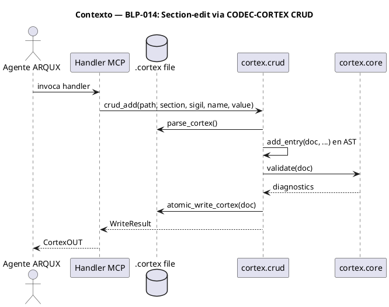
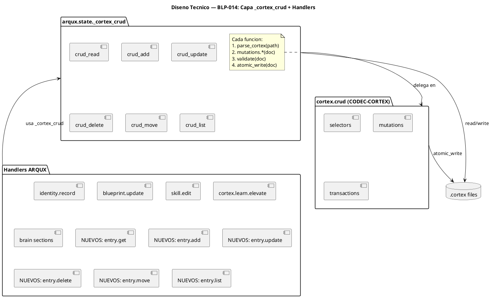
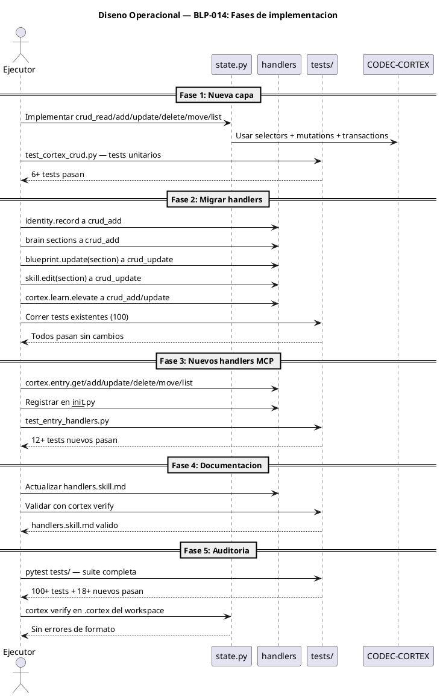

# BLP-014: Implementar esquema de actualización parcial (section-edit) en handlers que mutan archivos

---

## §1: Problem Statement

Los handlers de ARQUX que mutan archivos .cortex (identity.record,
blueprint.update, skill.edit, read_brain/write_brain_sections,
cortex.learn.elevate) operan mediante manipulación directa de strings
(find/replace, concatenación, slicing) y reescritura completa del
archivo. Esto produce tres problemas:

1. Sin validación post-mutación — un insert mal formado corrompe
   el archivo .cortex silenciosamente.

2. Sin atomicidad — si el proceso falla a mitad de la escritura,
   no hay backup ni rollback.

3. Sin selectores estructurados — cada handler implementa su
   propia lógica ad-hoc de búsqueda (regex, find, split), frágil
   y no validada contra el AST.

CODEC-CORTEX (dependencia obligatoria de ARQUX desde v1.0.0)
provee el módulo `cortex.crud` con mutaciones atómicas, validación
integrada y sistema de selectores. ARQUX no lo está usando.

**Evidencia:**
- identity.record_handler() en handlers/cortex.py:192 usa
  `text.find("
$6:")` y string slicing sin validación.
- blueprint.update() en handlers/blueprint.py usa regex
  `_replace_section()` que ya produjo bugs de header duplication
  (BLP-005).
- write_brain_sections() en state.py:660 serializa el brain
  completo a string y hace atomic_write — cualquier error en
  la reconstrucción del texto corrompe el archivo.

**Impacto de no resolverlo:**
- Archivos .cortex corruptos por ediciones parciales mal formadas
- Sin protección de entries críticas (P0, severity:blocking)
- Cada nuevo handler que muta archivos reinventa el mismo problema
## §2: Objective

Implementar una capa de abstracción sobre `cortex.crud` en ARQUX que
unifique todas las operaciones de edición parcial de archivos .cortex,
migrar los handlers existentes a usarla, y exponer nuevos handlers
MCP para operaciones CRUD genéricas sobre cualquier .cortex.
## §3: Preconditions

- CODEC-CORTEX >= 0.4.0 instalado (dependencia obligatoria de ARQUX)
- 100 tests existentes pasando (baseline actual)
- Módulo cortex.crud disponible (selectors, mutations, transactions)
- Handlers existentes identificados y sus tests localizados
## §4: Guiding Principle

Toda mutación de archivos con formato CODEC-CORTEX sigil (.cortex, .skill.md,
learn-policies.cortex) DEBE pasar por `cortex.crud`. Nunca manipular
strings directamente. Los archivos markdown sin formato CORTEX
(BLP-XXX.md, AGENTS.md, README.md) no están alcanzados por esta regla.

**Evidencia:** BLP-005 demostró que regex sobre markdown produce
header duplication — pero ese bug fue en _replace_section sobre
BLP-XXX.md (markdown template), no sobre .cortex. La solución para
markdown es corregir el regex; para .cortex es usar cortex.crud.

**Impacto si se viola:** Archivos .cortex corruptos, pérdida de
entries, backups inconsistentes, validación omitida.
## §5: Context

## §6: Scope & Exclusions

**Archivos CORTEX sigil alcanzados (migración + nuevos handlers):**

| Archivo | Formato | Handler migrado |
|---|---|---|
| .arqux/meta-brain.cortex | CORTEX | workspace ops, projects/manifest consolidados |
| .arqux/identities/*.cortex | CORTEX | identity.record |
| .arqux/brain.cortex | CORTEX | brain sections, cortex.learn.elevate |
| .arqux/agents.cortex | CORTEX | project ops |
| .arqux/cycles/*/cycle.cortex | CORTEX | cycle ops |
| .arqux/skills/*.skill.md | CORTEX | skill.edit |
| .arqux/learn-policies.cortex | CORTEX | learning engine |

**Archivos CORTEX no mutados actualmente (alcanzables por nuevos handlers MCP):**

| Archivo | Formato | Nota |
|---|---|---|
| AGENTS.md | CORTEX sigil | Generado en init, sin string ops actuales |

**Fuera del alcance (markdown sin CORTEX sigil):**

| Archivo | Formato | Nota |
|---|---|---|
| BLP-XXX.md | markdown template | blueprint.update con regex se mantiene |
| README.md | markdown | — |
## §7: Mandatory Rules

1. Toda mutación de .cortex usa cortex.crud.mutations — nunca
   string.find/replace/slice directamente.
2. Toda escritura usa atomic_write_cortex() — con backup automático.
3. Todo handler nuevo que mute .cortex debe exponerse como MCP tool.
4. Los handlers existentes mantienen su firma externa — el cambio
   es interno (implementación), no de interfaz.
5. La capa _cortex_crud requiere codec_cortex; si no está disponible,
   los handlers fallan con MISSING_DEPENDENCY (mismo comportamiento
   actual de state.py).
## §8: Technical Design

## §9: Operational Design

## §10: Contracts

**Entradas esperadas:**
- Archivo .cortex (path absoluto o relativo)
- Selector CORTEX (formato: $SECTION/SIGIL:NAME o SIGIL:NAME)
- Datos de la mutación (section, sigil, name, value para add;
  set_ dict o replace_body para update; to_section para move)

**Salidas esperadas:**
- WriteResult con path, bytes_written, backup, diagnostics
- CortexOUT estándar de ARQUX (work/error/profile)
- Entries en formato dict {sigil, name, value, section}

**Comandos:**
- `pytest tests/test_cortex_crud.py` — tests unitarios de la capa
- `pytest tests/` — suite completa de regresión
- `cortex verify <file>` — validación de integridad post-migración
## §11: Work Procedure

### Fase 2: Migrar handlers existentes (solo archivos .cortex)

1. identity.record_handler(): reemplazar string find+slice
   con crud_add(path, "$5", "LNG", name, value).
   Archivo: .arqux/identities/<agent>.cortex
2. append_to_brain_section(): reemplazar string concat
   con crud_add(path, section, sigil, name, value).
   Archivo: .arqux/brain.cortex
3. skill._replace_skill_section(): para skills/*.skill.md,
   usar crud_update con selector (el formato es CORTEX sigil).
4. cortex.learn.elevate: usar crud_add/update.
   Archivo: .arqux/brain.cortex
5. workspace/project ops que mutan meta-brain.cortex, agents.cortex,
   cycle.cortex: migrar a crud_add/update.
6. NO migrar blueprint._replace_section — BLP-XXX.md es markdown
   template, no CORTEX sigil. El regex es correcto aquí.

7. Verificar que los 100 tests existentes pasan sin modificar.
## §12: Acceptance Criteria

- **AC-01:** La capa _cortex_crud existe en state.py con 6 funciones
  (read, add, update, delete, move, list). Solo opera sobre archivos
  con formato CORTEX sigil.
- **AC-02:** identity.record usa crud_add sobre identities/*.cortex.
  Verificación: diff sin string.find ni string slicing.
- **AC-03:** append_to_brain_section usa crud_add sobre brain.cortex.
  Verificación: diff sin string concatenation para secciones.
- **AC-04:** skill.edit con section= usa crud_update sobre skills/*.skill.md
  (formato CORTEX sigil). Verificación: test de skill.edit.
- **AC-05:** cortex.learn.elevate usa crud_add/update sobre brain.cortex.
  Verificación: test de learn.elevate.
- **AC-06:** 6 nuevos handlers MCP registrados y funcionales.
  Verificación: MCP tools/list incluye cortex.entry.*.
- **AC-07:** 100 tests existentes pasan sin modificaciones.
  Verificación: pytest tests/ output.
- **AC-08:** 18+ tests nuevos para _cortex_crud + nuevos handlers.
  Verificación: pytest test_cortex_crud.py test_entry_handlers.py.
- **AC-09:** blueprint.update con section= NO fue migrado a crud
  (BLP-XXX.md es markdown). El regex _replace_section se mantiene.
## §13: Required Validations

| Tipo | Descripción | Comando | Evidencia Esperada |
|---|---|---|---|---|
| test | Tests unitarios _cortex_crud | `pytest tests/test_cortex_crud.py -v` | 6+ passed |
| test | Tests handlers entry | `pytest tests/test_entry_handlers.py -v` | 12+ passed |
| test | Regresión completa | `pytest tests/ -v` | 100+ passed, 0 failed |
| lint | Verificación handlers.skill.md | `cortex verify handlers.skill.md` | valid=true |
| lint | Verificación brain.cortex | `cortex verify .arqux/brain.cortex` | valid=true |
| lint | Verificación meta-brain | `cortex verify .arqux/meta-brain.cortex` | valid=true |
| seguridad | Sin string ops en handlers | `grep -r "\.find\|\.replace\|\[.*:\]" handlers/` | Solo en _cortex_crud |
## §14: Tasks

- **T-1.1:** Implementar crud_read y crud_add en state.py — con requiere_codec_cortex, parse, add_entry, validate, atomic_write. Solo para archivos CORTEX sigil.
- **T-1.2:** Implementar crud_update, crud_delete, crud_move, crud_list — (depende de T-1.1).
- **T-2.1:** Migrar identity.record_handler a crud_add — reemplazar string ops. Archivo: identities/*.cortex.
- **T-2.2:** Migrar append_to_brain_section a crud_add — reemplazar string concat. Archivo: brain.cortex.
- **T-2.3:** Migrar skill._replace_skill_section a crud_update — skills/*.skill.md tiene formato CORTEX sigil.
- **T-2.4:** Migrar cortex.learn.elevate a crud_add/update. Archivo: brain.cortex.
- **T-2.5:** Migrar workspace/project ops que mutan meta-brain.cortex, agents.cortex, cycle.cortex a crud.
- **T-2.6:** Verificar que blueprint.update (BLP-XXX.md, markdown) NO se modifica — el regex se conserva.
- **T-3.1:** Implementar cortex.entry.get en handlers/cortex.py.
- **T-3.2:** Implementar cortex.entry.add, .update, .delete — (depende de T-3.1).
- **T-3.3:** Implementar cortex.entry.move, .list — (depende de T-3.1).
- **T-3.4:** Registrar 6 nuevos handlers en __init__.py.
- **T-4.1:** Escribir tests unitarios para _cortex_crud (test_cortex_crud.py).
- **T-4.2:** Escribir tests para nuevos handlers (test_entry_handlers.py).
- **T-4.3:** Correr regresión completa y verificar 100 tests existentes pasan.
- **T-5.1:** Actualizar handlers.skill.md con firmas de los 6 nuevos handlers.
- **T-5.2:** Validar handlers.skill.md con cortex verify.
## §15: Risks

| ID | Descripción | Impacto | Mitigación |
|---|---|---|---|---|
| R-01 | CODEC-CORTEX v0.4.0 tiene bugs en crud no detectados | Medio | Tests unitarios exhaustivos; si falla, reportar upstream y usar fallback string ops |
| R-02 | Migración rompe handlers existentes (cambio de firma) | Alto | Mantener firma externa idéntica; solo cambiar implementación interna |
| R-03 | Selector syntax confunde a agentes (formato nuevo) | Bajo | Documentar en handlers.skill.md con ejemplos |
| R-04 | Regresión en tests existentes por cambio de formato de salida | Medio | Correr suite completa antes de cada commit; ajustar solo si es necesario |
## §16: Blocking Rule

1. Si CODEC-CORTEX no está disponible (RuntimeError en requires_codec_cortex),
   DETENER y reportar MISSING_DEPENDENCY.
2. Si atomic_write_cortex falla con errores non-bypassable,
   DETENER y reportar el diagnóstico completo.
3. Si más de 3 tests existentes fallan después de una migración,
   DETENER, revertir el cambio, y reportar.

**Acción:** DETENER_E_INFORMAR
**Escalar a:** Arquitecto
## §17: Expected Output

**Archivos creados:**
- `tests/test_cortex_crud.py` — tests unitarios de la capa _cortex_crud
- `tests/test_entry_handlers.py` — tests de los 6 nuevos handlers MCP

**Archivos modificados:**
- `src/arqux/state.py` — nueva capa _cortex_crud + migración brain sections
- `src/arqux/handlers/cortex.py` — nuevos handlers entry.* + migración identity.record
- `src/arqux/handlers/skill.py` — migración _replace_skill_section (skills/*.skill.md = CORTEX sigil)
- `src/arqux/handlers/__init__.py` — registro de 6 nuevos handlers
- `.arqux/skills/handlers.skill.md` — firmas de nuevos handlers

**Archivos NO modificados (exentos — markdown sin CORTEX sigil):**
- `src/arqux/handlers/blueprint.py` — BLP-XXX.md usa regex, se conserva

**Evidencia:**
- `pytest tests/ -v` — 118+ tests pasando
- `cortex verify handlers.skill.md` — valid=true

**Resumen:**
> Capa _cortex_crud unifica edición parcial de archivos CORTEX sigil (.cortex, .skill.md, learn-policies) via CODEC-CORTEX CRUD. identity.record, brain sections, skill.edit, learn.elevate y workspace ops migrados. blueprint.update (BLP-XXX.md markdown) excluido. 6 nuevos handlers MCP expuestos.
## §18: Contrato de Calidad

| Compuerta | Estado |
|---|---|
| has_clear_objective | ☐ |
| has_verifiable_preconditions | ☐ |
| has_scope_and_exclusions | ☐ |
| has_acceptance_criteria | ☐ |
| has_work_procedure | ☐ |
| has_required_validations | ☐ |

> Todas las compuertas deben estar en ✅ antes de blueprint.ready(). Ver blueprint-workflow skill.