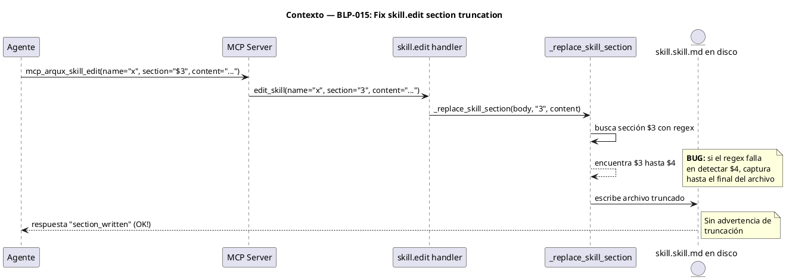
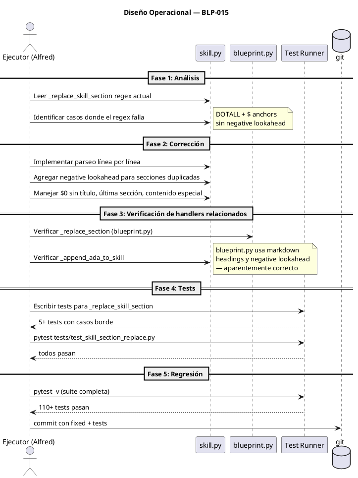

# BLP-015: Fix skill.edit section replacement regex bug and audit all section-manipulating handlers for similar boundary detection issues

---

## §1: Planteamiento del Problema
## §1: Planteamiento del Problema

**Evidencia:**
- El handler `skill.edit` con parámetro `section` trunca archivos de skill: reemplaza desde el inicio de la sección hasta el final del archivo, eliminando todas las secciones posteriores.
- Ocurrió 3 veces durante la sesión del 2026-07-07 mientras se editaba `protocol.skill.md`. Cada vez que se usó `section=$3`, las secciones $4-$7 desaparecieron.
- El bug está confirmado en el código: `_replace_skill_section()` en `src/arqux/handlers/skill.py:353`. El regex de detección de fronteras entre secciones falla en ciertos casos.

**Impacto de no resolverlo:**
Cada edición por sección de una skill puede destruir silenciosamente contenido de secciones posteriores sin advertencia. El daño solo se detecta al leer el archivo completo después.

## §2: Objetivo
## §2: Objetivo

Corregir el regex de `_replace_skill_section` en `skill.py` para que detecte correctamente los límites entre secciones CORTEX sin truncar el contenido posterior. Auditar todos los handlers con manipulación de secciones vía regex (`blueprint._replace_section`, `skill._append_ada_to_skill`) para descartar el mismo bug.

## §3: Precondiciones
## §3: Precondiciones

- [ ] BLP-014 completado y cerrado (CRUD migration, sanity checks)
- [ ] Test suite completa pasando (110 tests)
- [ ] Reproducción del bug documentada (protocol.skill.md truncado 3 veces)
- [ ] Audit inicial de handlers completado

## §4: Principio Rector
## §4: Principio Rector

El handler `skill.edit` es la interfaz gobernada para editar skills. No debe destruir datos silenciosamente. Toda edición por sección debe preservar el resto del archivo intacto.

**Evidencia del problema:** 3 ocurrencias en sesión del 2026-07-07. Cada `skill.edit section=$3` truncó `protocol.skill.md` de ~9KB a ~6KB perdiendo $4-$7.

**Impacto si se viola:** Agentes pierden contenido de skills sin advertencia. La confianza en el handler se erosiona y los agentes evitan usarlo, recurriendo a writes completos que son más riesgosos.

## §5: Contexto
## §5: Contexto



Handlers auditados además de skill.edit:
- **blueprint.update** (`blueprint.py:_replace_section`): usa markdown headings (`## §N:`) con negative lookahead. Patrón diferente, menor riesgo.
- **skill.record** (`skill.py:_append_ada_to_skill`): busca `\n$1:` como frontera. Riesgo bajo.
- **skill.evolve** (`skill.py`): busca `$0: ADAPTATIONS` y luego `\n$1:`. Riesgo bajo.

## §6: Alcance y Exclusiones
## §6: Alcance y Exclusiones

**Dentro del alcance:**
- Corregir `_replace_skill_section()` en `src/arqux/handlers/skill.py`
- Verificar `_replace_section()` en `src/arqux/handlers/blueprint.py`
- Verificar `_append_ada_to_skill()` en `src/arqux/handlers/skill.py`
- Agregar tests unitarios para `_replace_skill_section` con casos borde
- Audit documentado de todos los handlers con manipulación de secciones

**Fuera del alcance (excluido explícitamente):**
- No incluye refactor del formato de archivos de skill
- No incluye migración a otro sistema de almacenamiento
- No incluye cambios en la API pública de ningún handler

## §7: Reglas Obligatorias
## §7: Reglas Obligatorias

1. No cambiar la API pública de `skill.edit` (firma del handler)
2. Todos los tests existentes deben seguir pasando
3. El fix debe manejar secciones con cualquier contenido CORTEX (incluyendo $, {, }, :)
4. El handler debe informar claramente si la sección no se encuentra (no escribir nada)
5. No puede haber regresión en `blueprint.update` ni `skill.record`

## §8: Diseño Técnico
## §8: Diseño Técnico

```puml
@startuml
title Diseño Técnico — BLP-015: Fix regex section boundary

package "skill.py" {
  [edit_skill()] as ES
  [_replace_skill_section()] as RSS
  [_append_ada_to_skill()] as AATS
}

package "blueprint.py" {
  [update_blueprint()] as UB
  [_replace_section()] as RS
}

package "tests/" {
  [test_skill_section_replace.py] as TSR
}

ES --> RSS : corrige regex
RSS --> RSS : nueva detección de\nfronteras por línea
note right of RSS: Enfoque: parsear línea por\nlínea en vez de regex\nmulti-line con DOTALL

UB --> RS : verificar (sin cambios)
AATS --> AATS : verificar (sin cambios)

TSR --> RSS : testea casos borde:
- última sección
- $0 sin título
- contenido con $, {, }
- secciones duplicadas
- sección intermedia

@enduml
```

**Enfoque de corrección:** Reemplazar el regex multi-line actual por un parseo línea por línea que:
1. Encuentre la línea que coincide con `$<N>` (inicio de sección)
2. Encuentre la siguiente línea que coincide con `$<M>` donde M != N (fin de sección)
3. Reemplace solo entre esos dos límites

Esto elimina la dependencia de `re.DOTALL` y `$` anchors que causan el bug.

## §9: Diseño Operacional
## §9: Diseño Operacional



## §10: Contratos

**Entradas esperadas:**
- _Formato, archivo o payload de entrada_

**Salidas esperadas:**
- _Archivos creados, modificados o reportes generados_

**Comandos:**
- `_comando_` — _propósito_


## §11: Procedimiento de Trabajo
## §11: Procedimiento de Trabajo

### Fase 1: Análisis del Bug
1. Leer `_replace_skill_section()` en `skill.py:353` y reproducir el bug con un test manual
2. Identificar los casos exactos donde el regex falla (última sección, $0, contenido especial)
3. Documentar hallazgos

### Fase 2: Corrección
1. Implementar parseo línea por línea en `_replace_skill_section`
2. Mantener la misma API (mismos parámetros, mismo返回值)
3. Verificar que la función maneje: sección intermedia, última sección, $0 sin título, secciones duplicadas, contenido con caracteres especiales

### Fase 3: Auditoría de handlers relacionados
1. Verificar `blueprint._replace_section` (blueprint.py:883)
2. Verificar `skill._append_ada_to_skill` (skill.py:49)
3. Verificar `skill.evolve` sección de búsqueda (skill.py:292)
4. Documentar resultados

### Fase 4: Tests
1. Crear `tests/test_skill_section_replace.py`
2. Tests para cada caso borde identificado
3. Test de regresión: suite completa

### Fase 5: Validación
1. `pytest -v` — 110+ tests pasando
2. Verificar que el fix funciona con `skill.edit section` real sobre protocol.skill.md

> **Reversión:** `git checkout -- src/arqux/handlers/skill.py` si el fix introduce regresión

## §12: Criterios de Aceptación
## §12: Criterios de Aceptación

- [ ] **CA-01:** `_replace_skill_section` con sección $3 de un archivo de 7 secciones preserva $4-$7 intactos
- [ ] **CA-02:** `_replace_skill_section` con $0 (sin título) funciona correctamente
- [ ] **CA-03:** `_replace_skill_section` con secciones duplicadas no rompe el archivo
- [ ] **CA-04:** `_replace_skill_section` con contenido especial ($, {, }, :) en la sección funciona
- [ ] **CA-05:** Audit de blueprint._replace_section, skill._append_ada_to_skill completado sin hallazgos críticos
- [ ] **CA-06:** Suite completa de tests pasa (110+)
- [ ] **CA-07:** skill.edit section= real sobre protocol.skill.md preserva todas las secciones

## §13: Validaciones Requeridas
## §13: Validaciones Requeridas

| Tipo | Descripción | Comando | Evidencia Esperada |
|---|---|---|---|
| test | Tests unitarios para _replace_skill_section | `pytest tests/test_skill_section_replace.py -v` | 5+ tests pasando |
| regression | Suite completa sin regresión | `pytest -v` | 110+ tests pasando |
| audit | blueprint._replace_section verificado | `grep -n "_replace_section" src/arqux/handlers/blueprint.py` | Patrón con negative lookahead presente |
| manual | skill.edit section real sobre protocol.skill.md | Llamar skill.edit section=$3 y verificar $4-$7 intactos | cortex.read confirma todas las secciones |

## §14: Tareas
## §14: Tareas

- [ ] **T-1.1:** Analizar _replace_skill_section regex y documentar casos de fallo
- [ ] **T-1.2:** Implementar parseo línea por línea como reemplazo del regex
- [ ] **T-2.1:** Verificar blueprint._replace_section (sin cambios esperados)
- [ ] **T-2.2:** Verificar skill._append_ada_to_skill (sin cambios esperados)
- [ ] **T-3.1:** Crear tests/test_skill_section_replace.py con 5+ tests de casos borde
- [ ] **T-4.1:** Correr suite completa de tests y verificar que pasa
- [ ] **T-4.2:** Verificar skill.edit section= real sobre protocol.skill.md

## §15: Riesgos
## §15: Riesgos

| ID | Descripción | Impacto | Mitigación |
|---|---|---|---|
| R-01 | El fix podría romper casos borde no detectados en el audit | Alto — archivos de skill corruptos | Tests exhaustivos con 5+ casos borde antes del fix |
| R-02 | blueprint._replace_section podría compartir el mismo bug | Medio — blueprints corruptos | Audit manual + test de regresión para blueprint |
| R-03 | El parseo línea por línea podría ser más lento que el regex | Bajo — skills tienen <200 líneas | Diferencia imperceptible |

## §16: Regla de Bloqueo
## §16: Regla de Bloqueo

1. Si después del fix, `pytest -v` muestra tests fallando que antes pasaban → DETENER
2. Si el audit revela que blueprint._replace_section tiene el mismo bug en producción → DETENER e informar

**Acción:** DETENER_E_INFORMAR
**Escalar a:** Arquitecto

## §17: Salida Esperada
## §17: Salida Esperada

**Archivos modificados:**
- `src/arqux/handlers/skill.py` — fix en `_replace_skill_section`

**Archivos creados:**
- `tests/test_skill_section_replace.py` — tests para casos borde

**Evidencia:**
- `pytest -v` output con 110+ tests pasando
- Audit de blueprint._replace_section y skill._append_ada_to_skill documentado

**Resumen:**
> skill.edit section= ya no trunca archivos. Todos los handlers con manipulación de secciones verificados. Tests agregados para prevenir regresión.

## §18: Contrato de Calidad

| Compuerta | Estado |
|---|---|
| has_clear_objective | ☐ |
| has_verifiable_preconditions | ☐ |
| has_scope_and_exclusions | ☐ |
| has_acceptance_criteria | ☐ |
| has_work_procedure | ☐ |
| has_required_validations | ☐ |

> Todas las compuertas deben estar en ✅ antes de blueprint.ready(). Ver blueprint-workflow skill.