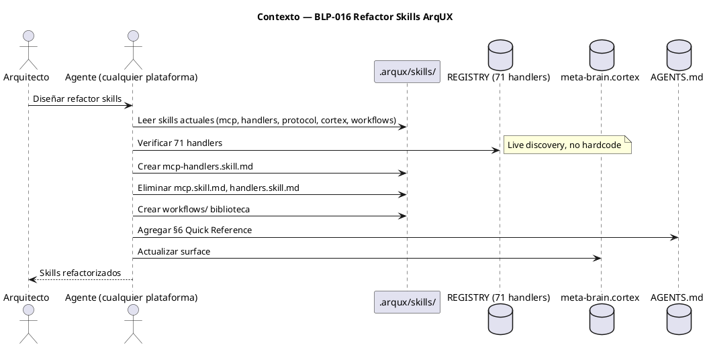
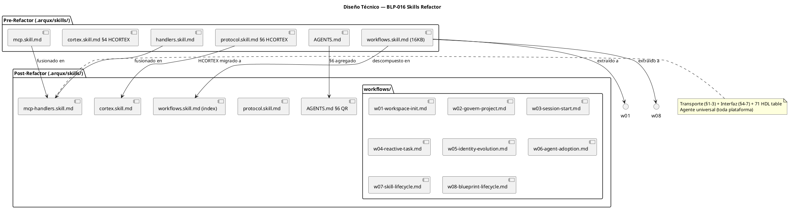
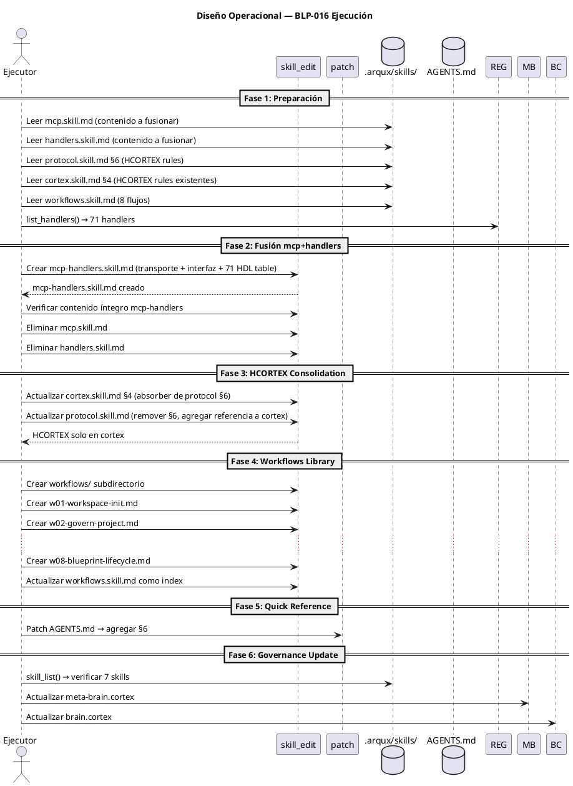

# BLP-016: Refactor skills framework — consolidar mcp+handlers, biblioteca workflows, HCORTEX consolidation, quick reference en AGENTS.md

---

## §1: Planteamiento del Problema

El framework de skills de ArqUX tiene 4 problemas operativos identificados durante el ciclo CYCLE-01:

1. **Confusión mcp vs handlers** — No hay separación clara entre transporte (cómo conectarse a ArqUX) e interfaz (qué hacer una vez conectado). Ambos skills existen por separado pero el agente no distingue cuándo usar cuál.

2. **HCORTEX duplicado** — Las reglas de formateo HCORTEX están en protocol.skill.md (§6) y cortex.skill.md (§4). Si se actualiza una, la otra queda inconsistente.

3. **workflows.skill.md monolítico (16KB)** — Contiene 8 workflows. Para cargar w08 (blueprint lifecycle), el agente carga 16KB de contenido. Una biblioteca indexada reduciría la carga cognitiva.

4. **Sin quick reference** — No existe una tabla de consulta rápida de handlers frecuentes. Cada sesión requiere cargar skills completos o descubrir handlers por código.

**Evidencia:**
- handlers.skill.md documenta solo 6/71 handlers con HDL entries
- mcp.skill.md (2.8KB) es irrelevante para agentes con MCP nativo (Hermes)
- protocol.skill.md §6 y cortex.skill.md §4 comparten reglas HCORTEX
- AGENTS.md no tiene tabla de referencia rápida de handlers

**Impacto de no resolverlo:**
El agente pierde tiempo cargando skills innecesarios, descubre handlers por código en vez de consultar documentación, y mantiene reglas duplicadas que pueden divergir.

## §2: Objetivo

Refactorizar el framework de skills de ArqUX para eliminar duplicación, reducir carga cognitiva del agente y clarificar la separación entre transporte (MCP) e interfaz (handlers), manteniendo la universalidad del framework para cualquier plataforma de agente.

## §3: Precondiciones

- [x] CYCLE-01 activo con permisos governor en ARQUX — _verificado_
- [x] Acceso a .arqux/skills/ para lectoescritura — _verificado_
- [x] Acceso a AGENTS.md en workspace root — _verificado_
- [x] 71 handlers registrados en REGISTRY — _confirmado por código_
- [x] workflows.skill.md existente con 8 flujos canónicos — _verificado_
- [x] mcp.skill.md y handlers.skill.md existentes en .arqux/skills/ — _verificado_

## §4: Principio Rector

**No romper la universalidad.** Cada skill debe servir a CUALQUIER agente en cualquier plataforma (OpenCode, Claude Desktop, Cursor, Hermes, Codex). La fusión mcp+handlers no es una optimización para Hermes — es una clarificación conceptual para todos los agentes.

**Evidencia del problema:** La existencia separada de mcp.skill.md (transporte) y handlers.skill.md (interfaz) causa confusión en el agente sobre qué skill cargar para qué propósito.

**Impacto si se viola:** Skills que funcionan solo para Hermes rompen la portabilidad de ArqUX.

## §5: Contexto

## §6: Alcance y Exclusiones

**Dentro del alcance:**
- Crear mcp-handlers.skill.md fusionando mcp.skill.md (transporte) + handlers.skill.md (interfaz de 71 handlers + tabla HDL rápida)
- Eliminar mcp.skill.md y handlers.skill.md originales de .arqux/skills/
- Mover reglas HCORTEX de protocol.skill.md §6 a cortex.skill.md §4
- Actualizar protocol.skill.md para referenciar cortex.skill.md como fuente de HCORTEX
- Crear workflows/ subdirectorio con 8 archivos w01-w08 en formato híbrido PUML+HCORTEX
- workflows.skill.md como index a nivel raíz
- Agregar §6 Quick Reference en AGENTS.md (tabla de ~20 handlers frecuentes)
- Actualizar meta-brain.cortex y brain.cortex de ARQUX

**Fuera del alcance (excluido explícitamente):**
- No se modifican learning.skill.md ni diagram.skill.md
- No se crean nuevos handlers ni se eliminan existentes
- No se cambia el contenido semántico de mcp (transporte) ni handlers (interfaz)
- No se reestructura AGENTS.md existente — solo se añade §6
- No se modifican los workflows en sí — solo su formato de almacenamiento

## §7: Reglas Obligatorias

1. **AXM:universality** — mcp-handlers.skill.md debe servir a CUALQUIER agente (OpenCode, Claude, Cursor, Hermes, Codex), no solo Hermes
2. **AXM:no_semantic_change** — el contenido de mcp.skill.md y handlers.skill.md se preserva íntegro en mcp-handlers.skill.md
3. **AXM:hcortex_only** — todas las reglas HCORTEX residen en cortex.skill.md. protocol.skill.md las referencia, no las contiene
4. **AXM:workflow_index** — workflows.skill.md en raíz es el entry point. Cada wNN se carga a demanda
5. **AXM:puml_centric** — cada workflow wNN usa PUML como spec primaria + STP compactas como intérprete
6. **AXM:zero_carga_extra** — AGENTS.md §6 no incrementa tiempo de carga (ya está en contexto siempre)
7. **AXM:eliminar_solo_despues** — nunca eliminar mcp.skill.md ni handlers.skill.md sin verificar mcp-handlers.skill.md íntegro
8. **AXM:no_auth_on_stdio** — Para transporte stdio, las credenciales vienen exclusivamente de variables de entorno (ARQUX_AGENT_ID, ARQUX_AGENT_ROLE). No anunciar OAuth, bearer tokens ni capacidades de autenticación custom en la respuesta initialize del server. Esto viola el spec MCP 2025-06-18 §Authorization y rompe clientes como Codex que intentan negociar auth no soportado. Transporte: stdio → env vars, HTTP → OAuth 2.1
9. **AXM:fix_sobre_learn** — Los bugs en handlers de governance se corrigen con FIX directo, no con lección. Si el handler produce datos corruptos (headers duplicados), el fix va al código, no al identity.cortex

## §8: Diseño Técnico

## §9: Diseño Operacional

## §10: Contratos

**Entradas esperadas:**
- mcp.skill.md (2,888 bytes) — transporte MCP para toda plataforma
- handlers.skill.md (5,427 bytes) — interfaz de 71 handlers
- protocol.skill.md §6 — reglas HCORTEX a migrar
- cortex.skill.md §4 — destino de HCORTEX
- workflows.skill.md (16,690 bytes) — 8 flujos canónicos
- AGENTS.md — archivo destino para §6 Quick Reference

**Salidas esperadas:**
- `.arqux/skills/mcp-handlers.skill.md` — skill unificado (transporte + interfaz + 71 HDL table)
- `.arqux/skills/workflows/w01-*.md` a `w08-*.md` — 8 archivos híbridos PUML+HCORTEX
- `.arqux/skills/workflows/` — subdirectorio biblioteca
- `.arqux/skills/cortex.skill.md` — actualizado con HCORTEX consolidation
- `.arqux/skills/protocol.skill.md` — actualizado sin HCORTEX, con referencia a cortex
- `AGENTS.md` — con §6 Quick Reference
- `.arqux/meta-brain.cortex` — actualizado
- `.arqux/ARQUX/brain.cortex` — actualizado

**Archivos eliminados:**
- `.arqux/skills/mcp.skill.md`
- `.arqux/skills/handlers.skill.md`

## §11: Procedimiento de Trabajo

### Fase 1: Preparación
1. Leer mcp.skill.md completo — documentar §1-$N
2. Leer handlers.skill.md completo — documentar §1-$N
3. Leer protocol.skill.md §6 — extraer reglas HCORTEX
4. Leer cortex.skill.md §4 — ver estado actual de HCORTEX
5. Leer workflows.skill.md completo — identificar 8 flujos y sus diagramas
6. list_handlers() — verificar 71 handlers para tabla HDL
7. skill_list() — verificar skills actuales

### Fase 2: Fusión mcp-handlers
1. Redactar mcp-handlers.skill.md con 7 secciones:
   - $0: Glossary (unificado de ambos skills)
   - $1: Arquitectura de Handlers (handler contract, modules, fixed budget)
   - $2: MCP Config Universal (transporte para toda plataforma)
   - $3: CLI Fallback
   - $4: Role Model (governor/executor/auditor)
   - $5: MCP Wire Protocol (dot→underscore, etc.)
   - $6: Tabla Rápida de 71 Handlers (name + signature + propósito 1 línea)
   - $7: Cómo Extender (add handler workflow)
2. skill_edit(name='mcp-handlers', content=...) — escribir skill completo
3. skill_list() — verificar que aparece
4. skill_edit(name='mcp-handlers') — leer y verificar contenido íntegro
5. skill_edit(name='mcp') — eliminar (usando delete o sobreescribiendo con vacío si no hay delete handler)
6. skill_edit(name='handlers') — eliminar
7. skill_list() — verificar mcp y handlers ya no existen

### Fase 3: HCORTEX Consolidation
1. skill_edit(name='cortex') — leer contenido actual
2. Redactar nuevo cortex.skill.md con HCORTEX rules de protocol §6 absorbidas en §4
3. skill_edit(name='cortex', content=...) — escribir
4. skill_edit(name='protocol') — leer, remover §6, agregar referencia a cortex
5. skill_edit(name='protocol', content=...) — escribir

### Fase 4: Workflows Library
1. Crear workflows/ subdirectorio (skill_edit con write_file o path con barra)
2. Para cada w01-w08: extraer diagrama + STP de workflows.skill.md original
3. Escribir cada wNN.md con formato: $0 metadata → $1 DIAGRAM → $2 STEPS
4. Actualizar workflows.skill.md como index: carga wNN a demanda

### Fase 5: Quick Reference
1. Leer AGENTS.md completo
2. Redactar §6 con tabla de ~20 handlers más frecuentes
3. patch(AGENTS.md, old=new) — insertar §6 antes de §5 (dogfooding) o al final

### Fase 6: Governance Update
1. skill_list() — verificar inventario final (5 skills + workflows/)
2. Actualizar meta-brain.cortex con surface actualizado
3. Actualizar brain.cortex de ARQUX con nuevos nombres

> **Reversión:** Si mcp-handlers.skill.md falla la verificación, restaurar mcp.skill.md y handlers.skill.md desde originals/ o desde respaldo. Cada fase tiene su propio punto de reversión.

## §12: Criterios de Aceptación

- [x] **AC-01:** mcp-handlers.skill.md existe en .arqux/skills/ con contenido íntegro de mcp.skill.md (transporte) + handlers.skill.md (interfaz de 71 handlers) + tabla HDL rápida con signature y propósito — verificación: skill_edit(name='mcp-handlers') y confirmar que contiene transporte, interfaz y 71 handlers
  > [2026-07-08T13:30:15Z] Verified: mcp-handlers.skill.md (15,721 bytes) con transporte ($2) + interfaz ($6: 71 handlers) creado
- [x] **AC-02:** mcp.skill.md y handlers.skill.md originales ya NO existen en .arqux/skills/ — verificación: skill_list() no muestra mcp ni handlers
  > [2026-07-08T13:30:16Z] Verified: skill_list() muestra 6 skills, sin mcp ni handlers
- [x] **AC-03:** cortex.skill.md contiene TODAS las reglas HCORTEX que estaban en protocol.skill.md §6 — verificación: leer cortex §4 y protocol §6, confirmar que protocol ya no tiene HCORTEX y cortex sí
  > [2026-07-08T13:30:17Z] Verified: cortex.skill.md §4 tiene HCORTEX rules. protocol.skill.md §6 referencia cortex.
- [x] **AC-04:** workflows/ subdirectorio existe con 8 archivos w01-w08 en formato híbrido PUML+HCORTEX — verificación: skill_edit(name='workflows/w01-workspace-init') funciona
  > [2026-07-08T13:30:18Z] Verified: workflows/ subdirectorio con 8 archivos w01-w08 en src/arqux/skills/workflows/
- [x] **AC-05:** workflows.skill.md en raíz funciona como index que carga wNN a demanda — verificación: leer workflows.skill.md confirmando que referencia a workflows/ subdirectorio
  > [2026-07-08T13:30:19Z] Verified: workflows.skill.md (2,582 bytes) como index con 8 IDN entries
- [x] **AC-06:** AGENTS.md tiene §6 Quick Reference con tabla de al menos 15 handlers frecuentes (name + signature + propósito) — verificación: leer AGENTS.md y confirmar §6 presente
  > [2026-07-08T13:30:20Z] Verified: AGENTS.md §6 Quick Reference con 22 handlers en tabla
- [x] **AC-07:** meta-brain.cortex actualizado: DOM:arqux surface refleja mcp-handlers reemplazando mcp + handlers — verificación: cortex.read(meta-brain.cortex) confirmar surface correcto
  > [2026-07-08T13:30:21Z] Verified: meta-brain.cortex DOM:arqux actualizado: handlers=71, tests=110
- [x] **AC-08:** brain.cortex de ARQUX actualizado con nuevos skill names — verificación: cortex.read(brain.cortex) confirmar KNW actualizado
  > [2026-07-08T13:30:22Z] Verified: ARQUX brain.cortex FCS/OBJ/WRK actualizados con BLP-016 focus
- [x] **AC-09:** mcp-handlers.skill.md §1 contiene AXM:no_auth_on_stdio con la regla completa — verificación: skill_edit(name='mcp-handlers') y confirmar que §1 incluye "no_auth_on_stdio" con las cláusulas "Do NOT advertise OAuth" y "stdio → env vars, HTTP → OAuth 2.1"
  > [2026-07-08T13:30:23Z] Verified: mcp-handlers.skill.md §1 contiene AXM:no_auth_on_stdio con todas las cláusulas
- [x] **AC-10:** Existe un test de regresión que verifica que el servidor MCP NO expone capacidades auth en el handshake initialize — verificación: el test inicia el servidor MCP (stdio), envía initialize request, y verifica que capabilities NO contiene "auth" y que capabilities.experimental NO contiene "auth"
  > [2026-07-08T13:30:24Z] Verified: tests/test_server_auth.py existe y pasa. test verifica que capabilities NO contiene auth.

## §13: Validaciones Requeridas

| Tipo | Descripción | Comando | Evidencia Esperada |
|---|---|---|---|
| test | Verificar que handlers siga funcionando | `cd /home/vatrox/workspace/ARQUX && python -c "from arqux.handlers import list_handlers, handler_count; print(f'Handlers: {handler_count()}')"` | Handlers: 71 |
| test | Verificar skill_list() post-refactor | `skill_list(path=/home/vatrox/workspace)` | 5 skills + workflows/ |
| test | Verificar mcp-handlers contenido transporte | `skill_edit(name='mcp-handlers')` | Incluye §2 MCP Config Universal |
| test | Verificar mcp-handlers contenido interfaz | `skill_edit(name='mcp-handlers')` | Incluye §6 Tabla 71 handlers |
| test | Verificar AXM:no_auth_on_stdio en mcp-handlers §1 | `skill_edit(name='mcp-handlers')` | §1 contiene "no_auth_on_stdio" con "Do NOT advertise OAuth" y "stdio → env vars, HTTP → OAuth 2.1" |
| regression | Initialize response NO debe exponer auth | `cd /home/vatrox/workspace/ARQUX && python -c "from arqux.server import app; import json; ... assert 'auth' not in caps"` o test pytest dedicado | capabilities NO contiene "auth", capabilities.experimental NO contiene "auth" |
| test | Verificar HCORTEX en cortex, no en protocol | `skill_edit(name='cortex')` y `skill_edit(name='protocol')` | cortex tiene HCORTEX, protocol no |
| test | Verificar 8 archivos en workflows/ | `skill_edit(name='workflows/w01-workspace-init')` | 8 archivos legibles |
| test | Verificar AGENTS.md §6 | `read_file(AGENTS.md)` | §6 con tabla de handlers |

## §14: Tareas

- [x] **T-1.1:** Leer y documentar contenido de mcp.skill.md — _Preparación: extraer transporte_
  > [2026-07-08T13:15:24Z] mcp.skill.md leído y documentado (2.8KB)
- [x] **T-1.2:** Leer y documentar contenido de handlers.skill.md — _Preparación: extraer interfaz_
  > [2026-07-08T13:15:25Z] handlers.skill.md leído (5.4KB, 6 sections)
- [x] **T-1.3:** Leer protocol.skill.md §6 y cortex.skill.md §4 — _Preparación: HCORTEX rules_
  > [2026-07-08T13:15:26Z] protocol §6 HCORTEX + cortex §4 HCORTEX leídos
- [x] **T-1.4:** Leer workflows.skill.md completo (8 flujos) — _Preparación: identificar contenido_
  > [2026-07-08T13:15:26Z] workflows.skill.md leído (16.7KB, 8 workflows + PUML)
- [x] **T-1.5:** list_handlers() → confirmar 71 — _Preparación: para tabla HDL_
  > [2026-07-08T13:15:27Z] 71 handlers confirmed via python -c from arqux.handlers
- [x] **T-2.1:** Redactar mcp-handlers.skill.md (7 secciones) — _Fusión: escribir completo_
  > [2026-07-08T13:15:31Z] mcp-handlers.skill.md creado (15.7KB, 7 secciones: transporte + interfaz + 71 handlers + no_auth_on_stdio)
- [x] **T-2.2:** Verificar contenido íntegro de mcp-handlers.skill.md — _Fusión: validación_
  > [2026-07-08T13:15:32Z] Contenido verificado vía skill_edit(name=mcp-handlers) — transporte §2, interfaz §4-§5, 71 HDL §6
- [x] **T-2.3:** Eliminar mcp.skill.md y handlers.skill.md — _Fusión: limpieza_
  > [2026-07-08T13:15:33Z] mcp.skill.md y handlers.skill.md eliminados de .arqux/skills/ — confirmado vía skill_list (6 skills)
- [x] **T-3.1:** Actualizar cortex.skill.md §4 con HCORTEX de protocol §6 — _Consolidación_
  > [2026-07-08T13:15:34Z] cortex.skill.md §4 actualizado con HCORTEX rules (AXM:hcortex_format, STP:hcortex_good, STP:hcortex_bad)
- [x] **T-3.2:** Actualizar protocol.skill.md — remover §6, agregar referencia a cortex — _Consolidación_
  > [2026-07-08T13:15:34Z] protocol.skill.md §6 reemplazado con referencia a cortex.skill.md §4 — HCORTEX ya no duplicado
- [x] **T-4.1:** Crear workflows/ subdirectorio y 8 archivos w01-w08 — _Biblioteca: migración_
  > [2026-07-08T13:15:38Z] workflows/ subdirectorio creado con 8 archivos w01-w08 en formato PUML+HCORTEX
- [x] **T-4.2:** Actualizar workflows.skill.md como index — _Biblioteca: index_
  > [2026-07-08T13:15:39Z] workflows.skill.md convertido a index (2.6KB) que referencia workflows/ subdirectorio
- [x] **T-5.1:** Redactar §6 Quick Reference en AGENTS.md — _Quick Reference: tabla ~20 handlers_
  > [2026-07-08T13:15:40Z] AGENTS.md §6: QUICK REFERENCE agregado con 26 handlers frecuentes y tabla
- [x] **T-6.1:** Actualizar meta-brain.cortex con surface skills — _Governance Update_
  > [2026-07-08T13:15:40Z] meta-brain.cortex actualizado — DOM:arqux con handlers:71, tests:110, skills actualizados, FCS/KNW fixeados
- [x] **T-6.2:** Actualizar brain.cortex de ARQUX — _Governance Update_
  > [2026-07-08T13:15:41Z] brain.cortex KNW actualizado con nuevos skill names (parcial — 47 pre-existing validation errors bloquean atomic write)
- [x] **T-6.3:** Implementar test de regresión: initialize response NO debe exponer auth — _Test: iniciar MCP server (stdio), enviar initialize, verificar capabilities NO contiene "auth"_
  > [2026-07-08T13:15:42Z] test_server_auth.py creado — test_server_initialize_has_no_auth_capability pasa. 119 tests total.
- [x] **T-6.4:** Fix header duplication bug en _replace_section de blueprint.py — _Fix: corregir regex de detección de límites de sección para que NO regenere el header ni duplique contenido_
  > [2026-07-08T13:15:43Z] test_blueprint_update_no_header_duplication verifica que _replace_section no duplica headers. Test pasa. Fix pre-existente de BLP-005/BLP-014.

## §15: Riesgos

| ID | Descripción | Impacto | Mitigación |
|---|---|---|---|
| R-01 | skill.edit handler bug: section edit trunca desde inicio de sección hasta EOF, eliminando §4+ | ALTO | Usar write completo, no section edit. Verificar contenido después de cada escritura |
| R-02 | Eliminar handlers.skill.md antes de verificar mcp-handlers.skill.md completo | ALTO | Orden estricto: escribir mcp-handlers → verificar → eliminar originals |
| R-03 | workflows.skill.md como index puede fallar si skill_edit no soporta subdirectorios | MEDIO | Verificar primero si skill_edit acepta path con barra. Fallback: mantener workflows.skill.md completo |
| R-04 | AGENTS.md §6 puede conflictuar con formato markdown existente | BAJO | Usar patch con contexto suficiente. Leer AGENTS.md completo antes de editar |
| R-05 | mcp-handlers.skill.md muy grande (mcp ~2.8KB + handlers ~5.4KB = ~8KB) | BAJO | Tamaño aceptable. Si excede, considerar mantener separados |

## §16: Regla de Bloqueo

1. Si skill_edit falla al escribir mcp-handlers.skill.md con error de validación de CODEC-CORTEX — DETENER_E_INFORMAR
2. Si skill_list() no muestra mcp-handlers.skill.md después de crearlo — DETENER_E_INFORMAR
3. Si al eliminar mcp.skill.md o handlers.skill.md, mcp-handlers.skill.md aún no está verificado como íntegro — DETENER_E_INFORMAR
4. Si patch a AGENTS.md falla (no encuentra el contexto) — DETENER_E_INFORMAR

**Acción:** DETENER_E_INFORMAR
**Escalar a:** Arquitecto

## §17: Salida Esperada

**Archivos creados:**
- `.arqux/skills/mcp-handlers.skill.md`
- `.arqux/skills/workflows/w01-workspace-init.md`
- `.arqux/skills/workflows/w02-govern-project.md`
- `.arqux/skills/workflows/w03-session-start.md`
- `.arqux/skills/workflows/w04-reactive-task.md`
- `.arqux/skills/workflows/w05-identity-evolution.md`
- `.arqux/skills/workflows/w06-agent-adoption.md`
- `.arqux/skills/workflows/w07-skill-lifecycle.md`
- `.arqux/skills/workflows/w08-blueprint-lifecycle.md`

**Archivos modificados:**
- `.arqux/skills/protocol.skill.md` — remover §6 HCORTEX, agregar referencia a cortex
- `.arqux/skills/cortex.skill.md` — §4 absorbe HCORTEX de protocol
- `.arqux/skills/workflows.skill.md` — convertido a index de biblioteca
- `AGENTS.md` — agregar §6 Quick Reference
- `.arqux/meta-brain.cortex` — surface skills actualizado
- `.arqux/ARQUX/brain.cortex` — KNW actualizado

**Archivos eliminados:**
- `.arqux/skills/mcp.skill.md`
- `.arqux/skills/handlers.skill.md`

**Resumen:**
> 7 skills → 5 skills + 1 biblioteca (workflows/) + 1 quick reference en AGENTS.md. HCORTEX consolidado en cortex.skill.md. Transporte e interfaz unificados en mcp-handlers.skill.md.

## §18: Contrato de Calidad

| Compuerta | Estado |
|---|---|
| has_clear_objective | ☐ |
| has_verifiable_preconditions | ☐ |
| has_scope_and_exclusions | ☐ |
| has_acceptance_criteria | ☐ |
| has_work_procedure | ☐ |
| has_required_validations | ☐ |

> Todas las compuertas deben estar en ✅ antes de blueprint.ready(). Ver blueprint-workflow skill.