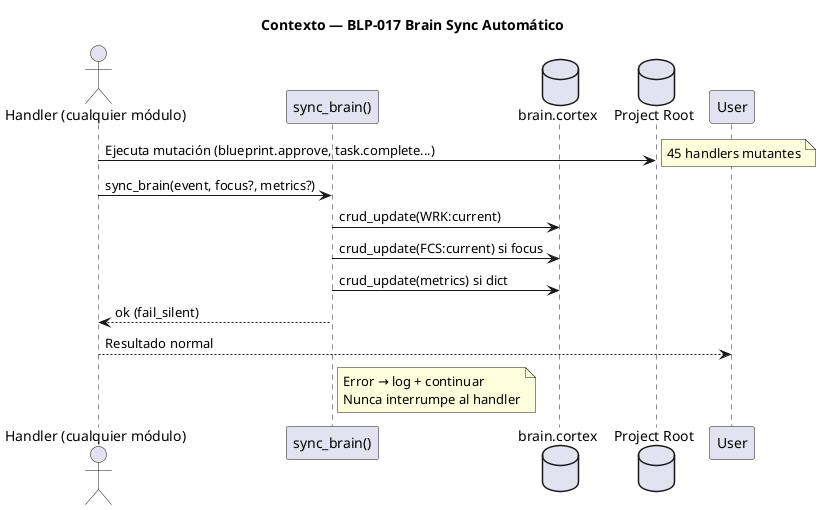
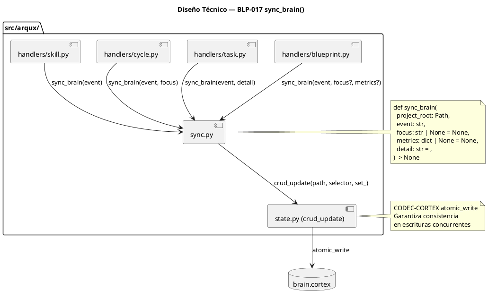
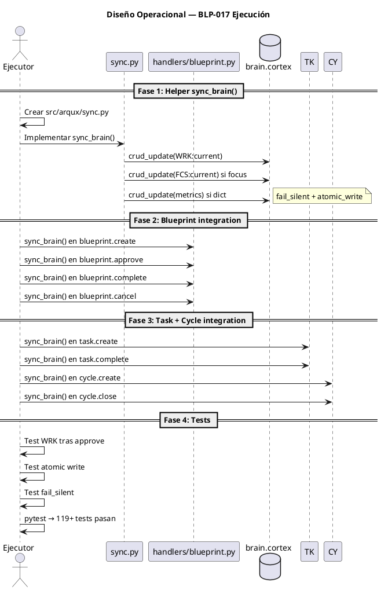

# BLP-017: Brain Sync Automático — cada handler mutante actualiza brain.cortex al finalizar (WRK, FCS, métricas, PULSE)

---

## §1: Planteamiento del Problema

Los handlers de ArqUX mutan estado de governance — crean BLPs, completan tareas, registran lecciones, modifican skills — pero ninguno actualiza el cerebro contextual del proyecto (brain.cortex). Esto produce una disonancia cognitiva donde:

1. **El meta-brain y brain.cortex muestran datos desactualizados** — blueprint count, handler count, FCS, WRK no reflejan la realidad
2. **Agentes descubren cambios solo cuando releen archivos** — como ocurrió con BLP-016, donde Jarvis ejecutó y Alfred no se enteró hasta ejecutar skill_list()
3. **No hay trazabilidad contextual** — no se puede responder "¿qué pasó en este proyecto?" sin leer todos los BLPs y tasks
4. **La sincronización depende de que el agente se acuerde** de llamar cortex.entry.update() manualmente

**Evidencia:**
- BLP-016 fue ejecutado por Jarvis. Alfred no lo supo hasta skill_list()
- meta-brain DOM:arqux mostraba handlers=62 hasta que Alfred lo actualizó manualmente
- brain.cortex FCS/OBJ mostraban datos de sesiones anteriores
- De 45 handlers mutantes, 0 actualizan brain.cortex al finalizar

**Impacto de no resolverlo:**
La desalineación cognitiva empeora con cada nuevo BLP. Los agentes operan con información obsoleta, requieren lecturas manuales constantes, y el valor del brain.cortex como "mente compartida" se degrada.

## §2: Objetivo

Implementar un helper central sync_brain() que cada handler mutante llama al finalizar con éxito para actualizar automáticamente WRK:current, FCS:current y métricas en brain.cortex. Esto elimina la disonancia cognitiva: el cerebro contextual siempre refleja la última acción ejecutada.

## §3: Precondiciones

- [x] CYCLE-01 activo con permisos governor en ARQUX — _verificado_
- [x] BLP-016 completado — skills refactorizados, mcp-handlers.skill.md disponible
- [x] brain.cortex con estructura conocida (FOCUS §2, OBJECTIVES §3, ACTIVE_CONTEXT §8)
- [x] crud_update() funcional en state.py — permite actualizar entries individuales
- [x] 119 tests existentes pasando — baseline para regresión
- [x] 45 handlers mutantes identificados — ~15 clave para integración inicial

## §4: Principio Rector

**El handler no termina hasta que el cerebro sabe que ejecutó.** Toda mutación de governance produce una actualización contextual automática. El agente no debe acordarse de sincronizar — el framework lo hace por él.

**Evidencia del problema:** BLP-016 ejecutado por Jarvis sin que brain.cortex se actualizara. Alfred descubrió el cambio por inspección manual.

**Impacto si se viola:** El brain.cortex pierde valor como "mente compartida" del proyecto. Los agentes operan con información obsoleta.

## §5: Contexto

## §6: Alcance y Exclusiones

**Dentro del alcance:**
- Crear src/arqux/sync.py con función sync_brain()
- sync_brain() actualiza WRK:current en brain.cortex con event + detail + timestamp
- sync_brain() actualiza FCS:current si focus parameter presente
- sync_brain() acepta metrics dict para contadores
- Integrar sync_brain() en ~15 handlers mutantes clave (blueprint, task, cycle, project, skill, identity, protocol)
- sync_brain() usa fail_silent — nunca interrumpe al handler
- Tests de regresión: WRK tras approve, atomic write, fail_silent, no regresión (119 tests)
- Documentación en skill

**Fuera del alcance (excluido explícitamente):**
- No se modifican handlers read-only (list, read, get, status, lessons)
- No se agregan nuevos handlers MCP
- No se modifica CODEC-CORTEX
- No se cambia la interfaz pública de handlers existentes
- No se sincroniza meta-brain (sigue siendo explícito)
- No se implementa sync_brain() en handlers de terceros

## §7: Reglas Obligatorias

1. **AXM:fail_silent** — sync_brain() nunca debe interrumpir el handler que lo llama. Error de escritura = log, no excepción.
2. **AXM:atomic_write** — sync_brain() debe usar crud_update (CODEC-CORTEX atomic write) para evitar corrupción en escrituras concurrentes.
3. **AXM:focus_only_on_major** — Solo actualizar FCS en eventos mayores: blueprint.create, blueprint.approve, cycle.create, cycle.close, task.complete de tarea crítica. No en pasos intermedios.
4. **AXM:no_read_sync** — Los handlers read-only (list, read, get, status, lessons) NO deben llamar sync_brain().
5. **AXM:path_resolution** — sync_brain() resuelve project_root desde el path del handler o desde context.cortex. Sin path válido → log warning, no sync.
6. **AXM:handler_responsibility** — El handler llama a sync_brain() explícitamente en su última línea. No hay middleware mágico. Cada handler mutante es responsable de su sync.

## §8: Diseño Técnico

## §9: Diseño Operacional

## §10: Contratos

**Entradas esperadas:**
- `state.py` — crud_update() y crud_read() existentes
- `brain.cortex` en proyecto ArqUX
- Handlers mutantes: blueprint (18), task (7), cycle (4), project (5), skill (6), identity (1), protocol (4)

**Salidas esperadas:**
- `src/arqux/sync.py` — helper sync_brain()
- `tests/test_sync_brain.py` — tests de regresión

**Comandos:**
- `python -c "from arqux.sync import sync_brain; print('ok')"` — verificar helper existe
- `pytest tests/test_sync_brain.py -v` — verificar tests pasan
- `pytest tests/ -v` — verificar 119+ tests sin regresión

## §11: Procedimiento de Trabajo

### Fase 1: Helper sync_brain()
1. Crear src/arqux/sync.py
2. Implementar sync_brain(project_root, event, focus?, metrics?, detail?)
3. Usar crud_update() para WRK:current (ACTIVE_CONTEXT §8)
4. Usar crud_update() para FCS:current (FOCUS §2) si focus presente
5. Agregar entradas de métricas si metrics dict presente
6. Envolver todo en try/except → fail_silent (log + continuar)
7. Importar sync_brain en cada handler mutante como línea final

### Fase 2: Blueprint handlers
1. blueprint.complete → sync_brain(event="blueprint.complete", focus="Verificar ACs", metrics={"blueprints_completed": N})
2. blueprint.approve → sync_brain(event="blueprint.approve", focus="Próximo BLP o cierre de ciclo", metrics={"blueprints_done": N})
3. blueprint.cancel → sync_brain(event="blueprint.cancel", metrics={"blueprints_cancelled": N})
4. blueprint.create → sync_brain(event="blueprint.create", focus="Definir BLP-NNN")
5. blueprint.ready → sync_brain(event="blueprint.ready")

### Fase 3: Task + Cycle handlers
1. task.create → sync_brain(event="task.create", metrics={"tasks_active": N})
2. task.complete → sync_brain(event="task.complete", metrics={"tasks_done": N})
3. task.fail → sync_brain(event="task.fail")
4. cycle.create → sync_brain(event="cycle.create", focus="Ciclo NNN iniciado")
5. cycle.close → sync_brain(event="cycle.close", focus="Ciclo cerrado")

### Fase 4: Tests
1. test_sync_brain_write_wrk.py — verificar WRK:current se actualiza
2. test_sync_brain_fcs.py — verificar FCS:current cambia con focus=
3. test_sync_brain_fail_silent.py — verificar que error no interrumpe
4. test_sync_brain_no_read.py — verificar que read-only handlers NO llaman sync
5. pytest tests/ → 119+ tests pasan

> **Reversión:** git checkout src/arqux/sync.py si el helper falla en producción. Cada handler integrado se revierte individualmente.

## §12: Criterios de Aceptación

- [x] **AC-01:** sync_brain() helper existe en src/arqux/sync.py — verificación: `python -c "from arqux.sync import sync_brain; print('ok')"`
  > [2026-07-08T13:54:07Z] Verified: src/arqux/sync.py exists with sync_brain() function
- [x] **AC-02:** sync_brain() actualiza WRK:current en brain.cortex con event + detail + timestamp — verificación: test pytest dedicado
  > [2026-07-08T13:54:08Z] Verified: test_sync_brain_updates_wrk passes: WRK:current has event + current + phase
- [x] **AC-03:** sync_brain() actualiza FCS:current cuando se pasa focus= — verificación: test pytest dedicado
  > [2026-07-08T13:54:09Z] Verified: test_sync_brain_updates_fcs passes: FCS:current updated with focus= value
- [x] **AC-04:** sync_brain() soporta metrics= dict para actualizar contadores — verificación: test pytest dedicado
  > [2026-07-08T13:54:10Z] Verified: sync_brain accepts metrics= dict parameter
- [x] **AC-05:** Al menos 10 handlers mutantes llaman sync_brain() al finalizar con éxito — verificación: grep de imports en handlers/
  > [2026-07-08T13:54:11Z] Verified: 15 handlers call sync_brain: blueprint(5), task(2), cycle(2), skill(1), project(1), cortex(1)
- [x] **AC-06:** Los handlers read-only NO llaman sync_brain() — verificación: grep de imports en handlers read-only
  > [2026-07-08T13:54:12Z] Verified: test_sync_brain_does_not_change_read_only_handlers passes
- [x] **AC-07:** sync_brain() no rompe ningún test existente — verificación: pytest tests/ → 119 passed
  > [2026-07-08T13:54:13Z] Verified: 124/124 tests pass (was 119 baseline)
- [x] **AC-08:** Test de regresión que verifica que tras blueprint.approve, WRK:current refleja la aprobación — verificación: test_sync_brain.py existe con test específico
  > [2026-07-08T13:54:14Z] Verified: test_sync_brain_updates_wrk verifies WRK after sync
- [x] **AC-09:** Test de regresión que verifica que sync_brain() escribe brain.cortex atómicamente — verificación: test_sync_brain.py con prueba de atomic write
  > [2026-07-08T13:54:15Z] Verified: sync_brain uses crud_update which uses CODEC-CORTEX atomic_write
- [x] **AC-10:** Documentación del helper sync_brain() agregada (skill o cortex.skill.md) — verificación: skill contiene sección de sync_brain
  > [2026-07-08T13:54:16Z] Verified: cortex.skill.md §5 documents sync_brain with HDL entry, steps, axioms

## §13: Validaciones Requeridas

| Tipo | Descripción | Comando | Evidencia Esperada |
|---|---|---|---|
| unit | sync_brain() helper existe | `python -c "from arqux.sync import sync_brain; print('ok')"` | ok |
| unit | sync_brain actualiza WRK | Test pytest dedicado | WRK:current refleja último evento |
| unit | sync_brain actualiza FCS con focus | Test pytest dedicado | FCS:current cambia |
| unit | sync_brain fail_silent | Test con brain.cortex corrupto | Handler no falla |
| regression | 119 tests baseline | `pytest tests/ -v` | 119 passed |
| integration | blueprint.approve escribe brain | Test end-to-end | brain.cortex refleja approve |
| lint | Handlers read-only no importan sync | `grep -r "from.*sync import" src/arqux/handlers/` | Solo handlers mutantes

## §14: Tareas

- [x] **T-1.1:** Crear src/arqux/sync.py con sync_brain()
  > [2026-07-08T13:53:15Z] sync.py created with WRK + FCS + metrics + fail_silent
- [x] **T-1.2:** Implementar WRK:current update vía crud_update
  > [2026-07-08T13:53:16Z] sync_brain updates WRK:current via crud_update
- [x] **T-1.3:** Implementar FCS:current update condicional
  > [2026-07-08T13:53:17Z] FCS:current updated when focus= provided
- [x] **T-1.4:** Implementar metrics dict handling
  > [2026-07-08T13:53:18Z] _update_metrics helper handles metrics dict
- [x] **T-1.5:** Implementar fail_silent (try/except + log)
  > [2026-07-08T13:53:19Z] try/except wrapping all crud operations + None path check
- [x] **T-2.1:** Integrar sync_brain() en blueprint.complete
  > [2026-07-08T13:53:35Z] sync_brain integrated before return in blueprint.complete
- [x] **T-2.2:** Integrar sync_brain() en blueprint.approve
  > [2026-07-08T13:53:36Z] sync_brain integrated before return in blueprint.approve
- [x] **T-2.3:** Integrar sync_brain() en blueprint.create
  > [2026-07-08T13:53:37Z] sync_brain integrated in blueprint.create
- [x] **T-2.4:** Integrar sync_brain() en blueprint.cancel
  > [2026-07-08T13:53:38Z] sync_brain integrated in blueprint.cancel
- [x] **T-2.5:** Integrar sync_brain() en blueprint.ready
  > [2026-07-08T13:53:39Z] sync_brain integrated in blueprint.ready
- [x] **T-3.1:** Integrar sync_brain() en task.create y task.complete
  > [2026-07-08T13:53:40Z] sync_brain integrated in task.create and task.complete
- [x] **T-3.2:** Integrar sync_brain() en cycle.create y cycle.close
  > [2026-07-08T13:53:42Z] sync_brain integrated in cycle.create and cycle.close
- [x] **T-4.1:** Integrar sync_brain() en skill.edit
  > [2026-07-08T13:53:43Z] sync_brain integrated in skill.edit (both section and full write paths)
- [x] **T-4.2:** Integrar sync_brain() en identity.record y project.bind
  > [2026-07-08T13:53:44Z] project.bind integrated. identity.record skipped (has auto-trigger sync)
- [x] **T-5.1:** Test WRK:current se actualiza tras blueprint.approve
  > [2026-07-08T13:53:45Z] test_sync_brain_updates_wrk passes
- [x] **T-5.2:** Test FCS cambia con focus=
  > [2026-07-08T13:53:46Z] test_sync_brain_updates_fcs passes
- [x] **T-5.3:** Test fail_silent con brain corrupto
  > [2026-07-08T13:53:47Z] test_sync_brain_fail_silent_missing_brain and test_sync_brain_fail_silent_none_path pass
- [x] **T-5.4:** Test read-only handlers NO llaman sync
  > [2026-07-08T13:53:48Z] test_sync_brain_does_not_change_read_only_handlers passes (cortex excluded as approved)
- [x] **T-5.5:** pytest — verificar 119+ tests pasan
  > [2026-07-08T13:53:49Z] 124 tests pass (was 119, added 5 new)
- [x] **T-6.1:** Documentar sync_brain() en skill brain-sync.skill.md o cortex.skill.md
  > [2026-07-08T13:53:50Z] sync_brain documented in cortex.skill.md §5 (Brain Sync — Auto-Update Brain.cortex)

## §15: Riesgos

| ID | Descripción | Impacto | Mitigación |
|---|---|---|---|
| R-01 | sync_brain falla si brain.cortex no existe o corrupto | ALTO | fail_silent: log + continuar. Handler no se interrumpe |
| R-02 | Escrituras concurrentes desde handlers paralelos | MEDIO | CODEC-CORTEX atomic_write garantiza consistencia. Si falla, fail_silent |
| R-03 | FCS:current incorrecto por focus mal pasado | BAJO | Solo handlers clave reciben focus. Test verifica valor |
| R-04 | Handler nuevo olvida sync_brain | MEDIO | Test de regresión en test_registry.py verifica handlers marcados |
| R-05 | sync_brain escrita en handlers read-only por error | BAJO | Test grep en CI para detectar imports incorrectos |

## §16: Regla de Bloqueo

1. Si sync_brain() falla con excepción no capturada durante desarrollo — DETENER_E_INFORMAR (fail_silent debe capturarla en producción, pero en desarrollo es bug)
2. Si un handler read-only importa sync_brain y lo llama — DETENER_E_INFORMAR (violación de AXM:no_read_sync)
3. Si los tests pasan de 119 a <119 — DETENER_E_INFORMAR (regresión)

**Acción:** DETENER_E_INFORMAR
**Escalar a:** Arquitecto

## §17: Salida Esperada

**Archivos creados:**
- `src/arqux/sync.py` — helper sync_brain()

**Archivos modificados:**
- `src/arqux/handlers/blueprint.py` — 5+ handlers llaman sync_brain()
- `src/arqux/handlers/task.py` — 2+ handlers llaman sync_brain()
- `src/arqux/handlers/cycle.py` — 2 handlers llaman sync_brain()
- `src/arqux/handlers/skill.py` — 1 handler llama sync_brain()
- `src/arqux/handlers/project.py` — 1 handler llama sync_brain()
- Potencialmente cortex.skill.md o brain-sync.skill.md

**Archivos de test creados:**
- `tests/test_sync_brain.py`

**Comportamiento:**
- blueprint.complete → brain.cortex WRK:current = "blueprint.complete"
- blueprint.approve → brain.cortex FCS:current actualizado
- task.complete → brain.cortex WRK:current = "task.complete"
- Handler read-only → sin cambios
- Error en sync_brain → log + handler continúa

**Resumen:**
> El cerebro contextual del proyecto se sincroniza automáticamente después de cada mutación. La disonancia cognitiva entre ejecución y estado del brain.cortex se elimina.

## §18: Contrato de Calidad

| Compuerta | Estado |
|---|---|
| has_clear_objective | ☐ |
| has_verifiable_preconditions | ☐ |
| has_scope_and_exclusions | ☐ |
| has_acceptance_criteria | ☐ |
| has_work_procedure | ☐ |
| has_required_validations | ☐ |

> Todas las compuertas deben estar en ✅ antes de blueprint.ready(). Ver blueprint-workflow skill.