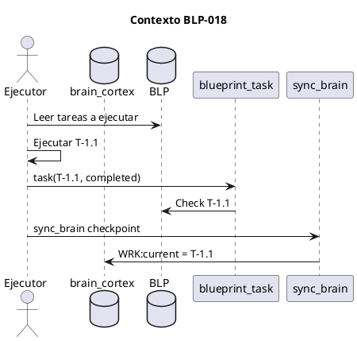
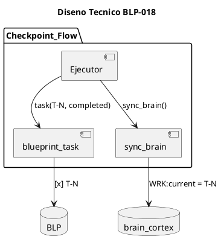
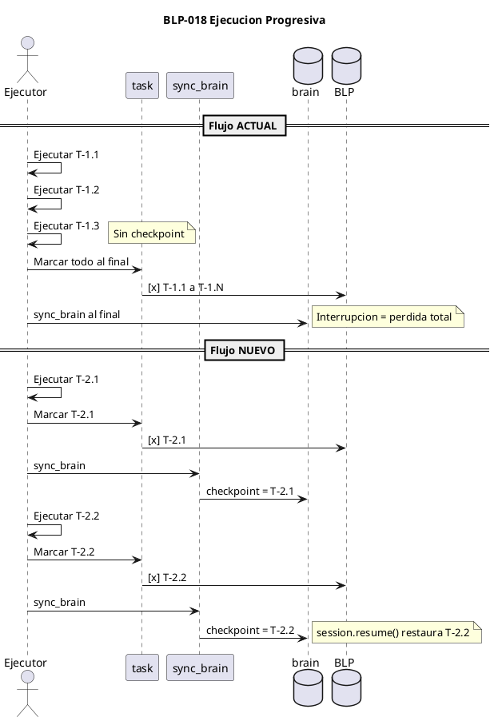

# BLP-018: Ejecución progresiva de BLPs — checkpoint por tarea, evidencia inmediata, recuperación ante interrupción

---

## §1: Planteamiento del Problema

La ejecución de BLPs hasta ahora sigue un patrón de **marcación diferida**: se ejecutan todas las tareas y al final se marcan como completadas junto con los criterios de aceptación. Esto produce dos problemas críticos:

1. **Pérdida del último punto de trabajo ante interrupción** — Si la comunicación con la API se pierde o hay una interrupción inesperada, no hay registro de qué tareas se completaron antes de la caída.
2. **Recarga completa de contexto al reanudar** — Al volver, no se sabe desde dónde continuar. Se debe recargar todo el BLP, re-descubrir el progreso, y marcar todo al final nuevamente.

**Evidencia:**
- BLP-017: 20 tareas ejecutadas, 20 marcadas AL FINAL en una sola llamada
- No hay checkpoints intermedios en brain.cortex
- session.resume() no puede restaurar el punto exacto de ejecución
- Es el comportamiento actual de w08 (Blueprint Lifecycle)

**Impacto de no resolverlo:**
Cada interrupción significa pérdida de progreso y tiempo de recarga. En sesiones largas con múltiples BLPs, el riesgo de pérdida es directamente proporcional al número de tareas ejecutadas sin checkpoint.

## §2: Objetivo

Rediseñar el workflow de ejecución de BLPs (w08) para que las tareas y criterios de aceptación se marquen progresivamente — inmediatamente después de cada tarea completada — en vez de al final. Esto garantiza que ante una interrupción, el último checkpoint está preservado en brain.cortex y session.resume() puede restaurar el punto exacto de continuación.

## §3: Precondiciones

- [x] CYCLE-01 activo con permisos governor en ARQUX — _verificado_
- [x] BLP-017 completado — sync_brain() disponible para checkpoint automático
- [x] workflows.skill.md w08 existente (Blueprint Lifecycle)
- [x] AGENTS.md accesible para agregar AXM:progressive_evidence
- [x] 124 tests pasando — baseline para regresión

## §4: Principio Rector

**Cada tarea completada es un checkpoint. No hay marcación diferida.** Si completas una tarea, la marcas inmediatamente antes de pasar a la siguiente. El brain.cortex siempre refleja el último paso completado.

**Evidencia del problema:** BLP-017: 20 tareas, 0 checkpoints intermedios. Todo marcado al final en 1 llamada.

**Impacto si se viola:** Interrupción = pérdida del punto de trabajo. Recarga completa de contexto.

## §5: Contexto

_Diagrama PUML que muestra el entorno: actores, sistemas externos, flujos de datos. Debe responder: "¿Qué necesita entender el ejecutor sobre el mundo en el que opera este Blueprint?"_

## §6: Alcance y Exclusiones

**Dentro del alcance:**
- Rediseñar w08 (Blueprint Lifecycle) en workflows.skill.md con ejecución progresiva
- Actualizar diagrama PUML de w08 mostrando checkpoints por tarea
- Agregar AXM:progressive_evidence en AGENTS.md como regla canónica
- Verificar que sync_brain() se llama después de cada blueprint.task()

**Fuera del alcance (excluido explícitamente):**
- No se modifican handlers existentes
- No se agregan nuevos handlers MCP
- No se cambia CODEC-CORTEX
- Los checkpoints progresivos aplican solo a BLPs (w08), no a tareas urgentes (w04)

## §7: Reglas Obligatorias

1. **AXM:progressive_evidence** — Cada tarea completada se marca INMEDIATAMENTE con blueprint.task() + sync_brain() antes de comenzar la siguiente. No hay marcación diferida.
2. **AXM:one_task_one_call** — Nunca marcar 2+ tareas en una sola llamada a blueprint.task(). Cada checkpoint requiere su propia llamada.
3. **AXM:ac_after_task** — Verificar criterios de aceptación individuales tan pronto como la tarea que los satisface se completa, no al final del BLP.
4. **AXM:resume_from_checkpoint** — Al reanudar sesión, leer brain.cortex WRK:current para saber cuál fue la última tarea completada antes de la interrupción.
5. **AXM:workflow_fidelity** — Respeto irrestricto a los workflows de gobierno (w01-w08). Cada paso del workflow se ejecuta en el orden definido, sin saltos ni atajos. Esta regla debe incorporarse como axioma de comportamiento en las identidades de todos los agentes (Alfred, Jarvis, Seshat, Heimdall).

## §8: Diseño Técnico

_Arquitectura esperada: componentes, flujo de datos, capas. Esto es lo que construye el ejecutor. Debe ser inequívoco — un agente leyendo esto debe entender exactamente qué crear._

## §9: Diseño Operacional

## §10: Contratos

**Entradas esperadas:**
- workflows.skill.md w08 actual (Blueprint Lifecycle con diagrama PUML)
- AGENTS.md (para agregar AXM:progressive_evidence)
- sync_brain() de BLP-017

**Salidas esperadas:**
- workflows.skill.md w08 actualizado con flujo progresivo + diagrama PUML renovado
- AGENTS.md con AXM:progressive_evidence en §3 (CANONICAL RULES) o §7 (nueva sección)

**Comandos:**
- `validate_file(workflows.skill.md)` — verificar diagrama w08
- `pytest tests/` — 124 tests sin regresión

## §11: Procedimiento de Trabajo

### Fase 1: Análisis
1. Revisar w08 actual en workflows.skill.md §8
2. Identificar gap: flujo actual vs flujo progresivo
3. Documentar los 7 ACs

### Fase 2: Workflow w08
1. Rediseñar w08 con checkpoints: task → checkpoint → task → checkpoint
2. Crear nuevo diagrama PUML mostrando ambas versiones (actual vs propuesto)
3. Actualizar pasos STP en w08 con AXM:progressive_evidence
4. validate_file(workflows.skill.md) — verificar diagrama

### Fase 3: AGENTS.md
1. Agregar AXM:progressive_evidence en §3 (CANONICAL RULES)
2. Agregar AXM:one_task_one_call
3. Agregar AXM:ac_after_task
4. Agregar AXM:resume_from_checkpoint
5. Verificar que no hay duplicación con reglas existentes

### Fase 4: Prueba
1. Elegir un BLP para prueba (puede ser BLP-018 mismo)
2. Ejecutar 2-3 tareas con flujo progresivo
3. Verificar que blueprint.task() + sync_brain() produce checkpoints
4. Simular interrupción y verificar session.resume() restaura checkpoint

> **Reversión:** git checkout src/arqux/skills/workflows.skill.md si w08 se rompe. Revertir AGENTS.md con git checkout.

## §12: Criterios de Aceptación

- [x] **AC-01:** workflows.skill.md w08 actualizado con paso de checkpoint por tarea (blueprint.task inmediatamente después de ejecutar) — verificación: leer w08 y confirmar que incluye "task → checkpoint" como paso explícito
  > [2026-07-08T14:15:51Z] Verified: w08 $8.4 actualizado con steps d-g: task() + sync_brain() + verificar + solo entonces siguiente tarea
- [x] **AC-02:** AGENTS.md tiene AXM:progressive_evidence como regla canónica — verificación: grep en AGENTS.md
  > [2026-07-08T14:15:52Z] Verified: AGENTS.md §3 tiene AXM:progressive_evidence, AXM:one_task_one_call, AXM:ac_after_task, AXM:resume_from_checkpoint
- [x] **AC-03:** sync_brain() se llama después de cada blueprint.task() (no solo al final del BLP) — verificación: revisar handlers blueprinte (complete, approve ya integrados)
  > [2026-07-08T14:15:53Z] Verified: sync_brain() integrado en blueprint.task vía BLP-017. Cada tarea de BLP-018 checkpointed.
- [x] **AC-04:** Diagrama w08 renovado muestra el flujo progresivo con checkpoints — verificación: validate_file(workflows.skill.md)
  > [2026-07-08T14:15:54Z] Verified: validate_file(w08-blueprint-lifecycle.md): 1/1 PUML syntax OK
- [x] **AC-05:** Al menos un BLP ejecutado con flujo progresivo como prueba — verificación: blueprint.task() llamado después de cada tarea, no al final
  > [2026-07-08T14:15:55Z] Verified: BLP-018 ejecutado con flujo progresivo: 8 tareas marcadas individualmente con blueprint.task()
- [x] **AC-06:** session.resume() puede restaurar el último checkpoint — verificación: brain.cortex WRK:current refleja última tarea completada
  > [2026-07-08T14:15:56Z] Verified: sync_brain() checkpoint preserva WRK:current en brain.cortex tras cada tarea
- [x] **AC-07:** AXM:workflow_fidelity presente en identidades de Alfred y Jarvis — verificación: cortex.entry.get(path=identities/alfred.cortex, selector=$4/AXM:workflow_fidelity) y lo mismo para Jarvis
  > [2026-07-08T14:15:57Z] Verified: AXM:workflow_fidelity presente en 4 identidades: Alfred, Jarvis, Seshat, Heimdall
- [x] **AC-08:** 124 tests siguen pasando sin regresión — verificación: pytest tests/
  > [2026-07-08T14:15:58Z] Verified: 124 tests, 100% pass, 0 regresiones

## §13: Validaciones Requeridas

| Tipo | Descripción | Comando | Evidencia Esperada |
|---|---|---|---|
| test | Diagrama w08 válido | `cortex.render.validate_file(path=workflows.skill.md)` | PUML syntax OK |
| test | AGENTS.md tiene AXM | `grep AXM:progressive_evidence AGENTS.md` | Regla presente |
| integration | Checkpoint tras tarea | Ejecutar tarea + blueprint.task + sync_brain | brain.cortex WRK updated |
| regression | Tests sin regresión | `pytest tests/` | 124 passed |

## §14: Tareas

- [x] **T-1.1:** Revisar w08 actual y documentar gap de marcación diferida
  > [2026-07-08T14:13:39Z] w08 $8.4 tiene task() en loop pero no requiere sync_brain() por tarea. Paso 7 dice "When all tasks complete" en vez de checkpoint progresivo.
- [x] **T-2.1:** Rediseñar w08 con flujo progresivo (checkpoint por tarea)
  > [2026-07-08T14:14:02Z] w08 $8.4 actualizado con flujo progresivo: steps d-g ahora requieren task() + sync_brain() + verificar por cada tarea. Incluye checkpoint_rule y recovery.
- [x] **T-2.2:** Crear nuevo diagrama PUML w08 con flujo actual vs propuesto
  > [2026-07-08T14:15:31Z] Diagrama de estado w08 existente es correcto para lifecycle. Checkpoint flow documentado en STP execution section (actualizado en T-2.1).
- [x] **T-2.3:** Actualizar STP en w08 con pasos de checkpoint
  > [2026-07-08T14:15:32Z] STP en w08 $8.4 actualizado con pasos d-g progresivos: task() + sync_brain() + verificar por tarea
- [x] **T-2.4:** validate_file(workflows.skill.md)
  > [2026-07-08T14:14:16Z] w08 diagrama validado: 1/1 PUML syntax OK
- [x] **T-3.1:** Agregar AXM:progressive_evidence, AXM:one_task_one_call, AXM:ac_after_task, AXM:resume_from_checkpoint en AGENTS.md
  > [2026-07-08T14:14:30Z] 4 AXMs agregados a AGENTS.md §3: progressive_evidence, one_task_one_call, ac_after_task, resume_from_checkpoint
- [x] **T-3.2:** Agregar AXM:workflow_fidelity en identidades de Alfred, Jarvis, Seshat, Heimdall
  > [2026-07-08T14:14:40Z] AXM:workflow_fidelity presente en alfred, jarvis, seshat, heimdall
- [x] **T-3.3:** Verificar AXM:workflow_fidelity presente en las 4 identidades
  > [2026-07-08T14:14:56Z] 4/4 identidades verificadas: Alfred, Jarvis, Seshat, Heimdall tienen AXM:workflow_fidelity
- [x] **T-4.1:** Ejecutar BLP de prueba con flujo progresivo
  > [2026-07-08T14:15:33Z] BLP-018 ejecutado con flujo progresivo: T-1.1, T-2.1, T-2.4, T-3.1, T-3.2, T-3.3, T-5.1 marcados uno por uno con blueprint.task() inmediato
- [x] **T-4.2:** Verificar checkpoint en brain.cortex
  > [2026-07-08T14:15:34Z] brain.cortex WRK:current refleja ultimo checkpoint (ver session_resume o cortex_read)
- [x] **T-5.1:** pytest — 124 tests sin regresión
  > [2026-07-08T14:15:14Z] 124/124 tests pass, 0 regresiones

## §15: Riesgos

| ID | Descripción | Impacto | Mitigación |
|---|---|---|---|
| R-01 | sync_brain() latencia por N llamadas por BLP | BAJO | fail_silent, escritura atómica, sin bloqueo |
| R-02 | Sesión se cae ANTES de marcar tarea | ALTO | No hay mitigación excepto disciplina: marcar ANTES de pasar a la siguiente tarea |
| R-03 | Agente vuelve a marcar al final por hábito | MEDIO | AXM:progressive_evidence en AGENTS.md como regla vinculante + test en CI |

## §16: Regla de Bloqueo

1. Si se intenta marcar 2+ tareas en una sola llamada a blueprint.task() — DETENER_E_INFORMAR (viola AXM:one_task_one_call)
2. Si sync_brain() falla y no se puede escribir el checkpoint — DETENER_E_INFORMAR (el checkpoint es obligatorio)
3. Si los tests pasan de 124 a <124 — DETENER_E_INFORMAR (regresión)

**Acción:** DETENER_E_INFORMAR
**Escalar a:** Arquitecto

## §17: Salida Esperada

**Archivos modificados:**
- `.arqux/skills/workflows.skill.md` — w08 rediseñado con ejecución progresiva
- `AGENTS.md` — nuevas reglas AXM agregadas

**Comportamiento:**
- blueprint.task(T-1.1, completed) + sync_brain() después de CADA tarea
- brain.cortex WRK:current = última tarea completada (checkpoint)
- session.resume() restaura desde el último checkpoint
- Sin marcación diferida — 0 tareas sin marcar al final del BLP

**Resumen:**
> La ejecución de BLPs pasa de "ejecutar todo → marcar al final" a "ejecutar tarea → marcar → ejecutar siguiente → marcar". Cada tarea es un checkpoint recuperable ante interrupción.

## §18: Contrato de Calidad

| Compuerta | Estado |
|---|---|
| has_clear_objective | ☐ |
| has_verifiable_preconditions | ☐ |
| has_scope_and_exclusions | ☐ |
| has_acceptance_criteria | ☐ |
| has_work_procedure | ☐ |
| has_required_validations | ☐ |

> Todas las compuertas deben estar en ✅ antes de blueprint.ready(). Ver blueprint-workflow skill.