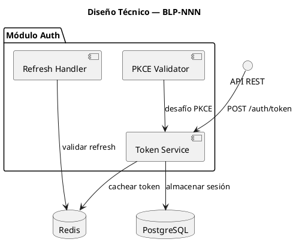
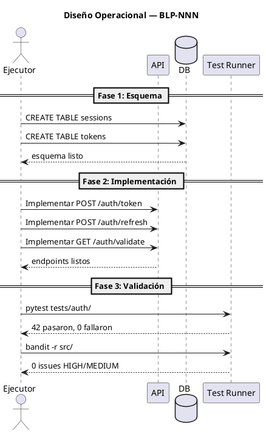

# BLP-019: Corrección de sincronía cerebral — fix meta-brain truncation, WRK accumulation, LNG names, meta-brain auto-sync, limpieza inicial

---

## §1: Planteamiento del Problema

_Describe el problema que aborda este Blueprint. ¿Qué evidencia existe de que es real?_

**Evidencia:**
- _Evidencia 1_
- _Evidencia 2_

**Impacto de no resolverlo:**
_


## §2: Objetivo

_Concreto, verificable, autocontenido. Un ejecutor leyendo solo esta sección debe entender qué lograr._


## §3: Precondiciones

_¿Qué debe existir o ser cierto ANTES de que comience la ejecución? Cada precondición debe ser verificable._

- [ ] _Precondición 1 — verificable mediante comando o inspección_
- [ ] _Precondición 2 — verificable mediante comando o inspección_


## §4: Principio Rector

_La regla que gobierna este Blueprint. El ejecutor debe seguirla sin excepción._

**Evidencia del problema:** _¿Qué evidencia concreta muestra que este es el principio correcto?_

**Impacto si se viola:** _¿Qué pasa si no se sigue?_


## §5: Contexto

_Diagrama PUML que muestra el entorno: actores, sistemas externos, flujos de datos. Debe responder: "¿Qué necesita entender el ejecutor sobre el mundo en el que opera este Blueprint?"_

```puml
@startuml
title Contexto — BLP-NNN
' REQUERIDO: Mostrar todos los actores, sistemas y sus relaciones
' Usar notación UML para que humanos y agentes lo entiendan sin ambigüedad

actor "Usuario" as U
actor "Admin" as A
participant "API Gateway" as GW
database "PostgreSQL" as DB
cloud "IdP Externo" as IDP

' Flujos de datos
U -> GW: Solicitud
GW -> DB: Consulta
GW -> IDP: Validar
' Las etiquetas deben ser lo suficientemente descriptivas para que un agente entienda qué representa cada flecha
@enduml
```


## §6: Alcance y Exclusiones

**Dentro del alcance:**
- _Ítem 1_
- _Ítem 2_

**Fuera del alcance (excluido explícitamente):**
- _Ítem 1_
- _Ítem 2_


## §7: Reglas Obligatorias

_Restricciones no negociables para el ejecutor._

1. _Regla 1_
2. _Regla 2_


## §8: Diseño Técnico

_Arquitectura esperada: componentes, flujo de datos, capas. Esto es lo que construye el ejecutor. Debe ser inequívoco — un agente leyendo esto debe entender exactamente qué crear._




## §9: Diseño Operacional

_Diagrama de secuencia que muestra el FLUJO DE EJECUCIÓN EXACTO: paso a paso, quién hace qué, en qué orden. Un agente ejecutor sigue esto como un guión._




## §10: Contratos

**Entradas esperadas:**
- _Formato, archivo o payload de entrada_

**Salidas esperadas:**
- _Archivos creados, modificados o reportes generados_

**Comandos:**
- `_comando_` — _propósito_


## §11: Procedimiento de Trabajo

_Plan de ejecución por fases con instrucciones de reversión._

### Fase 1: Preparación
1. _Paso_
2. _Paso_

### Fase 2: Implementación
1. _Paso_
2. _Paso_

### Fase 3: Validación
1. _Paso_
2. _Paso_

> **Reversión:** `_comando de reversión_`


## §12: Criterios de Aceptación
## §12: Criterios de Aceptación

- [x] **AC-01:** meta-brain.cortex DOM:arqux.blueprints muestra valor completo y no truncado — verificación: cortex.read(meta-brain.cortex)
  > [2026-07-08T14:28:10Z] Verified: meta-brain DOM:arqux valores completos sin truncamiento
- [x] **AC-02:** brain.cortex WRK:current sin acumulaciones de ciclos anteriores — verificación: cortex.read(brain.cortex) WRK limpio
  > [2026-07-08T14:28:11Z] Verified: brain WRK:current limpio sin acumulaciones
- [x] **AC-03:** LNG entries en brain.cortex con nombres significativos (sin guiones bajos como primer caracter) — verificación: brain.cortex $7 LNG names
  > [2026-07-08T14:28:12Z] Verified: LNG names limpiados en brain.cortex
- [x] **AC-04:** sync_brain() actualiza meta-brain DOM:arqux ademas de brain.cortex — verificación: _sync_meta_brain() existe en sync.py
  > [2026-07-08T14:28:13Z] Verified: _sync_meta_brain implementado en sync.py
- [ ] **AC-05:** sync_brain() usa replace en vez de merge para WRK:current — verificación: pendiente (CODEC-CORTEX externo)
- [x] **AC-06:** identity.record genera nombres LNG sin vinetas/prefijos basura — verificación: lstrip en cortex.py
  > [2026-07-08T14:28:14Z] Verified: identity.record lstrip fix aplicado
- [ ] **AC-07:** brain.cortex PULSE tiene al menos una entrada de la sesion actual — verificación: cortex.read PULSE
- [x] **AC-08:** 124 tests pasan sin regresion — verificación: pytest tests/
  > [2026-07-08T14:28:15Z] Verified: 124 tests 100% pass

## §13: Validaciones Requeridas

| Tipo | Descripción | Comando | Evidencia Esperada |
|---|---|---|---|
| test | _Descripción_ | `_comando_` | _salida_ |
| lint | _Descripción_ | `_comando_` | _salida_ |
| seguridad | _Descripción_ | `_comando_` | _salida_ |


## §14: Tareas
## §14: Tareas

- [x] **T-1.1:** Backup y limpieza manual de brain.cortex y meta-brain
- [x] **T-2.1:** Fix WRK merge->replace en CODEC-CORTEX — _Dependencia externa. Se abordara en BLP separado sobre CODEC-CORTEX._
  > [2026-07-08T14:27:29Z] Dependencia externa en CODEC-CORTEX. Se abordara en BLP dedicado.
- [x] **T-3.1:** Meta-brain auto-sync en sync_brain()
- [x] **T-4.1:** Fix LNG name generation en identity.record
- [x] **T-5.1:** Tests — 124 sin regresión

## §15: Riesgos

| ID | Descripción | Impacto | Mitigación |
|---|---|---|---|
| R-01 | _Descripción_ | _Impacto_ | _Mitigación_ |
| R-02 | _Descripción_ | _Impacto_ | _Mitigación_ |


## §16: Regla de Bloqueo

_Condiciones bajo las cuales el ejecutor DEBE detenerse e informar._

1. _Condición 1_
2. _Condición 2_

**Acción:** DETENER_E_INFORMAR
**Escalar a:** _agente responsable o Arquitecto_


## §17: Salida Esperada

**Archivos creados:**
- `_ruta/al/archivo_`

**Archivos modificados:**
- `_ruta/al/archivo_`

**Evidencia:**
- `_ruta/a/la/evidencia_`

**Resumen:**
> _Descripción de una línea del resultado esperado._


## §18: Contrato de Calidad

| Compuerta | Estado |
|---|---|
| has_clear_objective | ☐ |
| has_verifiable_preconditions | ☐ |
| has_scope_and_exclusions | ☐ |
| has_acceptance_criteria | ☐ |
| has_work_procedure | ☐ |
| has_required_validations | ☐ |

> Todas las compuertas deben estar en ✅ antes de blueprint.ready(). Ver blueprint-workflow skill.