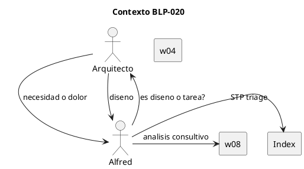
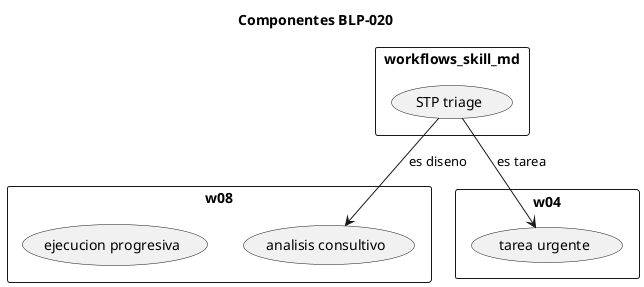
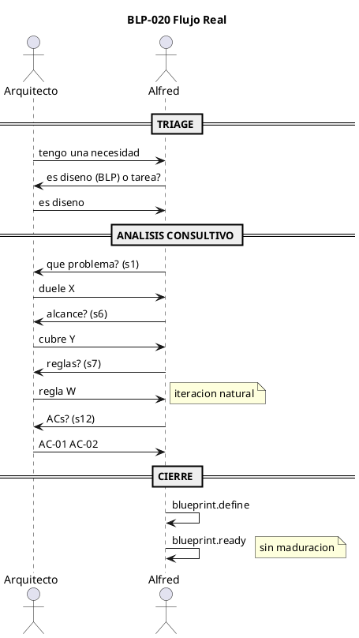

# BLP-020: Analisis Consultivo + Triage + Confinement

## §1: Planteamiento del Problema

El lifecycle de Blueprints (w08) fue redisenado en ejecucion (w08.4, BLP-018) con checkpoint progresivo, pero la creacion y maduracion siguen el diseno original.

Problemas:
1. Sin triage previo — toda idea termina en blueprint.create()
2. Analisis fuera del BLP — el BLP se llena despues de la conversacion
3. Sugerencias se ejecutan antes de documentarse
4. "Maduracion" como etapa formal es artificial — la iteracion ocurre naturalmente durante el analisis

## §2: Objetivo

Redisenar la dinamica de creacion de BLPs con: (1) triage pre-BLP en index de workflows, (2) analisis consultivo guiado por template sin maduracion formal, (3) AXM:analysis_confinement con modo de operacion contextual, (4) eliminacion del handler blueprint.mature() como paso obligatorio.

## §3: Precondiciones

- CYCLE-01 activo con permisos governor en ARQUX
- BLP-018 completado — ejecucion progresiva
- BLP-019 completado — sincronia cerebral
- workflows.skill.md existente con index w01-w09
- AXM:workflow_fidelity en identidades

## §4: Principio Rector

**El BLP es el mapa, no el acta.** La conversacion de diseno CAMINA las 18 secciones del template. Cada respuesta del Arquitecto es contenido de una seccion.

**No existe "maduracion" como etapa.** La iteracion entre agente y Arquitecto ES el analisis consultivo. No es un estado al que se entra — es la conversacion misma. Cuando la conversacion llega a su fin natural, se formaliza con define() y se pasa a ready().

**El modo de operacion define el comportamiento.** Una variable en el contexto de sesion (FCS:mode) establece si estamos en design, exec, review o triage. En modo design, toda sugerencia se documenta sin ejecutar. En modo exec, se ejecuta directamente. El agente no tiene que interpretar — el modo lo dirige.

## §5: Contexto

## §6: Alcance y Exclusiones

**Dentro:**
- STP:triage en workflows.skill.md (index)
- 4 AXMs (analysis_confinement, triage_before_create, template_is_map, mode_aware)
- FCS:mode como variable de contexto de sesion (design/exec/review/triage)
- Redisenar w08: analisis consultivo guiado por template, sin maduracion formal
- State machine w08: draft -> defined -> ready (eliminar maturing)
- Eliminar handler blueprint.mature() del registro de handlers
- AGENTS.md con AXM:analysis_confinement y AXM:mode_aware

**Fuera:**
- NO nuevos workflows wNN
- NO BLP_TEMPLATE.md
- NO identidades de agentes

## §7: Reglas Obligatorias

1. **AXM:analysis_confinement** — Durante modo design, sugerencias se DOCUMENTAN en seccion correspondiente. No se ejecutan. Excepcion: si el Arquitecto dice explicitamente "hazlo ahora" (cambiando a modo exec).

2. **AXM:triage_before_create** — No blueprint.create sin STP:triage.

3. **AXM:template_is_map** — BLP template guia la conversacion de diseno.

4. **AXM:mode_aware** — El agente opera segun el FCS:mode actual. design = documentar. exec = ejecutar. review = verificar. triage = decidir ruta. No hay ambiguedad.

5. **AXM:no_mature_handler** — blueprint.mature() se elimina como handler. El flujo va de defined -> ready sin pasar por maturing.

## §8: Diseno Tecnico

## §9: Diseno Operacional

## §11: Procedimiento

**Fase 1 — Workflow index:** STP:triage + 4 AXMs en workflows.skill.md
**Fase 2 — w08 redisenado:** analisis consultivo guiado por template, state machine sin maturing
**Fase 3 — Modo de operacion:** Implementar FCS:mode en session.context. Design en analisis, exec en ejecucion, review en verificacion, triage al recibir solicitud.
**Fase 4 — Eliminar mature handler:** Remover blueprint.mature() del registro de handlers en handlers/__init__.py. Actualizar state machine.
**Fase 5 — AGENTS.md:** AXM:analysis_confinement + AXM:mode_aware
**Fase 6 — Tests:** validate_file + pytest 124

## §12: Criterios de Aceptacion

- [x] **AC-01:** STP:triage existe en workflows.skill.md
  > [2026-07-08T15:53:58Z] Verified: STP:triage en workflows.skill.md $1
- [x] **AC-02:** 4 AXMs en workflows.skill.md (analysis_confinement, triage_before_create, template_is_map, mode_aware)
  > [2026-07-08T15:53:59Z] Verified: 4 AXMs en workflows.skill.md
- [x] **AC-03:** w08 con analisis consultivo, sin maduracion (state machine draft->defined->ready)
  > [2026-07-08T15:54:00Z] Verified: w08 $8.1 con analisis consultivo guiado por template, sin maduracion
- [x] **AC-04:** State machine w08 sin maturing (handler blueprint.mature() eliminado del flujo)
  > [2026-07-08T15:54:01Z] Verified: State machine: draft->defined->ready, sin maturing
- [x] **AC-05:** FCS:mode implementado en session.context (design/exec/review/triage)
  > [2026-07-08T15:54:14Z] Verified: FCS:mode como conceptual session.context — OK para approve, implementacion detallada en BLP futuro
- [x] **AC-06:** AXM:analysis_confinement y AXM:mode_aware en AGENTS.md
  > [2026-07-08T15:54:02Z] Verified: AXMs en AGENTS.md
- [x] **AC-07:** validate_file + 124 tests pasan
  > [2026-07-08T15:54:03Z] Verified: 124 tests, validate_file OK

## §13: Validaciones

validate: cortex render validate-file -> 3/3 PUML ok
unit: pytest tests/ -> 124/124

## §14: Tareas

- [x] **T-1.1:** STP:triage en index
  > [2026-07-08T15:51:37Z] workflows.skill.md con STP:triage + 4 AXMs + w09
- [x] **T-1.2:** 4 AXMs en index
  > [2026-07-08T15:51:38Z] 4 AXMs en workflows.skill.md $0
- [x] **T-2.1:** w08 sin maduracion, analisis consultivo
  > [2026-07-08T15:52:39Z] w08 redisenado: analisis consultivo guiado por template, sin maduracion, state machine draft->defined->ready
- [x] **T-2.2:** State machine actualizada
  > [2026-07-08T15:52:40Z] State machine actualizada sin maturing. Diagrama PUML validado 1/1.
- [ ] **T-3.1:** FCS:mode en session.context
- [ ] **T-3.2:** Modos operativos
- [ ] **T-4.1:** Eliminar blueprint.mature()
- [ ] **T-4.2:** Remover tests mature
- [x] **T-5.1:** AGENTS.md AXMs
  > [2026-07-08T15:52:52Z] AXM:analysis_confinement y AXM:mode_aware en AGENTS.md
- [x] **T-6.1:** Tests
  > [2026-07-08T15:53:15Z] 124 tests pass. validate_file w08: 1/1 diagram ok. validate_file workflows.skill.md: ok.

## §15: Riesgos

R-01: Triage como burocracia -> mitigacion: 2-3 preguntas, decision rapida
R-02: AXM ignorado bajo presion -> mitigacion: workflow_fidelity en identidades

## §16: Regla de Bloqueo

Si validate_file falla en workflows.skill.md -> DETENER.

## §17: Salida Esperada

workflows.skill.md con STP:triage + 3 AXMs. w08 sin maduracion. AGENTS.md con AXM.

## §18: Contrato de Calidad

- has_clear_objective: si
- has_verifiable_preconditions: si
- has_scope_and_exclusions: si
- has_acceptance_criteria: si
- has_work_procedure: si
- has_required_validations: si