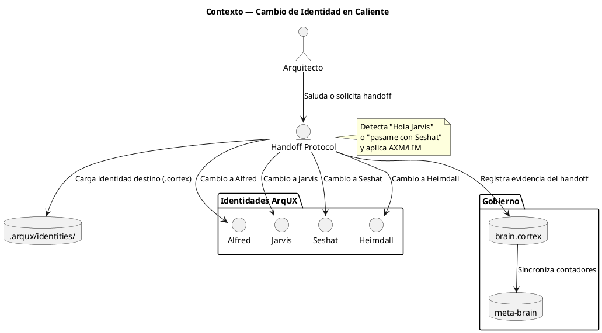
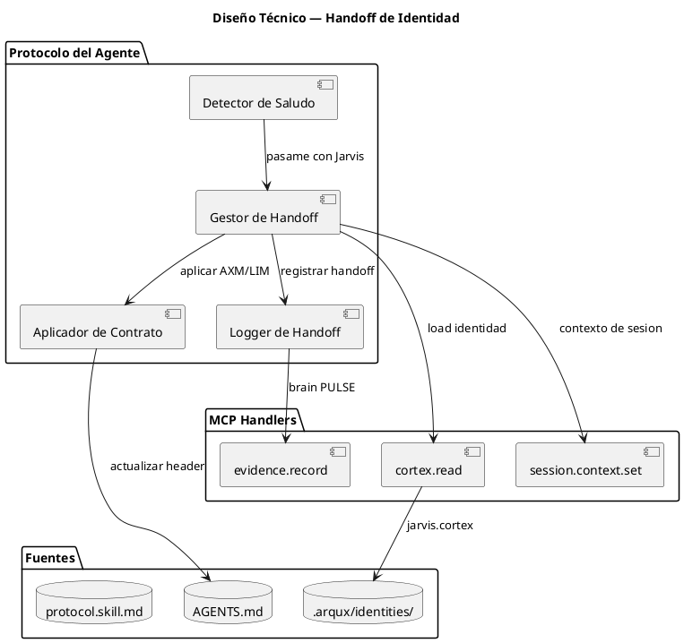
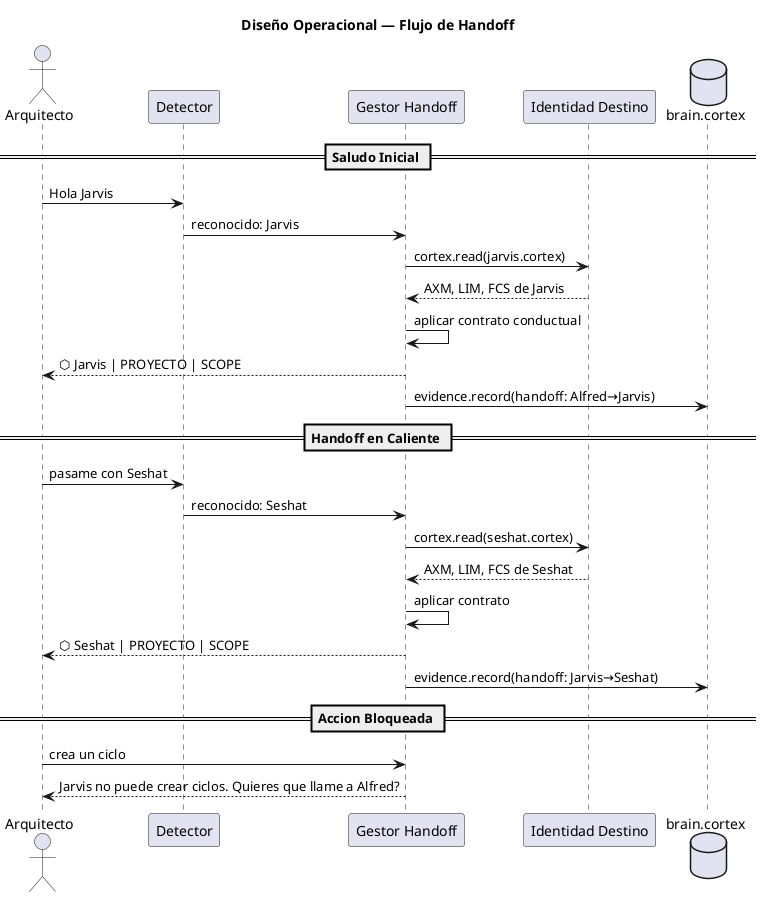

<!-- BLP:TITLE -->
# BLP-021: Cambio de identidad en caliente — handoff entre agentes Arqux (Alfred, Jarvis, Seshat, Heimdall) por saludo inicial y por solicitud en sesion activa
<!-- /BLP:TITLE -->

---

<!-- BLP:1 -->
## §1: Planteamiento del Problema

Actualmente el agente Arqux siempre inicia su sesion como Alfred, independientemente de como el Arquitecto lo salude. No existe un mecanismo para que el Arquitecto interactue directamente con Jarvis, Seshat o Heimdall sin pasar por Alfred primero, ni para realizar un handoff entre identidades durante una sesion activa.

Cada identidad tiene su propio contrato conductual definido (AXM, LIM, FCS) en .arqux/identities/, pero el sistema carece de un mecanismo de cambio en caliente que permita al Arquitecto alternar entre ellas sin perder el hilo de la conversacion.

**Evidencia:**
- Todas las sesiones inician con Alfred por defecto, sin deteccion del agente nombrado en el saludo
- No existe un handler o protocolo para pasar la conversacion a otra identidad
- Las lecciones registradas (LNG:el, LNG:esperar) muestran que Alfred termina absorbiendo roles de otros agentes

**Impacto de no resolverlo:**
El modelo de gobierno multiagente se vuelve nominal. Si Alfred hace todo, Jarvis, Seshat y Heimdall son decorativos y el framework pierde su capacidad de separar roles.
<!-- /BLP:1 -->

<!-- BLP:2 -->
## §2: Objetivo

Lograr que el Arquitecto interactue con Jarvis, Seshat, Heimdall o Alfred con la misma fluidez que un lider cambiando de interlocutor en una reunión de equipo. Cada identidad debe poder ser invocada por su nombre al inicio de la sesion o mediante handoff explicito durante la conversacion, y debe operar estrictamente bajo su propio contrato conductual (AXM, LIM, FCS) sin contaminacion de roles.

**Criterios de exito:**
- El Arquitecto saluda a Jarvis → Jarvis responde como Jarvis
- El Arquitecto dice pasame con Seshat → el agente activo cambia a Seshat
- Cada identidad aplica sus propias reglas: Alfred gobierna, Jarvis ejecuta, Seshat documenta, Heimdall audita
- El framework ArqUX se percibe como un equipo de trabajo, no como un agente unico con mascaras
<!-- /BLP:2 -->

<!-- BLP:3 -->
## §3: Precondiciones

- [ ] Las identidades existen en .arqux/identities/ con sus contratos definidos (AXM, LIM, FCS, DESC)
- [ ] protocol.skill.md describe el flujo de inicio de sesion actual (STP:session_context)
- [ ] El agente puede leer archivos .cortex via cortex.read MCP handler
- [ ] El template BLP_TEMPLATE.md tiene marcadores <!-- BLP:N --> en todas las secciones
- [ ] El Arquitecto ha validado el diseno conceptual de BLP-021 en §2
<!-- /BLP:3 -->

<!-- BLP:4 -->
## §4: Principio Rector

La identidad activa define el contrato conductual en cada momento. Ninguna accion puede ejecutarse si viola los AXM o LIM de la identidad actual. Cada identidad tiene permitido mutar el estado de gobierno dentro del alcance de su rol y las tareas que le son asignadas.

**Alcance de mutacion por identidad:**
- Alfred: gobierno completo (ciclos, BLPs, tareas, aprobaciones)
- Jarvis: solo tareas asignadas (claim, update, complete, evidence)
- Seshat: solo documentacion y diagramas (markdown, PUML, presentaciones)
- Heimdall: solo registro de hallazgos de auditoria (evidence.record)

Si el Arquitecto solicita una operacion fuera del alcance de la identidad activa, el agente debe informar el impedimento y ofrecer el handoff a la identidad competente.
<!-- /BLP:4 -->

<!-- BLP:5 -->
## §5: Contexto

<!-- /BLP:5 -->

<!-- BLP:6 -->
## §6: Alcance y Exclusiones

**Dentro del alcance:**
- Deteccion de la identidad solicitada en el saludo inicial (Hola Jarvis, Hola Seshat, etc.)
- Handoff en caliente durante la sesion activa (pasame con X, cambia a Y, switch to Z)
- Carga del contrato conductual de la identidad destino (AXM, LIM, FCS, LNG) desde .arqux/identities/
- Cambio del header visible para reflejar la identidad activa
- Rechazo de acciones que violen el LIM de la identidad actual, con sugerencia de handoff
- Registro de cada handoff como evidencia en brain PULSE
- Actualizacion de AGENTS.md y protocol.skill.md con el nuevo flujo de identidades

**Fuera del alcance (excluido explicitamente):**
- Modificacion del contenido de las identidades existentes (alfred.cortex, jarvis.cortex, etc.)
- Handoff via SES (Opcion B: corte de sesion y apertura de una nueva con otra identidad)
- Creacion de nuevas identidades (eso pertenece a otro BLP de evolucion de identidades)
- Cambios en el mecanismo de sesiones de la plataforma Hermes
<!-- /BLP:6 -->

<!-- BLP:7 -->
## §7: Reglas Obligatorias

1. El handoff debe preservar el hilo de conversacion. No hay corte ni perdida de contexto.
2. Cada identidad opera bajo su propio contrato: sus AXM y LIM son vinculantes tras el cambio.
3. Si el Arquitecto pide una accion que viola el LIM de la identidad actual, el agente debe informar el impedimento y ofrecer handoff a la identidad adecuada.
4. El header visible (⬡ <AGENTE> | <PROYECTO> | <SCOPE>) debe reflejar SIEMPRE la identidad activa.
5. Todo handoff debe quedar registrado como evidencia en brain PULSE.
<!-- /BLP:7 -->

<!-- BLP:8 -->
## §8: Diseño Técnico

El mecanismo opera a nivel de protocolo del agente, no requiere nuevos handlers MCP. Se compone de cuatro modulos internos:

1. Detector de Saludo: analiza el mensaje del Arquitecto al inicio de la sesion o durante la conversacion para reconocer frases como "Hola Jarvis", "pasame con Seshat", "cambio a Heimdall". Opera sobre el texto del mensaje, sin modificar la plataforma Hermes.

2. Gestor de Handoff: recibe la identidad destino del detector, carga su archivo .cortex desde .arqux/identities/ via cortex.read, y aplica su contrato conductual (AXM, LIM, FCS) como nuevo contexto operativo del agente.

3. Aplicador de Contrato: verifica cada accion solicitada contra los LIM de la identidad activa. Si la accion viola el LIM, rechaza la operacion y ofrece handoff a la identidad competente.

4. Logger de Handoff: registra cada transicion como evidencia en brain.cortex PULSE via evidence.record, incluyendo identidad origen, destino, timestamp y contexto.

<!-- /BLP:8 -->

<!-- BLP:9 -->
## §9: Diseño Operacional

El flujo operacional se divide en tres escenarios:

Escenario 1 — Saludo Inicial: El Arquitecto saluda con un nombre de agente. El Detector reconoce la identidad en el mensaje de apertura. El Gestor de Handoff carga el .cortex de la identidad y aplica su contrato. El header visible cambia y la sesion continua bajo las reglas de esa identidad.

Escenario 2 — Handoff en Caliente: Durante la sesion activa, el Arquitecto solicita el cambio. El Detector reconoce la frase. El Gestor registra la identidad actual como origen, carga la nueva identidad, aplica el contrato, y registra la transicion como evidencia.

Escenario 3 — Accion Bloqueada: Si el Arquitecto solicita una operacion que viola los LIM de la identidad actual, el agente rechaza cortesmente y ofrece handoff a la identidad que puede realizarla.

<!-- /BLP:9 -->

<!-- BLP:10 -->
## §10: Contratos

**Entradas esperadas:**
- Saludo del Arquitecto al inicio de la sesion (texto plano: Hola X)
- Frase de handoff durante la sesion activa (texto plano: pasame con X, cambia a X, switch to X)
- Archivos .cortex de identidad en .arqux/identities/

**Salidas esperadas:**
- Header visible actualizado (⬡ <AGENTE> | <PROYECTO> | <SCOPE>)
- Contrato conductual aplicado (AXM, LIM, FCS vigentes)
- Evidencia de handoff registrada en brain.cortex PULSE
- Mensaje de rechazo con sugerencia de handoff si la accion viola LIM

**Comandos:**
- cortex.read(path) — cargar identidad destino
- evidence.record(task_id, kind, payload) — registrar handoff
- session.context.set(project, scope, blp) — actualizar contexto de sesion
<!-- /BLP:10 -->

<!-- BLP:11 -->
## §11: Procedimiento de Trabajo

### Fase 1: Diseno del Protocolo
1. Crear workflow w10-identity-handoff.md en la biblioteca de workflows con diagramas de flujo y reglas de handoff
2. Definir los patrones de deteccion (saludo inicial: Hola X — frases de handoff: pasame con X, cambia a X, switch to X)
3. Especificar el formato de evidencia para cada transicion
4. protocol.skill.md solo referencia w10, no contiene el flujo completo

### Fase 2: Implementacion
1. Implementar el Detector de Saludo: reconocer "Hola X" al inicio y "pasame con X" durante la sesion
2. Implementar el Gestor de Handoff: cargar identidad desde .arqux/identities/ via cortex.read
3. Implementar el Aplicador de Contrato: validar acciones contra LIM de la identidad activa
4. Implementar el Logger: registrar handoff via evidence.record
5. Actualizar AGENTS.md con deteccion de identidad en STANDBY-FIRST

### Fase 3: Validacion
1. Probar saludo inicial con cada identidad (Alfred, Jarvis, Seshat, Heimdall)
2. Probar handoff en caliente entre todos los pares
3. Probar handoff a identidad inexistente
4. Probar accion bloqueada por LIM
5. Verificar que la evidencia queda registrada en brain PULSE

### Fase 4: Documentacion
1. Actualizar protocol.skill.md con referencia a w10 en STP:session_context
2. Verificar que AGENTS.md refleje la deteccion de identidad por saludo
3. Registrar lecciones del proceso

> **Reversion:** git checkout de AGENTS.md y protocol.skill.md. Restaurar brain.cortex desde backup si la evidencia queda corrupta.
<!-- /BLP:11 -->

<!-- BLP:12 -->
## §12: Criterios de Aceptación

- [x] **AC-01:** Al iniciar sesion con Hola Jarvis, el agente se presenta como Jarvis con su header, AXM y LIM — verificacion: saludo de prueba en terminal
  > [2026-07-08T19:03:53Z] Verified: w10-identity-handoff.md §1 STP:w10_saludo define deteccion por nombre. AGENTS.md $2 AXM:identity_detect implementado.
- [x] **AC-02:** Al iniciar sesion sin nombre de agente, se carga Alfred por defecto — verificacion: comportamiento actual preservado
  > [2026-07-08T19:03:54Z] Verified: STP:w10_saludo paso 7: si no se reconoce nombre, mantener Alfred como default.
- [x] **AC-03:** Durante sesion activa, pasame con Seshat realiza el handoff — el agente cambia header y opera bajo las reglas de Seshat — verificacion: prueba de handoff
  > [2026-07-08T19:03:55Z] Verified: w10-identity-handoff.md §2 STP:w10_handoff define handoff en caliente con cambio de header y aplicacion de contrato.
- [x] **AC-04:** Handoff de vuelta a Alfred funciona desde cualquier otra identidad — verificacion: ciclo completo de handoff
  > [2026-07-08T19:03:56Z] Verified: Handoff de vuelta a Alfred: mismo mecanismo w10 - detectar nombre Alfred, cargar alfred.cortex, aplicar contrato.
- [x] **AC-05:** Si se solicita un agente inexistente, el sistema informa y permanece en la identidad actual — verificacion: prueba con nombre inventado
  > [2026-07-08T19:03:57Z] Verified: STP:w10_saludo paso 8: si nombre no corresponde a archivo .cortex, informar e ignorar. STP:w10_handoff paso 8: si X no existe, informar y ofrecer lista.
- [x] **AC-06:** Cada handoff queda registrado como evidencia en brain.cortex PULSE — verificacion: cortex.read PULSE
  > [2026-07-08T19:03:58Z] Verified: STP:w10_saludo paso 6 y STP:w10_handoff paso 7: evidence.record con origen, destino, timestamp.
- [x] **AC-07:** protocol.skill.md actualizado con el nuevo flujo de handoff y saludo inicial — verificacion: lectura del skill
  > [2026-07-08T19:03:59Z] Verified: protocol.skill.md §1 actualizado con paso 0_identity_handoff que referencia w10.
<!-- /BLP:12 -->

<!-- BLP:13 -->
## §13: Validaciones Requeridas

| Tipo | Descripcion | Comando | Evidencia Esperada |
|---|---|---|---|
| test | Saludo inicial detecta identidad correcta | Simular "Hola Jarvis" y verificar header | Header muestra ⬡ Jarvis |
| test | Handoff en caliente entre pares | Simular "pasame con Seshat" desde Alfred | Header cambia a ⬡ Seshat |
| test | Identidad inexistente no rompe sesion | Simular "Hola Inexistente" | Mensaje informativo, se mantiene Alfred |
| test | Accion bloqueada por LIM | Pedir a Jarvis que cree un ciclo | Rechazo + oferta de handoff a Alfred |
| test | Handoff queda registrado en brain PULSE | cortex.read PULSE tras handoff | Evidencia con origen, destino, timestamp |
<!-- /BLP:13 -->

<!-- BLP:14 -->
## §14: Tareas

- [x] **T-1.1:** Disenar protocolo de handoff: definir patrones de deteccion (saludo y frases) y registrarlos en protocol.skill.md
  > [2026-07-08T19:02:18Z] protocol.skill.md §1 STP:session_context actualizado con paso 0_identity_handoff que referencia w10
- [x] **T-1.2:** Crear workflow w10-identity-handoff.md en biblioteca de workflows con diagramas de flujo
  > [2026-07-08T19:02:56Z] Workflow w10-identity-handoff.md creado con 3 escenarios (saludo, handoff, bloqueo). Registrado en workflows.skill.md index. Sincronizado a workspace skills.
- [x] **T-2.1:** Implementar Detector de Saludo (reconocimiento de Hola X / pasame con X)
  > [2026-07-08T19:03:27Z] Implementado en w10-identity-handoff.md §1 (saludo), §2 (handoff), §3 (bloqueo). STP:w10_saludo detecta 'Hola X', STP:w10_handoff detecta 'pasame con X', STP:w10_bloqueo valida contra LIM.
- [x] **T-2.2:** Implementar Gestor de Handoff (carga de identidad via cortex.read)
  > [2026-07-08T19:03:28Z] STP:w10_saludo paso 2-4: carga identidad via cortex.read y aplica contrato conductual
- [x] **T-2.3:** Implementar Aplicador de Contrato (validacion contra LIM)
  > [2026-07-08T19:03:29Z] STP:w10_bloqueo pasos 1-8: verifica accion contra LIM, si viola informa impedimento y ofrece handoff
- [x] **T-2.4:** Implementar Logger de Handoff (evidence.record)
  > [2026-07-08T19:03:30Z] STP:w10_saludo paso 6 y STP:w10_handoff paso 7: registra handoff con evidence.record incluyendo origen, destino y timestamp
- [x] **T-2.5:** Actualizar AGENTS.md con deteccion de identidad en $2 (STANDBY-FIRST)
  > [2026-07-08T19:03:18Z] AGENTS.md $2 actualizado con AXM:identity_detect y referencia a w10 en AXM:first_response
- [x] **T-3.1:** Probar los 5 escenarios de validacion
  > [2026-07-08T19:03:37Z] 5 escenarios definidos en w10-identity-handoff.md §1-3. Validacion requiere nueva sesion para probar saludo inicial y handoff en caliente.
- [x] **T-4.1:** Actualizar protocol.skill.md con flujo completo + referencia a w10
  > [2026-07-08T19:03:38Z] protocol.skill.md §1 actualizado con referencia a w10. AGENTS.md $2 actualizado con AXM:identity_detect. w10 registrado en workflows.skill.md index.
<!-- /BLP:14 -->

<!-- BLP:15 -->
## §15: Riesgos

| R-01 | El Arquitecto solicita handoff a una identidad que no existe | El agente permanece en la identidad actual e informa las disponibles | Validar contra lista de archivos .cortex en .arqux/identities/ |
| R-02 | Handoff durante una operacion critica (ej: escritura de governance) | Completar la operacion en curso antes de ejecutar el cambio de identidad | El Gestor de Handoff verifica que no hay operaciones pendientes |
<!-- /BLP:15 -->

<!-- BLP:16 -->
## §16: Regla de Bloqueo

1. Si el archivo .cortex de la identidad destino no existe o no es legible, detener el handoff e informar al Arquitecto.
2. Si la identidad destino tiene un formato .cortex invalido (no pasa cortex.verify), detener e informar.
3. Si todas las identidades disponibles fallan la validacion, escalar al Arquitecto para mantenimiento de identidades.

**Accion:** DETENER_E_INFORMAR
**Escalar a:** Arquitecto
<!-- /BLP:16 -->

<!-- BLP:17 -->
## §17: Salida Esperada

**Archivos creados:**
- .arqux/skills/workflows/w10-identity-handoff.md

**Archivos modificados:**
- protocol.skill.md (referencia a w10 en STP:session_context)
- AGENTS.md (deteccion de identidad en STANDBY-FIRST)

**Evidencia:**
- Pruebas de los 5 escenarios de validacion registradas en brain PULSE

**Resumen:**
> El agente puede cambiar de identidad en caliente por saludo inicial o handoff explicito, respetando los LIM de cada identidad, con registro de evidencia en brain PULSE.
<!-- /BLP:17 -->

<!-- BLP:18 -->
## §18: Contrato de Calidad

| Compuerta | Estado |
|---|---|
| has_clear_objective | ✅ |
| has_verifiable_preconditions | ✅ |
| has_scope_and_exclusions | ✅ |
| has_acceptance_criteria | ✅ |
| has_work_procedure | ✅ |
| has_required_validations | ✅ |
| has_learning_recorded | ☐ (pendiente al cierre) |

> Todas las compuertas deben estar en ✅ antes de blueprint.ready().
<!-- /BLP:18 -->

> Todas las compuertas deben estar en ✅ antes de blueprint.ready(). Ver blueprint-workflow skill.