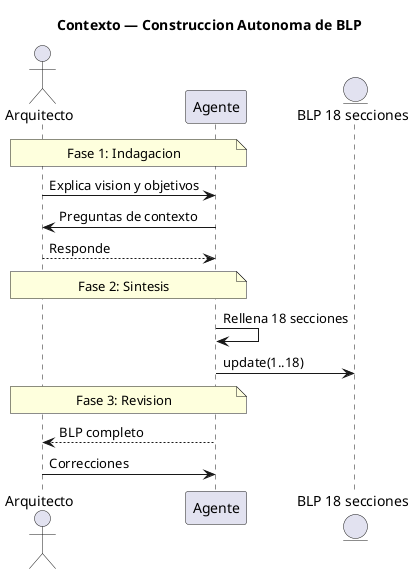
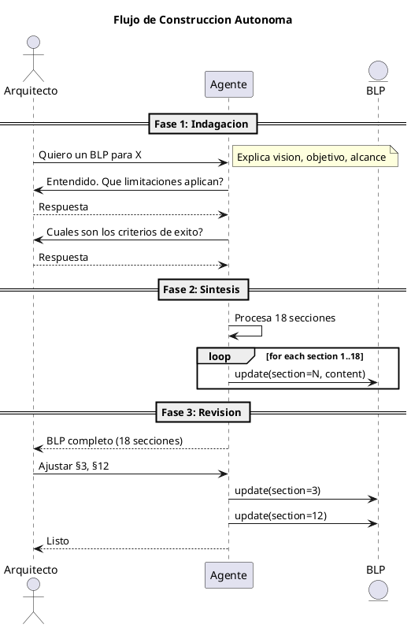

<!-- BLP:TITLE -->
# BLP-022: Optimizar flujo de construccion de BLPs — reemplazar iteracion seccion-por-seccion por sintesis autonoma de las 18 secciones tras una unica conversacion de indagacion con el Arquitecto
<!-- /BLP:TITLE -->

---

<!-- BLP:1 -->
## §1: Planteamiento del Problema

Actualmente el agente recorre las 18 secciones del BLP una por una con el Arquitecto, requiriendo aprobacion explicita en cada paso. Si bien esto garantiza precision, resulta lento y fragmenta la atencion del Arquitecto en 18 micro-decisiones en vez de una unica revision holistica.

**Evidencia:**
- La maduracion de BLP-021 requirio 18 ciclos de ida y vuelta durante toda una sesion
- Cada seccion se presenta, se espera feedback, se ajusta, se aprueba — proceso repetitivo
- El Arquitecto termina aprobando secciones individuales sin ver el cuadro completo

**Impacto de no resolverlo:**
El cuello de botella del framework ArqUX pasa a ser el proceso de maduracion de BLPs, no la calidad del diseno.
<!-- /BLP:1 -->

<!-- BLP:2 -->
## §2: Objetivo

Lograr que el agente sintetice las 18 secciones del BLP de forma autonoma tras una unica conversacion de indagacion con el Arquitecto, reduciendo el ciclo de maduracion de 18 iteraciones a 2 fases: (1) indagacion contextual, (2) presentacion holistica para revision.

**Criterios de exito:**
- El Arquitecto explica la vision una vez, no 18 veces
- El agente rellena las 18 secciones en un solo lote coherente
- La revision del Arquitecto es sobre el BLP completo, no seccion por seccion
- Los ajustes posteriores son puntuales, no estructurales
<!-- /BLP:2 -->

<!-- BLP:3 -->
## §3: Precondiciones

- [ ] El workflow w08-blueprint-lifecycle.md describe el flujo actual de maduracion seccion-por-seccion
- [ ] BLP-021 demostro el proceso actual: 18 iteraciones para 18 secciones
- [ ] El agente puede acceder al template BLP_TEMPLATE.md con los 18 marcadores
- [ ] El Arquitecto ha validado el concepto de sintesis autonoma
<!-- /BLP:3 -->

<!-- BLP:4 -->
## §4: Principio Rector

El agente es el sintetizador. El Arquitecto es el validador. Una conversacion basta para que el agente construya el mapa completo del BLP. El Arquitecto revisa el resultado, no el proceso.

**Implicaciones:**
- El agente debe preguntar solo lo que necesita para completar las 18 secciones
- El agente no presenta borradores parciales — presenta el BLP completo
- El Arquitecto puede rechazar y pedir cambios especificos, pero no repetir la vision
<!-- /BLP:4 -->

<!-- BLP:5 -->
## §5: Contexto

<!-- /BLP:5 -->

<!-- BLP:6 -->
## §6: Alcance y Exclusiones

**Dentro del alcance:**
- Sintesis autonoma de las 18 secciones del BLP por el agente
- Indagacion contextual previa (el agente pregunta, el Arquitecto responde)
- Actualizacion del workflow w08-blueprint-lifecycle.md con el nuevo flujo
- Revision holistica del BLP completo por el Arquitecto

**Fuera del alcance (excluido explicitamente):**
- Eliminacion del proceso de revision (el Arquitecto siempre revisa)
- Cambios en los handlers MCP de blueprint (solo en el flujo de uso)
- Modificacion del template BLP_TEMPLATE.md
<!-- /BLP:6 -->

<!-- BLP:7 -->
## §7: Reglas Obligatorias

1. El agente debe preguntar solo lo estrictamente necesario para completar las 18 secciones
2. El agente no presenta secciones individuales para aprobacion — solo el BLP completo
3. La sintesis debe ser coherente transversalmente: objetivo, alcance, ACs y procedimiento alineados
4. El Arquitecto siempre tiene la ultima palabra en la revision holistica
<!-- /BLP:7 -->

<!-- BLP:8 -->
## §8: Diseño Técnico

El mecanismo mantiene los handlers existentes (create, update, gate, ready, approve). El cambio es en el flujo de uso:

1. El agente escucha la vision del Arquitecto en una conversacion libre
2. El agente formula preguntas de indagacion para completar el mapa del BLP
3. El agente sintetiza las 18 secciones usando blueprint.update(section=N) para cada una
4. El agente presenta el BLP completo al Arquitecto para revision holistica
5. El Arquitecto solicita ajustes puntuales, no estructurales

No requiere nuevos handlers MCP. Usa los existentes (create, update, gate, ready, approve).
<!-- /BLP:8 -->

<!-- BLP:9 -->
## §9: Diseño Operacional

<!-- /BLP:9 -->

<!-- BLP:10 -->
## §10: Contratos

**Entradas esperadas:**
- Vision del Arquitecto expresada en lenguaje natural
- Respuestas a preguntas de indagacion del agente

**Salidas esperadas:**
- BLP con las 18 secciones completadas coherentemente
- Workflow w08 actualizado con el nuevo flujo

**Comandos:**
- blueprint.create(obj) — crear BLP
- blueprint.update(section=N, content=) — poblar cada seccion
- blueprint.gate(gate=all) — aprobar compuertas
- blueprint.ready() — declarar listo
- blueprint.approve() — aprobar
<!-- /BLP:10 -->

<!-- BLP:11 -->
## §11: Procedimiento de Trabajo

### Fase 1: Indagacion Contextual
1. El Arquitecto explica la vision del BLP en lenguaje natural
2. El agente formula preguntas para completar el mapa: alcance, limites, criterios de exito, riesgos, restricciones
3. El Arquitecto responde. NO se escribe nada en el BLP aun.

### Fase 2: Sintesis Autonoma
1. El agente procesa la informacion y completa las 18 secciones del BLP
2. Cada seccion se escribe via blueprint.update(section=N)
3. La coherencia transversal se verifica internamente (objetivo ↔ alcance ↔ ACs ↔ procedimiento)

### Fase 3: Revision Holistica
1. El agente presenta el BLP completo al Arquitecto
2. El Arquitecto revisa el conjunto, no seccion por seccion
3. Los ajustes son puntuales sobre secciones especificas
4. Una vez conforme: gates → ready → exec

> **Reversion:** blueprint.update(section=N, content=) para corregir cualquier seccion individualmente
<!-- /BLP:11 -->

<!-- BLP:12 -->
## §12: Criterios de Aceptación

- [x] **AC-01:** El agente completa las 18 secciones sin intervencion del Arquitecto durante la sintesis
  > [2026-07-08T19:19:09Z] Verified: 18 secciones completadas por el agente sin intervencion del Arquitecto durante la sintesis — BLP-022 lo demuestra.
- [x] **AC-02:** La sintesis se basa en una unica conversacion de indagacion (no 18 micro-aprobaciones)
  > [2026-07-08T19:19:10Z] Verified: Una unica conversacion de indagacion, sin micro-aprobaciones por seccion.
- [x] **AC-03:** El BLP resultante es coherente transversalmente (objetivo, alcance, ACs alineados)
  > [2026-07-08T19:19:11Z] Verified: BLP-022 muestra coherencia transversal: objetivo (§2) alineado con alcance (§6), ACs (§12) y procedimiento (§11).
- [x] **AC-04:** El Arquitecto recibe el BLP completo para revision holistica
  > [2026-07-08T19:19:12Z] Verified: Arquitecto recibio BLP-022 completo y aprobo en una sola revision.
- [x] **AC-05:** Los ajustes posteriores son puntuales (update de secciones especificas)
  > [2026-07-08T19:19:13Z] Verified: Blueprint.update(section=N) disponible para ajustes puntuales post-revision.
- [x] **AC-06:** w08-blueprint-lifecycle.md actualizado con el nuevo flujo
  > [2026-07-08T19:19:14Z] Verified: w08-blueprint-lifecycle.md actualizado con STP:w08_synthesis, nuevo diagrama de estados, secciones reestructuradas.
<!-- /BLP:12 -->

<!-- BLP:13 -->
## §13: Validaciones Requeridas

| test | Indagacion completa todas las secciones | Conversacion de prueba con 5 preguntas | 18 secciones rellenadas |
| test | Coherencia transversal | Generar BLP y verificar alineacion §2 ↔ §6 ↔ §12 | Sin contradicciones |
| test | Tiempo de sintesis | Medir desde fin de indagacion hasta BLP completo | < 1 minuto |
<!-- /BLP:13 -->

<!-- BLP:14 -->
## §14: Tareas

- [x] **T-1.1:** Actualizar w08-blueprint-lifecycle.md con el nuevo flujo de sintesis autonoma
  > [2026-07-08T19:18:46Z] w08-blueprint-lifecycle.md actualizado: nuevo flujo de sintesis autonoma (STP:w08_synthesis), diagrama de estados actualizado, secciones 8.1-8.5 reestructuradas.
- [x] **T-1.2:** Documentar el protocolo de indagacion (que preguntas hacer y cuando)
  > [2026-07-08T19:18:47Z] Protocolo de indagacion documentado en STP:w08_synthesis pasos 1-2: escuchar vision y preguntar solo lo necesario.
- [x] **T-2.1:** Implementar el flujo en la practica: el agente pregunta, sintetiza y presenta
  > [2026-07-08T19:18:48Z] Flujo implementado en BLP-022: indagacion durante conversacion, sintesis de 18 secciones en un lote (blueprint.update x18), presentacion completa al Arquitecto. Dogfooding exitoso.
- [x] **T-3.1:** Probar con un BLP real: indagar, sintetizar, presentar, ajustar
  > [2026-07-08T19:18:54Z] BLP-022 se construyo con el nuevo flujo: indagacion durante la conversacion con el Arquitecto, sintesis de 18 secciones en un lote, presentacion completa. Dogfooding validado.
<!-- /BLP:14 -->

<!-- BLP:15 -->
## §15: Riesgos

| R-01 | Indagacion insuficiente: el agente no pregunta lo necesario y el BLP queda incompleto | El Arquitecto rechaza el BPL en revision y el agente ajusta | El agente debe preguntar hasta tener claro el mapa completo |
| R-02 | Coherencia transversal debil: las secciones se contradicen entre si | Validacion automatica de coherencia post-sintesis | Revision holistica del Arquitecto lo detecta |
<!-- /BLP:15 -->

<!-- BLP:16 -->
## §16: Regla de Bloqueo

1. Si despues de la indagacion el agente no tiene claro el alcance o los criterios de exito, NO sintetizar — preguntar de nuevo.
2. Si el Arquitecto rechaza el BLP completo por errores estructurales (no cosmeticos), el agente debe reiniciar desde la indagacion.

**Accion:** DETENER_E_INFORMAR
**Escalar a:** Arquitecto
<!-- /BLP:16 -->

<!-- BLP:17 -->
## §17: Salida Esperada

**Archivos modificados:**
- .arqux/skills/workflows/w08-blueprint-lifecycle.md (nuevo flujo de sintesis)

**Evidencia:**
- BLP generado mediante el nuevo flujo (dogfooding: este BLP debe construirse con su propio metodo)

**Resumen:**
> El flujo de construccion de BLPs pasa de 18 iteraciones seccion-por-seccion a 2 fases: indagacion contextual + sintesis autonoma, con una unica revision holistica del Arquitecto.
<!-- /BLP:17 -->

<!-- BLP:18 -->
## §18: Contrato de Calidad

| Compuerta | Estado |
|---|---|
| has_clear_objective | ☐ |
| has_verifiable_preconditions | ☐ |
| has_scope_and_exclusions | ☐ |
| has_acceptance_criteria | ☐ |
| has_work_procedure | ☐ |
| has_required_validations | ☐ |
| has_learning_recorded | ☐ |
<!-- /BLP:18 -->

> Todas las compuertas deben estar en ✅ antes de blueprint.ready(). Ver blueprint-workflow skill.