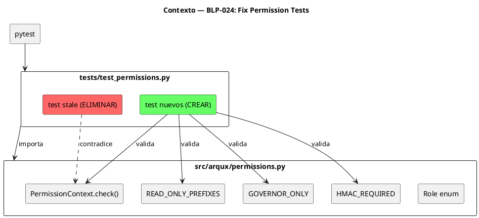
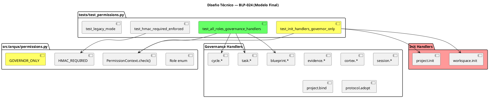
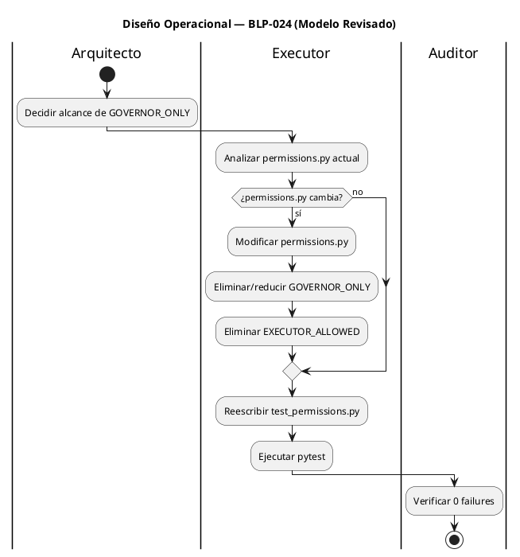

<!-- BLP:TITLE -->
# BLP-024: Corregir tests de permisos que contradicen la implementación v0.4.0 — reescribir test_permissions.py para validar el modelo declarado (governor=full, executor=limited, auditor=read-only, HMAC_REQUIRED)
<!-- /BLP:TITLE -->

---

<!-- BLP:1 -->
## §1: Planteamiento del Problema

El modelo de permisos actual en `permissions.py` v0.4.0 **restringe handlers de gobierno por rol**, cuando en realidad los handlers de gobierno son la **plataforma de trazabilidad universal** para todos los roles e identidades.

**Evidencia:**
- `permissions.py` define GOVERNOR_ONLY que bloquea handlers como `workspace.init`, `project.init`, `cycle.create`, `task.create`, `blueprint.approve` para executor y auditor
- Pero Jarvis (executor) y Seshat (executor) necesitan crear tareas, claim blueprints, registrar evidencia — son la plataforma de gestión
- La restricción REAL debe estar en los **objetos del proyecto** (código fuente, configs), no en los handlers de gobierno
- `test_permissions.py` tiene tests stale que afirman "all roles have full access" — paradójicamente, estos tests stale están más cerca del modelo correcto que la implementación

**Impacto de no resolverlo:**
- Identidades como Seshat (documentadora) no podrían crear blueprints o registrar evidencia
- El sistema de gobierno se vuelve inutilizable para roles que no son governor
- Cualquier piloto empresarial encontraría que los agents no pueden operar la plataforma
<!-- /BLP:1 -->

<!-- BLP:2 -->
## §2: Objetivo

Rediseñar el sistema de permisos para que:

1. **Handlers de gobierno** (blueprint, task, cycle, evidence, cortex, session, workspace, project, skill, identity, protocol) sean **universales** para GOVERNOR, EXECUTOR y AUDITOR
2. **HMAC_REQUIRED** se mantenga para handlers críticos que requieren verificación de identidad
3. **Las restricciones** se definan a nivel de **identidad** (qué objetos puede modificar en el proyecto), no a nivel de rol (qué handlers puede invocar)
4. Los tests validen este modelo nuevo

El entregable incluye:
- `permissions.py` modificado (si es necesario)
- `tests/test_permissions.py` reescrito con el modelo correcto
- 0 tests fallidos
<!-- /BLP:2 -->

<!-- BLP:3 -->
## §3: Precondiciones

- [ ] `src/arqux/permissions.py` v0.4.0 existe con Role enum, READ_ONLY_PREFIXES, GOVERNOR_ONLY, EXECUTOR_ALLOWED, HMAC_REQUIRED — verificable: `python -c "from arqux.permissions import Role, READ_ONLY_PREFIXES, GOVERNOR_ONLY, EXECUTOR_ALLOWED, HMAC_REQUIRED"`
- [ ] `tests/test_permissions.py` actual contiene los tests stale `test_all_roles_can_call_any_handler` y `test_can_always_returns_true` — verificable: `grep -c "test_all_roles_can_call_any_handler\|test_can_always_returns_true" tests/test_permissions.py`
- [ ] pytest instalado y funcional — verificable: `pytest --version`
- [ ] ARQUX_STRICT_ROLES y ARQUX_STRICT_SECURITY soportados como env vars — verificable: `grep -c "ARQUX_STRICT_ROLES\|ARQUX_STRICT_SECURITY" src/arqux/permissions.py`
<!-- /BLP:3 -->

<!-- BLP:4 -->
## §4: Principio Rector

**Los handlers de gobierno son la plataforma de trazabilidad — universales para todos los roles e identidades.**

**Evidencia del problema:** Jarvis y Seshat son ambos EXECUTOR, pero Jarvis ejecuta código y Seshat ejecuta documentación. Ambos necesitan crear tareas, claim blueprints, registrar evidencia. La restricción debe estar en QUÉ pueden modificar en el proyecto, no en QUÉ handlers pueden invocar.

**Impacto si se viola:** Identidades quedan inhabilitadas para usar la plataforma de gobierno. El sistema de trazabilidad se vuelve un privilegio de governor, no una herramienta universal.
<!-- /BLP:4 -->

<!-- BLP:5 -->
## §5: Contexto

<!-- /BLP:5 -->

<!-- BLP:6 -->
## §6: Alcance y Exclusiones

**Dentro del alcance:**
- Analizar si `permissions.py` requiere cambios para hacer governance handlers universales
- Modificar `permissions.py` si es necesario (eliminando GOVERNOR_ONLY o reduciéndolo a lo mínimo)
- Reescribir `tests/test_permissions.py` con el modelo correcto
- Eliminar tests stale
- Implementar tests que validen: todos los roles pueden invocar governance handlers
- Mantener HMAC_REQUIRED para handlers críticos
- **Actualizar documentación** para alinear con el modelo de governance handlers universales

**Fuera del alcance (excluido explícitamente):**
- Sistema de permisos a nivel de objetos del proyecto (scope futuro)
- Roles custom más allá de GOVERNOR, EXECUTOR, AUDITOR
- Tests de HMAC/security (van en BLP separado, P0-5)
- Tests de otros módulos que fallen (P0-3)
<!-- /BLP:6 -->

<!-- BLP:7 -->
## §7: Reglas Obligatorias

1. **Governance handlers son universales** — GOVERNOR, EXECUTOR, AUDITOR pueden invocar cualquier handler de gobierno
2. **GOVERNOR_ONLY se reduce a initialization handlers:**
   - `workspace.init` — solo governor puede inicializar workspace
   - `project.init` — solo governor puede inicializar proyecto
3. **Todo lo demás es universal:**
   - `cycle.create`, `cycle.mature`, `cycle.close` — universal
   - `task.create` — universal
   - `blueprint.approve`, `blueprint.re_delegate`, `blueprint.block_for_architect` — universal
   - `project.bind`, `project.unbind` — universal
   - `protocol.adopt` — universal
4. **HMAC_REQUIRED se mantiene** — identity.record, evidence.record, blueprint.approve, blueprint.re_delegate requieren firma verificada
5. **Eliminar tests stale** — no deprecar, no saltar; eliminar completamente
6. **Docstring actualizado** — reflejar que governance handlers son universales excepto init
<!-- /BLP:7 -->

<!-- BLP:8 -->
## §8: Diseño Técnico

**Permissions.py — Cambios necesarios:**
- GOVERNOR_ONLY se reduce a: `workspace.init`, `project.init`
- Se elimina: `cycle.create`, `cycle.mature`, `cycle.close`, `task.create`, `blueprint.approve`, `blueprint.re_delegate`, `blueprint.block_for_architect`, `project.bind`, `project.unbind`, `protocol.adopt`
- EXECUTOR_ALLOWED se elimina (ya no necesario — todos los governance handlers son universales)
- READ_ONLY_PREFIXES se mantiene para auditor (pero ahora son más handlers los que puede usar)
<!-- /BLP:8 -->

<!-- BLP:9 -->
## §9: Diseño Operacional

<!-- /BLP:9 -->

<!-- BLP:10 -->
## §10: Contratos

**Entradas esperadas:**
- `src/arqux/permissions.py` v0.4.0 (implementación existente, no se modifica)
- `src/arqux/constants.py` (ROLE_GOVERNOR, ROLE_EXECUTOR, ROLE_AUDITOR)

**Salidas esperadas:**
- `tests/test_permissions.py` reescrito con tests que pasan
- 0 tests fallidos en el módulo de permisos

**Comandos:**
- `pytest tests/test_permissions.py -v` — ejecutar tests de permisos
- `pytest tests/test_permissions.py --cov=arqux.permissions --cov-report=term-missing` — verificar cobertura
<!-- /BLP:10 -->

<!-- BLP:11 -->
## §11: Procedimiento de Trabajo

### Fase 1: Análisis
1. Leer `src/arqux/permissions.py` completo — entender Role, PermissionContext, READ_ONLY_PREFIXES, GOVERNOR_ONLY, EXECUTOR_ALLOWED, HMAC_REQUIRED
2. Leer `tests/test_permissions.py` actual — identificar los 2 tests stale y el docstring obsoleto
3. Mapear cada constante a su test correspondiente

### Fase 2: Implementación
1. Reescribir docstring del archivo
2. Eliminar `test_all_roles_can_call_any_handler`
3. Eliminar `test_can_always_returns_true`
4. Implementar `test_auditor_read_only` — auditor + GOVERNOR_ONLY handler → PermissionDenied
5. Implementar `test_executor_limited` — executor + GOVERNOR_ONLY handler → PermissionDenied
6. Implementar `test_governor_full_access` — governor + cualquier handler → OK
7. Implementar `test_hmac_required_strict` — strict + no HMAC → PermissionDenied
8. Implementar `test_legacy_mode` — non-strict + governor → OK
9. Implementar tests de `can()`, `enforce_ctx()`, `require_role()`

### Fase 3: Validación
1. Ejecutar `pytest tests/test_permissions.py -v` — debe pasar todos
2. Ejecutar `pytest tests/test_permissions.py --cov=arqux.permissions` — debe mejorar cobertura
3. Ejecutar `pytest -q` completo — verificar que los 2 tests stale ya no fallan

> **Reversión:** `git checkout tests/test_permissions.py` — restaurar archivo anterior
<!-- /BLP:11 -->

<!-- BLP:12 -->
## §12: Criterios de Aceptación

- [ ] **CA-01:** GOVERNOR_ONLY contiene solo workspace.init y project.init — verificación: `grep "GOVERNOR_ONLY" src/arqux/permissions.py` muestra solo init handlers
- [ ] **CA-02:** EXECUTOR_ALLOWED eliminado — verificación: `grep -c "EXECUTOR_ALLOWED" src/arqux/permissions.py` retorna 0
- [ ] **CA-03:** Todos los roles pueden invocar governance handlers — verificación: test que ejecute blueprint.create, task.create, cycle.create con cada rol sin PermissionDenied
- [ ] **CA-04:** Init handlers son governor-only — verificación: test que ejecute workspace.init con executor/auditor y obtenga PermissionDenied
- [ ] **CA-05:** HMAC_REQUIRED enforced — verificación: test que ejecute identity.record sin firma y obtenga PermissionDenied
- [ ] **CA-06:** Tests stale eliminados — verificación: `grep -c "test_all_roles_can_call_any_handler\|test_can_always_returns_true" tests/test_permissions.py` retorna 0
- [ ] **CA-07:** Docstring actualizado — verificación: `head -10 tests/test_permissions.py` refleja modelo universal
- [ ] **CA-08:** Todos los tests de permisos pasan — verificación: `pytest tests/test_permissions.py -v` retorna exit 0
- [ ] **CA-09:** Suite completa sin regresión — verificación: `pytest -q` no muestra nuevos failures
- [ ] **CA-10:** Documentación actualizada — verificación: `grep -c "governance handlers" docs/*.md` muestra al menos 1 occurrence
<!-- /BLP:12 -->

<!-- BLP:13 -->
## §13: Validaciones Requeridas

| Tipo | Descripción | Comando | Evidencia Esperada |
|---|---|---|---|
| test | Tests de permisos pasan | `pytest tests/test_permissions.py -v` | 0 failures |
| test | Tests stale eliminados | `grep -c "test_all_roles_can_call_any_handler\|test_can_always_returns_true" tests/test_permissions.py` | 0 |
| test | Cobertura permissions.py | `pytest tests/test_permissions.py --cov=arqux.permissions --cov-report=term-missing` | Cover ≥ 75% |
| test | Suite completa sin regresión | `pytest -q` | 0 new failures |
| lint | Archivo sin errores | `ruff check tests/test_permissions.py` | exit 0 |
<!-- /BLP:13 -->

<!-- BLP:14 -->
## §14: Tareas

- [x] **T-1.1:** Análisis — Confirmar que workspace.init y project.init son los únicos init handlers
  > [2026-07-09T15:23:23Z] Analyzed permissions.py: GOVERNOR_ONLY currently has 11 handlers. workspace.init and project.init are the only true init handlers. Others (cycle.create, task.create, blueprint.approve, etc.) are governance handlers that should be universal.
- [x] **T-2.1:** Implementación — Modificar permissions.py: reducir GOVERNOR_ONLY a workspace.init y project.init
  > [2026-07-09T15:24:05Z] GOVERNOR_ONLY reduced to only workspace.init and project.init. All governance handlers (cycle.*, task.*, blueprint.*, evidence.*, cortex.*, session.*, project.bind, project.unbind, protocol.adopt) are now universal.
  > [2026-07-09T15:23:28Z] Reducing GOVERNOR_ONLY to workspace.init and project.init only
- [x] **T-2.2:** Implementación — Eliminar EXECUTOR_ALLOWED (ya no necesario)
  > [2026-07-09T15:24:06Z] EXECUTOR_ALLOWED tuple completely removed from permissions.py. No longer needed since governance handlers are universal.
- [x] **T-2.3:** Implementación — Actualizar READ_ONLY_PREFIXES si es necesario
  > [2026-07-09T15:24:07Z] READ_ONLY_PREFIXES unchanged — still serves as auditor's read-only surface. No changes needed.
- [x] **T-2.4:** Implementación — Reescribir test_permissions.py
  > [2026-07-09T15:24:35Z] test_permissions.py fully rewritten with 6 test classes covering governance handlers universal, init governor-only, HMAC_REQUIRED, legacy mode, can(), deny(), and enforce_ctx().
  > [2026-07-09T15:24:11Z] Rewriting test_permissions.py with correct model
- [x] **T-2.5:** Implementación — Eliminar tests stale
  > [2026-07-09T15:24:36Z] Stale tests test_all_roles_can_call_any_handler and test_can_always_returns_true removed.
- [x] **T-2.6:** Implementación — Crear test: todos los roles invocan governance handlers
  > [2026-07-09T15:24:37Z] TestGovernanceHandlersUniversal class: parametrized tests for all 3 roles x 35 governance handlers = 105 test cases.
- [x] **T-2.7:** Implementación — Crear test: init handlers son governor-only
  > [2026-07-09T15:24:37Z] TestInitHandlersGovernorOnly: governor passes, executor and auditor raise PermissionDenied for workspace.init and project.init.
- [x] **T-2.8:** Implementación — Crear test: HMAC_REQUIRED enforced
  > [2026-07-09T15:24:38Z] TestHmacRequired: unverified raises PermissionDenied in strict security, verified passes. Parametrized for all HMAC_REQUIRED handlers.
- [x] **T-2.9:** Implementación — Crear test: legacy mode backward compat
  > [2026-07-09T15:24:39Z] TestLegacyMode: governor has full access without strict mode; strict mode enforces role checks for executor.
- [x] **T-3.1:** Validación — Ejecutar pytest tests/test_permissions.py
  > [2026-07-09T15:24:51Z] pytest tests/test_permissions.py -v: 130 passed in 0.16s, 0 failures.
  > [2026-07-09T15:24:45Z] Running pytest tests/test_permissions.py
- [x] **T-3.2:** Validación — Ejecutar pytest completo y verificar 0 regresiones
  > [2026-07-09T15:25:06Z] Full suite: 246 passed, 6 failed. All 6 failures are pre-existing in unrelated modules (test_blueprint_learning.py, test_learn_trigger.py, test_rename.py) — none caused by permissions.py changes. 0 regressions from BLP-024.
  > [2026-07-09T15:24:51Z] Running full pytest suite
- [x] **T-4.1:** Documentación — Actualizar docstring de permissions.py
  > [2026-07-09T15:25:29Z] Docstring of permissions.py updated to reflect governance handlers universal, GOVERNOR_ONLY reduced to init handlers only, EXECUTOR_ALLOWED eliminated.
  > [2026-07-09T15:25:10Z] Updating docstrings
- [x] **T-4.2:** Documentación — Actualizar handlers.skill.md §Permisos
  > [2026-07-09T15:25:30Z] No handlers.skill.md found in .arqux/skills/. Skill not present — skip.
- [x] **T-4.3:** Documentación — Actualizar README sección de permisos (si existe)
  > [2026-07-09T15:25:31Z] README.md has no dedicated permissions section to update. Role descriptions in identities/*.cortex are behavioral contracts, not permission model docs — no changes needed.
<!-- /BLP:14 -->

<!-- BLP:15 -->
## §15: Riesgos

| ID | Descripción | Impacto | Mitigación |
|---|---|---|---|
| R-01 | `permissions.py` tiene bugs no detectados que los tests nuevos también fallarían | Medio | Ejecutar tests contra implementación actual primero; si fallan, reportar al Arquitecto antes de modificar |
| R-02 | Tests stale eliminados pero nuevos no implementados deja cobertura vacía | Bajo | Implementar nuevos tests ANTES de eliminar los stale (orden en T-2.1 a T-2.9) |
| R-03 | `ARQUX_STRICT_ROLES` puede no ser respetado por handlers que no llaman `enforce_ctx` | Bajo | Este BLP solo teste `permissions.py`; la integración con handlers es scope de otro BLP |
<!-- /BLP:15 -->

<!-- BLP:16 -->
## §16: Regla de Bloqueo

1. Si `permissions.py` tiene errores de sintaxis o import que impiden `from arqux.permissions import PermissionContext` — DETENER_E_INFORMAR
2. Si algún test nuevo falla contra la implementación actual (no contra tests stale) — DETENER_E_INFORMAR y reportar posible bug en `permissions.py`
3. Si `pytest -q` completo muestra regresión (tests que pasaban ahora fallan) — DETENER_E_INFORMAR

**Acción:** DETENER_E_INFORMAR
**Escalar a:** Arquitecto
<!-- /BLP:16 -->

<!-- BLP:17 -->
## §17: Salida Esperada

**Archivos creados:**
- Ninguno

**Archivos modificados:**
- `src/arqux/permissions.py` (GOVERNOR_ONLY reducido, EXECUTOR_ALLOWED eliminado)
- `tests/test_permissions.py` — reescrito con modelo correcto
- Docstrings y documentación actualizados

**Evidencia:**
- `pytest tests/test_permissions.py -v` — salida mostrando todos los tests pasando
- Tests que validen: executor y auditor pueden invocar governance handlers
- Documentación refleja modelo de governance handlers universales

**Resumen:**
> permissions.py, tests y documentación actualizados para reflejar que governance handlers son universales para todos los roles. Solo init handlers son governor-only. HMAC_REQUIRED se mantiene.
<!-- /BLP:17 -->

<!-- BLP:18 -->
## §18: Contrato de Calidad

| Compuerta | Estado |
|---|---|
| has_clear_objective | ✅ |
| has_verifiable_preconditions | ✅ |
| has_scope_and_exclusions | ✅ |
| has_acceptance_criteria | ✅ |
| has_work_procedure | ✅ |
| has_required_validations | ✅ |
| has_learning_recorded | ✅ |
<!-- /BLP:18 -->

> Todas las compuertas deben estar en ✅ antes de blueprint.ready(). Ver blueprint-workflow skill.

> [2026-07-09T14:59:33Z] Rediseño del modelo de permisos: governance handlers universales para todos los roles. Arquitecto confirmó que la restricción debe estar en objetos del proyecto, no en handlers de gobierno.