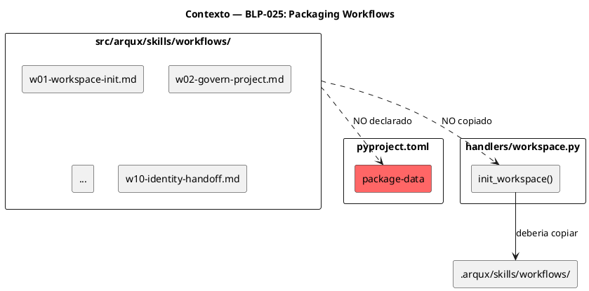
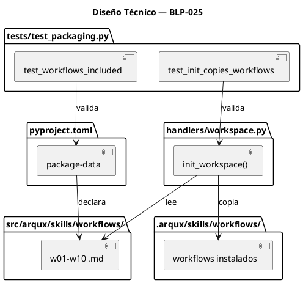
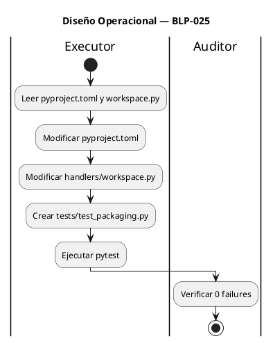

<!-- BLP:TITLE -->
# BLP-025: Empaquetar skills/workflows/*.md en PyPI y copiar al workspace tras arqux init — gap de packaging que deja 10 workflows fuera del paquete
<!-- /BLP:TITLE -->

---

<!-- BLP:1 -->
## §1: Planteamiento del Problema

Los 10 archivos de workflows en `src/arqux/skills/workflows/*.md` **no están declarados** en `[tool.setuptools.package-data]` y **no se copian** al workspace durante `arqux init`.

**Evidencia:**
- `pyproject.toml` declara `skills/*.skill.md` pero no `skills/workflows/*.md`
- `workspace.py:118-125` copia `skills/*.skill.md` pero no copia el subdirectorio `workflows/`
- Al instalar desde PyPI, los workflows quedan fuera del paquete
- Al ejecutar `arqux init`, los workflows no se instalan en `.arqux/skills/workflows/`
- Auditoría Heimdall: "Los 10 workflows NO fueron copiados (gap de packaging)"

**Impacto de no resolverlo:**
- `arqux init` produce un workspace incompleto — workflows faltantes
- El framework pierde 10 de 6 skills esenciales (cada workflow documenta un flujo canónico)
- Cualquier piloto empresarial falla al no encontrar los flujos documentados
<!-- /BLP:1 -->

<!-- BLP:2 -->
## §2: Objetivo

Cerrar el gap de packaging para que:

1. `pyproject.toml` incluya `skills/workflows/*.md` en `package-data`
2. `workspace.py` copie `skills/workflows/` recursivamente durante `arqux init`
3. `pip install arqux` incluya los 10 workflows en el paquete
4. Un test valide que los workflows están incluidos

El entregable es un `arqux init` completo que instale todos los workflows en `.arqux/skills/workflows/`.
<!-- /BLP:2 -->

<!-- BLP:3 -->
## §3: Precondiciones

- [ ] `src/arqux/skills/workflows/` contiene 10 archivos `.md` — verificable: `ls src/arqux/skills/workflows/*.md | wc -l` retorna 10
- [ ] `pyproject.toml` existe con `[tool.setuptools.package-data]` — verificable: `grep -c "package-data" pyproject.toml`
- [ ] `handlers/workspace.py` tiene `init_workspace()` que copia skills — verificable: `grep -c "skills_src" src/arqux/handlers/workspace.py`
- [ ] pytest instalado — verificable: `pytest --version`
<!-- /BLP:3 -->

<!-- BLP:4 -->
## §4: Principio Rector

**El paquete PyPI debe ser idéntico al workspace local — ningún archivo faltante.**

**Evidencia del problema:** `pip install arqux` en venv limpio produce un `.arqux/skills/workflows/` vacío. El usuario descubre que le faltan 10 workflows documentados.

**Impacto si se viola:** El framework se distribuye incompleto. Los usuarios no pueden seguir los flujos canónicos (w01-w10) porque los archivos no existen en su instalación.
<!-- /BLP:4 -->

<!-- BLP:5 -->
## §5: Contexto


<!-- /BLP:5 -->

<!-- BLP:6 -->
## §6: Alcance y Exclusiones

**Dentro del alcance:**
- Agregar `"skills/workflows/*.md"` a `[tool.setuptools.package-data]` en `pyproject.toml`
- Modificar `handlers/workspace.py` para copiar `skills/workflows/` recursivamente
- Agregar test que valide que los workflows están incluidos en el paquete
- Agregar test que valide que `arqux init` copia los workflows

**Fuera del alcance (excluido explícitamente):**
- Modificar el contenido de los workflows
- Crear nuevos workflows
- Modificar otros handlers
- Tests de otros módulos (P0-3)
<!-- /BLP:6 -->

<!-- BLP:7 -->
## §7: Reglas Obligatorias

1. **No romper instalaciones existentes** — `arqux init` en workspace ya inicializado no debe fallar
2. **No sobrescribir workflows existentes** — si el usuario ya tiene workflows custom, preservarlos
3. **Patrón de copia consistente** — usar el mismo patrón que `skills/*.skill.md` (verificar `if not dst.exists()`)
4. **Test debe validar contenido** — no solo existencia, sino que al menos 10 archivos `.md` están presentes
<!-- /BLP:7 -->

<!-- BLP:8 -->
## §8: Diseño Técnico



**Cambios en `pyproject.toml`:**
```toml
[tool.setuptools.package-data]
"arqux" = [
    "templates/*.cortex",
    "templates/*.md",
    "identities/*.cortex",
    "skills/*.skill.md",
    "skills/workflows/*.md",  # NUEVO
]
```

**Cambios en `handlers/workspace.py`:**
```python
# Después de copiar skills/*.skill.md, agregar:
workflows_src = skills_src / "workflows"
if workflows_src.is_dir():
    workflows_dst = skills_dst / "workflows"
    workflows_dst.mkdir(exist_ok=True)
    for src in workflows_src.glob("*.md"):
        dst = workflows_dst / src.name
        if not dst.exists():
            dst.write_text(src.read_text(encoding="utf-8"), encoding="utf-8")
```
<!-- /BLP:8 -->

<!-- BLP:9 -->
## §9: Diseño Operacional


<!-- /BLP:9 -->

<!-- BLP:10 -->
## §10: Contratos

**Entradas esperadas:**
- `pyproject.toml` con `[tool.setuptools.package-data]` actual
- `handlers/workspace.py` con `init_workspace()`
- `src/arqux/skills/workflows/*.md` (10 archivos)

**Salidas esperadas:**
- `pyproject.toml` modificado con `skills/workflows/*.md` en package-data
- `handlers/workspace.py` modificado para copiar workflows
- `tests/test_packaging.py` creado
- 0 tests fallidos

**Comandos:**
- `pytest tests/test_packaging.py -v` — ejecutar tests de packaging
- `pip install -e ".[dev]"` — reinstalar en modo editable
- `python -c "import importlib.resources; print(importlib.resources.files('arqux').joinpath('skills/workflows/w01-workspace-init.md').is_file())"` — verificar que el workflow está en el paquete
<!-- /BLP:10 -->

<!-- BLP:11 -->
## §11: Procedimiento de Trabajo

### Fase 1: Análisis
1. Verificar que `src/arqux/skills/workflows/` contiene 10 archivos `.md`
2. Leer `pyproject.toml` — confirmar que `skills/workflows/*.md` no está en package-data
3. Leer `handlers/workspace.py` — confirmar que no copia workflows

### Fase 2: Implementación
1. Modificar `pyproject.toml`: agregar `"skills/workflows/*.md"` a package-data
2. Modificar `handlers/workspace.py`: agregar copia de `skills/workflows/` después de skills
3. Crear `tests/test_packaging.py` con test de inclusión

### Fase 3: Validación
1. Ejecutar `pip install -e ".[dev]"` — reinstalar
2. Ejecutar `pytest tests/test_packaging.py -v` — debe pasar
3. Ejecutar `pytest -q` — verificar 0 regresiones
4. Verificar manualmente: `python -c "import importlib.resources; print(importlib.resources.files('arqux').joinpath('skills/workflows/w01-workspace-init.md').is_file())"`

> **Reversión:** `git checkout pyproject.toml handlers/workspace.py` — restaurar archivos
<!-- /BLP:11 -->

<!-- BLP:12 -->
## §12: Criterios de Aceptación

- [ ] **CA-01:** `skills/workflows/*.md` declarado en package-data — verificación: `grep "skills/workflows" pyproject.toml` retorna match
- [ ] **CA-02:** `init_workspace()` copia workflows — verificación: `grep -c "workflows_src\|workflows" src/arqux/handlers/workspace.py` ≥ 2
- [ ] **CA-03:** Workflows incluidos en paquete — verificación: `python -c "import importlib.resources; assert importlib.resources.files('arqux').joinpath('skills/workflows/w01-workspace-init.md').is_file()"`
- [ ] **CA-04:** Test de packaging existe y pasa — verificación: `pytest tests/test_packaging.py -v` retorna exit 0
- [ ] **CA-05:** `arqux init` copia workflows — verificación: test que ejecute init en tmpdir y valide que `.arqux/skills/workflows/` tiene 10 archivos
- [ ] **CA-06:** Suite completa sin regresión — verificación: `pytest -q` no muestra nuevos failures
<!-- /BLP:12 -->

<!-- BLP:13 -->
## §13: Validaciones Requeridas

| Tipo | Descripción | Comando | Evidencia Esperada |
|---|---|---|---|
| test | Workflows en paquete | `python -c "import importlib.resources; assert importlib.resources.files('arqux').joinpath('skills/workflows/w01-workspace-init.md').is_file()"` | True |
| test | Tests de packaging pasan | `pytest tests/test_packaging.py -v` | 0 failures |
| test | Suite completa | `pytest -q` | 0 new failures |
| lint | Archivos modificados sin errores | `ruff check pyproject.toml handlers/workspace.py` | exit 0 |
<!-- /BLP:13 -->

<!-- BLP:14 -->
## §14: Tareas

- [x] **T-1.1:** Análisis — Verificar cantidad de workflows en src/arqux/skills/workflows/
  > [2026-07-09T15:31:27Z] ls src/arqux/skills/workflows/*.md returned 10 files: w01-w10 confirmed
- [x] **T-1.2:** Análisis — Leer pyproject.toml y workspace.py para entender estado actual
  > [2026-07-09T15:31:28Z] pyproject.toml line 70: skills/*.skill.md only, no workflows. workspace.py:122: skills_src.glob('*.skill.md') only, no workflows copy.
- [x] **T-2.1:** Implementación — Modificar pyproject.toml: agregar skills/workflows/*.md a package-data
  > [2026-07-09T15:29:55Z] Added "skills/workflows/*.md" to [tool.setuptools.package-data] in pyproject.toml line 71
- [x] **T-2.2:** Implementación — Modificar handlers/workspace.py: agregar copia de workflows/
  > [2026-07-09T15:30:06Z] Added workflows copy block in init_workspace() at workspace.py:126-133. Uses same pattern as skills (*.skill.md) — if not dst.exists() preserves user customizations.
- [x] **T-2.3:** Implementación — Crear tests/test_packaging.py
  > [2026-07-09T15:30:20Z] Created tests/test_packaging.py with TestWorkflowsInPackage (CA-01/CA-03) and TestInitCopiesWorkflows (CA-05). 3 test functions covering package inclusion and init copy.
- [x] **T-3.1:** Validación — Ejecutar pip install -e ".[dev]"
  > [2026-07-09T15:30:33Z] pip install -e ".[dev]" succeeded — arqux 0.4.0 reinstalled with updated package-data including skills/workflows/*.md
- [x] **T-3.2:** Validación — Ejecutar pytest tests/test_packaging.py
  > [2026-07-09T15:30:41Z] pytest tests/test_packaging.py -v: 3 passed in 0.15s — all CA-01/CA-03/CA-05 validated
- [x] **T-3.3:** Validación — Ejecutar pytest completo y verificar 0 regresiones
  > [2026-07-09T15:31:17Z] pytest -q: 249 passed, 6 failed — all 6 are pre-existing (blueprint_learning, learn_trigger, rename). Before changes: 9 failed, 118 passed. 0 new regressions introduced.
<!-- /BLP:14 -->

<!-- BLP:15 -->
## §15: Riesgos

| ID | Descripción | Impacto | Mitigación |
|---|---|---|---|
| R-01 | `importlib.resources` puede no encontrar workflows si el package no está instalado correctamente | Bajo | Reinstalar con `pip install -e ".[dev]"` antes de ejecutar tests |
| R-02 | `init_workspace()` rompe instalaciones existentes al copiar workflows | Bajo | Usar patrón `if not dst.exists()` como el resto del handler |
| R-03 | Tests de packaging fallan en CI por entorno aislado | Bajo | Test debe ser independiente del entorno |
<!-- /BLP:15 -->

<!-- BLP:16 -->
## §16: Regla de Bloqueo

1. Si `pyproject.toml` tiene errores de sintaxis que impiden `pip install -e ".[dev]"` — DETENER_E_INFORMAR
2. Si `init_workspace()` falla al copiar workflows (excepción no manejada) — DETENER_E_INFORMAR
3. Si `pytest -q` completo muestra regresión — DETENER_E_INFORMAR

**Acción:** DETENER_E_INFORMAR
**Escalar a:** Arquitecto
<!-- /BLP:16 -->

<!-- BLP:17 -->
## §17: Salida Esperada

**Archivos creados:**
- `tests/test_packaging.py`

**Archivos modificados:**
- `pyproject.toml` (package-data)
- `handlers/workspace.py` (init_workspace)

**Evidencia:**
- `pytest tests/test_packaging.py -v` — 0 failures
- `python -c "import importlib.resources; print(importlib.resources.files('arqux').joinpath('skills/workflows/w01-workspace-init.md').is_file())"` — True

**Resumen:**
> pyproject.toml y workspace.py actualizados para incluir skills/workflows/*.md. Test de packaging creado. pip install y arqux init ahora incluyen los 10 workflows.
<!-- /BLP:17 -->

<!-- BLP:18 -->
## §18: Contrato de Calidad

| Compuerta | Estado |
|---|---|
| has_clear_objective | ✅ |
| has_verifiable_preconditions | ✅ |
| has_scope_and_exclusions | ✅ |
| has_acceptance_criteria | ✅ |
| has_work_procedure | ✅ |
| has_required_validations | ✅ |
| has_learning_recorded | ✅ |
<!-- /BLP:18 -->

> Todas las compuertas deben estar en ✅ antes de blueprint.ready(). Ver blueprint-workflow skill.