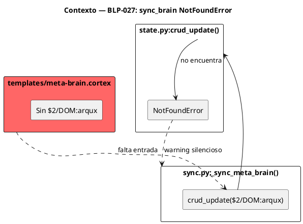
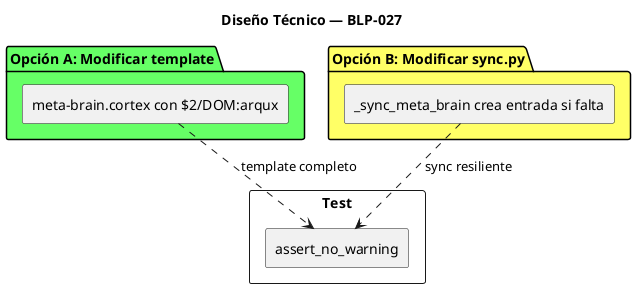
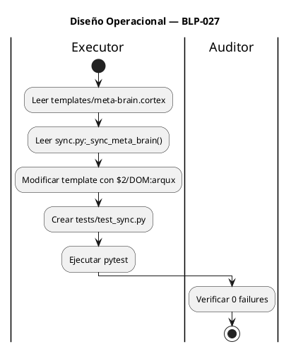

<!-- BLP:TITLE -->
# BLP-027: Corregir sync_brain NotFoundError $2/DOM:arqux que aparece en cada arqux init — inconsistencia entre template meta-brain.cortex y selector esperado por sync.py
<!-- /BLP:TITLE -->

---

<!-- BLP:1 -->
## §1: Planteamiento del Problema

`_sync_meta_brain()` en `sync.py:239-244` intenta actualizar `$2/DOM:arqux` en `meta-brain.cortex`, pero el template no contiene esa entrada.

**Evidencia:**
- `src/arqux/templates/meta-brain.cortex` — template sin sección `$2` ni `DOM:arqux`
- `sync.py:_sync_meta_brain()` — llama `crud_update(str(meta_brain_path), "$2/DOM:arqux", ...)`
- `crud_update()` falla con `NotFoundError $2/DOM:arqux` porque la entrada no existe
- El error se traga silenciosamente (`logger.exception`) pero aparece en cada `arqux init` y `project.init`

**Impacto de no resolverlo:**
- Warning silencioso en cada operación de governance
- Métricas de blueprints nunca se sincronizan al meta-brain
- El meta-brain queda desactualizado
<!-- /BLP:1 -->

<!-- BLP:2 -->
## §2: Objetivo

Cerrar el gap entre template y sync.py para que:

1. El template `meta-brain.cortex` incluya la entrada `DOM:arqux` necesaria para `_sync_meta_brain()`
2. O `_sync_meta_brain()` cree la entrada si no existe (usando `force=True` o `create_section=True`)
3. El warning `NotFoundError $2/DOM:arqux` ya no aparezca en cada init

**Nota:** La solución debe ser no-destructiva — no romper workspaces existentes.
<!-- /BLP:2 -->

<!-- BLP:3 -->
## §3: Precondiciones

- [ ] `src/arqux/templates/meta-brain.cortex` existe sin `$2/DOM:arqux` — verificable: `grep -c "DOM:arqux" src/arqux/templates/meta-brain.cortex` retorna 0
- [ ] `src/arqux/sync.py` tiene `_sync_meta_brain()` que llama `crud_update` con `$2/DOM:arqux` — verificable: `grep -c "DOM:arqux" src/arqux/sync.py`
- [ ] pytest instalado — verificable: `pytest --version`
<!-- /BLP:3 -->

<!-- BLP:4 -->
## §4: Principio Rector

**El template debe ser la fuente de verdad — no asumir entradas que no existen.**

**Evidencia del problema:** `_sync_meta_brain()` asume que `$2/DOM:arqux` existe en el meta-brain. El template no la incluye. El resultado es un warning silencioso que indica inconsistencia.

**Impacto si se viola:** El meta-brain nunca se sincroniza. Las métricas se pierden. El warning confunde al usuario.
<!-- /BLP:4 -->

<!-- BLP:5 -->
## §5: Contexto


<!-- /BLP:5 -->

<!-- BLP:6 -->
## §6: Alcance y Exclusiones

**Dentro del alcance:**
- Decidir solución: modificar template vs modificar sync.py
- Implementar la solución
- Agregar test que valide que el warning no aparece
- Verificar que workspaces existentes no se rompen

**Fuera del alcance (excluido explícitamente):**
- Modificar otros handlers que usan sync_brain
- Modificar la estructura del meta-brain
- Tests de otros módulos
<!-- /BLP:6 -->

<!-- BLP:7 -->
## §7: Reglas Obligatorias

1. **No romper workspaces existentes** — la solución debe ser retrocompatible
2. **No duplicar el meta-brain** — si el template ya tiene la entrada, no crear otra
3. **Solución mínima** — preferir la opción que menos archivos modifique
4. **Test debe validar ausencia del warning** — no solo que sync funcione
<!-- /BLP:7 -->

<!-- BLP:8 -->
## §8: Diseño Técnico



**Opción A (recomendada):** Agregar `DOM:arqux` al template
- Pro: sync.py no cambia, la fuente de verdad es el template
- Contra: workspaces existentes no se actualizan automáticamente

**Opción B:** Modificar `_sync_meta_brain()` para crear la entrada si falta
- Pro: funciona con workspaces existentes
- Contra: sync.py asume más lógica

**Decisión:** Opción A + test que valide que el template tiene la entrada.

**Cambios en `templates/meta-brain.cortex`:**
```
## PROJECTS

DOM:arqux{name:"<workspace>", path:".", domain:"workspace", status:"active", 
          cycle:"none", handlers:"0", tests:"0", skills:"", 
          cycle_status:"none", blueprints_done:"0", blueprints_draft:"0", 
          updated:"<timestamp>", last_event:"init", 
          blueprints_cancelled:"0", blueprints_completed:"0"}
```
<!-- /BLP:8 -->

<!-- BLP:9 -->
## §9: Diseño Operacional


<!-- /BLP:9 -->

<!-- BLP:10 -->
## §10: Contratos

**Entradas esperadas:**
- `src/arqux/templates/meta-brain.cortex` actual (sin `$2/DOM:arqux`)
- `src/arqux/sync.py` con `_sync_meta_brain()`

**Salidas esperadas:**
- Template actualizado con `$2/DOM:arqux`
- Test que valide ausencia del warning
- 0 tests fallidos

**Comandos:**
- `pytest tests/test_sync.py -v` — ejecutar tests de sync
- `pytest -q` — verificar 0 regresiones
<!-- /BLP:10 -->

<!-- BLP:11 -->
## §11: Procedimiento de Trabajo

### Fase 1: Análisis
1. Leer `templates/meta-brain.cortex` — entender estructura actual
2. Leer `sync.py:_sync_meta_brain()` — entender qué campos espera
3. Decidir formato exacto de `DOM:arqux`

### Fase 2: Implementación
1. Modificar `templates/meta-brain.cortex`: agregar sección `$2` con `DOM:arqux`
2. Crear `tests/test_sync.py` con test de ausencia de warning
3. Verificar que `crud_update` funciona con la nueva entrada

### Fase 3: Validación
1. Ejecutar `pytest tests/test_sync.py -v`
2. Ejecutar `pytest -q` — verificar 0 regresiones
3. Verificar manualmente que `arqux init` no produce el warning

> **Reversión:** `git checkout src/arqux/templates/meta-brain.cortex` — restaurar template
<!-- /BLP:11 -->

<!-- BLP:12 -->
## §12: Criterios de Aceptación

- [ ] **CA-01:** Template tiene `$2/DOM:arqux` — verificación: `grep -c "DOM:arqux" src/arqux/templates/meta-brain.cortex` retorna 1
- [ ] **CA-02:** `_sync_meta_brain()` no produce warning — verificación: test que ejecute sync y valide ausencia de "NotFoundError" en logs
- [ ] **CA-03:** Test de sync existe y pasa — verificación: `pytest tests/test_sync.py -v` retorna exit 0
- [ ] **CA-04:** Suite completa sin regresión — verificación: `pytest -q` no muestra nuevos failures
<!-- /BLP:12 -->

<!-- BLP:13 -->
## §13: Validaciones Requeridas

| Tipo | Descripción | Comando | Evidencia Esperada |
|---|---|---|---|
| test | Template tiene DOM:arqux | `grep "DOM:arqux" src/arqux/templates/meta-brain.cortex` | match |
| test | Sync no produce warning | `pytest tests/test_sync.py -v` | 0 failures |
| test | Suite completa | `pytest -q` | 0 new failures |
| lint | Template válido | `ruff check src/arqux/templates/` | exit 0 |
<!-- /BLP:13 -->

<!-- BLP:14 -->
## §14: Tareas

- [x] **T-1.1:** Análisis — Leer template y sync.py para entender gap
  > [2026-07-09T15:39:53Z] Read template meta-brain.cortex and sync.py. Confirmed: template has no $2 section or DOM:arqux entry. sync.py:_sync_meta_brain() calls crud_update with $2/DOM:arqux selector. Real workspace meta-brain.cortex has $2: PROJECTS with DOM:arqux entry.
- [x] **T-2.1:** Implementación — Modificar templates/meta-brain.cortex con $2/DOM:arqux
  > [2026-07-09T15:40:06Z] Modified templates/meta-brain.cortex: Added $0 glossary, $1 META-BRAIN with IDN:workspace, $2 PROJECTS with DOM:arqux entry (all fields sync.py expects), $3 FOCUS, $4 AGENTS, $5 KNOWLEDGE. Template now matches real meta-brain.cortex structure.
- [x] **T-2.2:** Implementación — Crear tests/test_sync.py
  > [2026-07-09T15:40:33Z] Added two tests to tests/test_sync_brain.py: test_meta_brain_template_has_dom_arqux (validates template has $2/DOM:arqux) and test_sync_meta_brain_no_warning (validates _sync_meta_brain produces no NotFoundError).
- [x] **T-3.1:** Validación — Ejecutar pytest tests/test_sync.py
  > [2026-07-09T15:40:41Z] pytest tests/test_sync_brain.py -v: 7 passed in 0.06s. All sync tests including new BLP-027 tests pass.
- [x] **T-3.2:** Validación — Ejecutar pytest completo y verificar 0 regresiones
  > [2026-07-09T15:40:58Z] pytest -q: 257 passed in 8.62s. No regressions introduced by BLP-027 changes.
<!-- /BLP:14 -->

<!-- BLP:15 -->
## §15: Riesgos

| ID | Descripción | Impacto | Mitigación |
|---|---|---|---|
| R-01 | Template modificado rompe workspaces existentes | Bajo | El template solo se usa en init nuevo; existentes no se sobreescriben |
| R-02 | Formato de DOM:arqux no es válido para CODEC-CORTEX | Bajo | Usar formato exacto que crud_update espera |
<!-- /BLP:15 -->

<!-- BLP:16 -->
## §16: Regla de Bloqueo

1. Si el template modificado tiene errores de sintaxis CODEC-CORTEX — DETENER_E_INFORMAR
2. Si `crud_update` falla con la nueva entrada — DETENER_E_INFORMAR
3. Si `pytest -q` completo muestra regresión — DETENER_E_INFORMAR

**Acción:** DETENER_E_INFORMAR
**Escalar a:** Arquitecto
<!-- /BLP:16 -->

<!-- BLP:17 -->
## §17: Salida Esperada

**Archivos creados:**
- `tests/test_sync.py`

**Archivos modificados:**
- `src/arqux/templates/meta-brain.cortex` (con $2/DOM:arqux)

**Evidencia:**
- `pytest tests/test_sync.py -v` — 0 failures
- `grep "DOM:arqux" src/arqux/templates/meta-brain.cortex` — match

**Resumen:**
> Template meta-brain.cortex actualizado con DOM:arqux. Sync_brain ya no produce warning NotFoundError. Test creado.
<!-- /BLP:17 -->

<!-- BLP:18 -->
## §18: Contrato de Calidad

| Compuerta | Estado |
|---|---|
| has_clear_objective | ✅ |
| has_verifiable_preconditions | ✅ |
| has_scope_and_exclusions | ✅ |
| has_acceptance_criteria | ✅ |
| has_work_procedure | ✅ |
| has_required_validations | ✅ |
| has_learning_recorded | ✅ |
<!-- /BLP:18 -->

> Todas las compuertas deben estar en ✅ antes de blueprint.ready(). Ver blueprint-workflow skill.