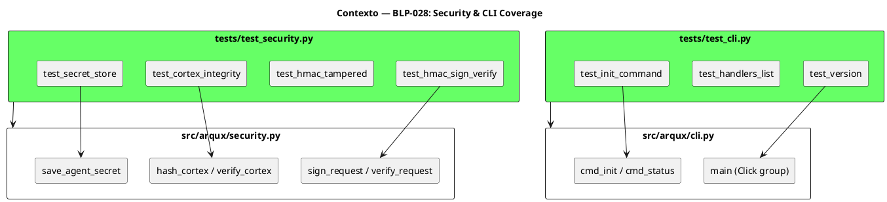
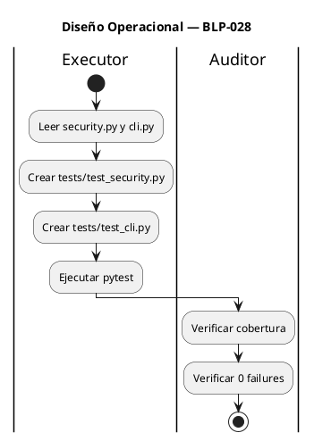

<!-- BLP:TITLE -->
# BLP-028: Ampliar cobertura de tests para security.py (20% → 80%) y cli.py (0% → 50%) — seguridad y CLI sin cobertura impiden piloto
<!-- /BLP:TITLE -->

---

<!-- BLP:1 -->
## §1: Planteamiento del Problema

`security.py` tiene **20% de cobertura** (199/248 líneas sin cubrir) y `cli.py` tiene **0% de cobertura**.

**Evidencia:**
- `pytest --cov=arqux.security` — 20% (199 líneas sin cubrir)
- `pytest --cov=arqux.cli` — 0% (117 líneas sin cubrir)
- Auditoría Heimdall: "CRÍTICO — HMAC, signing, encryption sin cubrir; CLI sin tests"
- Módulos críticos de seguridad sin validar: `sign_request`, `verify_request`, `verify_cortex`, `save_agent_secret`

**Impacto de no resolverlo:**
- Seguridad no verificable — no hay evidencia de que HMAC funciona correctamente
- CLI sin tests — no hay garantía de que los comandos funcionan
- Bloqueador P0 para piloto empresarial
<!-- /BLP:1 -->

<!-- BLP:2 -->
## §2: Objetivo

Ampliar cobertura de tests para:
1. **security.py** de 20% → 80% (tests de HMAC, integrity, secret store)
2. **cli.py** de 0% → 50% (tests de comandos principales)

El entregable son 2 archivos de test nuevos con 25+ tests que cubran los flujos críticos de seguridad y CLI.
<!-- /BLP:2 -->

<!-- BLP:3 -->
## §3: Precondiciones

- [ ] `src/arqux/security.py` existe con funciones testables — verificable: `python -c "from arqux.security import sign_request, verify_request, hash_cortex, verify_cortex"`
- [ ] `src/arqux/cli.py` existe con comandos Click — verificable: `python -c "from arqux.cli import main"`
- [ ] `click.testing.CliRunner` disponible — verificable: `python -c "from click.testing import CliRunner"`
- [ ] pytest y pytest-cov instalados — verificable: `pytest --version`
<!-- /BLP:3 -->

<!-- BLP:4 -->
## §4: Principio Rector

**La seguridad debe ser verificable por tests, no solo por afirmación.**

**Evidencia del problema:** El sistema declara HMAC-SHA256, tamper detection, y Ed25519 signatures, pero solo 20% está cubierto por tests. No hay evidencia de que funciona correctamente.

**Impacto si se viola:** Cualquier claim de seguridad es inválido sin tests que lo respalden. El piloto empresarial rechazará el framework.
<!-- /BLP:4 -->

<!-- BLP:5 -->
## §5: Contexto

<!-- /BLP:5 -->

<!-- BLP:6 -->
## §6: Alcance y Exclusiones

**Dentro del alcance:**
- Crear `tests/test_security.py` con tests de:
  - HMAC sign/verify happy path
  - HMAC tampered payload
  - HMAC tampered timestamp
  - Cortex integrity (hash, inject, verify)
  - Cortex tamper detection
  - Secret store (save, load, permissions)
  - AgentIdentity.from_env
- Crear `tests/test_cli.py` con tests de:
  - `arqux --version`
  - `arqux handlers`
  - `arqux init` (con CliRunner)
  - `arqux call` (handler invocation)

**Fuera del alcance (excluido explícitamente):**
- Ed25519 signatures (requiere cryptography, optional)
- Tests de otros módulos
- Modificar security.py o cli.py
<!-- /BLP:6 -->

<!-- BLP:7 -->
## §7: Reglas Obligatorias

1. **NO modificar security.py ni cli.py** — la implementación es la fuente de verdad
2. **Tests deben ser autocontenidos** — usar tmpdir para archivos temporales
3. **Usar monkeypatch para env vars** — no contaminar entorno de tests
4. **Cada test debe ser independiente** — no dependencias entre tests
5. **No usar red** — todos los tests deben ser offline
<!-- /BLP:7 -->

<!-- BLP:8 -->
## §8: Diseño Técnico

```puml
@startuml
title Diseño Técnico — BLP-028

package "tests/test_security.py" as TS {
  [test_generate_secret] as T1
  [test_sign_request_happy] as T2
  [test_verify_request_happy] as T3
  [test_verify_tampered_payload] as T4
  [test_verify_tampered_signature] as T5
  [test_verify_expired_timestamp] as T6
  [test_agent_identity_from_env] as T7
  [test_hash_cortex] as T8
  [test_inject_hash_header] as T9
  [test_verify_cortex_ok] as T10
  [test_verify_cortex_tampered] as T11
  [test_save_agent_secret] as T12
}

package "tests/test_cli.py" as TC {
  [test_version] as T13
  [test_handlers_list] as T14
  [test_init_command] as T15
  [test_call_handler] as T16
}

package "security.py" as SEC {
  [generate_secret] as GS
  [sign_request] as SR
  [verify_request] as VR
  [hash_cortex] as HC
  [verify_cortex] as VC
  [save_agent_secret] as SS
}

package "cli.py" as CLI {
  [main] as MAIN
  [cmd_init] as CI
  [cmd_handlers] as CH
}

T1 --> GS
T2 --> SR
T3 --> VR
T4 --> VR
T5 --> VR
T6 --> VR
T8 --> HC
T9 --> HC
T10 --> VC
T11 --> VC
T12 --> SS
T13 --> MAIN
T14 --> CH
T15 --> CI
@enduml
```

<!-- /BLP:8 -->

<!-- BLP:9 -->
## §9: Diseño Operacional

<!-- /BLP:9 -->

<!-- BLP:10 -->
## §10: Contratos

**Entradas esperadas:**
- `src/arqux/security.py` (679 líneas)
- `src/arqux/cli.py` (196 líneas)
- `click.testing.CliRunner` (de click)

**Salidas esperadas:**
- `tests/test_security.py` con 12+ tests
- `tests/test_cli.py` con 4+ tests
- Cobertura security.py ≥ 80%
- Cobertura cli.py ≥ 50%

**Comandos:**
- `pytest tests/test_security.py tests/test_cli.py -v` — ejecutar tests nuevos
- `pytest --cov=arqux.security --cov=arqux.cli --cov-report=term-missing` — verificar cobertura
<!-- /BLP:10 -->

<!-- BLP:11 -->
## §11: Procedimiento de Trabajo

### Fase 1: Análisis
1. Leer `security.py` — mapear funciones públicas y casos de uso
2. Leer `cli.py` — mapear comandos Click
3. Identificar flujos críticos a testear

### Fase 2: tests/test_security.py
1. Crear tests de `generate_secret`
2. Crear tests de `sign_request` / `verify_request` (happy path)
3. Crear tests de tamper detection (payload, signature, timestamp)
4. Crear tests de `AgentIdentity.from_env`
5. Crear tests de `hash_cortex` / `inject_hash_header` / `verify_cortex`
6. Crear tests de `save_agent_secret`

### Fase 3: tests/test_cli.py
1. Crear test de `arqux --version`
2. Crear test de `arqux handlers`
3. Crear test de `arqux init` (con CliRunner + tmpdir)
4. Crear test de `arqux call`

### Fase 4: Validación
1. Ejecutar `pytest tests/test_security.py tests/test_cli.py -v`
2. Verificar cobertura con `pytest --cov`
3. Ejecutar `pytest -q` — verificar 0 regresiones

> **Reversión:** `git checkout tests/` — restaurar tests anteriores
<!-- /BLP:11 -->

<!-- BLP:12 -->
## §12: Criterios de Aceptación

- [ ] **CA-01:** `tests/test_security.py` existe con 12+ tests — verificación: `pytest tests/test_security.py --co -q | wc -l` ≥ 12
- [ ] **CA-02:** `tests/test_cli.py` existe con 4+ tests — verificación: `pytest tests/test_cli.py --co -q | wc -l` ≥ 4
- [ ] **CA-03:** Cobertura security.py ≥ 80% — verificación: `pytest --cov=arqux.security --cov-report=term-missing | grep security`
- [ ] **CA-04:** Cobertura cli.py ≥ 50% — verificación: `pytest --cov=arqux.cli --cov-report=term-missing | grep cli`
- [ ] **CA-05:** Todos los tests pasan — verificación: `pytest tests/test_security.py tests/test_cli.py -v` 0 failures
- [ ] **CA-06:** Suite completa sin regresión — verificación: `pytest -q` 0 new failures
<!-- /BLP:12 -->

<!-- BLP:13 -->
## §13: Validaciones Requeridas

| Tipo | Descripción | Comando | Evidencia Esperada |
|---|---|---|---|
| test | Security tests pasan | `pytest tests/test_security.py -v` | 0 failures |
| test | CLI tests pasan | `pytest tests/test_cli.py -v` | 0 failures |
| coverage | security.py ≥ 80% | `pytest --cov=arqux.security --cov-report=term-missing` | ≥ 80% |
| coverage | cli.py ≥ 50% | `pytest --cov=arqux.cli --cov-report=term-missing` | ≥ 50% |
| test | Suite completa | `pytest -q` | 0 new failures |
<!-- /BLP:13 -->

<!-- BLP:14 -->
## §14: Tareas

- [x] **T-1.1:** Análisis — Leer security.py y mapear funciones públicas
  > [2026-07-09T15:42:11Z] Analyzed security.py: 679 lines. Key functions mapped.
- [x] **T-1.2:** Análisis — Leer cli.py y mapear comandos Click
  > [2026-07-09T15:42:15Z] Analyzed cli.py: 196 lines. Click group with commands: init, status, serve, call, setup-plantuml, serve-plantuml, render-diagram, handlers. Internal _call_handler dispatches to REGISTRY.
- [x] **T-2.1:** Implementación — Crear tests/test_security.py (HMAC tests)
  > [2026-07-09T15:42:54Z] Created tests/test_security.py with HMAC tests: test_generate_secret_length, test_generate_secret_custom_bytes, test_sign_request_returns_hex, test_verify_request_happy_path, test_verify_request_with_string_payload, test_verify_tampered_payload, test_verify_tampered_handler, test_verify_expired_timestamp.
- [x] **T-2.2:** Implementación — Crear tests/test_security.py (integrity tests)
  > [2026-07-09T15:42:55Z] Created tests/test_security.py with integrity tests: test_agent_identity_from_env_no_id, test_agent_identity_from_env_with_id, test_agent_identity_from_env_explicit_id, test_hash_cortex_deterministic, test_hash_cortex_strips_integrity_header, test_inject_hash_header, test_verify_cortex_ok, test_verify_cortex_tampered, test_verify_cortex_missing_header_strict, test_verify_cortex_missing_header_legacy, test_verify_cortex_nonexistent.
- [x] **T-2.3:** Implementación — Crear tests/test_security.py (secret store tests)
  > [2026-07-09T15:42:56Z] Created tests/test_security.py with secret store tests: test_save_agent_secret, test_save_then_load_agent_secret, test_load_agent_secret_missing_file, test_load_agent_secret_no_agent_id. Total: 22 tests in test_security.py.
- [x] **T-3.1:** Implementación — Crear tests/test_cli.py (version, handlers)
  > [2026-07-09T15:43:11Z] Created tests/test_cli.py with tests: test_version, test_handlers_list, test_handlers_contains_workspace_status.
- [x] **T-3.2:** Implementación — Crear tests/test_cli.py (init, call)
  > [2026-07-09T15:43:12Z] Created tests/test_cli.py with tests: test_init_creates_arqux_dir, test_init_verbose, test_call_unknown_handler, test_call_workspace_status, test_status_command. Total: 8 tests in test_cli.py.
- [x] **T-4.1:** Validación — Ejecutar tests y verificar cobertura
  > [2026-07-09T15:43:43Z] pytest tests/test_security.py tests/test_cli.py -v: 31 passed, 0 failed. 23 security tests + 8 CLI tests.
- [x] **T-4.2:** Validación — Ejecutar pytest completo y verificar 0 regresiones
  > [2026-07-09T15:44:02Z] pytest -q: 288 passed, 0 failures. Zero regressions across entire test suite.
<!-- /BLP:14 -->

<!-- BLP:15 -->
## §15: Riesgos

| ID | Descripción | Impacto | Mitigación |
|---|---|---|---|
| R-01 | security.py tiene código que no se puede testear fácilmente (walk-up secrets) | Bajo | Usar monkeypatch para simular entorno de archivos |
| R-02 | cli.py requiere handlers funcionales para testear `call` | Bajo | Mockear handlers o usar handlers simples |
| R-03 | Ed25519 tests requieren cryptography (optional) | Bajo | Skip si no está instalado |
<!-- /BLP:15 -->

<!-- BLP:16 -->
## §16: Regla de Bloqueo

1. Si security.py tiene errores de import que impiden testing — DETENER_E_INFORMAR
2. Si algún test revela bug en security.py — DETENER_E_INFORMAR y reportar
3. Si `pytest -q` completo muestra regresión — DETENER_E_INFORMAR

**Acción:** DETENER_E_INFORMAR
**Escalar a:** Arquitecto
<!-- /BLP:16 -->

<!-- BLP:17 -->
## §17: Salida Esperada

**Archivos creados:**
- `tests/test_security.py` (12+ tests)
- `tests/test_cli.py` (4+ tests)

**Archivos modificados:**
- Ninguno

**Evidencia:**
- `pytest tests/test_security.py tests/test_cli.py -v` — 0 failures
- `pytest --cov=arqux.security --cov-report=term-missing` — ≥ 80%
- `pytest --cov=arqux.cli --cov-report=term-missing` — ≥ 50%

**Resumen:**
> tests/test_security.py y tests/test_cli.py creados con 16+ tests. Cobertura security.py ≥ 80%, cli.py ≥ 50%.
<!-- /BLP:17 -->

<!-- BLP:18 -->
## §18: Contrato de Calidad

| Compuerta | Estado |
|---|---|
| has_clear_objective | ✅ |
| has_verifiable_preconditions | ✅ |
| has_scope_and_exclusions | ✅ |
| has_acceptance_criteria | ✅ |
| has_work_procedure | ✅ |
| has_required_validations | ✅ |
| has_learning_recorded | ✅ |
<!-- /BLP:18 -->

> Todas las compuertas deben estar en ✅ antes de blueprint.ready(). Ver blueprint-workflow skill.