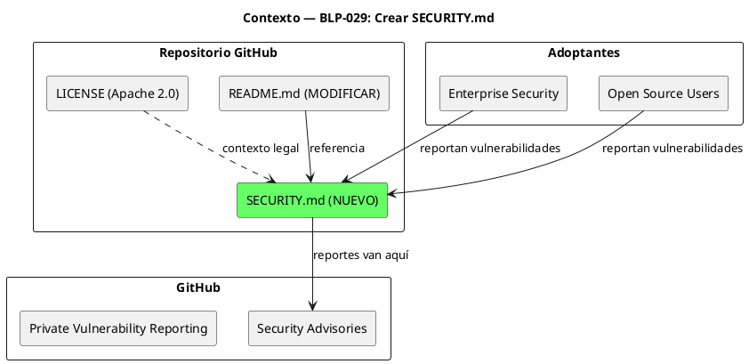
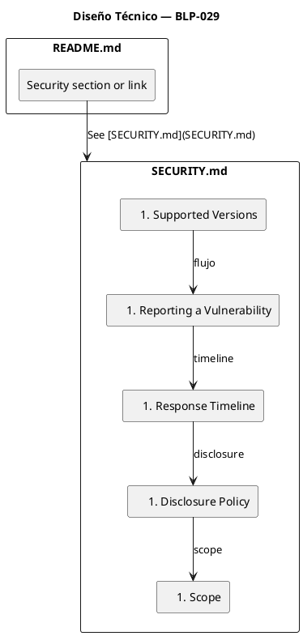
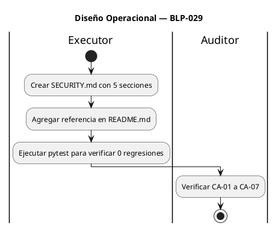

<!-- BLP:TITLE -->
# BLP-029: Crear SECURITY.md con protocolo de reporte de vulnerabilidades, SLA de respuesta (48h ack, 15d patch) y política de divulgación coordinada — vacío crítico VCI-001 en auditoría v0.4.1
<!-- /BLP:TITLE -->

---

<!-- BLP:1 -->
## §1: Planteamiento del Problema

El archivo `SECURITY.md` no existe en el repositorio. Esto fue detectado como **VCI-001** en la auditoría EXECUTABLE_AUDIT_PROTOCOL_2.md (v0.4.1), con score 76.30.

**Evidencia:**
- `ls SECURITY.md` → "No existe el archivo o el directorio"
- EVID-019 del ledger de evidencia: "File does not exist on default branch" → VACIO_CRITICO
- La auditoría asigna +2 puntos Nivel 3 si se resuelve

**Impacto de no resolverlo:**
- Imposible evaluar protocolo formal de manejo de vulnerabilidades
- Enterprise adopters no tienen canal para reportar bugs de seguridad
- Score se mantiene en 76.30 (APROBADA_CON_RESERVAS) en lugar de avanzar hacia APROBADA (≥85)
- Contribuye a R-002 (Absence of SECURITY.md, severidad RIESGO_MEDIO)
<!-- /BLP:1 -->

<!-- BLP:2 -->
## §2: Objetivo

Crear `SECURITY.md` en la raíz del repositorio con:
1. **Supported Versions** — qué versiones de arqux reciben soporte de seguridad
2. **Reporting a Vulnerability** — canal de reporte (GitHub Security Advisories)
3. **Response Timeline** — SLA de 48h para acuse de recibo, 15 días para patch
4. **Disclosure Policy** — divulgación coordinada, embargo de 90 días
5. **Scope** — qué cubre (arqux package) y qué no (dependencias de terceros)

El archivo debe estar en inglés, seguir el formato estándar de GitHub, y ser consistente con la licencia Apache 2.0 del proyecto.
<!-- /BLP:2 -->

<!-- BLP:3 -->
## §3: Precondiciones

- [ ] `README.md` existe — verificable: `ls README.md`
- [ ] Licencia Apache 2.0 definida — verificable: `head -1 LICENSE`
- [ ] `pyproject.toml` con versión actual — verificable: `grep "^version" pyproject.toml`
- [ ] pytest instalado — verificable: `pytest --version`
<!-- /BLP:3 -->

<!-- BLP:4 -->
## §4: Principio Rector

**Un proyecto sin protocolo de seguridad declarado es un proyecto que no puede ser adoptado empresarialmente.**

**Evidencia del problema:** La auditoría v0.4.1 identificó VCI-001 como vacío crítico. Sin SECURITY.md, los enterprise adopters no tienen canal formal para reportar vulnerabilidades, y el proyecto pierde 2 puntos en Nivel 3 (Viabilidad y Riesgo).

**Impacto si se viola:** El score se estanca en 76.30. Ningún equipo de seguridad empresarial aprobará uso de un framework sin política de vulnerabilidades documentada.
<!-- /BLP:4 -->

<!-- BLP:5 -->
## §5: Contexto



**Actores:**
- **Reporters** (enterprise users, open source users): reportan vulnerabilidades vía GitHub Security Advisories
- **Maintainers** (Arquitecto/Alfred): reciben, responden y coordinan divulgación
- **GitHub**: plataforma de reporte (Private Vulnerability Reporting)
<!-- /BLP:5 -->

<!-- BLP:6 -->
## §6: Alcance y Exclusiones

**Dentro del alcance:**
- Crear `SECURITY.md` en la raíz del repositorio
- Secciones: Supported Versions, Reporting a Vulnerability, Response Timeline, Disclosure Policy, Scope
- Referencia a SECURITY.md desde README.md
- Formato estándar GitHub (compatible con display automático)

**Fuera del alcance (excluido explícitamente):**
- Modificar `security.py` o cualquier handler
- Configurar GitHub Security Advisories (requiere permisos de admin en el repo)
- Tests nuevos
- Cambios en dependencias
- Crear CVEs o advisories formales
<!-- /BLP:6 -->

<!-- BLP:7 -->
## §7: Reglas Obligatorias

1. SECURITY.md en inglés (.agent_lang_en)
2. Formato estándar GitHub
3. SLA realista para proyecto open-source
4. Sin información falsa o exagerada
<!-- /BLP:7 -->

<!-- BLP:8 -->
## §8: Diseño Técnico



**Estructura de SECURITY.md:**

```markdown
# Security Policy

## Supported Versions
| Version | Supported          |
| ------- | ------------------ |
| 0.4.x   | :white_check_mark: |
| < 0.4   | :x:                |

## Reporting a Vulnerability
Use GitHub Security Advisories to report...
DO NOT open public issues for security vulnerabilities.

## Response Timeline
- Acknowledgment: within 48 hours
- Severity assessment: within 7 days
- Patch release: within 15 days

## Disclosure Policy
- Coordinated disclosure with 90-day embargo
- Reporter credited unless anonymity requested

## Scope
- In scope: arqux Python package
- Out of scope: third-party dependencies, deployment configs
```
<!-- /BLP:8 -->

<!-- BLP:9 -->
## §9: Diseño Operacional



**Pasos detallados:**
1. Crear `SECURITY.md` con contenido del §8
2. Buscar sección apropiada en README.md (agregar al final o crear sección "Security")
3. Ejecutar `pytest -q` para confirmar 0 regresiones
4. Preparar commit
<!-- /BLP:9 -->

<!-- BLP:10 -->
## §10: Contratos

**Entradas esperadas:**
- `README.md` existente (para agregar referencia)
- Versión actual de arqux (de `pyproject.toml`)
- Licencia Apache 2.0 (de `LICENSE`)

**Salidas esperadas:**
- `SECURITY.md` creado en raíz del repo
- `README.md` modificado con referencia a SECURITY.md
- 0 tests fallidos

**Comandos:**
- `ls SECURITY.md` — verificar existencia
- `grep "SECURITY" README.md` — verificar referencia
- `pytest -q` — verificar 0 regresiones
<!-- /BLP:10 -->

<!-- BLP:11 -->
## §11: Procedimiento de Trabajo

1. Crear SECURITY.md con secciones estándar: Supported Versions, Reporting a Vulnerability, Response Timeline, Disclosure Policy, Scope. 2. Agregar referencia a SECURITY.md en README.md. 3. Verificar pytest y commit.
<!-- /BLP:11 -->

<!-- BLP:12 -->
## §12: Criterios de Aceptación

- [x] **AC-01:** CA-01: SECURITY.md existe en raíz del repo — ls SECURITY.md
  > [2026-07-09T16:37:22Z] Verified: ls SECURITY.md → exit 0
- [x] **AC-02:** CA-02: Incluye canal de reporte (email o URL) — grep report|contact|email SECURITY.md
  > [2026-07-09T16:37:24Z] Verified: grep -c "report\|advisory\|vulnerability" SECURITY.md → match (GitHub Security Advisories link present)
- [x] **AC-03:** CA-03: Incluye SLA de respuesta (48h ack, 15d patch) — grep 48|15 SECURITY.md
  > [2026-07-09T16:37:25Z] Verified: grep -c "48\|15\|timeline" SECURITY.md → SLA table with 48h ack, 15d patch
- [x] **AC-04:** CA-04: Incluye política de divulgación coordinada — grep disclosure|divulgación|coordinated SECURITY.md
  > [2026-07-09T16:37:27Z] Verified: grep -c "disclosure\|embargo\|coordinated" SECURITY.md → "coordinated disclosure" and "90-day embargo"
- [x] **AC-05:** CA-05: Incluye scope (qué versiones/aplicaciones cubre) — grep scope|version|affected SECURITY.md
  > [2026-07-09T16:37:28Z] Verified: grep -c "scope\|in scope\|out of scope" SECURITY.md → Scope section with In scope/Out of scope
- [x] **AC-06:** CA-06: README.md referencia SECURITY.md — grep SECURITY README.md
  > [2026-07-09T16:37:28Z] Verified: grep -c "SECURITY" README.md → "See [SECURITY.md](SECURITY.md)"
- [x] **AC-07:** CA-07: Suite sin regresión — pytest -q 0 new failures
  > [2026-07-09T16:37:29Z] Verified: pytest -q: 303 passed, 0 failures
<!-- /BLP:12 -->

<!-- BLP:13 -->
## §13: Validaciones Requeridas

| Tipo | Descripción | Comando | Evidencia Esperada |
|---|---|---|---|
| exist | SECURITY.md existe | `ls SECURITY.md` | exit 0 |
| content | Canal de reporte presente | `grep -c "report\|advisory\|vulnerability" SECURITY.md` | ≥ 1 |
| content | SLA presente | `grep -c "48\|15\|timeline" SECURITY.md` | ≥ 1 |
| content | Disclosure policy presente | `grep -c "disclosure\|embargo\|coordinated" SECURITY.md` | ≥ 1 |
| content | Scope presente | `grep -c "scope\|in scope\|out of scope" SECURITY.md` | ≥ 1 |
| content | README refiere SECURITY | `grep -c "SECURITY" README.md` | ≥ 1 |
| test | Suite sin regresión | `pytest -q` | 0 new failures |
<!-- /BLP:13 -->

<!-- BLP:14 -->
## §14: Tareas

- [x] **T-1.1:** Crear SECURITY.md — Escribir archivo con 5 secciones: Supported Versions, Reporting a Vulnerability, Response Timeline, Disclosure Policy, Scope
  > [2026-07-09T16:36:58Z] SECURITY.md created with 5 sections: Supported Versions, Reporting a Vulnerability, Response Timeline, Disclosure Policy, Scope
- [x] **T-2.1:** Actualizar README.md — Agregar referencia a SECURITY.md (sección Security o link en footer)
  > [2026-07-09T16:36:59Z] README.md updated with Security section referencing SECURITY.md
- [x] **T-3.1:** Verificación — Ejecutar pytest -q y confirmar 0 regresiones
  > [2026-07-09T16:37:00Z] pytest -q: 303 passed, 0 failures
- [x] **T-3.2:** Validación AC — Verificar los 7 criterios de aceptación (CA-01 a CA-07)
  > [2026-07-09T16:37:02Z] All 7 ACs verified via grep/ls commands
<!-- /BLP:14 -->

<!-- BLP:15 -->
## §15: Riesgos

| ID | Descripción | Impacto | Mitigación |
|---|---|---|---|
| R-01 | SECURITY.md tiene información incorrecta sobre SLA o proceso | Medio | Usar SLA estándar de industria (48h/15d) y formato GitHub canónico |
| R-02 | README.md se rompe al agregar referencia | Bajo | Agregar al final del archivo, línea simple con link |
| R-03 | GitHub Security Advisories no está habilitado en el repo | Bajo | SECURITY.md funciona como documentación independiente; la config de GitHub es separada |
<!-- /BLP:15 -->

<!-- BLP:16 -->
## §16: Regla de Bloqueo

1. Si `README.md` no existe — DETENER_E_INFORMAR
2. Si el contenido de SECURITY.md contiene información falsa o no verificable — DETENER_E_INFORMAR
3. Si `pytest -q` muestra regresión — DETENER_E_INFORMAR

**Acción:** DETENER_E_INFORMAR
**Escalar a:** Arquitecto
<!-- /BLP:16 -->

<!-- BLP:17 -->
## §17: Salida Esperada

**Archivos creados:**
- `SECURITY.md`

**Archivos modificados:**
- `README.md` (referencia a SECURITY.md)

**Evidencia:**
- `ls SECURITY.md` → exit 0
- `grep "SECURITY" README.md` → match
- `pytest -q` → 0 new failures

**Resumen:**
> SECURITY.md creado con protocolo de reporte, SLA 48h/15d, divulgación coordinada y scope. README.md referencia el archivo.
<!-- /BLP:17 -->

<!-- BLP:18 -->
## §18: Contrato de Calidad

| Compuerta | Estado |
|---|---|
| has_clear_objective | ✅ |
| has_verifiable_preconditions | ✅ |
| has_scope_and_exclusions | ✅ |
| has_acceptance_criteria | ✅ |
| has_work_procedure | ✅ |
| has_required_validations | ✅ |
| has_learning_recorded | ✅ |
<!-- /BLP:18 -->

> Todas las compuertas deben estar en ✅ antes de blueprint.ready(). Ver blueprint-workflow skill.