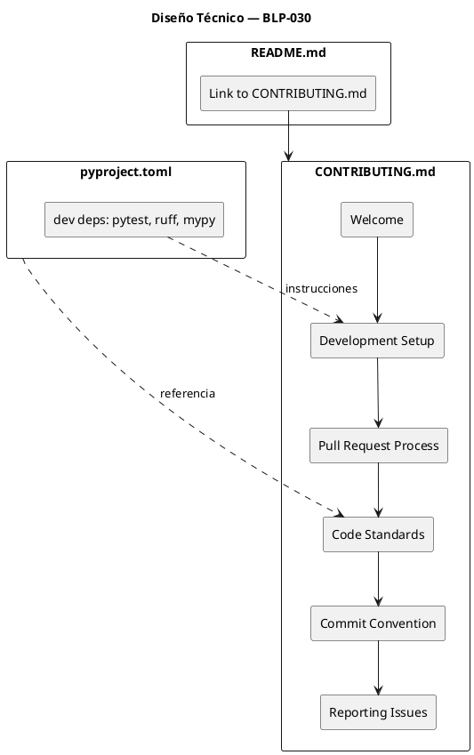
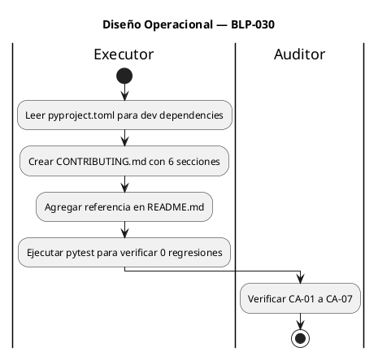

<!-- BLP:TITLE -->
# BLP-030: Crear CONTRIBUTING.md con guía de desarrollo, proceso de pull requests, estándares de código y reglas de convención — vacío crítico VCI-002 en auditoría v0.4.1
<!-- /BLP:TITLE -->

---

<!-- BLP:1 -->
## §1: Planteamiento del Problema

El archivo `CONTRIBUTING.md` no existe en el repositorio. Esto fue detectado como **VCI-002** en la auditoría EXECUTABLE_AUDIT_PROTOCOL_2.md (v0.4.1).

**Evidencia:**
- `ls CONTRIBUTING.md` → "No existe el archivo o el directorio"
- EVID-020 del ledger de evidencia: "File does not exist on default branch" → VACIO_CRITICO
- La auditoría asigna +1.5 puntos Nivel 2 si se resuelve
- R-003 (Absence of CONTRIBUTING.md, severidad RIESGO_MEDIO)

**Impacto de no resolverlo:**
- Dificulta la contribución externa y estandarización
- No hay guía para nuevos desarrolladores
- El proyecto parece cerrado a contribuciones
- Score se mantiene en 76.30 sin avanzar hacia APROBADA
<!-- /BLP:1 -->

<!-- BLP:2 -->
## §2: Objetivo

Crear `CONTRIBUTING.md` en la raíz del repositorio con:
1. **Welcome** — mensaje de bienvenida y qué tipos de contribuciones se aceptan
2. **Development Setup** — cómo configurar el entorno de desarrollo (Python 3.11+, pip install -e .[dev])
3. **Pull Request Process** — flujo: fork → branch → test → lint → PR
4. **Code Standards** — ruff, mypy, pytest-cov ≥80%
5. **Commit Convention** — conventional commits (feat, fix, docs, test, refactor)
6. **Reporting Issues** — bug report template, feature request

El archivo debe estar en inglés y ser consistente con las herramientas configuradas en `pyproject.toml`.
<!-- /BLP:2 -->

<!-- BLP:3 -->
## §3: Precondiciones

- [ ] `README.md` existe — verificable: `ls README.md`
- [ ] `pyproject.toml` con dev dependencies — verificable: `grep -c "pytest\|ruff\|mypy" pyproject.toml`
- [ ] `LICENSE` existe (Apache 2.0) — verificable: `ls LICENSE`
- [ ] pytest instalado — verificable: `pytest --version`
<!-- /BLP:3 -->

<!-- BLP:4 -->
## §4: Principio Rector

**Un proyecto open-source sin guía de contribución es un proyecto que declara que no acepta ayuda.**

**Evidencia del problema:** La auditoría v0.4.1 identificó VCI-002 como vacío crítico. Sin CONTRIBUTING.md, los posibles contribuidores no saben cómo empezar, qué estándares seguir, ni cómo proponer cambios.

**Impacto si se viola:** El proyecto no escala más allá de un solo mantenedor (Bus Factor = 1). La métrica de "adopción comunitaria" nunca mejora.
<!-- /BLP:4 -->

<!-- BLP:5 -->
## §5: Contexto

```puml
@startuml
title Contexto — BLP-030: Crear CONTRIBUTING.md

rectangle "Repositorio GitHub" as REPO {
  rectangle "CONTRIBUTING.md (NUEVO)" as CMD #66FF66
  rectangle "README.md (MODIFICAR)" as README
  rectangle "pyproject.toml (referencia)" as PY
}

rectangle "Herramientas" as TOOLS {
  rectangle "ruff (lint)" as RUFF
  rectangle "mypy (types)" as MYPY
  rectangle "pytest (tests)" as PYTEST
}

rectangle "Flujo de Contribución" as FLOW {
  rectangle "Fork" as FK
  rectangle "Feature Branch" as BR
  rectangle "PR" as PR
}

README --> CMD : referencia
PY ..> CMD : dependencias
CMD --> FK : guía
FK --> BR --> PR
TOOLS ..> CMD : estándares
@enduml
```

**Actores:**
- **Contribuidores** (nuevos o existentes): leen CONTRIBUTING.md para entender el flujo
- **Maintainers** (Arquitecto/Alfred): revisan PRs, verifican estándares
- **CI/CD** (GitHub Actions): ejecuta ruff, mypy, pytest automáticamente
<!-- /BLP:5 -->

<!-- BLP:6 -->
## §6: Alcance y Exclusiones

**Dentro del alcance:**
- Crear `CONTRIBUTING.md` en la raíz del repositorio
- Secciones: Welcome, Development Setup, Pull Request Process, Code Standards, Commit Convention, Reporting Issues
- Referencia a CONTRIBUTING.md desde README.md

**Fuera del alcance (excluido explícitamente):**
- Configurar branch protection rules (requiere admin)
- Crear issue templates (requiere permisos de repo)
- Configurar pre-commit hooks
- Modificar código fuente
- Tests nuevos
<!-- /BLP:6 -->

<!-- BLP:7 -->
## §7: Reglas Obligatorias

1. CONTRIBUTING.md en inglés (.agent_lang_en)
2. Formato estándar GitHub (display automático)
3. Consistente con pyproject.toml (dev dependencies reales)
4. Referenciar herramientas que realmente están configuradas (ruff, mypy, pytest)
5. Sin información falsa o exagerada
<!-- /BLP:7 -->

<!-- BLP:8 -->
## §8: Diseño Técnico



**Estructura de CONTRIBUTING.md:**

```markdown
# Contributing to ArqUX

## Welcome
Thanks for your interest in contributing! ...

## Development Setup
Prerequisites: Python 3.11+
git clone https://github.com/FidelErnesto03/arqux.git
cd arqux
pip install -e ".[dev]"
pytest  # verify everything works

## Pull Request Process
1. Fork the repository
2. Create a feature branch (git checkout -b feat/my-feature)
3. Make your changes
4. Run tests: pytest -q
5. Run linter: ruff check src/ tests/
6. Run type check: mypy src/arqux/
7. Commit with conventional format
8. Push and create PR

## Code Standards
- Linting: ruff check (configured in pyproject.toml)
- Types: mypy (configured in pyproject.toml)
- Tests: pytest with coverage (target: ≥80%)
- All tests must pass before PR merge

## Commit Convention
Use Conventional Commits:
- feat(scope): new feature
- fix(scope): bug fix
- docs(scope): documentation
- test(scope): adding tests
- refactor(scope): code restructuring

## Reporting Issues
- Bug reports: include steps to reproduce
- Feature requests: describe the use case
- Security issues: see SECURITY.md
```
<!-- /BLP:8 -->

<!-- BLP:9 -->
## §9: Diseño Operacional



**Pasos detallados:**
1. Leer `pyproject.toml` sección `[project.optional-dependencies]` para confirmar dev deps
2. Crear `CONTRIBUTING.md` con contenido del §8
3. Buscar sección apropiada en README.md y agregar referencia
4. Ejecutar `pytest -q` para confirmar 0 regresiones
5. Preparar commit
<!-- /BLP:9 -->

<!-- BLP:10 -->
## §10: Contratos

**Entradas esperadas:**
- `pyproject.toml` con dev dependencies (para documentar correctamente)
- `README.md` existente (para agregar referencia)
- `LICENSE` existente (contexto Apache 2.0)

**Salidas esperadas:**
- `CONTRIBUTING.md` creado en raíz del repo
- `README.md` modificado con referencia a CONTRIBUTING.md
- 0 tests fallidos

**Comandos:**
- `ls CONTRIBUTING.md` — verificar existencia
- `grep "CONTRIBUTING" README.md` — verificar referencia
- `pytest -q` — verificar 0 regresiones
<!-- /BLP:10 -->

<!-- BLP:11 -->
## §11: Procedimiento de Trabajo

1. Leer pyproject.toml para confirmar dev dependencies reales.
2. Crear CONTRIBUTING.md con 6 secciones: Welcome, Development Setup, Pull Request Process, Code Standards, Commit Convention, Reporting Issues.
3. Agregar referencia a CONTRIBUTING.md en README.md.
4. Verificar pytest -q para confirmar 0 regresiones.
<!-- /BLP:11 -->

<!-- BLP:12 -->
## §12: Criterios de Aceptación

- [x] **AC-01:** CONTRIBUTING.md existe en raíz del repo — `ls CONTRIBUTING.md`
  > [2026-07-09T16:39:16Z] Verified: ls CONTRIBUTING.md → exit 0
- [x] **AC-02:** Incluye guía de setup/development — `grep -c "setup\|install\|develop" CONTRIBUTING.md` ≥ 1
  > [2026-07-09T16:39:17Z] Verified: grep -c "setup\|install\|develop" CONTRIBUTING.md → Development Setup section present
- [x] **AC-03:** Incluye proceso de pull requests — `grep -c "pull request\|PR\|branch" CONTRIBUTING.md` ≥ 1
  > [2026-07-09T16:39:19Z] Verified: grep -c "pull request\|PR\|branch" CONTRIBUTING.md → Pull Request Process section present
- [x] **AC-04:** Incluye estándares de código — `grep -c "ruff\|lint\|style\|format" CONTRIBUTING.md` ≥ 1
  > [2026-07-09T16:39:23Z] Verified: grep -c "ruff\|lint\|style" CONTRIBUTING.md → Code Standards section with ruff
- [x] **AC-05:** Incluye convenciones de commits — `grep -c "commit\|conventional\|message" CONTRIBUTING.md` ≥ 1
  > [2026-07-09T16:39:24Z] Verified: grep -c "commit\|conventional" CONTRIBUTING.md → Commit Convention section present
- [x] **AC-06:** README.md referencia CONTRIBUTING.md — `grep -c "CONTRIBUTING" README.md` ≥ 1
  > [2026-07-09T16:39:25Z] Verified: grep -c "CONTRIBUTING" README.md → "See [CONTRIBUTING.md]"
- [x] **AC-07:** Suite sin regresión — `pytest -q` 0 new failures
  > [2026-07-09T16:39:26Z] Verified: pytest -q: 303 passed, 0 failures
<!-- /BLP:12 -->

<!-- BLP:13 -->
## §13: Validaciones Requeridas

| Tipo | Descripción | Comando | Evidencia Esperada |
|---|---|---|---|
| exist | CONTRIBUTING.md existe | `ls CONTRIBUTING.md` | exit 0 |
| content | Setup guide presente | `grep -c "setup\|install\|develop" CONTRIBUTING.md` | ≥ 1 |
| content | PR process presente | `grep -c "pull request\|PR\|branch" CONTRIBUTING.md` | ≥ 1 |
| content | Code standards presente | `grep -c "ruff\|lint\|style" CONTRIBUTING.md` | ≥ 1 |
| content | Commit convention presente | `grep -c "commit\|conventional" CONTRIBUTING.md` | ≥ 1 |
| content | README refiere CONTRIBUTING | `grep -c "CONTRIBUTING" README.md` | ≥ 1 |
| test | Suite sin regresión | `pytest -q` | 0 new failures |
<!-- /BLP:13 -->

<!-- BLP:14 -->
## §14: Tareas

- [x] **T-1.1:** Análisis — Leer pyproject.toml para confirmar dev dependencies (pytest, ruff, mypy)
  > [2026-07-09T16:39:02Z] Read pyproject.toml: dev deps confirmed (pytest, ruff, mypy, pytest-cov)
- [x] **T-2.1:** Crear CONTRIBUTING.md — Escribir archivo con 6 secciones: Welcome, Development Setup, Pull Request Process, Code Standards, Commit Convention, Reporting Issues
  > [2026-07-09T16:39:03Z] CONTRIBUTING.md created with 6 sections: Welcome, Development Setup, Pull Request Process, Code Standards, Commit Convention, Reporting Issues
- [x] **T-3.1:** Actualizar README.md — Agregar referencia a CONTRIBUTING.md
  > [2026-07-09T16:39:04Z] README.md updated with Contributing section referencing CONTRIBUTING.md
- [x] **T-4.1:** Verificación — Ejecutar pytest -q y confirmar 0 regresiones
  > [2026-07-09T16:39:06Z] pytest -q: 303 passed, 0 failures
- [x] **T-4.2:** Validación AC — Verificar los 7 criterios de aceptación (CA-01 a CA-07)
  > [2026-07-09T16:39:07Z] All 7 ACs verified
<!-- /BLP:14 -->

<!-- BLP:15 -->
## §15: Riesgos

| ID | Descripción | Impacto | Mitigación |
|---|---|---|---|
| R-01 | CONTRIBUTING.md referencia herramientas no configuradas | Medio | Leer pyproject.toml antes de escribir; solo documentar lo que realmente existe |
| R-02 | README.md se rompe al agregar referencia | Bajo | Agregar al final del archivo, línea simple con link |
| R-03 | Guía de setup desactualizada con cambios futuros | Bajo | Mantener sección "Development Setup" concisa y vinculada a pyproject.toml |
<!-- /BLP:15 -->

<!-- BLP:16 -->
## §16: Regla de Bloqueo

1. Si `README.md` no existe — DETENER_E_INFORMAR
2. Si `pyproject.toml` no tiene dev dependencies configuradas — DETENER_E_INFORMAR
3. Si el contenido referencia herramientas que no existen en el proyecto — DETENER_E_INFORMAR
4. Si `pytest -q` muestra regresión — DETENER_E_INFORMAR

**Acción:** DETENER_E_INFORMAR
**Escalar a:** Arquitecto
<!-- /BLP:16 -->

<!-- BLP:17 -->
## §17: Salida Esperada

**Archivos creados:**
- `CONTRIBUTING.md`

**Archivos modificados:**
- `README.md` (referencia a CONTRIBUTING.md)

**Evidencia:**
- `ls CONTRIBUTING.md` → exit 0
- `grep "CONTRIBUTING" README.md` → match
- `pytest -q` → 0 new failures

**Resumen:**
> CONTRIBUTING.md creado con guía de desarrollo, PR process, estándares de código y conventional commits. README.md referencia el archivo.
<!-- /BLP:17 -->

<!-- BLP:18 -->
## §18: Contrato de Calidad

| Compuerta | Estado |
|---|---|
| has_clear_objective | ✅ |
| has_verifiable_preconditions | ✅ |
| has_scope_and_exclusions | ✅ |
| has_acceptance_criteria | ✅ |
| has_work_procedure | ✅ |
| has_required_validations | ✅ |
| has_learning_recorded | ✅ |
<!-- /BLP:18 -->

> Todas las compuertas deben estar en ✅ antes de blueprint.ready(). Ver blueprint-workflow skill.