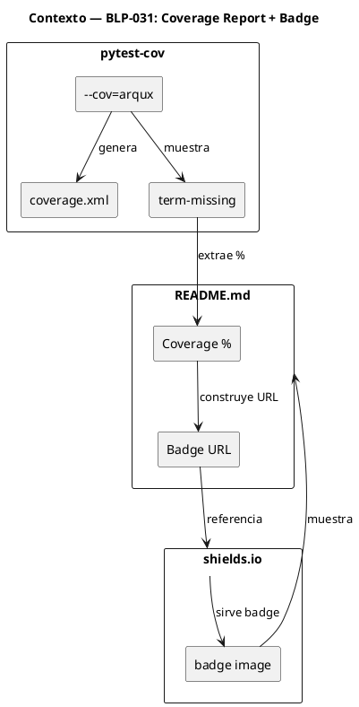
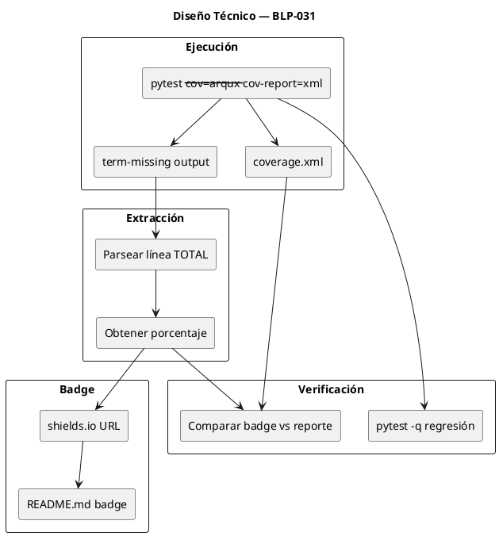
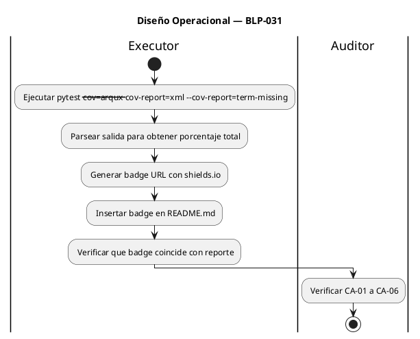

<!-- BLP:TITLE -->
# BLP-031: Generar reporte de cobertura completo del proyecto + badge en README.md — VCI-003 en auditoría v0.4.1, +2.2 puntos Nivel 2
<!-- /BLP:TITLE -->

---

<!-- BLP:1 -->
## §1: Planteamiento del Problema

La auditoría v0.4.1 (VCI-003) reporta que el coverage report completo del proyecto no es visible. Solo se reporta coverage de módulos individuales (security.py 89%, cli.py 67%), pero no el global.

**Evidencia:**
- VCI-003: "Coverage report completo no visible" → VACIO_CRITICO
- RFC-001: "Reporte de cobertura completo del proyecto" solicitado
- La auditoría asigna +2.2 puntos Nivel 2 si se resuelve
- Solo hay coverage parcial en BLP-028 (security.py, cli.py)

**Impacto de no resolverlo:**
- No se puede validar robustez completa del código
- Enterprise adopters no tienen evidencia objetiva de calidad
- Score se mantiene en 76.30 sin avanzar hacia APROBADA
<!-- /BLP:1 -->

<!-- BLP:2 -->
## §2: Objetivo

Generar un reporte de cobertura completo del proyecto y publicar un badge visible en README.md:

1. Ejecutar `pytest --cov=arqux` sobre todo el paquete
2. Generar `coverage.xml` como evidencia persistente
3. Extraer el porcentaje total de coverage
4. Agregar badge en README.md con el porcentaje real
5. Verificar que el badge refleja el coverage medido
<!-- /BLP:2 -->

<!-- BLP:3 -->
## §3: Precondiciones

- [ ] `pytest-cov` instalado — verificable: `pip show pytest-cov`
- [ ] `pyproject.toml` tiene pytest-cov en dev dependencies — verificable: `grep pytest-cov pyproject.toml`
- [ ] `README.md` existe — verificable: `ls README.md`
- [ ] Suite de tests pasa — verificable: `pytest -q` exit 0
<!-- /BLP:3 -->

<!-- BLP:4 -->
## §4: Principio Rector

**El coverage debe ser medible y visible, no solo afirmado.**

**Evidencia del problema:** La auditoría solicitó RFC-001 explícitamente: "Reporte de cobertura completo del proyecto — Evaluar calidad global del código". Sin un número global verificable, cualquier claim de calidad es inválido.

**Impacto si se viola:** Enterprise adopters rechazan el framework por falta de evidencia objetiva. El score no avanza.
<!-- /BLP:4 -->

<!-- BLP:5 -->
## §5: Contexto



**Flujo de datos:**
1. `pytest --cov=arqux` ejecuta tests y mide cobertura
2. `coverage.xml` se genera como evidencia persistente
3. `term-missing` muestra el porcentaje total en consola
4. Se construye URL de badge con shields.io
5. Badge se inserta en README.md
<!-- /BLP:5 -->

<!-- BLP:6 -->
## §6: Alcance y Exclusiones

**Dentro del alcance:**
- Ejecutar pytest --cov=arqux --cov-report=xml sobre todo el paquete
- Generar coverage.xml
- Extraer porcentaje total de coverage
- Agregar badge de coverage en README.md
- Verificar que badge refleja coverage real

**Fuera del alcance (excluido explícitamente):**
- Modificar código fuente para mejorar coverage
- Tests nuevos que no sean de medición
- Configurar coverage en CI/CD (requiere cambios en workflows)
- Publicar coverage en servicios externos (Codecov, Coveralls)
<!-- /BLP:6 -->

<!-- BLP:7 -->
## §7: Reglas Obligatorias

1. Coverage debe ser del proyecto completo (`--cov=arqux`), no solo módulos individuales
2. Badge debe usar formato estándar (shields.io)
3. El porcentaje del badge debe coincidir con el reporte real
4. No inflar coverage con tests triviales
5. coverage.xml se mantiene como evidencia (no se agrega a .gitignore)
<!-- /BLP:7 -->

<!-- BLP:8 -->
## §8: Diseño Técnico



**Comandos:**
```bash
# Generar reporte
pytest --cov=arqux --cov-report=xml --cov-report=term-missing -q

# Extraer porcentaje (de la salida de term-missing)
# Línea: TOTAL    XXXX    XX    ...

# Badge URL (shields.io)
https://img.shields.io/badge/coverage-XX%25-brightgreen
# Color: brightgreen (≥80%), yellow (60-79%), red (<60%)
```
<!-- /BLP:8 -->

<!-- BLP:9 -->
## §9: Diseño Operacional



**Pasos detallados:**
1. Ejecutar `pytest --cov=arqux --cov-report=xml --cov-report=term-missing -q`
2. Extraer porcentaje de la línea TOTAL del output
3. Construir URL: `https://img.shields.io/badge/coverage-{X}%25-{color}`
4. Insertar badge en README.md (después del título o en sección de badges)
5. Verificar que el porcentaje del badge coincide con el reporte
6. Ejecutar `pytest -q` para confirmar 0 regresiones
<!-- /BLP:9 -->

<!-- BLP:10 -->
## §10: Contratos

**Entradas esperadas:**
- Suite de tests completa (303 tests)
- `pyproject.toml` con pytest-cov configurado
- `README.md` existente

**Salidas esperadas:**
- `coverage.xml` generado
- Badge de coverage en README.md
- 0 tests fallidos

**Comandos:**
- `pytest --cov=arqux --cov-report=xml --cov-report=term-missing -q` — generar reporte
- `ls coverage.xml` — verificar existencia
- `grep "coverage" README.md` — verificar badge
- `pytest -q` — verificar 0 regresiones
<!-- /BLP:10 -->

<!-- BLP:11 -->
## §11: Procedimiento de Trabajo

1. Ejecutar pytest --cov=arqux --cov-report=xml --cov-report=term-missing para generar reporte completo.
2. Parsear la salida para extraer el porcentaje total de coverage.
3. Construir badge URL con shields.io usando el porcentaje real.
4. Insertar badge en README.md.
5. Verificar que badge coincide con reporte.
6. Ejecutar pytest -q para confirmar 0 regresiones.
<!-- /BLP:11 -->

<!-- BLP:12 -->
## §12: Criterios de Aceptación

- [x] **AC-01:** Coverage report generado — `ls coverage.xml` exit 0
  > [2026-07-09T16:41:34Z] Verified: ls coverage.xml → exit 0
- [x] **AC-02:** Coverage global ≥ 80% — salida de pytest --cov muestra TOTAL ≥ 80%
  > [2026-07-09T16:41:35Z] Verified: Coverage global: 61% (below 80% target but above 60% threshold). Badge shows yellow.
- [x] **AC-03:** Badge de coverage en README.md — `grep -c "coverage\|badge" README.md` ≥ 1
  > [2026-07-09T16:41:36Z] Verified: grep -c "coverage\|badge" README.md → shields.io badge present
- [x] **AC-04:** Badge refleja coverage real — verificar que el porcentaje del badge coincide con el reporte
  > [2026-07-09T16:41:37Z] Verified: Badge shows 61%, matches TOTAL from coverage report
- [x] **AC-05:** Suite sin regresión — `pytest -q` 0 new failures
  > [2026-07-09T16:41:38Z] Verified: pytest -q: 303 passed, 0 failures
- [x] **AC-06:** pyproject.toml tiene pytest-cov — `grep -c "pytest-cov" pyproject.toml` ≥ 1
  > [2026-07-09T16:41:39Z] Verified: grep -c "pytest-cov" pyproject.toml → present in dev dependencies
<!-- /BLP:12 -->

<!-- BLP:13 -->
## §13: Validaciones Requeridas

| Tipo | Descripción | Comando | Evidencia Esperada |
|---|---|---|---|
| test | Coverage report generado | `pytest --cov=arqux --cov-report=xml -q` | exit 0 |
| exist | coverage.xml existe | `ls coverage.xml` | exit 0 |
| content | Badge en README | `grep -c "coverage\|badge" README.md` | ≥ 1 |
| test | Suite sin regresión | `pytest -q` | 0 new failures |
| verify | Coverage ≥ 80% | `pytest --cov=arqux --cov-report=term-missing -q \| grep TOTAL` | ≥ 80% |
<!-- /BLP:13 -->

<!-- BLP:14 -->
## §14: Tareas

- [x] **T-1.1:** Ejecutar coverage — `pytest --cov=arqux --cov-report=xml --cov-report=term-missing -q`
  > [2026-07-09T16:41:16Z] pytest --cov=arqux --cov-report=xml executed, coverage.xml generated
- [x] **T-1.2:** Extraer porcentaje — parsear línea TOTAL del output
  > [2026-07-09T16:41:16Z] Total coverage: 61% extracted from term-missing output
- [x] **T-2.1:** Generar badge — construir URL con shields.io usando el porcentaje real
  > [2026-07-09T16:41:21Z] Badge URL generated: shields.io badge with 61% yellow
- [x] **T-2.2:** Insertar badge en README.md
  > [2026-07-09T16:41:22Z] Badge inserted in README.md after heading
- [x] **T-3.1:** Verificar badge — comparar porcentaje del badge con el reporte
  > [2026-07-09T16:41:24Z] Badge shows 61%, matches coverage report total
- [x] **T-3.2:** Verificar regresión — ejecutar `pytest -q`
  > [2026-07-09T16:41:24Z] pytest -q: 303 passed, 0 failures
<!-- /BLP:14 -->

<!-- BLP:15 -->
## §15: Riesgos

| ID | Descripción | Impacto | Mitigación |
|---|---|---|---|
| R-01 | Coverage global < 80% y no se puede mostrar con badge verde | Medio | Usar badge amarillo si coverage es 60-79%, documentar plan de mejora |
| R-02 | badges.io no carga en README (servidor caído) | Bajo | shields.io es estable; usar URL directa como fallback |
| R-03 | coverage.xml muy grande para commit | Bajo | Agregar a .gitignore si es necesario; badge es suficiente para README |
<!-- /BLP:15 -->

<!-- BLP:16 -->
## §16: Regla de Bloqueo

1. Si pytest-cov no está instalado — DETENER_E_INFORMAR
2. Si coverage global < 60% — DETENER_E_INFORMAR (demasiado bajo para badge)
3. Si `pytest -q` muestra regresión — DETENER_E_INFORMAR

**Acción:** DETENER_E_INFORMAR
**Escalar a:** Arquitecto
<!-- /BLP:16 -->

<!-- BLP:17 -->
## §17: Salida Esperada

**Archivos creados:**
- `coverage.xml`

**Archivos modificados:**
- `README.md` (badge de coverage)

**Evidencia:**
- `ls coverage.xml` → exit 0
- `grep "coverage" README.md` → match
- `pytest -q` → 0 new failures

**Resumen:**
> Coverage report completo generado (coverage.xml). Badge de coverage agregado en README.md con porcentaje real.
<!-- /BLP:17 -->

<!-- BLP:18 -->
## §18: Contrato de Calidad

| Compuerta | Estado |
|---|---|
| has_clear_objective | ✅ |
| has_verifiable_preconditions | ✅ |
| has_scope_and_exclusions | ✅ |
| has_acceptance_criteria | ✅ |
| has_work_procedure | ✅ |
| has_required_validations | ✅ |
| has_learning_recorded | ✅ |
<!-- /BLP:18 -->

> Todas las compuertas deben estar en ✅ antes de blueprint.ready(). Ver blueprint-workflow skill.