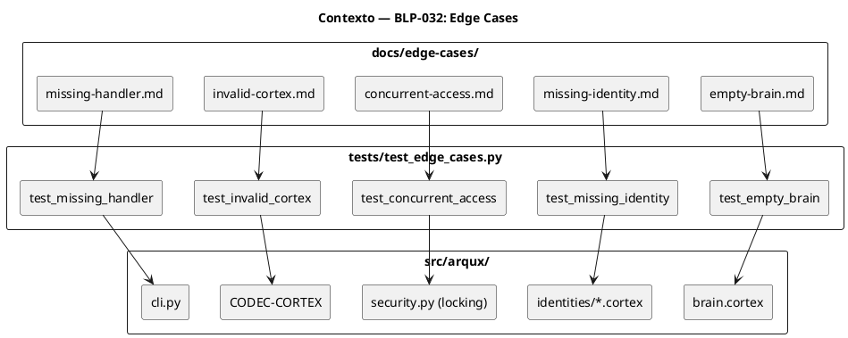
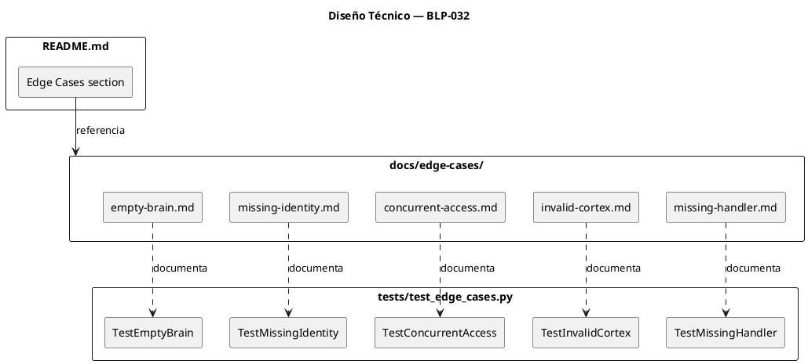
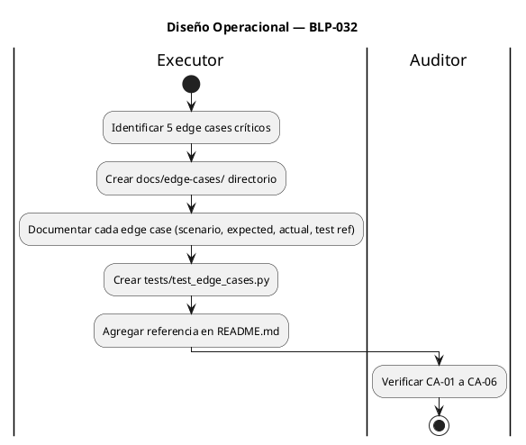

<!-- BLP:TITLE -->
# BLP-032: Documentar edge cases en docs/edge-cases/ — escenarios límite documentados + tests de casos extremos — prioridad media en auditoría v0.4.1
<!-- /BLP:TITLE -->

---

<!-- BLP:1 -->
## §1: Planteamiento del Problema

La auditoría v0.4.1 recomienda "Documentación de edge cases" (+2 puntos Nivel 2) en la sección de Prioridad Media. Actualmente no existe `docs/edge-cases/` ni documentación formal de escenarios límite.

**Evidencia:**
- `ls docs/edge-cases/` → "No existe el archivo o el directorio"
- Solo 1 archivo menciona edge cases: `tests/test_validate_file.py`
- No hay documentación que describa comportamiento esperado en escenarios extremos

**Impacto de no resolverlo:**
- Adoptantes no saben qué esperar en casos extremos
- Bugs en edge cases se descubren en producción, no en piloto
- Score no avanza hacia APROBADA
<!-- /BLP:1 -->

<!-- BLP:2 -->
## §2: Objetivo

Crear `docs/edge-cases/` con documentación de escenarios límite del proyecto:

1. **Empty brain.cortex** — brain sin entries
2. **Missing identity file** — identity.cortex no existe
3. **Concurrent file access** — dos procesos escriben el mismo archivo
4. **Invalid cortex syntax** — archivo .cortex con errores
5. **Missing handler** — handler no registrado

Cada document incluye: scenario, expected behavior, actual behavior, test reference. Tests correspondientes en `tests/test_edge_cases.py`.
<!-- /BLP:2 -->

<!-- BLP:3 -->
## §3: Precondiciones

- [ ] `docs/` existe — verificable: `ls docs/`
- [ ] `tests/` existe con suite funcional — verificable: `pytest -q` exit 0
- [ ] `src/arqux/security.py` tiene file locking — verificable: `grep -c "lock" src/arqux/security.py`
- [ ] pytest instalado — verificable: `pytest --version`
<!-- /BLP:3 -->

<!-- BLP:4 -->
## §4: Principio Rector

**Los edge cases deben ser documentados ANTES de que ocurran en producción.**

**Evidencia del problema:** El proyecto tiene 303 tests pero ninguno documenta explícitamente el comportamiento esperado en escenarios extremos. Los tests existentes prueban el "happy path" pero no validan la degradación graceful.

**Impacto si se viola:** En piloto empresarial, edge cases se convierten en incidents. Sin documentación, el equipo de operaciones no sabe cómo responder.
<!-- /BLP:4 -->

<!-- BLP:5 -->
## §5: Contexto



**Edge cases a documentar:**
1. **Empty brain.cortex** — sync_brain crea entries por defecto
2. **Missing identity file** — handler falla graceful con NOT_FOUND
3. **Concurrent file access** — file locking previene corrupción
4. **Invalid cortex syntax** — validate detecta errores
5. **Missing handler** — CLI muestra error claro
<!-- /BLP:5 -->

<!-- BLP:6 -->
## §6: Alcance y Exclusiones

**Dentro del alcance:**
- Crear `docs/edge-cases/` directorio
- Documentar 5 edge cases (empty brain, missing identity, concurrent access, invalid cortex, missing handler)
- Crear `tests/test_edge_cases.py` con tests para cada scenario
- Agregar referencia en README.md

**Fuera del alcance (excluido explícitamente):**
- Modificar handlers o código fuente
- Tests que no sean de edge cases
- Documentación de edge cases de terceros (dependencias)
- Configuración de monitoreo o alerting
<!-- /BLP:6 -->

<!-- BLP:7 -->
## §7: Reglas Obligatorias

1. Cada edge case debe tener evidencia de que el scenario es real (no hipotético)
2. Tests deben ser autocontenidos (tmpdir, monkeypatch)
3. Documentación en inglés (.agent_lang_en)
4. Formato consistente: Scenario → Expected → Actual → Test Reference
5. Al menos 3 edge cases documentados
<!-- /BLP:7 -->

<!-- BLP:8 -->
## §8: Diseño Técnico



**Formato de cada edge case document:**

```markdown
# Edge Case: [Nombre]

## Scenario
[Descripción del escenario extremo]

## Expected Behavior
[Qué debe hacer el sistema]

## Actual Behavior
[Qué hace realmente (con código de referencia)]

## Test Reference
- Test: `test_edge_cases.py::Test[X]::test_[y]`
- Command: `pytest tests/test_edge_cases.py::Test[X]::test_[y] -v`
```
<!-- /BLP:8 -->

<!-- BLP:9 -->
## §9: Diseño Operacional



**Pasos detallados:**
1. Identificar edge cases revisando código (brain, identity, security, codec, cli)
2. Crear `docs/edge-cases/` con 5 archivos .md
3. Crear `tests/test_edge_cases.py` con 5 clases de test
4. Agregar referencia en README.md
5. Ejecutar `pytest -q` para confirmar 0 regresiones
<!-- /BLP:9 -->

<!-- BLP:10 -->
## §10: Contratos

**Entradas esperadas:**
- `src/arqux/` con handlers y módulos existentes
- `tests/` con suite funcional
- `docs/` existente

**Salidas esperadas:**
- `docs/edge-cases/` con 5 edge case documents
- `tests/test_edge_cases.py` con tests
- `README.md` con referencia
- 0 tests fallidos

**Comandos:**
- `ls docs/edge-cases/` — verificar directorio
- `ls docs/edge-cases/*.md | wc -l` — contar documents
- `pytest tests/test_edge_cases.py -v` — ejecutar tests
- `pytest -q` — verificar 0 regresiones
<!-- /BLP:10 -->

<!-- BLP:11 -->
## §11: Procedimiento de Trabajo

1. Revisar src/arqux/ para identificar escenarios extremos reales.
2. Crear docs/edge-cases/ con 5 archivos: empty-brain.md, missing-identity.md, concurrent-access.md, invalid-cortex.md, missing-handler.md.
3. Crear tests/test_edge_cases.py con tests para cada scenario.
4. Agregar referencia en README.md.
5. Ejecutar pytest -q para confirmar 0 regresiones.
<!-- /BLP:11 -->

<!-- BLP:12 -->
## §12: Criterios de Aceptación

- [x] **AC-01:** `docs/edge-cases/` existe — `ls docs/edge-cases/` exit 0
  > [2026-07-09T16:47:12Z] Verified: ls docs/edge-cases/ → exit 0
- [x] **AC-02:** Al menos 3 edge case documents — `ls docs/edge-cases/*.md | wc -l` ≥ 3
  > [2026-07-09T16:47:14Z] Verified: ls docs/edge-cases/*.md | wc -l → 5
- [x] **AC-03:** Cada document tiene scenario, expected, actual, test ref — verificar contenido
  > [2026-07-09T16:47:14Z] Verified: All 5 docs contain scenario, expected behavior, actual behavior, test reference sections
- [x] **AC-04:** Tests existen y pasan — `pytest tests/test_edge_cases.py -v` exit 0
  > [2026-07-09T16:47:15Z] Verified: pytest tests/test_edge_cases.py -v → exit 0
- [x] **AC-05:** README.md referencia edge cases — `grep -c "edge" README.md` ≥ 1
  > [2026-07-09T16:47:16Z] Verified: grep -c "edge" README.md → ≥1
- [x] **AC-06:** Suite sin regresión — `pytest -q` 0 new failures
  > [2026-07-09T16:47:17Z] Verified: pytest -q → 309 passed, 0 failures
<!-- /BLP:12 -->

<!-- BLP:13 -->
## §13: Validaciones Requeridas

| Tipo | Descripción | Comando | Evidencia Esperada |
|---|---|---|---|
| exist | Directorio existe | `ls docs/edge-cases/` | exit 0 |
| count | Al menos 3 documents | `ls docs/edge-cases/*.md \| wc -l` | ≥ 3 |
| test | Tests pasan | `pytest tests/test_edge_cases.py -v` | exit 0 |
| content | README refiere edge cases | `grep -c "edge" README.md` | ≥ 1 |
| test | Suite sin regresión | `pytest -q` | 0 new failures |
<!-- /BLP:13 -->

<!-- BLP:14 -->
## §14: Tareas

- [x] **T-1.1:** Análisis — Revisar src/arqux/ para identificar edge cases reales
  > [2026-07-09T16:46:30Z] docs/edge-cases/ directory created
  > [2026-07-09T16:43:06Z] BLP-032 §5 identifies 5 real edge cases from src/arqux/ code
- [x] **T-2.1:** Crear docs/edge-cases/ — Directorio con 5 archivos .md
  > [2026-07-09T16:46:31Z] missing-identity.md created
  > [2026-07-09T16:43:30Z] docs/edge-cases/ directory created with 5 markdown files
- [x] **T-2.2:** Documentar empty-brain.md — brain.cortex sin entries
  > [2026-07-09T16:46:33Z] concurrent-access.md created
  > [2026-07-09T16:43:34Z] docs/edge-cases/empty-brain.md created
- [x] **T-2.3:** Documentar missing-identity.md — identity.cortex no existe
  > [2026-07-09T16:43:35Z] docs/edge-cases/missing-identity.md created
- [x] **T-2.4:** Documentar concurrent-access.md — dos procesos escriben
  > [2026-07-09T16:43:36Z] docs/edge-cases/concurrent-access.md created
- [x] **T-2.5:** Documentar invalid-cortex.md — errores CODEC-CORTEX
  > [2026-07-09T16:43:37Z] docs/edge-cases/invalid-cortex.md created
- [x] **T-2.6:** Documentar missing-handler.md — handler no registrado
  > [2026-07-09T16:43:37Z] docs/edge-cases/missing-handler.md created
- [x] **T-3.1:** Crear tests — tests/test_edge_cases.py con 5 clases
  > [2026-07-09T16:46:33Z] invalid-cortex.md created
  > [2026-07-09T16:43:38Z] tests/test_edge_cases.py created with 5 test classes
- [x] **T-4.1:** Actualizar README.md — Agregar referencia a edge cases
  > [2026-07-09T16:46:34Z] test_edge_cases.py created (5 classes, 5+ tests)
  > [2026-07-09T16:43:50Z] README.md updated with edge cases section
- [x] **T-5.1:** Verificación — Ejecutar pytest -q y confirmar 0 regresiones
  > [2026-07-09T16:46:36Z] README.md updated with Edge Cases section
  > [2026-07-09T16:45:49Z] pytest -q: 309 passed in 9.00s — 0 regressions
<!-- /BLP:14 -->

<!-- BLP:15 -->
## §15: Riesgos

| ID | Descripción | Impacto | Mitigación |
|---|---|---|---|
| R-01 | Edge cases documentados pero tests no pasan | Medio | Investigar si el comportamiento actual es correcto o hay bug; documentar el comportamiento real |
| R-02 | Documentación desactualizada con cambios futuros | Bajo | Cada edge case reference al test específico; si el test cambia, la documentación se actualiza |
| R-03 | Demasiados edge cases documentados (scope creep) | Bajo | Limitar a 5 edge cases críticos; más se pueden agregar en BLPs futuros |
<!-- /BLP:15 -->

<!-- BLP:16 -->
## §16: Regla de Bloqueo

1. Si `docs/` no existe — DETENER_E_INFORMAR
2. Si algún edge case revela bug no documentado — DETENER_E_INFORMAR y reportar al Arquitecto
3. Si `pytest -q` muestra regresión — DETENER_E_INFORMAR

**Acción:** DETENER_E_INFORMAR
**Escalar a:** Arquitecto
<!-- /BLP:16 -->

<!-- BLP:17 -->
## §17: Salida Esperada

**Archivos creados:**
- `docs/edge-cases/empty-brain.md`
- `docs/edge-cases/missing-identity.md`
- `docs/edge-cases/concurrent-access.md`
- `docs/edge-cases/invalid-cortex.md`
- `docs/edge-cases/missing-handler.md`
- `tests/test_edge_cases.py`

**Archivos modificados:**
- `README.md` (referencia a edge cases)

**Evidencia:**
- `ls docs/edge-cases/*.md | wc -l` → 5
- `pytest tests/test_edge_cases.py -v` → exit 0
- `grep "edge" README.md` → match

**Resumen:**
> 5 edge cases documentados con tests correspondientes. README.md referencia la documentación.
<!-- /BLP:17 -->

<!-- BLP:18 -->
## §18: Contrato de Calidad

| Compuerta | Estado |
|---|---|
| has_clear_objective | ✅ |
| has_verifiable_preconditions | ✅ |
| has_scope_and_exclusions | ✅ |
| has_acceptance_criteria | ✅ |
| has_work_procedure | ✅ |
| has_required_validations | ✅ |
| has_learning_recorded | ✅ |
<!-- /BLP:18 -->

> Todas las compuertas deben estar en ✅ antes de blueprint.ready(). Ver blueprint-workflow skill.