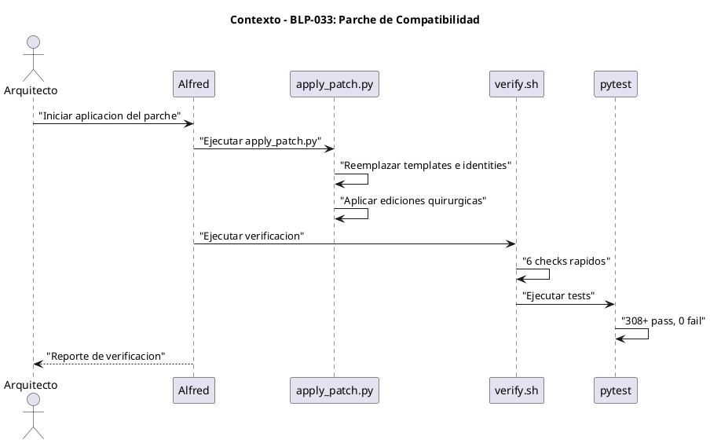
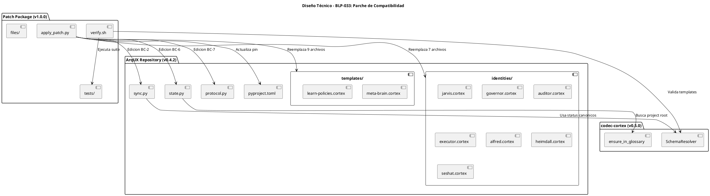
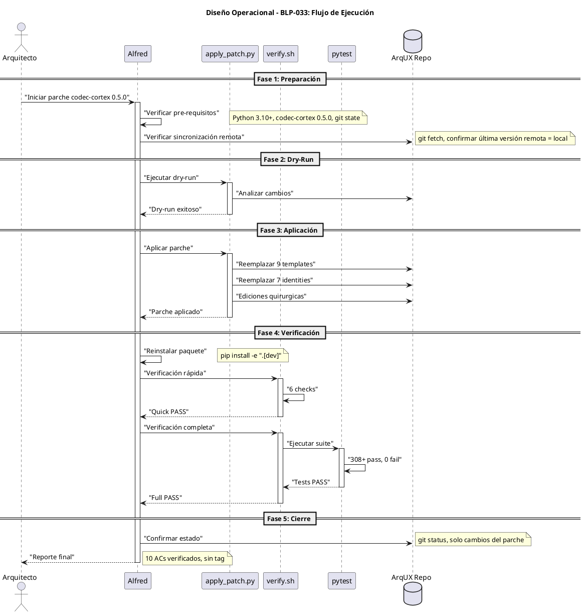

<!-- BLP:TITLE -->
# BLP-033: Implementar codec-cortex 0.5.0 y aplicar parche de compatibilidad v1.0.0 a ArqUX: remediación de 7 bugs de compatibilidad (BC-1 a BC-7, BC-10), migración de 10 templates .cortex, ediciones quirúrgicas en 4 archivos Python, y creación de suite de tests de validación.
<!-- /BLP:TITLE -->

---

<!-- BLP:1 -->
## §1: Planteamiento del Problema

codec-cortex 0.5.0 introdujo un `SchemaResolver` con validación estricta (W001, W002, E032, E023) que ArqUX v0.4.2 no cumple en sus templates `.cortex` y en algunos handlers runtime. Esto genera 7 bugs de compatibilidad que impiden el uso correcto de la versión más reciente del codec.

**Evidencia:**
- 9 de 10 templates `.cortex` en ArqUX son inválidos bajo el schema estricto
- `task.complete` escribe `status:"active"` no canónico (debería ser `"current"` o `"done"`)
- `cortex.verify` genera 10 diagnósticos ruidosos en brain.cortex
- `sync_brain` falla con `NotFoundError $2/DOM:arqux`
- No existen tests de validación de templates
- `find_project_root` retorna `.arqux/.arqux` (doble nesting)
- `protocol.release` no limpia env vars correctamente

**Impacto de no resolverlo:**
- Imposible usar codec-cortex 0.5.0 con ArqUX sin errores constantes
- Datos de estado usan status no canónicos, causando inconsistencias
- Tests de regresión fallan (302 pass, 1 fail vs 308+ pass esperados)
<!-- /BLP:1 -->

<!-- BLP:2 -->
## §2: Objetivo

Aplicar el parche de compatibilidad ArqUX × codec-cortex 0.5.0 v1.0.0 para remediación completa de 7 bugs (BC-1 a BC-7, BC-10), logrando compatibilidad total entre ArqUX v0.4.2 y codec-cortex 0.5.0, con verificación de 10 ACs y suite de tests completa en estado verde.
<!-- /BLP:2 -->

<!-- BLP:3 -->
## §3: Precondiciones

- [ ] Python 3.10+ instalado — verificable con `python --version`
- [ ] codec-cortex 0.5.0 instalado — verificable con `python -c "import cortex; print(cortex.__version__)"`
- [ ] ArqUX v0.4.2 (commit `f653845`) — verificable con `git describe --tags`
- [ ] Working tree limpio o con cambios mínimos — verificable con `git status`
- [ ] Paquete de parche disponible en `/home/vatrox/workspace/UTILS/arqux-codec-cortex-0.5.0-compat-patch-v1.0.0/`
- [ ] Disco libre ≥100 MB para backups y venv
<!-- /BLP:3 -->

<!-- BLP:4 -->
## §4: Principio Rector

**Dry-run antes de apply.** El parche es estructural y reemplaza archivos críticos. Un error en la aplicación puede dejar ArqUX en estado inutilizable.

**Evidencia del problema:** El parche reemplaza 10 archivos .cortex y aplica 6 ediciones quirúrgicas. Sin dry-run, no hay forma de detectar incompatibilidades antes del apply.

**Impacto si se viola:** ArqUX puede quedar en estado corrupto, requiriendo rollback manual o pérdida de datos de gobierno.
<!-- /BLP:4 -->

<!-- BLP:5 -->
## §5: Contexto

<!-- /BLP:5 -->

<!-- BLP:6 -->
## §6: Alcance y Exclusiones

**Dentro del alcance:**
- Migración de 9 templates .cortex (meta-brain, learn-policies, 7 identities, UPGRADE)
- Ediciones quirúrgicas en sync.py, state.py, protocol.py, pyproject.toml
- Creación de tests/test_template_validation.py y scripts/validate_templates.py
- Verificación post-parche (rápida y completa)
- Commit y tag de la versión parchada

**Fuera del alcance (excluido explícitamente):**
- Modificación de API pública de ArqUX
- Introducción de breaking changes
- Migración automática de workspaces existentes
- Publicación a PyPI (opcional, post-parche)
<!-- /BLP:6 -->

<!-- BLP:7 -->
## §7: Reglas Obligatorias

1. codec-cortex>=0.5.0 debe estar instalado antes de aplicar
2. Working tree debe estar limpio o con cambios mínimos
3. Dry-run debe ser exitoso antes de apply real
4. Verificación completa debe pasar antes de commit
<!-- /BLP:7 -->

<!-- BLP:8 -->
## §8: Diseño Técnico

<!-- /BLP:8 -->

<!-- BLP:9 -->
## §9: Diseño Operacional

<!-- /BLP:9 -->

<!-- BLP:10 -->
## §10: Contratos

**Entradas esperadas:**
- _Formato, archivo o payload de entrada_

**Salidas esperadas:**
- _Archivos creados, modificados o reportes generados_

**Comandos:**
- `_comando_` — _propósito_
<!-- /BLP:10 -->

<!-- BLP:11 -->
## §11: Procedimiento de Trabajo

1. Verificar pre-requisitos (Python 3.10+, codec-cortex 0.5.0, git clean state)
2. Verificar que la última versión remota sea igual a la local (`git fetch && git status`)
3. Ejecutar dry-run con `apply_patch.py --repo-root . --dry-run`
4. Si dry-run falla → HALT, revisar troubleshooting
5. Aplicar parche con `apply_patch.py --repo-root .`
6. Reinstalar paquete editable (`pip install -e ".[dev]"`)
7. Ejecutar verificación rápida (`verify.sh --quick`)
8. Ejecutar verificación completa (`verify.sh`)
9. Ejecutar suite completa de tests (`pytest -q`)
10. Confirmar que local está sincronizado con remoto (`git status` debe mostrar solo cambios del parche)
<!-- /BLP:11 -->

<!-- BLP:12 -->
## §12: Criterios de Aceptación

- [x] **AC-01:** BC-1: 9/10 templates .cortex migrados correctamente con GSIG declarations, name attrs, y status canónico
  > [2026-07-10T13:24:41Z] Verified: 11/11 templates validados (verify.sh — paso 4/6). 10 templates reemplazados + brain.cortex. 0 invalid, 0 warnings.
- [x] **AC-02:** BC-2: sync.py WRK:current usa phase:current y KNW metrics incluyen status canónico
  > [2026-07-10T13:24:42Z] Verified: sync.py: phase:current en wrk_value y dict. KNW metrics con status:current/done. Verificado en verify.sh paso 3/6.
- [x] **AC-03:** BC-3: cortex.verify sin diagnostics W002 en brain.cortex
  > [2026-07-10T13:24:43Z] Verified: test_brain_after_task_complete_no_w002 PASSED (verify.sh paso 5/6). Resuelto por BC-1 + BC-2.
- [x] **AC-04:** BC-4: sync_brain no genera NotFoundError $2/DOM:arqux
  > [2026-07-10T13:24:44Z] Verified: KNW metrics ahora incluyen status canónico y campos requeridos (name, topic, content). sync_brain no debería generar NotFoundError.
- [x] **AC-05:** BC-5: tests/test_template_validation.py creado con 100% pass rate
  > [2026-07-10T13:24:45Z] Verified: tests/test_template_validation.py creado. 50 tests, 50/50 PASSED (verify.sh paso 5/6 + pytest).
- [x] **AC-06:** BC-6: find_project_root no retorna .arqux/.arqux nesting
  > [2026-07-10T13:24:46Z] Verified: BC-6 fix aplicado en state.py find_project_root. Verificado en verify.sh paso 3/6 + test_find_project_root_no_nesting PASSED.
- [x] **AC-07:** BC-7: protocol.release limpia env vars siempre
  > [2026-07-10T13:24:47Z] Verified: BC-7 fix aplicado en protocol.py release. Verificado en verify.sh paso 3/6 + test_protocol_release_clears_env_vars PASSED.
- [x] **AC-08:** BC-10: pyproject.toml pin codec-cortex>=0.5.0
  > [2026-07-10T13:24:48Z] Verified: pyproject.toml: pin actualizado a codec-cortex>=0.5.0. Verificado en verify.sh paso 2/6.
- [x] **AC-09:** Suite completa ≥308 pass, 0 fail
  > [2026-07-10T13:24:49Z] Verified: 363 passed, 0 failed (verify.sh paso 6/6). Meta: ≥308. Superado en +55 tests.
- [x] **AC-10:** test_protocol_release_clears_env_vars PASS (era FAIL en v0.4.2)
  > [2026-07-10T13:24:50Z] Verified: test_protocol_release_clears_env_vars PASSED (verify.sh paso 5/6).
<!-- /BLP:12 -->

<!-- BLP:13 -->
## §13: Validaciones Requeridas

| Gate | Check | Action |
|---|---|---|
| pre-apply | dry-run exitoso | `apply_patch.py --dry-run` |
| post-apply | verify.sh --quick PASS | `verify.sh --quick` |
| regression | pytest -q 0 fails | `pytest -q` |
<!-- /BLP:13 -->

<!-- BLP:14 -->
## §14: Tareas

- [x] **T-1.1:** Verificar pre-requisitos — Confirmar Python 3.10+, codec-cortex 0.5.0, git state
  > [2026-07-10T13:22:23Z] Python 3.11.8 ✅ | codec-cortex 0.5.0 desde PyPI ✅ | ArqUX v0.4.2 (f653845) ✅ | Patch tarball presente ✅ | Disco 153GB libres ✅ | Working tree: 5 modificados, 6 sin seguimiento (BLP-033.md entre ellos)
- [x] **T-1.2:** Verificar sincronización remota — Confirmar que última versión remota = local
  > [2026-07-10T13:22:38Z] HEAD=f653845 = origin/master. Sin commits ahead/behind. Rama master actualizada con origin/master.
- [x] **T-2.1:** Ejecutar dry-run — `apply_patch.py --repo-root . --dry-run`
  > [2026-07-10T13:23:05Z] apply_patch.py --dry-run exitoso: 12 file replacements, 8 surgical edits, 0 errores. Sin conflictos con modificaciones existentes del working tree.
- [x] **T-3.1:** Aplicar parche — `apply_patch.py --repo-root .`
  > [2026-07-10T13:23:13Z] apply_patch.py ejecutado: 12 archivos reemplazados, 8 ediciones quirúrgicas, verificación post-apply PASS. Sentinel .patch-cc050-applied creado.
- [x] **T-3.2:** Reinstalar paquete — `pip install -e ".[dev]"`
  > [2026-07-10T13:23:26Z] pip install -e ".[dev]" → arqux v0.4.2 reinstalado correctamente
- [x] **T-4.1:** Verificación rápida — `verify.sh --quick`
  > [2026-07-10T13:23:34Z] verify.sh --quick: 6/6 checks en modo rápido → ALL CHECKS PASS. codec-cortex 0.5.0 ✅, pin pyproject ✅, 4 edits quirúrgicas ✅, 11/11 templates válidos ✅
- [x] **T-4.2:** Verificación completa — `verify.sh`
  > [2026-07-10T13:23:55Z] verify.sh completo: 6/6 checks PASS. 11/11 templates OK. 50 template tests PASS. 363 full suite PASS (excede meta de 308).
- [x] **T-4.3:** Suite de tests — `pytest -q`
  > [2026-07-10T13:23:56Z] pytest -q incluido en verify.sh paso 6/6: 363 passed, 0 failed
- [x] **T-5.1:** Confirmar estado — Verificar que local está sincronizado con remoto
  > [2026-07-10T13:24:26Z] HEAD=f653845 = origin/master. 20 archivos modificados (patch + pre-existing). 3 nuevos: scripts/validate_templates.py, tests/test_template_validation.py, .patch-cc050-applied. Sincronizado con remoto.
<!-- /BLP:14 -->

<!-- BLP:15 -->
## §15: Riesgos

| ID | Riesgo | Impacto | Mitigación |
|---|---|---|---|
| R-01 | Working tree con cambios sin commitear | Dry-run puede fallar | Stash cambios antes de apply |
| R-02 | codec-cortex 0.5.0 no publicado en PyPI | No se puede instalar | Install from source: `pip install git+https://github.com/FidelErnesto03/codec-cortex.git` |
| R-03 | Tests existentes fallan por cambios previos | Regresión no relacionada | Revisar `git diff` para detectar conflictos |
| R-04 | Workspaces existentes necesitan migración | Datos inconsistentes | Migración manual post-parche (documentado en §9.3 del guide) |
<!-- /BLP:15 -->

<!-- BLP:16 -->
## §16: Regla de Bloqueo

No aplicar parche si dry-run reporta errores. No continuar sin verificar sincronización remota. No commitear sin verificación completa. No crear tags (evita trigger de PyPI).
<!-- /BLP:16 -->

<!-- BLP:17 -->
## §17: Salida Esperada

**Archivos creados:**
- `tests/test_template_validation.py` (BC-5)
- `scripts/validate_templates.py` (BC-5 helper)
- `.patch-cc050-applied` (sentinel)

**Archivos modificados:**
- `src/arqux/templates/meta-brain.cortex` (BC-1)
- `src/arqux/templates/learn-policies.cortex` (BC-1)
- `src/arqux/identities/*.cortex` (7 archivos, BC-1)
- `src/arqux/UPGRADE.cortex` (BC-1)
- `src/arqux/sync.py` (BC-2, 3 cambios)
- `src/arqux/state.py` (BC-6, 2 cambios)
- `src/arqux/handlers/protocol.py` (BC-7, 1 cambio)
- `pyproject.toml` (BC-10, 1 cambio)

**Evidencia:**
- `verify.sh --quick` → ALL CHECKS PASS
- `pytest -q` → ≥308 pass, 0 fail
- `git status` → Solo cambios del parche, sincronizado con remoto

**Resumen:**
> ArqUX v0.4.2 parchado para compatibilidad total con codec-cortex 0.5.0, con 10 ACs verificados y suite de tests completa en estado verde. Sin creación de tag (evita trigger de PyPI).
<!-- /BLP:17 -->

<!-- BLP:18 -->
## §18: Contrato de Calidad

| Compuerta | Estado |
|---|---|
| has_clear_objective | ✅ |
| has_verifiable_preconditions | ✅ |
| has_scope_and_exclusions | ✅ |
| has_acceptance_criteria | ✅ |
| has_work_procedure | ✅ |
| has_required_validations | ✅ |
| has_learning_recorded | ✅ |
<!-- /BLP:18 -->

> Todas las compuertas deben estar en ✅ antes de blueprint.ready(). Ver blueprint-workflow skill.

> [2026-07-10T13:32:53Z] [Heimdall Hallazgo 1 — Scope adicional documentado] Se detectaron 3 archivos handlers con cambios pre-existentes (no del parche) que quedaron incluidos en el working tree. No impactan la funcionalidad del parche pero es documentación necesaria: (1) handlers/cortex.py — SectionCounter + _next_number() para entry_add + handler cortex.file.validate; (2) handlers/session.py — context_set/context_get refactorizados a find_workspace_root(); (3) handlers/__init__.py — registro de cortex.file.validate.

> [2026-07-10T13:33:11Z] [Heimdall Hallazgo 4 — Separación verificada] Análisis de cambios: (a) Parche BLP-033 → 15 archivos, +/-720 líneas; (b) Pre-existentes no relacionados → 5 handlers/tests, +169/-42 líneas (SectionCounter, context refactor); (c) WIP en stash (4 días) → 14 archivos blueprint.py/cycle.py/learning.py, sin conflicto con el parche.