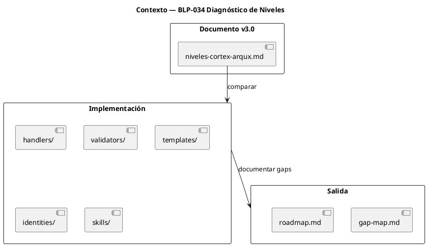
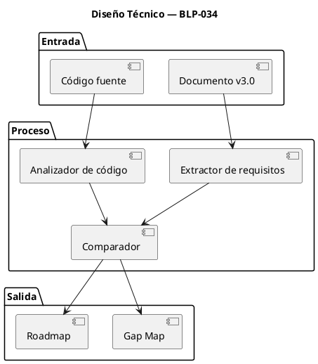
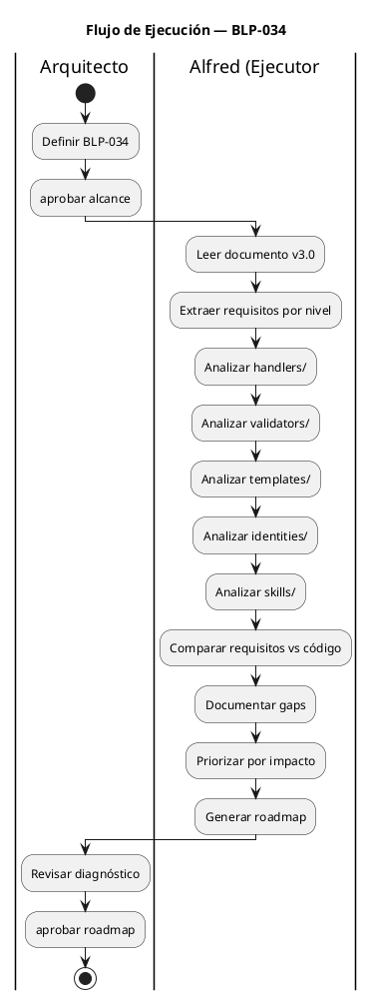

<!-- BLP:TITLE -->
# BLP-034: Diagnosticar correspondencia entre niveles documentados (v3.0) y implementación actual en ArqUX. Identificar gaps entre teoría y práctica.
<!-- /BLP:TITLE -->

---

<!-- BLP:1 -->
## §1: Planteamiento del Problema

El documento `niveles-cortex-arqux.md` v3.0 establece 4 niveles claros:
- Level 0 = PACKAGE (Personal Library + paquetes de lecciones)
- Level 1 = BEHAVIORAL (Identidad - no modificable directamente)
- Level 2 = SKILL (Procedimental - nativa o heredada)
- Level 3 = BRAIN (Estado del proyecto)

Sin embargo, la implementación actual en el código fuente puede no reflejar esta nueva estructura.

**Evidencia:**
- El documento fue actualizado hoy (2026-07-10) con nueva definición de niveles
- Los handlers, validadores y templates pueden seguir la estructura anterior
- No existe un mapeo documentado entre requisitos y implementación

**Impacto de no resolverlo:**
- Inconsistencia entre documentación y código
- Errores de validación incorrectos
- Handlers que no funcionan como se espera
- Skills que no se cargan correctamente
<!-- /BLP:1 -->

<!-- BLP:2 -->
## §2: Objetivo

Generar un **gap map completo** que muestre la correspondencia entre los 4 niveles documentados (v3.0) y la implementación actual en el código fuente de ArqUX.

El diagnóstico debe producir:
1. **Matriz de correspondencia**: Nivel documentado ↔ Componente implementado
2. **Lista de gaps**: Qué falta, qué sobra, qué está mal
3. **Priorización**: Impacto de cada gap en el funcionamiento actual
4. **Roadmap**: Orden de corrección recomendado
<!-- /BLP:2 -->

<!-- BLP:3 -->
## §3: Precondiciones

- [ ] Documento `niveles-cortex-arqux.md` v3.0 existe y está actualizado
- [ ] Directorio `src/arqux/` existe con handlers, validators, templates
- [ ] Directorio `.arqux/skills/` existe con skills actuales
- [ ] Directorio `.arqux/identities/` existe con identidades de agentes
<!-- /BLP:3 -->

<!-- BLP:4 -->
## §4: Principio Rector

**"La documentación es la fuente de verdad. El código debe ajustarse a ella, no al revés."**

**Evidencia del problema:** 
- El documento v3.0 define requisitos claros para cada nivel
- Si el código no cumple estos requisitos, hay un bug de gobernanza

**Impacto si se viola:**
- Los agentes no podrán cargar identidades correctamente
- Los validadores rechazarán archivos válidos
- Las skills no se cargarán en el formato esperado
<!-- /BLP:4 -->

<!-- BLP:5 -->
## §5: Contexto

<!-- /BLP:5 -->

<!-- BLP:6 -->
## §6: Alcance y Exclusiones

**Dentro del alcance:**
- `src/arqux/handlers/` — Todos los handlers del sistema
- `src/arqux/validators/` — Validadores de niveles
- `src/arqux/templates/` — Templates de brain, meta-brain, etc.
- `.arqux/identities/` — Identidades de agentes (creadas por governor a solicitud del usuario)
- `.arqux/skills/` — Skills nativas
- `src/arqux/constants.py` — Constantes y definiciones

**Nota importante:** Las identidades y roles son creadas y administradas por el rol **governor** por solicitud del usuario. Este diagnóstico verifica que la infraestructura soporte esta operación.

**Fuera del alcance (excluido explícitamente):**
- Código de test (`tests/`)
- Documentación externa al proyecto
- Dependencias de terceros
- Código de ejemplo o demo
<!-- /BLP:6 -->

<!-- BLP:7 -->
## §7: Reglas Obligatorias

1. **No modificar código** — Este es un diagnóstico, no una corrección
2. **Documentar con evidencia** — Cada gap debe referenciar archivo y línea
3. **Priorizar por impacto** — Clasificar gaps: crítico, alto, medio, bajo
4. **Mantener neutralidad** — Reportar tal como está, no como debería estar
<!-- /BLP:7 -->

<!-- BLP:8 -->
## §8: Diseño Técnico

<!-- /BLP:8 -->

<!-- BLP:9 -->
## §9: Diseño Operacional

<!-- /BLP:9 -->

<!-- BLP:10 -->
## §10: Contratos

**Entradas esperadas:**
- `niveles-cortex-arqux.md` v3.0 (documento actualizado)
- Código fuente completo en `src/arqux/`

**Salidas esperadas:**
- `diagnostico-niveles.hcortex.md` — Gap map en formato HCORTEX

**Comandos:**
- `grep` — Buscar referencias a niveles en código
- `find` — Localizar archivos relevantes
- `cat` — Leer contenido de archivos
<!-- /BLP:10 -->

<!-- BLP:11 -->
## §11: Procedimiento de Trabajo

1. Leer `niveles-cortex-arqux.md` v3.0 y extraer requisitos por nivel
2. Analizar `src/arqux/handlers/` — buscar referencias a niveles
3. Analizar `src/arqux/validators/` — verificar lógica de validación
4. Analizar `src/arqux/templates/` — verificar estructura de templates
5. Analizar `.arqux/identities/` — verificar formato de identidades (creadas por governor)
6. Analizar `.arqux/skills/` — verificar formato de skills
7. Comparar requisitos documentados vs implementación
8. Documentar cada gap en formato HCORTEX con evidencia (archivo:línea)
9. Priorizar gaps por impacto (crítico/alto/medio/bajo)
10. Generar `diagnostico-niveles.hcortex.md` con gaps abordables
<!-- /BLP:11 -->

<!-- BLP:12 -->
## §12: Criterios de Aceptación

- [ ] **AC-01:** Gap map completo que mapee cada nivel (0-3) a componentes implementados
- [ ] **AC-02:** Cada gap documentado con evidencia (archivo:línea)
- [ ] **AC-03:** Priorización de gaps por impacto (crítico/alto/medio/bajo)
- [ ] **AC-04:** Roadmap de ajustes con orden recomendado
- [ ] **AC-05:** Resumen ejecutivo para el Arquitecto
<!-- /BLP:12 -->

<!-- BLP:13 -->
## §13: Validaciones Requeridas

| Tipo | Descripción | Comando | Evidencia Esperada |
|---|---|---|---|
| verificación | Documento v3.0 existe | `ls niveles-cortex-arqux.md` | Archivo encontrado |
| verificación | Código fuente existe | `ls src/arqux/` | Directorios handlers, validators, templates |
| integridad | Referencias a niveles en código | `grep -r "Level\|Nivel" src/arqux/` | Lista de referencias |
| completitud | Todos los niveles cubiertos | Verificación manual | Niveles 0-3 documentados en código |
<!-- /BLP:13 -->

<!-- BLP:14 -->
## §14: Tareas

- [ ] **T-1.1:** Extraer requisitos — Leer documento v3.0 y listar requisitos por nivel
- [ ] **T-1.2:** Analizar handlers — Buscar referencias a niveles en handlers/
- [ ] **T-1.3:** Analizar validators — Verificar lógica de validación por nivel
- [ ] **T-1.4:** Analizar templates — Verificar estructura de brain, meta-brain, etc.
- [ ] **T-1.5:** Analizar identities — Verificar formato de identidades
- [ ] **T-1.6:** Analizar skills — Verificar formato de skills
- [ ] **T-2.1:** Comparar — Mapear requisitos vs implementación
- [ ] **T-2.2:** Documentar gaps — Listar cada gap con evidencia
- [ ] **T-2.3:** Priorizar — Clasificar por impacto
- [ ] **T-3.1:** Generar roadmap — Orden de corrección recomendado
- [ ] **T-3.2:** Presentar resumen — Resumen ejecutivo para Arquitecto
<!-- /BLP:14 -->

<!-- BLP:15 -->
## §15: Riesgos

| ID | Riesgo | Impacto | Mitigación |
|----|--------|---------|------------|
| R-01 | Algunos handlers pueden no existir | Gap incompleto | Documentar como "no implementado" |
| R-02 | Validadores pueden tener lógica incorrecta | Gaps falsos | Verificar con tests existentes |
| R-03 | Templates pueden no seguir estructura | Diferencias menores | Documentar como "requiere ajuste" |
| R-04 | Código puede tener referencias obsoletas | Confusión | Marcar como "legacy" |
<!-- /BLP:15 -->

<!-- BLP:16 -->
## §16: Regla de Bloqueo

El ejecutor DEBE detenerse e informar si:

1. **No encuentra el código fuente** — Directorio `src/arqux/` no existe
2. **Documento v3.0 no existe** — No hay referencia para comparar
3. **Gaps críticos detectados** — Más de 5 gaps de severidad "crítica"

**Acción:** DETENER_E_INFORMAR  
**Escalar a:** Arquitecto
<!-- /BLP:16 -->

<!-- BLP:17 -->
## §17: Salida Esperada

**Archivos creados:**
- `diagnostico-niveles.hcortex.md` — Gap map en formato HCORTEX para abordar cada GAP

**Archivos modificados:**
- Ninguno (es diagnóstico, no corrección)

**Evidencia:**
- Referencias a código fuente (archivo:línea)
- Análisis de cada nivel (0-3)

**Resumen:**
> Diagnóstico completo en formato HCORTEX que permite abordar cada GAP individualmente.
<!-- /BLP:17 -->

<!-- BLP:18 -->
## §18: Contrato de Calidad

| Compuerta | Estado |
|---|---|
| has_clear_objective | ✅ |
| has_verifiable_preconditions | ✅ |
| has_scope_and_exclusions | ✅ |
| has_acceptance_criteria | ✅ |
| has_work_procedure | ✅ |
| has_required_validations | ✅ |
| has_learning_recorded | ✅ |
<!-- /BLP:18 -->

> Todas las compuertas deben estar en ✅ antes de blueprint.ready(). Ver blueprint-workflow skill.