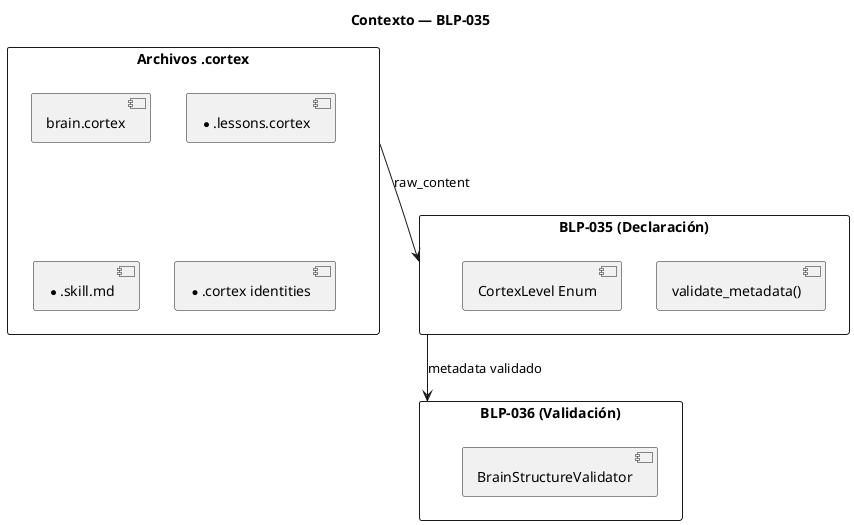
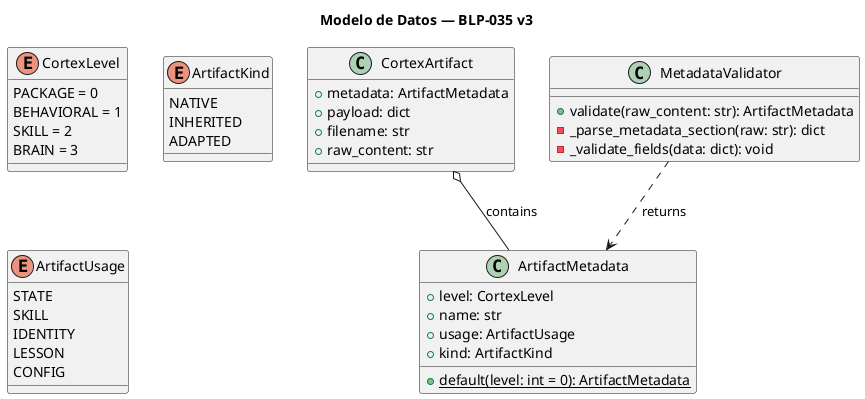
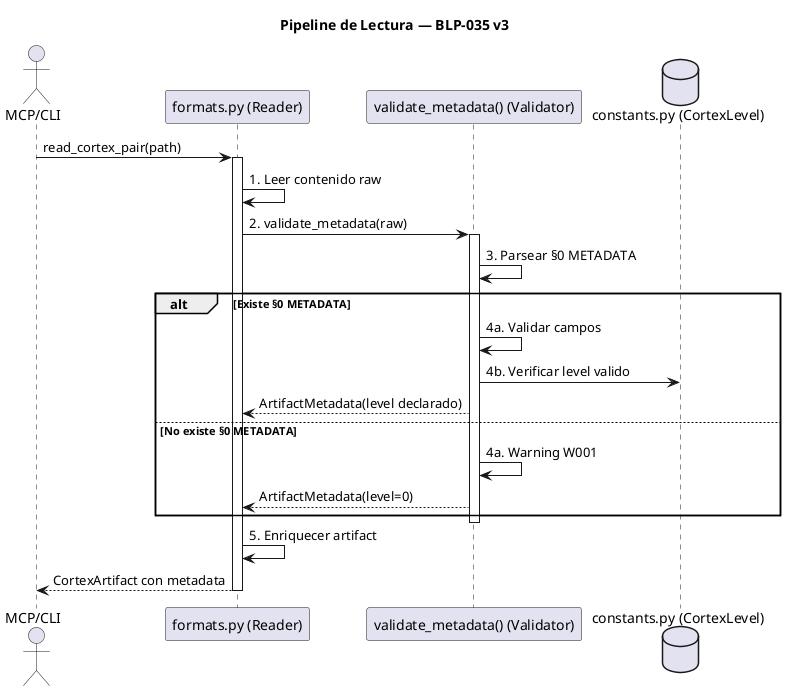
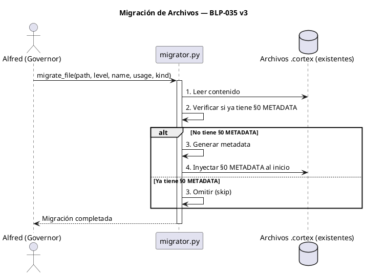

<!-- BLP:TITLE -->
# BLP-035: Declaración e Identidad de Artefactos Cortex — §0 METADATA Obligatorio
<!-- /BLP:TITLE -->

---

<!-- BLP:1 -->
## §1: Planteamiento del Problema

El framework ArqUX trata actualmente los archivos `.cortex` como texto plano o YAML genérico. No existe un mecanismo para identificar a qué nivel (0: PACKAGE, 1: BEHAVIORAL, 2: SKILL, 3: BRAIN) pertenece un artefacto antes de procesarlo.

Los enfoques de inferencia (heurísticas basadas en filename, firma de sigilos) son frágiles y generan incertidumbre. El framework necesita una **declaración explícita** de identidad en cada archivo, no una adivinanza.
<!-- /BLP:1 -->

<!-- BLP:2 -->
## §2: Objetivo

Definir el **§0 METADATA** como sección de identidad técnica obligatoria e inamovible en todo archivo `.cortex` de ArqUX, y crear un **validador de metadata** (`validate_metadata()`) que verifique la presencia y validez de esta sección antes de permitir la lectura.

El §0 METADATA declara: `level`, `name`, `usage`, `kind`.
<!-- /BLP:2 -->

<!-- BLP:3 -->
## §3: Precondiciones

- [ ] Documento v3.0 disponible con esquema §0 METADATA
- [ ] `src/arqux/formats.py` existe como punto de entrada para parsing
- [ ] `src/arqux/constants.py` existe para alojar enumeraciones
- [ ] BLP-036 (Validador) conceptualmente aprobado para validación por nivel
<!-- /BLP:3 -->

<!-- BLP:4 -->
## §4: Principio Rector

**"Declare, don't infer."**

Todo artefacto cortex se describe a sí mismo. El §0 METADATA es su acta de nacimiento técnica: inamovible, obligatoria y auto-documentada. La inferencia es un fallback, no la regla.
<!-- /BLP:4 -->

<!-- BLP:5 -->
## §5: Contexto

Post-diagnóstico (BLP-034). El código actual lee secciones de texto pero ignora la jerarquía arquitectónica. Los handlers MCP no saben si están leyendo una lección rutinaria (Nivel 0) o el estado neural del proyecto (Nivel 3), lo que genera acoplamiento y riesgo de mutación indebida.


<!-- /BLP:5 -->

<!-- BLP:6 -->
## §6: Alcance y Exclusiones

**Dentro del alcance:**
- Definición del esquema §0 METADATA (`level`, `name`, `usage`, `kind`)
- Implementación de `validate_metadata()` en `formats.py`
- Actualización de `read_cortex_pair()` para requerir §0 METADATA
- Migrador de archivos existentes de ArqUX
- Migración de archivos core: `brain.cortex`, `meta-brain.cortex`, identities
- Tests unitarios con fixtures para los 4 niveles

**Fuera del alcance (excluido explícitamente):**
- Migración de archivos de terceros (se verá más adelante)
- Reglas de validación de negocio por nivel
- Modificación de lógica de escritura (Write-Path)
<!-- /BLP:6 -->

<!-- BLP:7 -->
## §7: Reglas Obligatorias

**§0 METADATA - Estructura Declarativa:**

```yaml
§0 METADATA{
  level: 3,           # 0=PACKAGE, 1=BEHAVIORAL, 2=SKILL, 3=BRAIN
  name: "brain",      # Nombre canónico del artefacto
  usage: "state",     # state|skill|identity|lesson|config
  kind: "native"      # native|inherited|adapted
}
```

**Reglas de Validación:**

1. **Regla de Default NIVEL 0:** Todo archivo `.cortex` SIN §0 METADATA se trata como NIVEL 0 (PACKAGE) y emite Warning `W001_NO_METADATA`. El §0 METADATA es obligatorio para operación normal.
2. **Regla de Inmutabilidad:** El §0 METADATA no puede ser modificado después de la creación excepto por migración oficial.
3. **Regla de Precedencia:** El `level` declarado en §0 METADATA es la fuente de verdad. No se infiere ni se sobreescribe.
4. **Regla de kind Único:** El campo `kind` vive exclusivamente en §0 METADATA. No se duplica en frontmatter YAML ni en otras secciones.
5. **Regla de Separación:** §0 METADATA es técnico (level, name, usage, kind). §1 IDENTITY es conductual (AXM, LIM, rol).
<!-- /BLP:7 -->

<!-- BLP:8 -->
## §8: Diseño Técnico

**Modelo de Datos:**



**Implementación Base (`formats.py`):**

```python
def validate_metadata(raw_content: str) -> ArtifactMetadata:
    """Valida y extrae §0 METADATA de un archivo .cortex.
    
    Si no existe §0 METADATA, retorna NIVEL 0 por defecto + Warning.
    """
    metadata_data = _parse_metadata_section(raw_content)
    
    if metadata_data is None:
        # Sin §0 METADATA → NIVEL 0 por defecto
        logger.warning("W001_NO_METADATA")
        return ArtifactMetadata.default(level=0)
    
    # Validar campos obligatorios
    required = ['level', 'name', 'usage', 'kind']
    for field in required:
        if field not in metadata_data:
            raise ValueError(f"§0 METADATA missing required field: {field}")
    
    # Validar rangos
    if metadata_data['level'] not in [0, 1, 2, 3]:
        raise ValueError(f"Invalid level: {metadata_data['level']}")
    
    return ArtifactMetadata(**metadata_data)

def _parse_metadata_section(raw_content: str) -> Optional[dict]:
    """Extrae y parsea la sección §0 METADATA del contenido."""
    # Buscar patrón: §0 METADATA{ ... }
    match = re.search(r'§0 METADATA\{([^}]+)\}', raw_content)
    if not match:
        return None
    
    # Parsear campos clave:valor
    content = match.group(1)
    result = {}
    for line in content.split(','):
        key, _, value = line.partition(':')
        result[key.strip()] = _parse_value(value.strip())
    
    return result
```

**Migrador (`migrator.py`):**

```python
def migrate_file(filepath: Path, level: int, name: str, usage: str, kind: str):
    """Inyecta §0 METADATA en un archivo .cortex existente."""
    content = filepath.read_text()
    
    if '§0 METADATA{' in content:
        return  # Ya tiene metadata
    
    metadata = f"§0 METADATA{{level: {level}, name: \"{name}\", usage: \"{usage}\", kind: \"{kind}\"}}

"
    filepath.write_text(metadata + content)
```
<!-- /BLP:8 -->

<!-- BLP:9 -->
## §9: Diseño Operacional

El validador opera como gateway en el pipeline de lectura.

**Pipeline:**



**Flujo de Migración:**


<!-- /BLP:9 -->

<!-- BLP:10 -->
## §10: Contratos

**Entradas esperadas:**
- `raw_content` (str, contenido completo del archivo .cortex)

**Salidas esperadas:**
- `ArtifactMetadata` con `level` (0-3), `name` (str), `usage` (str), `kind` (str)

**Comportamiento:**
- Si §0 METADATA válido: retorna metadata con level declarado
- Si §0 METADATA inválido: lanza `ValueError`
- Si sin §0 METADATA: retorna `ArtifactMetadata.default(level=0)` + Warning W001

**Excepciones:**
- `ValueError` si `level` fuera de rango 0-3
- `ValueError` si falta campo obligatorio en §0 METADATA
<!-- /BLP:10 -->

<!-- BLP:11 -->
## §11: Procedimiento de Trabajo

1. Definir estructura §0 METADATA en `constants.py` (CortexLevel, ArtifactKind, ArtifactUsage, ArtifactMetadata.default())
2. Implementar `validate_metadata()` y `_parse_metadata_section()` en `formats.py`
3. Implementar migrador `migrate_file()` en `migrator.py` (nuevo)
4. Migrar archivos core: brain.cortex, meta-brain.cortex, identities (6 archivos)
5. Actualizar `read_cortex_pair()` para usar `validate_metadata()`
6. Crear `tests/test_metadata.py` con fixtures para cada nivel
7. Ejecutar `pytest -q` para confirmar 0 regresiones
<!-- /BLP:11 -->

<!-- BLP:12 -->
## §12: Criterios de Aceptación

- [ ] **AC-01:** Todo `.cortex` SIN §0 METADATA → NIVEL 0 + Warning `W001_NO_METADATA`
- [ ] **AC-02:** Todo `.cortex` CON §0 METADATA válido → Usa `level` declarado
- [ ] **AC-03:** §0 METADATA con `level` inválido (fuera de 0-3) → `ValueError`
- [ ] **AC-04:** §0 METADATA con campo faltante → `ValueError`
- [ ] **AC-05:** Archivos migrados mantienen contenido intacto (solo se inyecta §0 METADATA al inicio)
- [ ] **AC-06:** Campo `kind` en §0 METADATA reemplaza frontmatter YAML en skills
- [ ] **AC-07:** Tests pasan sin regresiones
- [ ] **AC-08:** Cobertura > 90%
<!-- /BLP:12 -->

<!-- BLP:13 -->
## §13: Validaciones Requeridas

| Tipo | Descripción | Comando | Evidencia Esperada |
|------|-------------|---------|-------------------|
| edge-case | Archivo sin §0 METADATA | Test | NIVEL 0 + Warning W001 |
| edge-case | §0 METADATA con level inválido | Test | ValueError |
| edge-case | §0 METADATA con campo faltante | Test | ValueError |
| edge-case | Archivo ya migrado (skip) | Test | Contenido intacto |
| edge-case | §0 METADATA sintaxis inválida | Test | ValueError |
| test | Suite de metadata | `pytest tests/test_metadata.py -v` | Todos pasan |
| test | Sin regresión | `pytest -q` | 0 new failures |
<!-- /BLP:13 -->

<!-- BLP:14 -->
## §14: Tareas

- [ ] **T-035.1:** Definir estructura §0 METADATA en `constants.py` (CortexLevel, ArtifactKind, ArtifactUsage, ArtifactMetadata.default())
- [ ] **T-035.2:** Implementar `validate_metadata()` y `_parse_metadata_section()` en `formats.py`
- [ ] **T-035.3:** Implementar migrador `migrate_file()` en `migrator.py` (nuevo)
- [ ] **T-035.4:** Migrar archivos core: brain.cortex, meta-brain.cortex, identities (6 archivos)
- [ ] **T-035.5:** Actualizar `read_cortex_pair()` para usar `validate_metadata()`
- [ ] **T-035.6:** Crear `tests/test_metadata.py` con fixtures para cada nivel
<!-- /BLP:14 -->

<!-- BLP:15 -->
## §15: Riesgos

| ID | Riesgo | Impacto | Mitigación |
|----|--------|---------|------------|
| R-01 | Archivos de terceros sin §0 METADATA no pueden migrarse automáticamente | Medio | Deferred - se verá más adelante |
| R-02 | Migración incorrecta corrompe contenido existente | Alto | Tests de integridad post-migración |
| R-03 | §0 METADATA manipulado para evadir gobernanza | Alto | §0 METADATA inamovible excepto por migración oficial |
| R-04 | Archivos legacy sin §0 METADATA operan en NIVEL 0 sin advertencia visible | Medio | Warning W001 visible en logs + auditoría Heimdall |
<!-- /BLP:15 -->

<!-- BLP:16 -->
## §16: Regla de Bloqueo

**BLOQUEO ARQUITECTÓNICO:** Queda estrictamente prohibido:

1. Modificar el §0 METADATA de un archivo después de su creación (excepto migración oficial)
2. Omitir la validación de §0 METADATA en el pipeline de lectura
3. Usar `kind` en frontmatter YAML (debe vivir exclusivamente en §0 METADATA)
4. Permitir archivos `.cortex` sin §0 METADATA válido en el workspace gobernado
5. Confundir §0 METADATA (técnico) con §1 IDENTITY (conductual)
<!-- /BLP:16 -->

<!-- BLP:17 -->
## §17: Salida Esperada

**Archivos creados:**
- `src/arqux/migrator.py` (nuevo)
- `tests/test_metadata.py`

**Archivos modificados:**
- `src/arqux/constants.py` (CortexLevel, ArtifactKind, ArtifactUsage)
- `src/arqux/formats.py` (validate_metadata() + read_cortex_pair())

**Archivos migrados:**
- `brain.cortex` (§0 METADATA inyectado)
- `meta-brain.cortex` (§0 METADATA inyectado)
- `alfred.cortex` (§0 METADATA inyectado)
- `jarvis.cortex` (§0 METADATA inyectado)
- `seshat.cortex` (§0 METADATA inyectado)
- `heimdall.cortex` (§0 METADATA inyectado)

**Evidencia:**
- `pytest tests/test_metadata.py -v` → exit 0
- `pytest -q` → 0 new failures
- Cobertura formats.py > 90%
<!-- /BLP:17 -->

<!-- BLP:18 -->
## §18: Contrato de Calidad

| Compuerta | Estado |
|-----------|--------|
| has_clear_objective | ✅ |
| has_verifiable_preconditions | ✅ |
| has_scope_and_exclusions | ✅ |
| has_acceptance_criteria | ✅ |
| has_work_procedure | ✅ |
| has_required_validations | ✅ |
| has_learning_recorded | ✅ |
<!-- /BLP:18 -->

> Todas las compuertas deben estar en ✅ antes de blueprint.ready(). Ver blueprint-workflow skill.