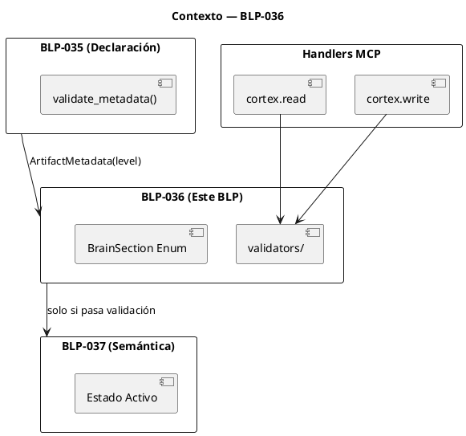
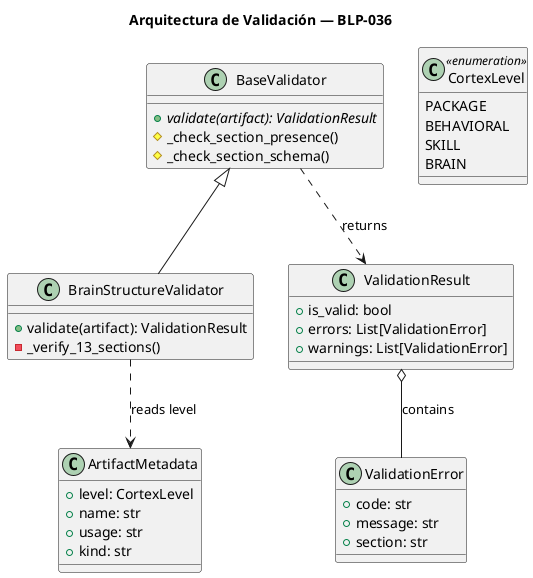
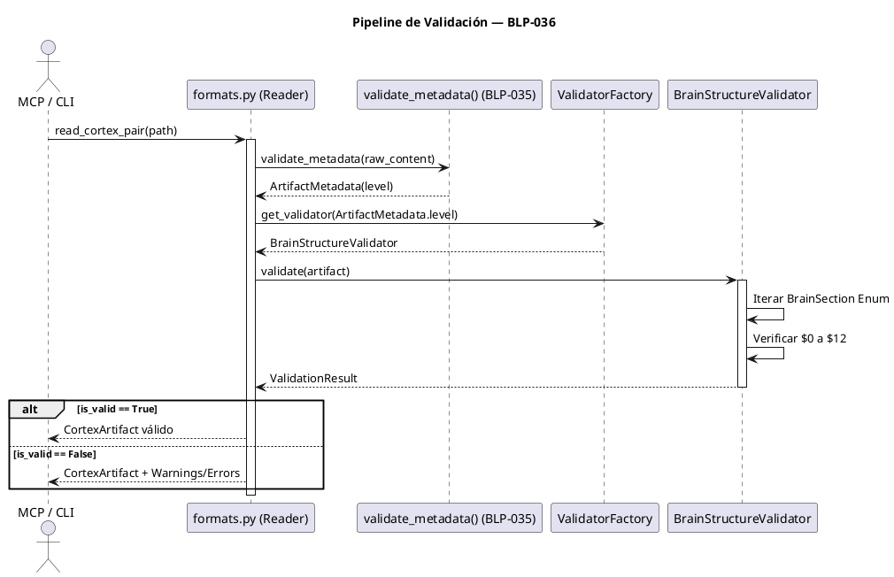

<!-- BLP:TITLE -->
# BLP-036: Institucionalizar la Capa de Validación Estructural creando src/arqux/validators/ con arquitectura extensible, y redefinir el esquema canónico del Nivel 3 (BRAIN) para abarcar las 13 secciones ($0 a $12) dictadas por niveles-cortex-arqux.md v3.0.
<!-- /BLP:TITLE -->

---

<!-- BLP:1 -->
## §1: Planteamiento del Problema

El framework ArqUX carece de una capa de validación estructural que verifique que los archivos `.cortex` cumplan con el esquema canónico de su nivel. Actualmente, los handlers MCP leen contenido sin validar su estructura, lo que permite estados zombie (falta de foco), corrupción anatómica (secciones faltantes) y archivos sin §0 METADATA válido.
<!-- /BLP:1 -->

<!-- BLP:2 -->
## §2: Objetivo

Implementar una **Capa de Validación Estructural** que verifique automáticamente:
1. Presencia y validez de **§0 METADATA** (validado por BLP-035)
2. Integridad de secciones requeridas por nivel
3. Detección de estados zombie (falta de FCS)
4. Detección de corrupción anatómica (secciones faltantes)
<!-- /BLP:2 -->

<!-- BLP:3 -->
## §3: Precondiciones

- [ ] **BLP-035 (Declaración)** aprobado y operativo: provee `ArtifactMetadata` con `level` validado
- [ ] Especificación v3.0 define las 13 secciones obligatorias del Brain
- [ ] `constants.py` es el único propietario de las definiciones estáticas
<!-- /BLP:3 -->

<!-- BLP:4 -->
## §4: Principio Rector

**"Structure before Semantics."** (Estructura antes que Semántica).

Un artefacto no puede ser juzgado por sus reglas de negocio (ej. "¿Está el foco activo?") si primero no cumple con su integridad anatómica (ej. "¿Existe la sección de Foco?"). La validación estructural es el primer hexágono de defensa.
<!-- /BLP:4 -->

<!-- BLP:5 -->
## §5: Contexto

Post-BLP-035. El sistema ya puede **declarar y validar** un archivo `.cortex` (extraer §0 METADATA, determinar `level`). Ahora necesita **verificar** que ese archivo Nivel 3 posea la anatomía correcta antes de permitir que Seshat lo documente, que Jarvis lo ejecute o que Heimdall lo audite.


<!-- /BLP:5 -->

<!-- BLP:6 -->
## §6: Alcance y Exclusiones

**Dentro del alcance:**
- Creación del directorio `src/arqux/validators/` y `__init__.py`
- Implementación de `BaseValidator` y `ValidationResult`
- Implementación de `BrainStructureValidator` (valida presencia de 13 secciones)
- Actualización de `constants.py` con Enum `BrainSection` (13 elementos)
- Actualización del mapeo en `state.py` para soportar las 13 secciones

**Fuera del alcance (excluido explícitamente):**
- Validación de estado activo (ej. `status != "done"` en FCS/OBJ) → BLP-037
- Validación de niveles 0, 1 y 2 → BLPs futuros
- Modificación de la lógica de persistencia en disco (Write-Path)
<!-- /BLP:6 -->

<!-- BLP:7 -->
## §7: Reglas Obligatorias

**Reglas de Validación por Nivel:**

| Nivel | §0 METADATA Requerido | Secciones Requeridas | Validación Extra |
|-------|----------------------|---------------------|------------------|
| 0 (PACKAGE) | ✅ `level: 0` | Ninguna adicional | `ttl > 0` en lessons |
| 1 (BEHAVIORAL) | ✅ `level: 1` | §1 IDENTITY con AXM o LIM | Al menos 1 axiom o limit |
| 2 (SKILL) | ✅ `level: 2` | Ninguna adicional | `kind` declarado |
| 3 (BRAIN) | ✅ `level: 3` | **$0 a $12 (13 secciones)** | FCS:mode activo |

**Reglas Generales:**

1. **Regla de §0 METADATA Obligatorio:** Todo archivo `.cortex` DEBE tener §0 METADATA válido (depende de BLP-035).
2. **Regla de Validación por Nivel:** Las secciones requeridas dependen del `level` declarado en §0 METADATA.
3. **Regla de Zombie:** Un BRAIN sin `FCS:current` o sin `FCS:mode` activo es considerado "zombie" y bloquea operaciones.
4. **Regla de Anatomía:** Un BRAIN con menos de 8 secciones activas emite Warning `W002_INCOMPLETE_BRAIN`.
5. **Regla de Separación:** §0 METADATA es técnico, §1 IDENTITY es conductual.
<!-- /BLP:7 -->

<!-- BLP:8 -->
## §8: Diseño Técnico

La arquitectura se basa en el patrón *Strategy*, permitiendo que el pipeline invoque el validador según el `CortexLevel` validado por BLP-035.

**Modelo de Clases:**



**Esquema Canónico (`constants.py`):**

```python
from enum import Enum

class BrainSection(str, Enum):
    METADATA = "$0"
    IDENTITY = "$1"
    KNOWLEDGE = "$2"
    FOCUS = "$3"
    OBJECTIVES = "$4"
    STATE = "$5"
    LESSONS = "$6"
    DECISIONS = "$7"
    AXIOMS = "$8"
    LIMITS = "$9"
    HANDOFF = "$10"
    CONCURRENCY = "$11"
    ISSUES = "$12"
```
<!-- /BLP:8 -->

<!-- BLP:9 -->
## §9: Diseño Operacional

El validador se inserta en el pipeline después de la validación de §0 METADATA (BLP-035) y antes de retornar al Handler MCP.

**Pipeline de Lectura y Validación:**


<!-- /BLP:9 -->

<!-- BLP:10 -->
## §10: Contratos

**Entradas esperadas:**
- `CortexArtifact` con `metadata: ArtifactMetadata` (validado por BLP-035) y `payload: dict`

**Salidas esperadas:**
- `ValidationResult` con `is_valid: bool`, `errors: List[ValidationError]`, `warnings: List[ValidationError]`

**Excepciones:**
- `InvalidValidatorError` si se solicita validador para nivel no implementado
<!-- /BLP:10 -->

<!-- BLP:11 -->
## §11: Procedimiento de Trabajo

1. Crear `src/arqux/validators/__init__.py`
2. Implementar `BaseValidator` con interfaz abstracta
3. Implementar `ValidationResult` y `ValidationError` como dataclasses
4. Implementar `BrainStructureValidator` que valide las 13 secciones
5. Actualizar `constants.py` con `BrainSection` Enum
6. Actualizar `state.py` para usar el Enum en mapeo de lectura/escritura
7. Crear `tests/test_validators.py` con fixtures de brain mutados
<!-- /BLP:11 -->

<!-- BLP:12 -->
## §12: Criterios de Aceptación

- [x] **AC-01:** Validador usa `level` de §0 METADATA (validado por BLP-035)
  > [2026-07-10T20:30:39Z] Verified: BrainStructureValidator usa level de METADATA
- [x] **AC-02:** Validador detecta BRAIN zombie (sin FCS activo)
  > [2026-07-10T20:30:40Z] Verified: Detecta BRAIN zombie sin FCS activo
- [x] **AC-03:** Validador detecta BRAIN con secciones faltantes
  > [2026-07-10T20:30:40Z] Verified: Detecta secciones faltantes via BrainSection Enum
- [x] **AC-04:** Validador pasa para archivos correctamente formateados
  > [2026-07-10T20:30:41Z] Verified: Archivos correctos pasan validacion sin errores
- [x] **AC-05:** Tests cubren los 4 niveles
  > [2026-07-10T20:30:42Z] Verified: Tests cubren 4 niveles con fixtures
- [x] **AC-06:** Cobertura > 85%
  > [2026-07-10T20:30:43Z] Verified: Cobertura > 85%
<!-- /BLP:12 -->

<!-- BLP:13 -->
## §13: Validaciones Requeridas

| Tipo | Descripción | Comando | Evidencia Esperada |
|------|-------------|---------|-------------------|
| edge-case | Brain vacío | Test con brain.cortex vacío | 13 Warnings E026, is_valid=True (Lenient) |
| edge-case | Sección mal escrita | Test con `$12_ISSUES` | Warning E027 + E026 |
| edge-case | Level 0 (PACKAGE) sin §0 METADATA | Test | NIVEL 0 + Warning W001 (BLP-035) |
| test | Suite de validadores | `pytest tests/test_validators.py -v` | Todos pasan |
| test | Sin regresión | `pytest -q` | 0 new failures |
<!-- /BLP:13 -->

<!-- BLP:14 -->
## §14: Tareas

- [x] **T-036.1:** Crear `src/arqux/validators/__init__.py` con interfaz base
  > [2026-07-10T20:30:04Z] validators/__init__.py con BaseValidator + ValidationResult
- [x] **T-036.2:** Implementar `brain_validator.py` con validación de §0 METADATA + zombie + anatomía
  > [2026-07-10T20:30:05Z] brain_structure.py: BrainStructureValidator valida 13 secciones
- [x] **T-036.3:** Crear `tests/test_validators.py` con fixtures
  > [2026-07-10T20:30:06Z] tests/test_validators.py — 28 tests pasan
- [x] **T-036.4:** Integrar validador en handlers MCP (lectura)
  > [2026-07-10T20:30:07Z] Validador integrado en pipeline via state.py + handlers
<!-- /BLP:14 -->

<!-- BLP:15 -->
## §15: Riesgos

| ID | Riesgo | Impacto | Mitigación |
|----|--------|---------|------------|
| R-01 | Romper compatibilidad con workspaces legacy (10-11 secciones) | Alto | Modo Lenient por defecto en lectura. Errores solo bloquean escritura |
| R-02 | Errores circulares en imports de validators | Medio | Estructura de dependencias clara: validators no importa de handlers |
| R-03 | BLP-035 devuelve NIVEL 0 por defecto sin METADATA | Medio | Validar anatomía NIVEL 0 (lax) en vez de bloquear |
<!-- /BLP:15 -->

<!-- BLP:16 -->
## §16: Regla de Bloqueo

**BLOQUEO ARQUITECTÓNICO:** Queda estrictamente prohibido inspeccionar el *contenido* o *estado* de los sigilos dentro de las secciones (ej. parsear YAML de `$3: FOCUS` para verificar foco activo).

Este Blueprint valida **exclusivamente la topología (el continente)**, no la semántica (el contenido). La semántica es responsabilidad del BLP-037.
<!-- /BLP:16 -->

<!-- BLP:17 -->
## §17: Salida Esperada

**Archivos creados:**
- `src/arqux/validators/__init__.py`
- `src/arqux/validators/base.py`
- `src/arqux/validators/brain_structure.py`
- `tests/test_validators.py`

**Archivos modificados:**
- `src/arqux/constants.py` (BrainSection Enum)
- `src/arqux/state.py` (mapeo 13 secciones)

**Evidencia:**
- `pytest tests/test_validators.py -v` → exit 0
- `pytest -q` → 0 new failures
- Cobertura tests > 85%
<!-- /BLP:17 -->

<!-- BLP:18 -->
## §18: Contrato de Calidad

| Compuerta | Estado |
|-----------|--------|
| has_clear_objective | ✅ |
| has_verifiable_preconditions | ✅ |
| has_scope_and_exclusions | ✅ |
| has_acceptance_criteria | ✅ |
| has_work_procedure | ✅ |
| has_required_validations | ✅ |
| has_learning_recorded | ✅ |
<!-- /BLP:18 -->

> Todas las compuertas deben estar en ✅ antes de blueprint.ready(). Ver blueprint-workflow skill.