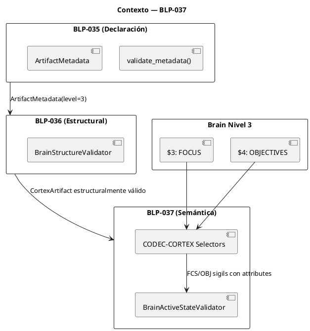
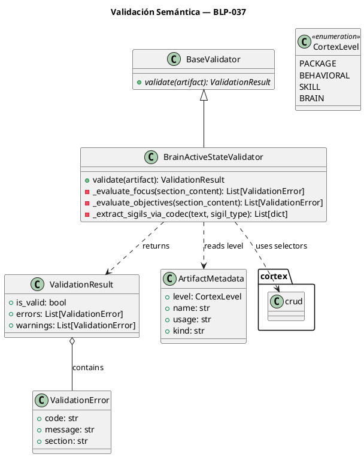
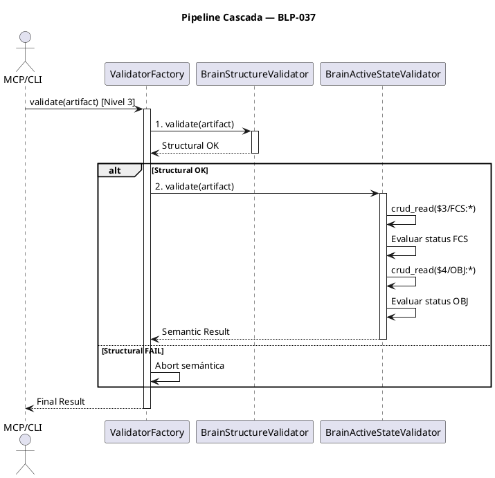

<!-- BLP:TITLE -->
# BLP-037: Implementar BrainActiveStateValidator que inspeccione contenido semántico de secciones FOCUS y OBJECTIVES del Nivel 3, garantizando al menos un FCS y OBJ con estado vigente. Emitir E024/E028 en caso de inercia.
<!-- /BLP:TITLE -->

---

<!-- BLP:1 -->
## §1: Planteamiento del Problema

El framework permite la existencia de "Proyectos Zombie" — un `brain.cortex` puede ser estructuralmente perfecto (13 secciones) pero semánticamente inerte: sin FCS activo o con todos los OBJ en `done`. Esto viola el principio de que *la ejecución debe estar impulsada por una intención gobernada y vigente*.
<!-- /BLP:1 -->

<!-- BLP:2 -->
## §2: Objetivo

Implementar el **Motor de Validación de Estado Activo** (`BrainActiveStateValidator`) que inspeccione el contenido semántico de las secciones `$3: FOCUS` y `$4: OBJECTIVES` del Nivel 3. Garantizar al menos un FCS y OBJ con estado vigente, emitiendo `E024_LEVEL3_MISSING_FOCUS` o `E028_NO_ACTIVE_OBJECTIVES` en caso de inercia.
<!-- /BLP:2 -->

<!-- BLP:3 -->
## §3: Precondiciones

- [ ] BLP-035 ejecutado: `validate_metadata()` retorna `ArtifactMetadata(level)` validado
- [ ] BLP-036 ejecutado: `BrainStructureValidator` valida anatomía $0-$12
- [ ] `CortexArtifact` incluye `metadata: ArtifactMetadata` (nivel declarado en §0 METADATA)
- [ ] CODEC-CORTEX disponible: `crud_read()`, `cortex_read()`, `selectors` para extraer sigilos
<!-- /BLP:3 -->

<!-- BLP:4 -->
## §4: Principio Rector

**"A brain without focus is a dead brain."**

La gobernanza no solo exige que el contenedor exista, sino que la energía direccional del proyecto (Foco y Objetivos) esté fluyendo activamente. La semántica dicta la supervivencia.
<!-- /BLP:4 -->

<!-- BLP:5 -->
## §5: Contexto

Post-BLP-036. El pipeline ya sabe que el archivo es Nivel 3 y tiene sus 13 "órganos" vitales. Ahora debe tomar el "pulso" del proyecto leyendo los metadatos de los sigilos en Foco y Objetivos usando CODEC-CORTEX selectors.


<!-- /BLP:5 -->

<!-- BLP:6 -->
## §6: Alcance y Exclusiones

**Dentro del alcance:**
- Implementación de `BrainActiveStateValidator` usando CODEC-CORTEX selectors
- Extracción de sigilos FCS/OBJ via `crud_read()` / `cortex_read()`
- Definición de `VALID_STATUSES` e `INVALID_STATUSES` en `constants.py`
- Integración en `ValidatorFactory` para `CortexLevel.BRAIN`

**Fuera del alcance (excluido explícitamente):**
- Creación de `SigilParser` regex (CODEC-CORTEX ya provee parsing)
- Modificación automática de estado (Auto-healing)
- Validación de coherencia Foco-Objetivos
- Validación de otras secciones del Brain
<!-- /BLP:6 -->

<!-- BLP:7 -->
## §7: Reglas Obligatorias

1. **Regla de Foco Vigente:** Al menos un FCS en `$3` con `status` NO en `[done, archived, dropped]`
2. **Regla de Objetivo Vigente:** Al menos un OBJ en `$4` con `status` NO en `[done, archived]`
3. **Error E024:** Si Regla 1 falla → `E024_LEVEL3_MISSING_FOCUS` (CRITICAL)
4. **Error E028:** Si Regla 2 falla → `E028_NO_ACTIVE_OBJECTIVES` (HIGH)
5. **Tolerancia Semántica:** `blocked` es VÁLIDO (proyecto vivo pero impedido)
<!-- /BLP:7 -->

<!-- BLP:8 -->
## §8: Diseño Técnico

**Modelo de Clases:**



**Extracción de Sigilos via CODEC-CORTEX:**

```python
from arqux.state import crud_read

def _extract_sigils_via_codec(artifact: CortexArtifact, sigil: str) -> list[dict]:
    """Extrae todos los sigilos de tipo dado usando CODEC-CORTEX selectors."""
    # crud_read usa _cc_selectors.select() internamente
    result = crud_read(artifact.path, f"$3/{sigil}:*") if sigil == "FCS" else crud_read(artifact.path, f"$4/{sigil}:*")
    return result.get("entries", [])

def _get_sigil_status(sigil_entry: dict) -> str:
    """Obtiene el atributo 'status' de una entrada de sigilo."""
    return sigil_entry.get("value", {}).get("status", "").lower()
```

**Estados Válidos (Whitelist):** `current`, `active`, `pending`, `blocked`, `paused`

**Estados Inválidos (Blacklist):** `done`, `archived`, `dropped`, `cancelled`

**Definición en `constants.py`:**

```python
VALID_STATUSES = frozenset({"current", "active", "pending", "blocked", "paused"})
INVALID_STATUSES = frozenset({"done", "archived", "dropped", "cancelled"})
```
<!-- /BLP:8 -->

<!-- BLP:9 -->
## §9: Diseño Operacional

**Pipeline de Validación en Cascada:**


<!-- /BLP:9 -->

<!-- BLP:10 -->
## §10: Contratos

**Entradas esperadas:**
- `CortexArtifact` Nivel 3 con:
  - `metadata: ArtifactMetadata` (level=3 validado por BLP-035)
  - `path: str` (ruta al archivo .cortex)
  - Estructuralmente válido (BLP-036 pasó)

**Salidas esperadas:**
- `ValidationResult` con:
  - `E024_LEVEL3_MISSING_FOCUS` (CRITICAL) si no hay FCS vigente
  - `E028_NO_ACTIVE_OBJECTIVES` (HIGH) si no hay OBJ vigente

**Estados válidos:** `current`, `active`, `pending`, `blocked`, `paused`

**Estados inválidos:** `done`, `archived`, `dropped`, `cancelled`
<!-- /BLP:10 -->

<!-- BLP:11 -->
## §11: Procedimiento de Trabajo

1. Definir `VALID_STATUSES` e `INVALID_STATUSES` en `constants.py`
2. Implementar `BrainActiveStateValidator` en `src/arqux/validators/brain_semantics.py` usando `crud_read()` para extraer FCS/OBJ
3. Integrar en `ValidatorFactory` para `CortexLevel.BRAIN` (después de `BrainStructureValidator`)
4. Crear `tests/test_brain_semantics.py` con fixtures de brains zombies/bloqueados/sanos
<!-- /BLP:11 -->

<!-- BLP:12 -->
## §12: Criterios de Aceptación

- [ ] **AC-01:** E024 si `$3` no contiene FCS
- [ ] **AC-02:** E024 si todos FCS tienen `status: "done"`
- [ ] **AC-03:** FCS con `status: "blocked"` es considerado válido
- [ ] **AC-04:** E028 si no hay objetivos vigentes en `$4`
- [ ] **AC-05:** ValidatorFactory ejecuta semántica solo si estructural pasó
<!-- /BLP:12 -->

<!-- BLP:13 -->
## §13: Validaciones Requeridas

| Tipo | Descripción | Evidencia Esperada |
|---|---|---|
| edge-case | `$3` con solo texto libre, sin sigilos | Error E024 |
| edge-case | Sigilo malformado sin llave de cierre | Warning + E024 si no hay otros |
| edge-case | Múltiples FCS: uno done, otro current | Válido (hay foco vigente) |
| test | Suite brain_semantics | `pytest tests/test_brain_semantics.py -v` → pass |
<!-- /BLP:13 -->

<!-- BLP:14 -->
## §14: Tareas

- [ ] **T-037.1:** Definir `VALID_STATUSES` e `INVALID_STATUSES` en `constants.py`
- [ ] **T-037.2:** Implementar `BrainActiveStateValidator` en `brain_semantics.py` usando `crud_read()`
- [ ] **T-037.3:** Integrar en `ValidatorFactory` para `CortexLevel.BRAIN`
- [ ] **T-037.4:** Crear `tests/test_brain_semantics.py`
<!-- /BLP:14 -->

<!-- BLP:15 -->
## §15: Riesgos

| ID | Riesgo | Impacto | Mitigación |
|----|--------|---------|------------|
| R-01 | Parsing regex frágil si usuarios alteran formato | Medio | Whitespace-agnostic + fallback YAML + W002 |
| R-02 | Falsos positivos si atributos están en minúsculas | Bajo | Normalización case-insensitive |
<!-- /BLP:15 -->

<!-- BLP:16 -->
## §16: Regla de Bloqueo

**BLOQUEO ARQUITECTÓNICO:** Queda estrictamente prohibido que este validador intente "revivir" un proyecto cambiando mágicamente el estado de `done` a `current`.

El validador es un **Auditor (Heimdall)**, no un **Ejecutor (Jarvis)**. Su única responsabilidad es emitir el diagnóstico E024 o E028 para que el Gobernador tome la decisión de iniciar un nuevo ciclo de planificación.
<!-- /BLP:16 -->

<!-- BLP:17 -->
## §17: Salida Esperada

**Archivos creados:**
- `src/arqux/validators/brain_semantics.py`
- `tests/test_brain_semantics.py`

**Archivos modificados:**
- `src/arqux/constants.py` (VALID_STATUSES, INVALID_STATUSES)
- `src/arqux/validators/__init__.py` (integración)

**Evidencia:**
- `pytest tests/test_brain_semantics.py -v` → exit 0
- `pytest -q` → 0 new failures
- Cobertura > 90%
<!-- /BLP:17 -->

<!-- BLP:18 -->
## §18: Contrato de Calidad

| Compuerta | Estado |
|---|---|
| has_clear_objective | ✅ |
| has_verifiable_preconditions | ✅ |
| has_scope_and_exclusions | ✅ |
| has_acceptance_criteria | ✅ |
| has_work_procedure | ✅ |
| has_required_validations | ✅ |
| has_learning_recorded | ✅ |
<!-- /BLP:18 -->

> Todas las compuertas deben estar en ✅ antes de blueprint.ready(). Ver blueprint-workflow skill.