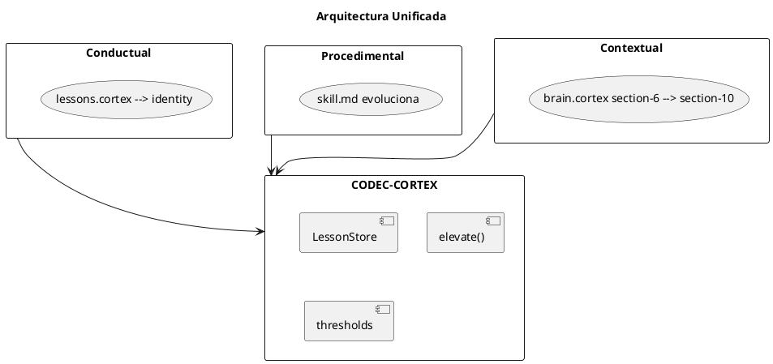
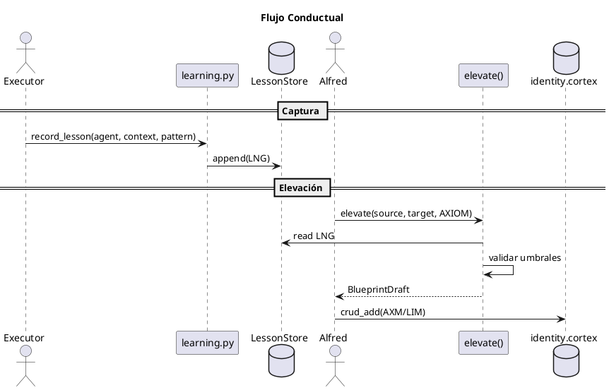
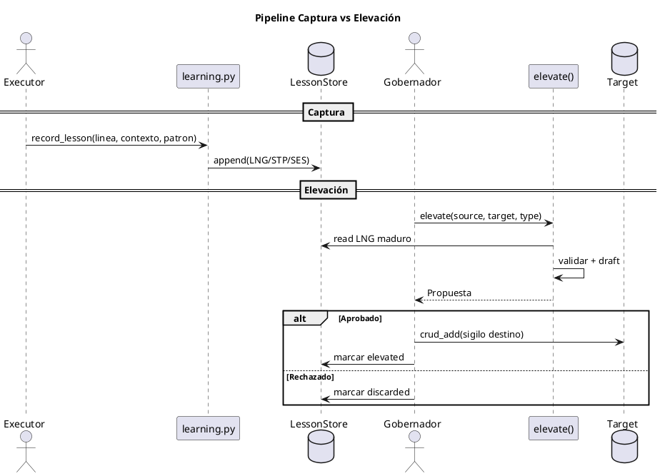
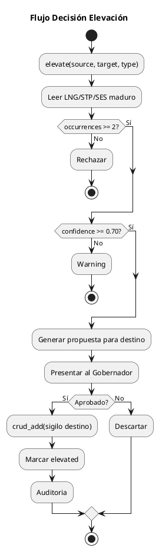
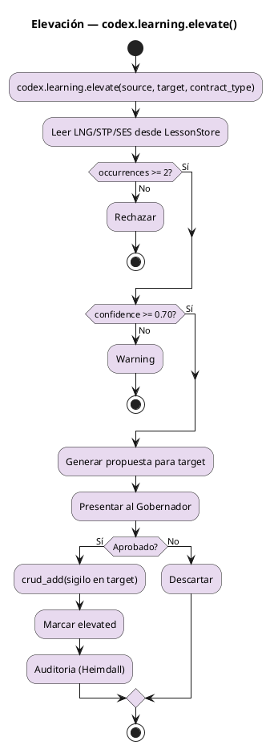

<!-- BLP:TITLE -->
# BLP-038: Establecer la Arquitectura de Tres Líneas de Aprendizaje Paralelas (Conductual, Procedimental y Contextual) con sus respectivos sigilos de almacenamiento, rutas de elevación y contratos de gobernanza, todas gestionadas por el motor CODEC-CORTEX `codex.learning.elevate()`.
<!-- /BLP:TITLE -->

---

<!-- BLP:1 -->
## §1: Planteamiento del Problema

El framework ArqUX trata actualmente todo aprendizaje como un flujo único indiferenciado hacia `brain.cortex`. Esto ignora la naturaleza intrínsecamente distinta de tres categorías de aprendizaje:

1. **Conductual**: Patrones de comportamiento del agente (hábitos, preferencias, heurísticas personales). Debe residir en la identidad del agente (Nivel 1 BEHAVIORAL).
2. **Procedimental**: Capacidades operativas, procedimientos y skills. Debe evolucionar dentro de los archivos `skills/skill.md` (Nivel 2 SKILL).
3. **Contextual**: Conocimiento del proyecto, decisiones, gobernanza. Pertenece al `brain.cortex` (Nivel 3 BRAIN).

**Evidencia:**
- `learning.py` escribe en `brain.cortex` sin diferenciar conductual de contextual
- No existe archivo `<agent>.lessons.cortex` (Nivel 0 PACKAGE conductual)
- Las skills no tienen trazabilidad de evolución interna (STP→CNST→CLAIM)
- No hay rutas de elevación diferenciadas por línea

**Impacto de no resolverlo:**
- Brain se satura con patrones conductuales del agente (ruido cognitivo)
- No hay trazabilidad de madurez por línea de aprendizaje
- Gobernador no controla qué entra en contratos conductuales (Nivel 1) vs skills (Nivel 2) vs conocimiento (Nivel 3)
<!-- /BLP:1 -->

<!-- BLP:2 -->
## §2: Objetivo

Definir e institucionalizar la **Arquitectura de Tres Líneas de Aprendizaje Paralelas**, cada una con:

| Dimensión | Conductual | Procedimental | Contextual |
|-----------|------------|---------------|------------|
| **Almacén N0 (raw)** | `<agent>.lessons.cortex` | `skills/<name>.skill.md` | `brain.cortex` $6 LESSONS |
| **Sigilo raw** | `LNG` | `STP` | `SES` / `LNG` |
| **Destino elevado** | `<agent>.cortex` §1 IDENTITY | `skills/<name>.skill.md` | `brain.cortex` $10 KNOWLEDGE |
| **Sigilo destino** | `AXM` / `LIM` | `CNST` / `CLAIM` | `KNW` |
| **Motor elevación** | `codex.learning.elevate()` | `codex.learning.elevate()` | `codex.learning.elevate()` |
| **Gobernanza** | Alfred (Gobernador) | Alfred (Gobernador) | Automática + revisión |

Las tres líneas comparten el mismo motor de elevación (`codex.learning.elevate()`) pero se diferencian por **archivo contenedor, sigilos y contrato de gobernanza**.

El §0 METADATA en cada archivo `.cortex` declara su línea vía `level` y `usage`.
<!-- /BLP:2 -->
<!-- /BLP:2 -->

<!-- BLP:3 -->
## §3: Precondiciones

- [ ] BLP-035 ejecutado: `validate_metadata()` reconoce §0 METADATA y clasifica `<agent>.lessons.cortex` como `CortexLevel.PACKAGE` (0)
- [ ] BLP-036 ejecutado: `BrainStructureValidator` valida anatomía por nivel (Nivel 0: sin secciones requeridas adicionales)
- [ ] `CortexArtifact` incluye `metadata: ArtifactMetadata` (nivel declarado en §0 METADATA)
- [ ] CODEC-CORTEX >= 0.5.0 disponible: módulo `codex.learning` con `LessonStore`, `elevate()`, hooks de gobernanza
- [ ] BLP-039 ejecutado: `IdentityManager` resuelve `<agent>.cortex` y `<agent>.lessons.cortex` por agente
- [ ] Memoria institucional distingue tres líneas: Conductual (agente), Procedimental (skill), Contextual (proyecto)
<!-- /BLP:3 -->

<!-- BLP:4 -->
## §4: Principio Rector

**"Three lines, one engine. Differentiate by container, not by mechanism."**

El aprendizaje en ArqUX ocurre en tres líneas paralelas e independientes, cada una con su propia topología de almacenamiento y destino de elevación, pero todas comparten el mismo motor de elevación: `codex.learning.elevate()` de CODEC-CORTEX.

La diferenciación no requiere mecanismos distintos — el motor es universal. La diferenciación es por:
- **Archivo contenedor** (dónde se almacena la lección raw)
- **Sigilo** (qué tipo de conocimiento representa)
- **Contrato de gobernanza** (quién aprueba la elevación)

Cada lección en Nivel 0 se eleva a **UNA** línea según su naturaleza. No hay cruce entre líneas.

El §0 METADATA en cada archivo declara su identidad: `level`, `name`, `usage`, `kind`. No se infiere.
<!-- /BLP:4 -->
<!-- /BLP:4 -->

<!-- BLP:5 -->
## §5: Contexto

Post-BLP-036/BLP-039. El pipeline ya clasifica y valida estructura por nivel, y el `IdentityManager` resuelve identidades por agente. Ahora establecemos la arquitectura de tres líneas de aprendizaje paralelas.

**Tres líneas de aprendizaje INDEPENDIENTES — un solo motor de elevación:**

| Línea | Nivel 0 Origen | Sigilo Almacén (N0) | Nivel 1/2/3 Destino | Sigilo Destino | Motor Elevación | Gobernanza |
|-------|----------------|---------------------|---------------------|----------------|----------------|------------|
| **Conductual** | `<agent>.lessons.cortex` (Package personal) | `LNG`¹ | `<agent>.cortex` §1 IDENTITY | `AXM` / `LIM` | `codex.learning.elevate()` | Alfred |
| **Procedimental** | `skills/<name>.skill.md` (evolución interna) | `STP` | `skills/<name>.skill.md` | `CNST` / `CLAIM` | `codex.learning.elevate()` | Alfred |
| **Contextual** | `brain.cortex` $6 LESSONS | `SES` / `LNG`¹ | `brain.cortex` $10 KNOWLEDGE | `KNW` | `codex.learning.elevate()` | Automática + Heimdall |

> ¹ `LNG` es el sigilo de lección del formato CODEC-CORTEX, usado tanto en conductual (`<agent>.lessons.cortex`) como en contextual (`brain.cortex`). La diferenciación no es por sigilo sino por **archivo contenedor**: las lecciones en `brain.cortex/$6` son contextuales; las lecciones en `<agent>.lessons.cortex` son conductuales. El motor `codex.learning.elevate()` opera sobre el contenedor que se le indique.

**NO se cruzan.** `codex.learning.elevate()` se configura por línea según su archivo origen y destino.

**BLP-038 establece la arquitectura de las tres líneas.**
<!-- /BLP:5 -->
<!-- /BLP:5 -->

<!-- BLP:6 -->
## §6: Alcance y Exclusiones

**Dentro del alcance (Arquitectura de Tres Líneas):**
- Definición canónica de las tres líneas: Conductual, Procedimental y Contextual
- Almacenes, sigilos, destinos de elevación y gobernanza por línea (ver §5)
- Creación de `.arqux/identities/<agent>.lessons.cortex` por agente (línea conductual)
- Refactorización de `src/arqux/learning.py` para añadir canal conductual vía `LessonStore`
- Configuración de `codex.learning.elevate()` para las tres líneas
- Implementación del handler/comando `arqux elevate --source <path> --target <path> --type <sigil>`
- Migración: sección `$6 LESSONS` en `brain.cortex` → separar conductuales a `<agent>.lessons.cortex`

**Fuera del alcance (excluido explícitamente):**
- Implementación completa de la línea Procedimental (evolución STP→CNST→CLAIM) → futuro BLP
- Modificación del canal contextual existente en `learning.py` (SES→LNG→KNW en brain.cortex)
- Validación semántica de lecciones → BLP-037
- Elevación automática sin intervención del Gobernador (solo conductual requiere gobernanza manual)
<!-- /BLP:6 -->
<!-- /BLP:6 -->

<!-- BLP:7 -->
## §7: Reglas Obligatorias

1. **Regla de §0 METADATA Obligatorio:** Todo archivo `<agent>.lessons.cortex` DEBE tener §0 METADATA válido con `level: 0`, `usage: "lesson"`, `kind: "native"`, `agent: "<agent_name>"`. (BLP-035)

2. **Regla de Aislamiento Conductual:** El `brain.cortex` (Nivel 3) NO recibe escrituras directas de lecciones conductuales operativas. Solo recibe referencias a lecciones elevadas (AXM/LIM) o lecciones contextuales propias (LNG en $6).

3. **Regla de Acumulación (Append-Only):** Los agentes (Jarvis/Seshat) solo pueden **añadir** sigilos `LNG` a su `<agent>.lessons.cortex`. No pueden modificar ni borrar lecciones existentes.

4. **Regla de Elevación Gobernada:** Solo el Gobernador (Alfred) puede ejecutar la elevación de Nivel 0 conductual a Nivel 1 (AXM/LIM en §1 IDENTITY de `<agent>.cortex`). La elevación es un acto de gobernanza, no de ejecución.

5. **Regla de Caducidad (Deuda de Aprendizaje Conductual):** Las lecciones en Nivel 0 poseen atributo `ttl` (Time-To-Live). Si una lección no es elevada o refutada en N ciclos, el sistema emite Warning `W003_LEARNING_DEBT_BEHAVIORAL`.

6. **Regla de kind Único:** El campo `kind` vive exclusivamente en §0 METADATA. No se duplica en frontmatter YAML.

7. **Regla de Identidad Vinculada:** `<agent>.lessons.cortex` se resuelve vía `IdentityManager` (BLP-039) — co-ubicado con `<agent>.cortex` en `.arqux/identities/`.
<!-- /BLP:7 -->

<!-- BLP:8 -->
## §8: Diseño Técnico

La arquitectura **usa el motor de elevación nativo de CODEC-CORTEX** (`codex.learning.elevate()`) como único motor para las tres líneas de aprendizaje. No se crean wrappers ni motores alternativos.

**Componentes CODEC-CORTEX:**

1. **`codex.learning.LessonStore`**: Repositorio Nivel 0 *append-only* con *file-lock*, TTL, madurez (`confidence`, `occurrences`). Se instancia por contenedor:
   ```python
   # Conductual: lessons del agente
   behavioral_store = LessonStore(path=".arqux/identities/jarvis.lessons.cortex")
   # Contextual: lessons del proyecto
   contextual_store = LessonStore(path=".arqux/brain.cortex", section="$6")
   ```

2. **`codex.learning.elevate()`**: Motor de elevación universal. Lee lecciones maduras desde un `LessonStore`, valida umbrales, genera propuesta de elevación. Opera sobre cualquier contenedor `.cortex` que se le indique:
   ```python
   # Elevación conductual: lessons.cortex → §1 IDENTITY del agente
   elevate(source="jarvis.lessons.cortex", target="jarvis.cortex §1 IDENTITY")
   # Elevación contextual: brain.cortex $6 → $10 KNOWLEDGE
   elevate(source="brain.cortex $6", target="brain.cortex $10")
   ```

3. **Hooks de gobernanza**: `on_capture`, `on_elevate`, `on_expire` para auditoría (Heimdall) y políticas por línea.

**Las tres líneas, un solo motor:**



**Integración en ArqUX:**

| Componente | Línea | Usa CODEC-CORTEX |
|------------|-------|------------------|
| `learning.py` conductual | Conductual | `LessonStore(path=lessons.cortex)` + `elevate()` → §1 IDENTITY |
| `learning.py` contextual | Contextual | `LessonStore(path=brain.cortex, section=$6)` + `elevate()` → $10 |
| `skills/` (futuro) | Procedimental | `LessonStore(path=skill.md, section=$0)` + `elevate()` → evolución interna |
| CLI `arqux elevate` | Configurable | `elevate(source, target, contract_type)` |

**Estructura del Sigilo `LNG` (mismo formato, distinto contenedor):**

```yaml
§0 METADATA{
  level: 0,
  name: "jarvis-lessons",
  usage: "lesson",
  kind: "native",
  agent: "jarvis"
}
---
LNG:lsn-042{type:"error-handling", confidence:0.85, occurrences:3, ttl:30, status:"raw"}
- context: "MCP handler failed due to timeout"
- pattern: "Always implement exponential backoff on external API calls"
- evidence_ref: "blp-037-task-04"
```

**Flujo de Datos (línea conductual — representativa de las tres):**



**Migrador:** `LessonStore.import_from_brain(brain_path, agent_map)` extrae conductuales de `brain.cortex/$6 LESSONS`, las asigna a su agente y crea `<agent>.lessons.cortex` con §0 METADATA + sigilos `LNG`. Limpia `brain.cortex` dejando solo contextuales.
<!-- /BLP:8 -->
<!-- /BLP:8 -->
<!-- /BLP:8 -->
<!-- /BLP:8 -->

<!-- BLP:9 -->
## §9: Diseño Operacional

Las tres líneas comparten el mismo flujo operacional. La captura (automática, por Executor vía `LessonStore`) se separa de la institucionalización (gobernada, por Gobernador vía `codex.learning.elevate()`).

**Pipeline Captura y Elevación (representativo — aplica a las tres líneas):**



**Flujo de Decisión de Elevación (Gobernador):**


<!-- /BLP:9 -->
<!-- /BLP:9 -->
<!-- /BLP:9 -->

<!-- BLP:10 -->
## §10: Contratos

**Entradas (Captura — todas las líneas):**
- `linea` (Enum): `behavioral | procedural | contextual`
- `agent` (str): Identidad del agente (ej. "jarvis")
- `context` (str): Contexto del error/observación
- `pattern` (str): Patrón aprendido
- `evidence_ref` (str): Referencia a evidencia (ej. task ID)

**Entradas (Elevación vía `codex.learning.elevate()`):**
- `source` (str): Ruta al LessonStore origen (ej. `"jarvis.lessons.cortex"` o `"brain.cortex $6"`)
- `target` (str): Destino de la elevación (ej. `"jarvis.cortex §1 IDENTITY"` o `"brain.cortex $10"`)
- `lesson_id` (str): ID del sigilo LNG/STP/SES en LessonStore
- `contract_type` (Enum): `AXIOM | LIMIT` (conductual), `CNST | CLAIM` (procedimental), `KNW` (contextual)

**Salidas (Elevación):**
- `BlueprintDraft` con `sigil_type`, `content`, `evidence_refs`, `target_section`
- Escritura contra el destino vía `crud_add()`

**Excepciones (compartidas por todas las líneas):**
- `LessonNotFoundError` (LessonStore)
- `InsufficientConfidenceError` (si `confidence < 0.7` o `occurrences < 2`)
- `InvalidLessonStatusError` (si ya `elevated` o `expired`)
- `ContainerIdentityError` (si contenedor origen/destino no existe)
<!-- /BLP:10 -->
<!-- /BLP:10 -->

<!-- BLP:11 -->
## §11: Procedimiento de Trabajo

El flujo lógico de elevación es universal para las tres líneas. La diferenciación ocurre en la configuración del `source` y `target` que recibe `codex.learning.elevate()`.

**Flujo de Decisión de Elevación (vía `codex.learning.elevate()`):**


<!-- /BLP:11 -->
<!-- /BLP:11 -->

<!-- BLP:12 -->
## §12: Criterios de Aceptación

- [ ] **AC-01:** Las tres líneas de aprendizaje (Conductual, Procedimental, Contextual) están definidas con almacenes, sigilos, destino de elevación y gobernanza diferenciados en la especificación canónica.
- [ ] **AC-02:** El canal conductual de `learning.py` escribe en `.arqux/identities/<agent>.lessons.cortex` con sigilos `LNG`. El canal contextual (`brain.cortex` $6 LESSONS con `SES`/`LNG`, $10 KNOWLEDGE con `KNW`) permanece inalterado.
- [ ] **AC-03:** `<agent>.lessons.cortex` tiene §0 METADATA `level: 0` y es clasificado como Nivel 0 por `validate_metadata()` (BLP-035).
- [ ] **AC-04:** `codex.learning.elevate()` es el único motor de elevación para las tres líneas. No existen wrappers ni motores alternativos.
- [ ] **AC-05:** Comando `arqux elevate --source <path> --target <path> --type <sigil>` invoca `codex.learning.elevate()` con los parámetros de la línea correspondiente.
- [ ] **AC-06:** Sistema emite Warning `W003_LEARNING_DEBT_BEHAVIORAL` para sigilos `LNG` conductuales con `ttl` vencido y `status: "raw"`.
- [ ] **AC-07:** Elevación conductual escribe en `$1 IDENTITY` de `<agent>.cortex` vía `crud_add()`. Elevación contextual escribe en `$10 KNOWLEDGE` de `brain.cortex`.
- [ ] **AC-08:** Tests pasan sin regresiones (`pytest -q` → 0 new failures); cobertura de nuevas rutas en `learning.py` > 90% según `pytest --cov=src/arqux/learning`.
<!-- /BLP:12 -->
<!-- /BLP:12 -->

<!-- BLP:13 -->
## §13: Validaciones Requeridas

| Tipo | Descripción | Comando | Evidencia Esperada |
|------|-------------|---------|-------------------|
| edge-case | Elevar lección conductual con `occurrences: 1` | Test | `InsufficientConfidenceError` (LessonStore) |
| edge-case | Múltiples instancias del mismo agente escribiendo | Test | `LessonStore` file-lock garantiza integridad |
| edge-case | §0 METADATA ausente en `<agent>.lessons.cortex` | Test | `LessonStore` inyecta §0 METADATA al primer append |
| edge-case | Lección conductual con `ttl` vencido | Test | Warning `W003_LEARNING_DEBT_BEHAVIORAL` (hook `on_expire`) |
| edge-case | Elevar lección conductual ya `status: "elevated"` | Test | `InvalidLessonStatusError` |
| edge-case | Canal contextual (`brain.cortex`) inalterado tras escribir conductual | Test | `brain.cortex` $6/$10 conserva sus entradas |
| edge-case | Agente inexistente | Test | `AgentIdentityError` (IdentityManager) |
| test | Suite aislamiento aprendizaje conductual | `pytest tests/test_learning_behavioral.py -v` | Todos pasan |
| test | Sin regresión | `pytest -q` | 0 new failures |
<!-- /BLP:13 -->

<!-- BLP:14 -->
## §14: Tareas

- [ ] **T-038.1:** Añadir canal conductual a `src/arqux/learning.py`: instanciar `LessonStore(path=.arqux/identities/<agent>.lessons.cortex)` para captura de `LNG` conductual. No modificar el canal contextual existente (`scan_brain`, `elevate_candidate` sobre `brain.cortex`).
- [ ] **T-038.2:** Configurar `codex.learning.elevate()` para línea conductual: source=`<agent>.lessons.cortex`, target=`<agent>.cortex §1 IDENTITY`, contract_type=`AXIOM|LIMIT`.
- [ ] **T-038.3:** Exponer CLI `arqux elevate --source <path> --target <path> --type <sigil>` como interfaz a `codex.learning.elevate()` con presets por línea.
- [ ] **T-038.4:** Registrar hooks `on_capture`, `on_elevate`, `on_expire` en `LessonStore` para auditoría (Heimdall) por línea.
- [ ] **T-038.5:** Implementar `LessonStore.import_from_brain()` para migración conductuales desde `brain.cortex/$6`.
- [ ] **T-038.6:** Crear suite `tests/test_learning_behavioral.py` con fixtures CODEC-CORTEX.
<!-- /BLP:14 -->
<!-- /BLP:14 -->

<!-- BLP:15 -->
## §15: Riesgos

| ID | Riesgo | Impacto | Mitigación |
|----|--------|---------|------------|
| R-01 | **Deuda de Aprendizaje Conductual Infinita**: `<agent>.lessons.cortex` crece indefinidamente porque el Gobernador no revisa/eleva lecciones. | Alto | Warning `W003_LEARNING_DEBT_BEHAVIORAL` estricto + reporte semanal Heimdall de lecciones estancadas para descarte/elevación forzosa. |
| R-02 | **Falsos positivos en elevación**: Patrón conductual elevado no generalizable para el agente. | Medio | Umbrales duros (`occurrences >= 2`, `confidence >= 0.7`) + aprobación manual Gobernador. |
| R-03 | **Contención de archivo**: Múltiples instancias del mismo agente escribiendo simultáneamente. | Bajo | `filelock` (fcntl) en `LessonRepository.append_lesson()` por archivo de agente. |
| R-04 | **Cruce de líneas**: Lección conductual elevada erróneamente como contextual/procedimental. | Alto | Motor de elevación SOLO conductual (AXM/LIM → §1 IDENTITY). Líneas paralelas en BLPs separados. |
<!-- /BLP:15 -->

<!-- BLP:16 -->
## §16: Regla de Bloqueo

**BLOQUEO ARQUITECTÓNICO:** Queda estrictamente prohibida la **Auto-Elevación Conductual** por parte del Executor (Jarvis). El Executor puede *recomendar* la elevación y generar el borrador, pero la mutación del Nivel 0 conductual al Nivel 1 (que altera los contratos de comportamiento en §1 IDENTITY de `<agent>.cortex`) requiere ineludiblemente la firma y aprobación del Gobernador (Alfred). La gobernanza no se delega.

**BLOQUEO ADICIONAL:** Queda prohibido que el motor de elevación conductual escriba en `brain.cortex` (Nivel 3 contextual) o en `skills/` (Nivel 2 procedimental). Cada línea tiene su motor y su destino.
<!-- /BLP:16 -->

<!-- BLP:17 -->
## §17: Salida Esperada

**Archivos creados:**
- `tests/test_learning_behavioral.py`

**Archivos modificados:**
- `src/arqux/learning.py` (añade canal conductual vía `LessonStore` + configura `codex.learning.elevate()` para tres líneas; el canal contextual a `brain.cortex` se conserva)
- `src/arqux/cli.py` / handlers (comando `arqux elevate --source --target --type`)

**Archivos generados en runtime (por agente, línea conductual):**
- `.arqux/identities/<agent>.lessons.cortex` (§0 METADATA + sigilos `LNG` — gestionado por `LessonStore`)

**Evidencia:**
- `pytest tests/test_learning_behavioral.py -v` → exit 0
- `pytest -q` → 0 new failures
- Cobertura nuevas rutas conductuales en `learning.py` > 90%
<!-- /BLP:17 -->
<!-- /BLP:17 -->

<!-- BLP:18 -->
## §18: Contrato de Calidad

| Compuerta | Estado |
|-----------|--------|
| has_clear_objective | ✅ |
| has_verifiable_preconditions | ✅ |
| has_scope_and_exclusions | ✅ |
| has_acceptance_criteria | ✅ |
| has_work_procedure | ✅ |
| has_required_validations | ✅ |
| has_learning_recorded | ✅ |
<!-- /BLP:18 -->

> Todas las compuertas deben estar en ✅ antes de blueprint.ready(). Ver blueprint-workflow skill.