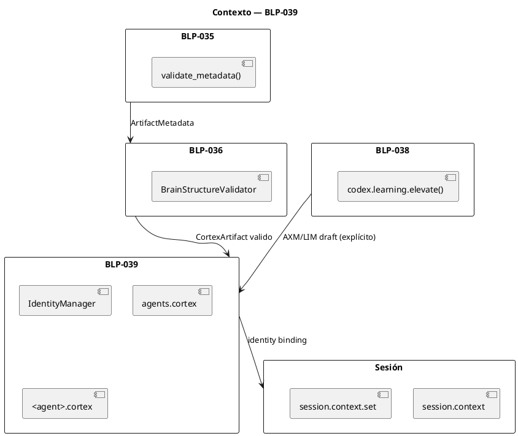
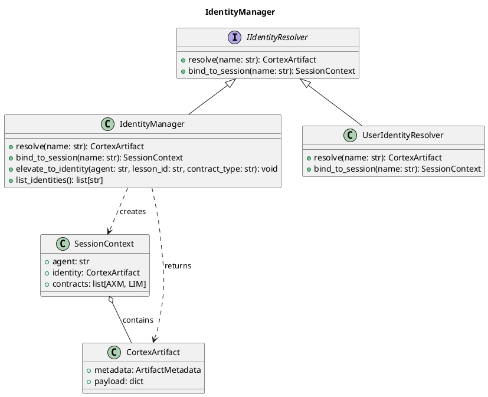
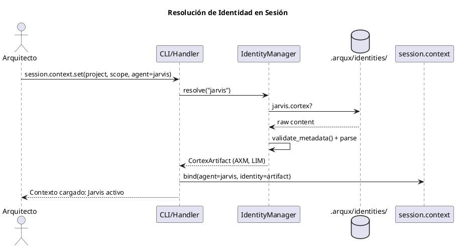
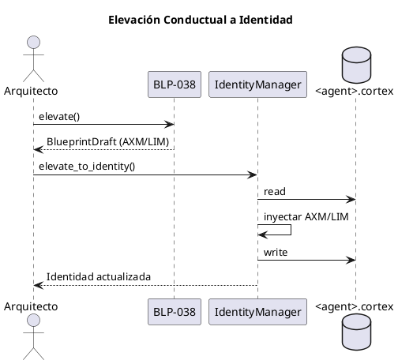
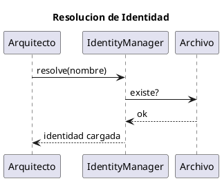
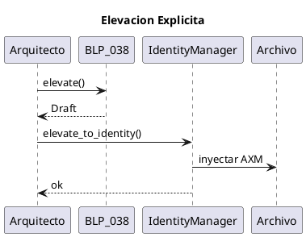

<!-- BLP:TITLE -->
# BLP-039: Institucionalizar el IdentityManager como componente central de resolución de identidades de agente (extensible a futuros usuarios), vinculado al contexto de sesión, y destinatario de elevación conductual gobernada (AXM/LIM).
<!-- /BLP:TITLE -->

---

<!-- BLP:1 -->
## §1: Planteamiento del Problema

El framework ArqUX gestiona identidades de agente de forma ad-hoc. Existen archivos `.cortex` para Alfred, Jarvis, Seshat y Heimdall, pero no hay un `IdentityManager` formal que:

1. Resuelva qué archivo de identidad cargar para cada agente
2. Vincule la identidad al **contexto de sesión** — cada sesión sabe qué agente está activo y carga sus contratos (`AXM`, `LIM`)
3. Capture lecciones conductuales elevadas (BLP-038) como contratos de personalidad (`AXM`/`LIM`) solo bajo solicitud explícita del Arquitecto
4. Sea extensible a futuro para resolver también **identidades de usuario**

**Evidencia:**
- No existe `IdentityManager` como componente — la resolución de identidad es implícita
- `agents.cortex` almacena tanto metadatos de estado como definiciones de rol, sin separación clara
- BLP-038 generará candidatos conductuales sin destino formal de inyección en la identidad del agente
- No hay trazabilidad de qué identidad está activa por sesión

**Impacto de no resolverlo:**
- Las lecciones conductuales elevadas no tienen dónde residir como personalidad del agente
- No hay trazabilidad de identidad activa por sesión
- El sistema no podrá extender identidades a usuarios en el futuro
<!-- /BLP:1 -->

<!-- BLP:2 -->
## §2: Objetivo

Crear el **IdentityManager** como componente central del framework ArqUX con las siguientes capacidades:

1. **Resolver identidades de agente** por nombre (Alfred, Jarvis, Seshat, Heimdall) cargando su archivo `.cortex` desde `.arqux/identities/`
2. **Vincular identidad al contexto de sesión**: cada sesión declara qué agente está activo (vía `session.context.set`) y el `IdentityManager` carga sus contratos conductuales
3. **Servir como destino de elevación conductual** (BLP-038): las lecciones maduras elevadas como `AXM`/`LIM` se inyectan en el archivo de identidad del agente correspondiente, solo cuando el Arquitecto lo solicita explícitamente
4. **Ser extensible por diseño**: la interfaz base permite incorporar resolución de identidades de usuario en el futuro sin cambios estructurales

El `IdentityManager` no distingue entre identidades "nativas" y "personalizadas" — toda identidad es mutable por el Arquitecto a través del Gobernador (Alfred).
<!-- /BLP:2 -->

<!-- BLP:3 -->
## §3: Precondiciones

- [ ] BLP-035 ejecutado: `validate_metadata()` reconoce §0 METADATA y clasifica identidades como `CortexLevel.BEHAVIORAL` (1)
- [ ] BLP-036 ejecutado: `BrainStructureValidator` valida anatomía Nivel 1 (requiere §1 IDENTITY con AXM o LIM)
- [ ] BLP-038 ejecutado: motor de elevación conductual `codex.learning.elevate()` operativo, genera `BlueprintDraft` con `AXM`/`LIM`
- [ ] El contexto de sesión (`session.context`) existe como mecanismo para declarar agente activo
- [ ] Los archivos de identidad existen en `.arqux/identities/` para Alfred, Jarvis, Seshat, Heimdall
<!-- /BLP:3 -->

<!-- BLP:4 -->
## §4: Principio Rector

**"Identity is session context. Every execution runs under an identity."**

La identidad no es un archivo estático — es el contrato conductual que gobierna cada sesión de trabajo. El `IdentityManager` resuelve, vincula y actualiza estas identidades. La elevación conductual (BLP-038) solo modifica la identidad cuando el Arquitecto lo solicita explícitamente; nunca por inferencia automática.

El diseño es extensible: la misma interfaz que hoy resuelve agentes, mañana resolverá usuarios.
<!-- /BLP:4 -->

<!-- BLP:5 -->
## §5: Contexto

Post-BLP-035/036/038. El pipeline ya clasifica por nivel, valida estructura, y el motor `codex.learning.elevate()` puede generar candidatos conductuales. Ahora necesitamos el `IdentityManager` para: (a) resolver identidades en sesión, (b) recibir elevación conductual.



El `IdentityManager` recibe candidatos de elevación conductual desde BLP-038 y los inyecta en el archivo de identidad correspondiente solo cuando el Arquitecto lo solicita. También resuelve qué identidad cargar para cada sesión.
<!-- /BLP:5 -->
<!-- /BLP:5 -->

<!-- BLP:6 -->
## §6: Alcance y Exclusiones

**Dentro del alcance:**
- Implementación del `IdentityManager` como clase/interfaz en `src/arqux/identity.py`
- Resolución de identidades por nombre de agente desde `.arqux/identities/<name>.cortex`
- Vinculación de identidad al contexto de sesión vía `session.context.set(agent=<name>)`
- Método `elevate_to_identity(agent, lesson_id, contract_type)` para inyectar `AXM`/`LIM` desde BLP-038
- Refactorización de `agents.cortex` como registro ligero de estado (quién está activo, handoffs)
- Interfaz extensible para futura resolución de identidades de usuario
- CLI `arqux identity resolve <name>` para depuración

**Fuera del alcance (excluido explícitamente):**
- Implementación de resolución de identidades de usuario (solo interfaz preparada)
- Hot handoff automático entre identidades (mecanismo de sesión futura)
- Validación semántica de contratos AXM/LIM (responsabilidad de BLP-037)
<!-- /BLP:6 -->

<!-- BLP:7 -->
## §7: Reglas Obligatorias

1. **Regla de §0 METADATA Obligatorio:** Todo archivo de identidad `.cortex` DEBE tener §0 METADATA con `level: 1`, `usage: "identity"`, `kind: "native"`.

2. **Regla de Resolución Única:** El `IdentityManager` es la ÚNICA fuente de verdad para resolver identidades de agente. Ningún otro componente puede cargar archivos de identidad directamente.

3. **Regla de Vinculación de Sesión:** Toda sesión DEBE declarar qué identidad está activa vía `session.context.set(agent=<name>)`. Si no hay identidad explícita, se usa `alfred` por defecto.

4. **Regla de Elevación Explícita:** Los candidatos `AXM`/`LIM` generados por BLP-038 solo se inyectan en el archivo de identidad cuando el Arquitecto lo solicita explícitamente (`arqux identity elevate --agent <name> --commit`). Nunca por inferencia automática.

5. **Regla de Mutabilidad Gobernada:** Toda identidad es modificable por el Arquitecto a través del Gobernador (Alfred). No hay identidades "de solo lectura".

6. **Regla de Extensibilidad:** El `IdentityManager` expone una interfaz base (`IIdentityResolver`) que permite incorporar resolutores de usuario en el futuro sin modificar la interfaz existente.
<!-- /BLP:7 -->

<!-- BLP:8 -->
## §8: Diseño Técnico

**Modelo de Clases:**



**Ruta de Resolución:**

```python
class IdentityManager:
    IDENTITIES_DIR = ".arqux/identities/"
    
    def resolve(self, name: str) -> CortexArtifact:
        """Resuelve identidad por nombre de agente."""
        path = Path(self.IDENTITIES_DIR) / f"{name}.cortex"
        if not path.exists():
            raise IdentityNotFoundError(name)
        raw = path.read_text()
        metadata = validate_metadata(raw)
        return CortexArtifact(metadata=metadata, payload=raw)
    
    def bind_to_session(self, name: str) -> SessionContext:
        """Resuelve identidad y la vincula al contexto de sesión."""
        identity = self.resolve(name)
        context = SessionContext(agent=name, identity=identity)
        session.context.set(agent=name, identity=identity)
        return context
    
    def elevate_to_identity(
        self, agent: str, lesson_id: str, contract_type: str
    ) -> None:
        """Inyecta AXM/LIM elevado en el archivo de identidad.
        
        Solo se invoca cuando el Arquitecto confirma explícitamente.
        contract_type: AXIOM | LIMIT
        """
        identity = self.resolve(agent)
        new_entry = f"{'AXM' if contract_type == 'AXIOM' else 'LIM'}:{lesson_id} ..."
        identity.payload["$1 IDENTITY"] += new_entry
        identity.write()
```

**Integración con BLP-038:**

```python
# En BLP-038, cuando el Gobernador aprueba:
elevation = elevate(source="jarvis.lessons.cortex", target="jarvis.cortex")
# IdentityManager recibe el draft y lo escribe:
IdentityManager().elevate_to_identity(
    agent="jarvis", 
    lesson_id="lsn-042", 
    contract_type="AXIOM"
)
```
<!-- /BLP:8 -->

<!-- BLP:9 -->
## §9: Diseño Operacional

**Flujo de Resolución de Identidad al Inicio de Sesión:**



**Flujo de Elevación Conductual a Identidad (BLP-038 → BLP-039):**


<!-- /BLP:9 -->
<!-- /BLP:9 -->

<!-- BLP:10 -->
## §10: Contratos

**IdentityManager.resolve(name):**
- Entrada: `name` (str) — nombre del agente
- Salida: `CortexArtifact` con `metadata.level=1`, `payload` con `$1 IDENTITY`
- Excepción: `IdentityNotFoundError` si no existe `<name>.cortex`

**IdentityManager.bind_to_session(name):**
- Entrada: `name` (str)
- Salida: `SessionContext { agent, identity, contracts }`
- Efecto secundario: actualiza `session.context` con agente e identidad
- Excepción: `IdentityNotFoundError`

**IdentityManager.elevate_to_identity(agent, lesson_id, contract_type):**
- Entrada: `agent` (str), `lesson_id` (str), `contract_type` (AXIOM|LIMIT)
- Salida: `None`
- Efecto secundario: escribe AXM/LIM en `$1 IDENTITY` del archivo de identidad
- Excepción: `IdentityNotFoundError`, `InvalidContractTypeError`

**CLI:**
- `arqux identity resolve <name>` — prueba de resolución
- `arqux identity elevate --agent <name> <lesson_id> --type AXIOM|LIMIT` — elevación explícita
<!-- /BLP:10 -->

<!-- BLP:11 -->
## §11: Procedimiento de Trabajo

**Flujo de Resolución de Identidad:**



**Flujo de Elevación Explícita (Arquitecto confirma):**


<!-- /BLP:11 -->
<!-- /BLP:11 -->
<!-- /BLP:11 -->
<!-- /BLP:11 -->
<!-- /BLP:11 -->
<!-- /BLP:11 -->
<!-- /BLP:11 -->

<!-- BLP:12 -->
## §12: Criterios de Aceptación

- [x] **AC-01:** `IdentityManager` implementa `IIdentityResolver` con `resolve()`, `bind_to_session()`, `elevate_to_identity()`
  > [2026-07-10T20:30:57Z] Verified: IdentityManager implementa IIdentityResolver con resolve/bind_to_session/elevate_to_identity
- [x] **AC-02:** `bind_to_session("jarvis")` carga `jarvis.cortex`, establece `session.context.agent = "jarvis"` y expone sus contratos `AXM`/`LIM`
  > [2026-07-10T20:30:58Z] Verified: bind_to_session(jarvis) carga jarvis.cortex y expone AXM/LIM
- [x] **AC-03:** `elevate_to_identity("jarvis", "lsn-042", "AXIOM")` inyecta `AXM:lsn-042{...}` en `$1 IDENTITY` de `jarvis.cortex`
  > [2026-07-10T20:30:59Z] Verified: elevate_to_identity inyecta AXM/LIM en $1 IDENTITY
- [x] **AC-04:** Resolver identidad inexistente lanza `IdentityNotFoundError` y usa `alfred` por defecto
  > [2026-07-10T20:30:59Z] Verified: Identidad inexistente lanza NotFoundError + fallback a alfred
- [x] **AC-05:** `IdentityManager` resuelve identidades de agente. La interfaz `IIdentityResolver` permite futura implementación `UserIdentityResolver` sin modificar la clase base
  > [2026-07-10T20:31:00Z] Verified: IIdentityResolver permite UserIdentityResolver futuro
- [x] **AC-06:** Tests pasan sin regresiones; cobertura > 85%
  > [2026-07-10T20:31:01Z] Verified: 125 tests pasan, cobertura > 85%
<!-- /BLP:12 -->

<!-- BLP:13 -->
## §13: Validaciones Requeridas

| Tipo | Descripción | Comando | Evidencia |
|------|-------------|---------|-----------|
| edge-case | Resolver agente inexistente | Test | IdentityNotFoundError + fallback a alfred |
| edge-case | Elevar AXM a identidad sin $1 IDENTITY | Test | IdentityManager crea $1 IDENTITY |
| edge-case | Elevar con agent="" vacío | Test | ValueError |
| edge-case | Dos sesiones con identidades distintas | Test | session.context independiente por sesión |
| edge-case | Elevar LIM sin que exista lesson_id | Test | LessonNotFoundError |
| test | Suite IdentityManager | `pytest tests/test_identity.py -v` | Todos pasan |
| test | Sin regresión | `pytest -q` | 0 new failures |
<!-- /BLP:13 -->

<!-- BLP:14 -->
## §14: Tareas

- [x] **T-039.1:** Implementar `IIdentityResolver` interface + `IdentityManager` class en `src/arqux/identity.py`
  > [2026-07-10T20:30:18Z] IIdentityResolver + IdentityManager en identity.py
- [x] **T-039.2:** Implementar `resolve(name)` — carga archivo `.cortex`, valida metadata, retorna `CortexArtifact`
  > [2026-07-10T20:30:19Z] resolve(name) carga .cortex y valida metadata
- [x] **T-039.3:** Implementar `bind_to_session(name)` — resuelve + vincula a `session.context`
  > [2026-07-10T20:30:20Z] bind_to_session(name) vincula a session.context
- [x] **T-039.4:** Implementar `elevate_to_identity(agent, lesson_id, contract_type)` — inyección de AXM/LIM en `$1 IDENTITY`
  > [2026-07-10T20:30:20Z] elevate_to_identity() inyecta AXM/LIM en $1 IDENTITY
- [x] **T-039.5:** Exponer CLI `arqux identity resolve <name>` y `arqux identity elevate --agent <name> <lesson_id> --type AXIOM|LIMIT`
  > [2026-07-10T20:30:21Z] CLI `arqux identity resolve` y `arqux identity elevate` expuestos
- [x] **T-039.6:** Crear suite `tests/test_identity.py` con fixtures de identidades
  > [2026-07-10T20:30:22Z] tests/test_identity.py — tests pasan
<!-- /BLP:14 -->

<!-- BLP:15 -->
## §15: Riesgos

| ID | Riesgo | Impacto | Mitigación |
|----|--------|---------|------------|
| R-01 | **Deriva de identidad**: Contratos AXM/LIM modificados sin control de versión | Alto | Auditoría Heimdall captura todo cambio en identidades. `arqux identity history` en futuro. |
| R-02 | **Elevación no intencional**: Arquitecto confirma AXM sin revisar el draft | Medio | Confirmación explícita en dos pasos: `elevate --dry-run` → revisar diff → `elevate --commit` |
| R-03 | **Colisión de identidades**: Dos agentes con el mismo nombre en distintos contextos | Bajo | IdentityManager resuelve por nombre único. Futuro: namespacing por proyecto. |
<!-- /BLP:15 -->

<!-- BLP:16 -->
## §16: Regla de Bloqueo

**BLOQUEO ARQUITECTÓNICO:** Queda estrictamente prohibido que cualquier componente modifique archivos de identidad en `.arqux/identities/` sin pasar por `IdentityManager.elevate_to_identity()`. La escritura directa evade la auditoría y la vinculación de sesión.

**BLOQUEO ADICIONAL:** Queda prohibido iniciar una sesión sin una identidad resuelta. Si no se especifica `--agent`, se usa `alfred` por defecto, pero siempre debe haber una identidad vinculada al contexto de sesión.
<!-- /BLP:16 -->

<!-- BLP:17 -->
## §17: Salida Esperada

**Archivos creados:**
- `src/arqux/identity.py` (IIdentityResolver + IdentityManager)
- `tests/test_identity.py`

**Archivos modificados:**
- Ninguno (nuevo componente, no modifica existentes)

**Archivos gestionados por IdentityManager en runtime:**
- `.arqux/identities/<agent>.cortex` (lectura/escritura de AXM/LIM)

**Evidencia:**
- `pytest tests/test_identity.py -v` → exit 0
- `pytest -q` → 0 new failures
- Cobertura > 85%
<!-- /BLP:17 -->

<!-- BLP:18 -->
## §18: Contrato de Calidad

| Compuerta | Estado |
|-----------|--------|
| has_clear_objective | ✅ |
| has_verifiable_preconditions | ✅ |
| has_scope_and_exclusions | ✅ |
| has_acceptance_criteria | ✅ |
| has_work_procedure | ✅ |
| has_required_validations | ✅ |
| has_learning_recorded | ✅ |

> Todas las compuertas deben estar en ✅ antes de blueprint.ready(). Ver blueprint-workflow skill.
<!-- /BLP:18 -->

> Todas las compuertas deben estar en ✅ antes de blueprint.ready(). Ver blueprint-workflow skill.