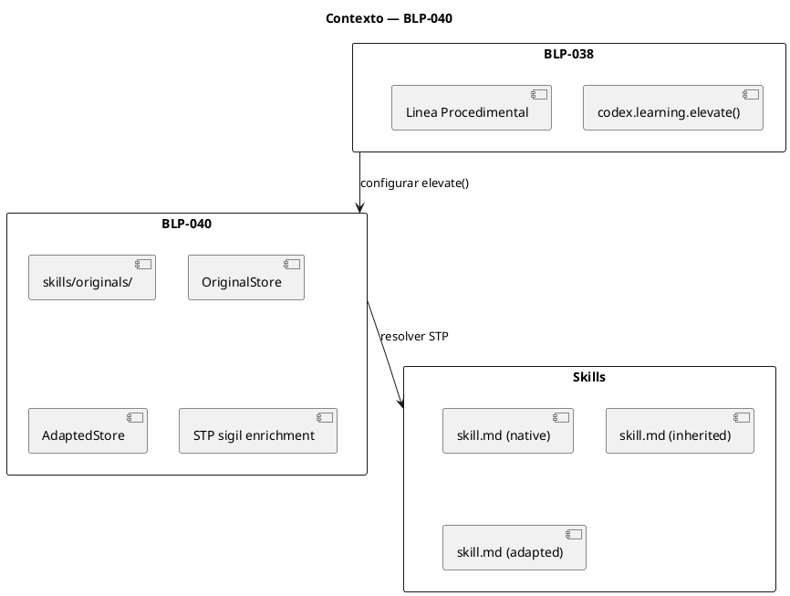
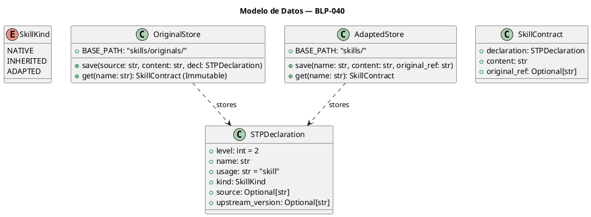
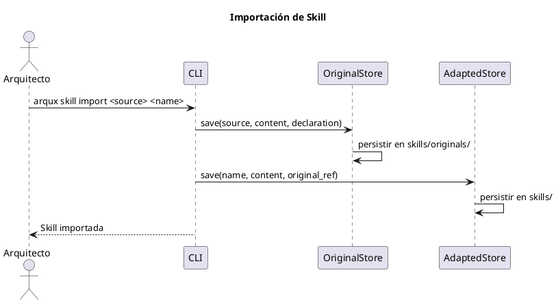
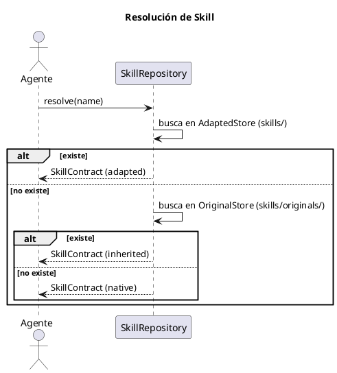
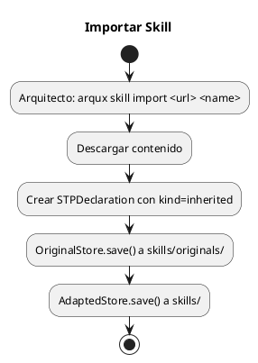
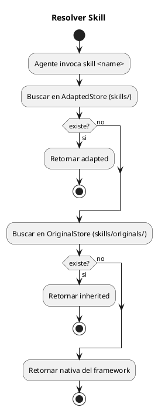

<!-- BLP:TITLE -->
# BLP-040: Institucionalizar la Trazabilidad de Skills (Línea Procedimental) creando skills/originals/ para preservar artefactos fuente inmutables, OriginalStore/AdaptedStore para resolución, y enriquecer el sigilo STP con metadatos de procedencia (kind, source, upstream_version).
<!-- /BLP:TITLE -->

---

<!-- BLP:1 -->
## §1: Planteamiento del Problema

La línea Procedimental de aprendizaje (BLP-038) carece de infraestructura de trazabilidad. Actualmente:

1. Las skills se gestionan como archivos planos sin registro de procedencia
2. No existe un directorio `skills/originals/` que preserve artefactos fuente inmutables
3. Los sigilos `STP` no poseen metadatos de origen, versión ni tipo (`native` | `inherited` | `adapted`)
4. No hay distinción entre una skill nativa del framework, una importada de terceros, o una adaptada localmente
5. El motor `codex.learning.elevate()` no tiene un `LessonStore` configurado para la línea procedimental

**Evidencia:**
- Los archivos `.skill.md` existentes no tienen §0 METADATA con procedencia
- No existe `skills/originals/` en ningún workspace
- No hay `OriginalStore` ni `AdaptedStore` como componentes

**Impacto de no resolverlo:**
- Skills importadas de terceros se modifican sin registro del original
- No hay trazabilidad de versiones upstream
- La línea procedimental de BLP-038 queda incompleta sin su capa de almacenamiento
<!-- /BLP:1 -->

<!-- BLP:2 -->
## §2: Objetivo

Crear la infraestructura de trazabilidad para la línea Procedimental de aprendizaje:

1. **`skills/originals/`**: Directorio para preservar artefactos fuente inmutables de terceros
2. **`OriginalStore`**: Componente de solo lectura para skills importadas
3. **`AdaptedStore`**: Componente de lectura/escritura para skills adaptadas localmente
4. **Enriquecer sigilo `STP`**: con metadatos `kind` (native|inherited|adapted), `source`, `upstream_version`
5. **CLI `arqux skill import`**: para importar skills externas con preservación del original
6. **Integración con BLP-038**: configurar `codex.learning.elevate()` para la línea procedimental
<!-- /BLP:2 -->

<!-- BLP:3 -->
## §3: Precondiciones

- [ ] El Motor de Inferencia (BLP-035) clasifica los archivos `.skill.md` como Nivel 2 (SKILL).
- [ ] El framework distingue conceptualmente entre el conocimiento procedural creado internamente (Nativo) y el importado de fuentes externas (Heredado).
- [ ] Los Handlers MCP tienen capacidad de lectura/escritura en el sistema de archivos del workspace.
<!-- /BLP:3 -->

<!-- BLP:4 -->
## §4: Principio Rector

**"Preserve the source, track the change. Every skill knows its origin."**

El conocimiento procedimental importado de terceros debe preservarse inmutable. Las adaptaciones locales deben enlazar explícitamente al original. El sigilo `STP` no solo almacena el procedimiento — declara su procedencia mediante `kind` (native|inherited|adapted), `source` y `upstream_version`.

La elevación procedural (STP→CNST o STP→CLAIM) usa el mismo motor `codex.learning.elevate()` configurado sobre el contenedor de skill correspondiente (BLP-038).
<!-- /BLP:4 -->

<!-- BLP:5 -->
## §5: Contexto

Post-BLP-035/036/038/039. El pipeline clasifica por nivel, valida estructura, el motor `codex.learning.elevate()` está operativo para tres líneas, y el `IdentityManager` resuelve identidades. La línea Procedimental necesita su capa de almacenamiento y trazabilidad.


<!-- /BLP:5 -->
<!-- /BLP:5 -->

<!-- BLP:6 -->
## §6: Alcance y Exclusiones

**Dentro del alcance:**
- Creación de `skills/originals/` en el workspace
- Implementación de `OriginalStore` (solo lectura) y `AdaptedStore` (lectura/escritura)
- Enriquecimiento del sigilo `STP` con metadatos: `kind`, `source`, `upstream_version`
- CLI `arqux skill import <source> <name>` para importación
- CLI `arqux skill list` para listar skills con procedencia
- Resolución: AdaptedStore > OriginalStore > nativas
- Integración con BLP-038: configurar `codex.learning.elevate()` para línea procedimental

**Fuera del alcance (excluido explícitamente):**
- Mecanismo de evolución interna STP→CNST/CLAIM (definido en BLP-038, no se replica)
- Validación semántica de skills (BLP-037)
- Migración de skills existentes (se hace en ejecución, no en diseño)
<!-- /BLP:6 -->

<!-- BLP:7 -->
## §7: Reglas Obligatorias

1. **Regla de §0 METADATA Obligatorio:** Todo archivo `.skill.md` DEBE tener §0 METADATA con `level: 2`, `usage: "skill"`, y `kind: "native"` | `"inherited"` | `"adapted"`.

2. **Regla de kind Único:** El campo `kind` vive exclusivamente en §0 METADATA. No se duplica en frontmatter YAML.

3. **Regla de Inmutabilidad del Original:** Los archivos dentro de `skills/originals/` son de Solo Lectura. Ningún agente puede modificarlos.

4. **Regla de Atribución Obligatoria:** Toda skill con `kind: "inherited"` DEBE poseer los metadatos `source` y `upstream_version` en §0 METADATA.

5. **Regla de Adaptación Explícita (Forking):** Para modificar una skill heredada, crear copia en `skills/` con `kind: "adapted"` y enlace al original.

6. **Regla de Resolución:** SkillRepository resuelve por prioridad: AdaptedStore > OriginalStore > Nativas del framework.

7. **Regla de Elevación Procedimental:** `codex.learning.elevate()` es el único motor de elevación STP→CNST/CLAIM en la línea procedimental (BLP-038).
<!-- /BLP:7 -->

<!-- BLP:8 -->
## §8: Diseño Técnico

**Modelo de Datos:**



**§0 METADATA para Skills (sigilo STP):**

```yaml
§0 METADATA{
  level: 2,
  name: "owasp-top10",
  usage: "skill",
  kind: "inherited",
  source: "https://owasp.org/Top10/",
  upstream_version: "2021"
}
---
STP:check-session{
  procedure: "Verify session timeout configuration"
}
```

**Integración con BLP-038 (Línea Procedimental):**

```python
# Configuración de codex.learning.elevate() para skills
elevate(
    source="skills/owasp-top10.skill.md",
    target="skills/owasp-top10.skill.md",
    contract_type="CNST"  # STP maduro → CNST (constraint)
)
```

**API de Stores:**

```python
class OriginalStore:
    def save(source: str, content: str, declaration: STPDeclaration) -> None
    def get(name: str) -> SkillContract
    
class AdaptedStore:
    def save(name: str, content: str, original_ref: str) -> None
    def get(name: str) -> SkillContract
    def list() -> list[SkillContract]
```
<!-- /BLP:8 -->
<!-- /BLP:8 -->

<!-- BLP:9 -->
## §9: Diseño Operacional

**Flujo de Importación de Skill:**



**Flujo de Resolución de Skill (runtime):**


<!-- /BLP:9 -->
<!-- /BLP:9 -->

<!-- BLP:10 -->
## §10: Contratos

**OriginalStore.save(source, content, declaration):**
- Entrada: `source` (str), `content` (str), `declaration` (STPDeclaration)
- Salida: None
- Efecto: escribe archivo en `skills/originals/<name>.skill.md`

**OriginalStore.get(name):**
- Entrada: `name` (str)
- Salida: `SkillContract` (inmutable)
- Excepción: `SkillNotFoundError`

**AdaptedStore.save(name, content, original_ref):**
- Entrada: `name` (str), `content` (str), `original_ref` (str)
- Salida: None
- Efecto: escribe archivo en `skills/<name>.skill.md`

**CLI:**
- `arqux skill import <source> <name>` — importa skill externa
- `arqux skill list` — lista skills con procedencia
- `arqux skill resolve <name>` — prueba de resolución
<!-- /BLP:10 -->

<!-- BLP:11 -->
## §11: Procedimiento de Trabajo

**Flujo de Importación:**



**Flujo de Resolución:**


<!-- /BLP:11 -->
<!-- /BLP:11 -->

<!-- BLP:12 -->
## §12: Criterios de Aceptación

- [ ] **AC-01:** El comando `arqux init` crea el directorio `skills/originals/` en el workspace
- [ ] **AC-02:** `arqux skill import <source> <name>` descarga, preserva original en `originals/` y crea copia en `skills/`
- [ ] **AC-03:** Toda skill heredada tiene §0 METADATA con `kind: "inherited"`, `source` y `upstream_version`
- [ ] **AC-04:** `OriginalStore.get()` retorna la skill inmutable; no permite escritura
- [ ] **AC-05:** `AdaptedStore.get()` retorna la skill adaptada si existe, con prioridad sobre `OriginalStore`
- [ ] **AC-06:** SkillRepository resuelve por orden: Adapted > Original > Nativa
- [ ] **AC-07:** `codex.learning.elevate()` puede configurarse con source=skill.md para la línea procedimental
- [ ] **AC-08:** Tests pasan sin regresiones; cobertura > 85%
<!-- /BLP:12 -->

<!-- BLP:13 -->
## §13: Validaciones Requeridas

| Tipo | Descripción | Comando | Evidencia |
|------|-------------|---------|-----------|
| edge-case | Importar skill con nombre ya existente | Test | Sobrescribe adapted, preserva original |
| edge-case | Resolver skill que solo existe como nativa | Test | Retorna nativa |
| edge-case | Resolver skill inexistente | Test | SkillNotFoundError |
| edge-case | AdaptedStore sin original_ref | Test | Warning W005_MISSING_ORIGINAL_REF |
| test | Suite skills | `pytest tests/test_skills.py -v` | Todos pasan |
| test | Sin regresión | `pytest -q` | 0 new failures |
<!-- /BLP:13 -->

<!-- BLP:14 -->
## §14: Tareas

- [ ] **T-040.1:** Crear `skills/originals/` en `arqux init`
- [ ] **T-040.2:** Implementar `OriginalStore` en `src/arqux/skills.py` (solo lectura, path base `skills/originals/`)
- [ ] **T-040.3:** Implementar `AdaptedStore` en `src/arqux/skills.py` (lectura/escritura, path base `skills/`)
- [ ] **T-040.4:** Implementar `SkillRepository.resolve(name)` con prioridad Adapted > Original > Nativa
- [ ] **T-040.5:** CLI `arqux skill import <source> <name>` y `arqux skill list`
- [ ] **T-040.6:** Enriquecer sigilo `STP` con metadatos `kind`, `source`, `upstream_version`
- [ ] **T-040.7:** Integrar línea procedimental con `codex.learning.elevate()` (BLP-038)
- [ ] **T-040.8:** Crear suite `tests/test_skills.py`
<!-- /BLP:14 -->

<!-- BLP:15 -->
## §15: Riesgos

| ID | Riesgo | Impacto | Mitigación |
|----|--------|---------|------------|
| R-01 | **Deriva de Conocimiento (Knowledge Drift)**: Adaptaciones locales se vuelven tan específicas que pierden relación con el original | Medio | Reporte Heimdall de skills no revisadas en > 6 meses |
| R-02 | **OriginalStore sin actualizar**: La fuente upstream cambia pero el original no se sincroniza | Alto | Warning W004_STALE_INHERITED_SKILL en resolución si hay desviación |
| R-03 | **Colisión de nombres**: Skill importada con mismo nombre que nativa | Bajo | Resolución prioriza Adapted/Original sobre Nativa |
<!-- /BLP:15 -->

<!-- BLP:16 -->
## §16: Regla de Bloqueo

**BLOQUEO ARQUITECTÓNICO:** Queda estrictamente prohibido que los agentes (Jarvis, Seshat) utilicen herramientas de edición para mutar directamente los archivos dentro de `skills/originals/`. La única vía de modificación es vía `AdaptedStore.save()` que crea una copia adaptada en `skills/`.

**BLOQUEO ADICIONAL:** Queda prohibido eludir la resolución de `SkillRepository` para cargar skills directamente desde el sistema de archivos.
<!-- /BLP:16 -->

<!-- BLP:17 -->
## §17: Salida Esperada

**Archivos creados:**
- `src/arqux/skills.py` (OriginalStore, AdaptedStore, SkillRepository)
- `tests/test_skills.py`

**Archivos modificados:**
- `src/arqux/cli.py` (comandos `arqux skill import` y `arqux skill list`)

**Directorios creados en runtime:**
- `skills/originals/`

**Evidencia:**
- `pytest tests/test_skills.py -v` → exit 0
- `pytest -q` → 0 new failures
- Cobertura > 85%
<!-- /BLP:17 -->

<!-- BLP:18 -->
## §18: Contrato de Calidad

| Compuerta | Estado |
|-----------|--------|
| has_clear_objective | ✅ |
| has_verifiable_preconditions | ✅ |
| has_scope_and_exclusions | ✅ |
| has_acceptance_criteria | ✅ |
| has_work_procedure | ✅ |
| has_required_validations | ✅ |
| has_learning_recorded | ✅ |

> Todas las compuertas deben estar en ✅ antes de blueprint.ready(). Ver blueprint-workflow skill.
<!-- /BLP:18 -->

> Todas las compuertas deben estar en ✅ antes de blueprint.ready(). Ver blueprint-workflow skill.