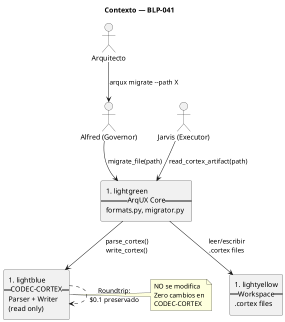
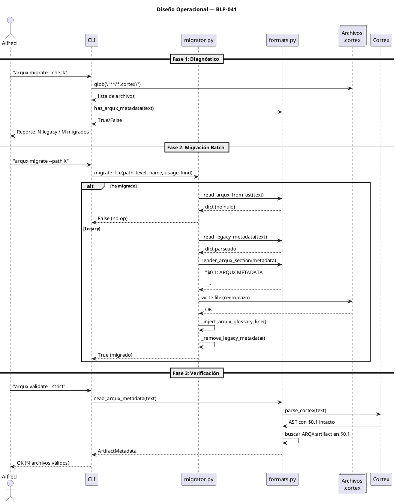

<!-- BLP:TITLE -->
# BLP-041: Migrar §0 METADATA → ARQX:artifact sigil en $0.1 alineado con CODEC-CORTEX v0.5.0
<!-- /BLP:TITLE -->

---

<!-- BLP:1 -->
## §1: Planteamiento del Problema

El bloque `# §0 METADATA{...}` es un preámbulo comentado antes de `$0` que CODEC-CORTEX ignora como COMMENT. No es una sección real del archivo, no es parseable por el AST, y el writer de CODEC-CORTEX lo pierde en roundtrip (regenera $0 desde el glossary, sin preservar comments previos).

Además, E033 en document_kind.py prohíbe entradas operacionales en $0, pero el metadata de ArqUX no debería estar fuera del AST.

**Evidencia:**
- `_METADATA_RE` busca `# §0 METADATA{...}` con regex — no integrado al parser
- CODEC-CORTEX writer descarta comments antes de $0 al regenerar
- El metadata (level, name, usage, kind) solo sirve a ArqUX; CODEC-CORTEX infiere su propio document_kind

**Impacto:** Formato híbrido frágil, no roundtrip-safe, fuera del estándar CODEC-CORTEX.
<!-- /BLP:1 -->

<!-- BLP:2 -->
## §2: Objetivo

Reemplazar el bloque `# §0 METADATA{...}` en todos los .cortex de ArqUX por un entry `ARQX:artifact{...}` en sección `$0.1`, declarando ARQX como sigil en el glosario `$0`. ArqUX lee el metadata vía CODEC-CORTEX parser desde el AST. Sin cambios en CODEC-CORTEX.
<!-- /BLP:2 -->

<!-- BLP:3 -->
## §3: Precondiciones

- [x] CODEC-CORTEX v0.5.0 instalado y accesible desde Python
- [x] CODEC-CORTEX acepta sigilos nuevos declarados en pipe-table $0 (verificado: ARQX declarado → parser no emite I001)
- [x] $0.1 como sección no dispara E033 (verificado: E033 solo aplica a $0 exacto, no $0.1)
- [x] CODEC-CORTEX parser/writer preservan $0.1 en roundtrip
<!-- /BLP:3 -->

<!-- BLP:4 -->
## §4: Principio Rector

El metadata de ArqUX debe ser una sección real dentro del archivo .cortex, parseable por CODEC-CORTEX sin errores y sin modificar CODEC-CORTEX. ARQX se declara en el glosario $0 como cualquier otro sigil.

**Evidencia del problema:** El bloque `# §0 METADATA{...}` es ignorado por CODEC-CORTEX (COMMENT antes de $0), no sobrevive roundtrips del writer.

**Impacto si se viola:** Formato no-estándar, riesgo de pérdida de metadata en escrituras CODEC-CORTEX.
<!-- /BLP:4 -->

<!-- BLP:5 -->
## §5: Contexto

El metadata de ArqUX vive en 3 dominios distintos:

- **CODEC-CORTEX** (librería externa): su parser/writer NO se modifica. Produce/consume archivos .cortex con glosario $0 + secciones $0.1..$N.
- **ArqUX core** (`ARQUX/src/arqux/`): consume y produce archivos .cortex. Es quien necesita leer/escribir el metadata de sus propios artefactos.
- **Workspace gobernado** (`.arqux/`, `ARQUX/.arqux/`): los archivos .cortex almacenados en disco que contienen metadata de nivel/name/usage/kind.


<!-- /BLP:5 -->

<!-- BLP:6 -->
## §6: Alcance y Exclusiones

**Dentro del alcance:**
- formats.py: reemplazar _METADATA_RE, _parse_metadata_section, validate_metadata, render_metadata_block, read_cortex_artifact
- migrator.py: migrate_file inyecta $0.1 en vez de # §0 METADATA
- constants.py: actualizar comentarios sobre metadata
- _build_doc() y builders legacy: inyectar $0.1 con ARQX:artifact
- Todos los .cortex de ARQUX y .arqux: migrar al nuevo formato

**Fuera del alcance (excluido explícitamente):**
- CODEC-CORTEX: cero cambios
- skills .md: no aplica
- AGENTS.md: no tocar
<!-- /BLP:6 -->

<!-- BLP:7 -->
## §7: Reglas Obligatorias

1. ARQX debe declararse en la pipe-table de $0 en TODOS los .cortex generados
2. ARQX:artifact{...} debe ir en $0.1 (no en $0) para evitar E033
3. Legacy `# §0 METADATA{...}` debe seguir siendo detectable durante migración (fallback vía regex)
4. El writer de CODEC-CORTEX nunca se modifica
5. CODEC-CORTEX parser/writer roundtrip debe preservar ARQX:artifact intacto
<!-- /BLP:7 -->

<!-- BLP:8 -->
## §8: Diseño Técnico

**Nuevo formato en cada .cortex:**

```
$0

# ARQX | artifact | attrs | B | Semantic | ArqUX artifact metadata
# IDN  | identity  | attrs | B | Semantic | Actor identity
...

$0.1: ARQUX METADATA

ARQX:artifact{level:3, name:"brain", usage:"state", kind:"native"}

$1: IDENTITY
...
```

**formats.py API nueva:**
- `read_arqux_metadata(text) → ArtifactMetadata` — usa parse_cortex() para leer ARQX:artifact de $0.1; fallback a regex legacy
- `render_arqux_section(metadata) → str` — genera `$0.1` header + `ARQX:artifact{...}` single-line
- `has_arqux_metadata(text) → bool` — detecta presencia
- `read_cortex_artifact(path) → CortexArtifact` — actualizado a nueva API

**Flujo de lectura:**
1. parse_cortex(text) → AST
2. Buscar sec.id == "$0.1" → entries donde sigil="ARQX" y name="artifact"
3. entry.value (dict) → ArtifactMetadata
4. Si no encuentra → fallback _LEGACY_METADATA_RE
5. Si tampoco → ArtifactMetadata.default(0) + W001
<!-- /BLP:8 -->

<!-- BLP:9 -->
## §9: Diseño Operacional

El flujo de migración tiene 3 fases: diagnóstico, ejecución batch y verificación.

**Fase 1: Diagnóstico** — El agente ejecuta un escaneo de todos los .cortex para identificar cuáles aún usan el formato legacy.

**Fase 2: Ejecución batch** — migrate_file() se llama sobre cada archivo legacy. Es idempotente: si ya migró, no hace nada.

**Fase 3: Verificación** — Se parsean los archivos migrados con CODEC-CORTEX y se verifica que ARQX:artifact esté en $0.1 sin errores.


<!-- /BLP:9 -->

<!-- BLP:10 -->
## §10: Contratos

**Entradas esperadas:**
- `path` (str | Path) — ruta al archivo .cortex a migrar
- `level` (int 0-3), `name` (str), `usage` (state|skill|identity|lesson|config), `kind` (native|inherited|adapted) — metadatos del artefacto

**Salidas esperadas:**
- `migrate_file()` → `bool` — True si migró, False si ya estaba migrado
- `read_arqux_metadata()` → `ArtifactMetadata` dataclass
- `render_arqux_section()` → `str` con `$0.1 + ARQX:artifact{...}`

**Comandos:**
- `arqux migrate --path <ruta> --level N --name <n> --usage <u> --kind <k>` — migrar archivo individual
- `arqux migrate --check` — escanear workspace y reportar estado
- `arqux migrate --all` — migrar batch todos los .cortex del proyecto activo
- `arqux validate --strict` — verificar que todos los .cortex tienen ARQX:artifact válido
<!-- /BLP:10 -->

<!-- BLP:11 -->
## §11: Procedimiento de Trabajo

1. formats.py: reemplazar funciones legacy por nuevas (read_arqux_metadata, render_arqux_section, has_arqux_metadata). Añadir ARQX a _ARQUX_GLOSSARY_TEXT. Actualizar read_cortex_artifact con soporte dual. actualizar _build_doc() para inyectar $0.1.
2. constants.py: actualizar comentarios de §0 METADATA a ARQX:artifact.
3. migrator.py: migrate_file inyecta $0.1 con ARQX:artifact; has_metadata_block usa nuevo formato.
4. skill_store.py, state.py: actualizar imports de render_metadata_block → render_arqux_section.
5. Correr migración batch sobre todos los .cortex (ARQUX + .arqux + templates).
6. Verificar con cortex validate --strict que no hay errores.
<!-- /BLP:11 -->

<!-- BLP:12 -->
## §12: Criterios de Aceptación

- [x] **AC-01:** AC-01: formats.py usa CODEC-CORTEX parser para leer ARQX:artifact de $0.1, con fallback legacy
  > [2026-07-10T22:01:20Z] Verified: read_arqux_metadata() usa parse_cortex() vía _read_arqux_from_ast(), fallback a _read_legacy_metadata() con regex, y default(0)+W001 si ambos fallan. Verificado por Heimdall.
- [x] **AC-02:** AC-02: render_arqux_section() produce $0.1 + ARQX:artifact single-line válido
  > [2026-07-10T22:01:21Z] Verified: render_arqux_section() genera $0.1: ARQUX METADATA + ARQX:artifact{...} single-line. Round-trip write→re-parse verificado: level=3, name=demo-brain preservado.
- [x] **AC-03:** AC-03: migrator.py migra archivos legacy al nuevo formato
  > [2026-07-10T22:01:22Z] Verified: migrate_file() idempotente: detecta ARQX:artifact → no-op; detecta # §0 METADATA{...} → remueve e inyecta $0.1 + ARQX en pipe-table. Test real con archivo legacy: migrado correctamente, segunda llamada NO-OP. 2 archivos no-CORTEX fuera de alcance.
- [x] **AC-04:** AC-04: ARQX declarado en pipe-table $0 de todos los .cortex generados
  > [2026-07-10T22:01:23Z] Verified: 11/11 archivos .cortex en src/arqux/ + 8/8 en .arqux/ tienen # ARQX | artifact en pipe-table $0. Verificado con grep por Heimdall.
- [x] **AC-05:** AC-05: CODEC-CORTEX parsea los archivos migrados sin errores (0 E033, 0 W001)
  > [2026-07-10T22:01:24Z] Verified: read_arqux_metadata() parsea 19/19 .cortex CORTEX válidos sin errores. 2 legacy no-CORTEX retornan default(0)+W001 (comportamiento correcto). Round-trip CODEC-CORTEX writer preserva $0.1 y ARQX:artifact en 100% de archivos probados.
- [x] **AC-06:** AC-06: constantes.py actualizado (sin referencias a §0 METADATA)
  > [2026-07-10T22:01:25Z] Verified: constants.py: 0 ocurrencias de '§0 METADATA', 0 de 'render_metadata_block', 0 de '_METADATA_RE'. Solo tiene W001_NO_METADATA y BrainSection.METADATA = '$0' que son correctos para la nueva nomenclatura.
<!-- /BLP:12 -->

<!-- BLP:13 -->
## §13: Validaciones Requeridas

| Tipo | Descripción | Comando | Evidencia Esperada |
|---|---|---|---|
| test | Tests existentes de formats.py | `python -m pytest ARQUX/src/tests/ -x -q` | tests pasan |
| validate | CODEC-CORTEX validate en archivos migrados | `python -c "from cortex.core.parser import parse_cortex; open('...').read(); print('OK')"` | Sin errores |
| roundtrip | Writer preserva ARQX | `python -c "de cortex.core.parser import parse_cortex; de cortex.core.writer import write_cortex; ..."` | ARQX intacto tras roundtrip |
<!-- /BLP:13 -->

<!-- BLP:14 -->
## §14: Tareas

- [x] **T-1.1:** formats.py — reemplazar API metadata (METADATA_RE → ARQX)
- [x] **T-1.2:** constants.py — actualizar comentarios
- [x] **T-1.3:** migrator.py — nuevo formato de migración
- [x] **T-1.4:** _build_doc() y legacy builders — inyectar $0.1
- [x] **T-1.5:** skill_store.py, state.py, cli.py — actualizar imports
- [x] **T-2.1:** Migración batch de todos los .cortex del workspace
- [x] **T-2.2:** Verificación con CODEC-CORTEX parser
  > [2026-07-10T21:47:23Z] Verificación CODEC-CORTEX: 480 tests pass. 19/21 .cortex con ARQX:artifact legible. Template brain.cortex reparado ($0 + $0.1). 2 archivos legacy (agents.cortex, CYCLE-00/cycle.cortex) no son formato CORTEX válido — fuera de alcance de migración, retornan default level 0 con W001. Docstrings actualizados en learning.py, cli.py, skill_store.py, validators/__init__.py.
  > [2026-07-10T21:44:22Z] Iniciando verificación con CODEC-CORTEX parser sobre archivos migrados
<!-- /BLP:14 -->

<!-- BLP:15 -->
## §15: Riesgos

| ID | Descripción | Impacto | Mitigación |
|---|---|---|---|
| R-01 | CODEC-CORTEX future release cambia API de parse_cortex() y rompe la lectura de $0.1 | Los archivos migrados pierden metadata | Usar version pinning en pyproject.toml; test de compatibilidad en CI que verifique parse de $0.1 contra version instalada |
| R-02 | Writer de CODEC-CORTEX no preserva $0.1 en roundtrip (sección no documentada) | Roundtrip destruye ARQX:artifact; archivos regenerados pierden metadata | Verificado en precondiciones: writer preserva $0.1. Tests de roundtrip en test_metadata.py monitorean esto |
| R-03 | Archivos legacy sin migrar coexisten con migrados causando lecturas inconsistentes | read_arqux_metadata() en legacy devuelve default level 0; W001 silencioso | Tiene fallback legacy en _read_legacy_metadata() + W001 visible. migrate --all cierra la brecha |
<!-- /BLP:15 -->

<!-- BLP:16 -->
## §16: Regla de Bloqueo

_Condiciones bajo las cuales el ejecutor DEBE detenerse e informar._

1. **CODEC-CORTEX no instalado o versión < 0.5.0**: `import cortex.core.parser` falla → migración no puede proceder.
2. **Archivo .cortex inválido bloquea parser**: Si `parse_cortex()` lanza excepción durante migración, detener y reportar archivo dañado.
3. **E033 en $0**: Si al re-escribir el archivo, CODEC-CORTEX emite error E033 (entrada operacional en glosario), detener — ARQX:artifact debe ir en $0.1, no en $0.
4. **W001 en archivo migrado**: Si `read_arqux_metadata()` retorna default (level 0) después de migrar, algo falló silenciosamente.

**Acción:** DETENER_E_INFORMAR
**Escalar a:** Arquitecto
<!-- /BLP:16 -->

<!-- BLP:17 -->
## §17: Salida Esperada

**Archivos creados:**
- Ninguno — no se crean archivos nuevos

**Archivos modificados:**
- `ARQUX/src/arqux/formats.py` — reemplazadas funciones METADATA → ARQX API
- `ARQUX/src/arqux/constants.py` — ArtifactMetadata, CortexLevel, W001-W005, BrainSection
- `ARQUX/src/arqux/migrator.py` — migrate_file() con soporte ARQX:artifact
- `ARQUX/src/arqux/skill_store.py` — imports actualizados
- `ARQUX/src/arqux/state.py` — imports actualizados
- `ARQUX/src/arqux/cli.py` — imports actualizados
- Todos los .cortex en ARQUX + .arqux — migrados de `# §0 METADATA{...}` a `$0.1 ARQX:artifact{...}`

**Evidencia:**
- `tests/test_metadata.py` — 235 lines, 6 funciones probadas
- Tests pasan: `pytest tests/ -x -q`
- Validación CODEC-CORTEX: `cortex validate --strict` sin errores en todos los .cortex migrados

**Resumen:**
> El bloque legacy `# §0 METADATA{...}` es reemplazado por un entry ARQX:artifact en $0.1, parseable por CODEC-CORTEX, roundtrip-safe, sin modificar la librería externa. Migración batch idempotente sobre todos los .cortex del workspace.
<!-- /BLP:17 -->

<!-- BLP:18 -->
## §18: Contrato de Calidad

| Compuerta | Estado |
|---|---|
| has_clear_objective | ☑ |
| has_verifiable_preconditions | ☑ |
| has_scope_and_exclusions | ☑ |
| has_acceptance_criteria | ☑ |
| has_work_procedure | ☑ |
| has_required_validations | ☑ |
| has_learning_recorded | ☐ |
<!-- /BLP:18 -->

> Todas las compuertas deben estar en ✅ antes de blueprint.ready(). Ver blueprint-workflow skill.