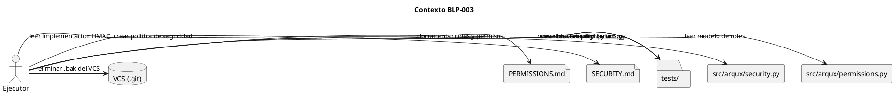
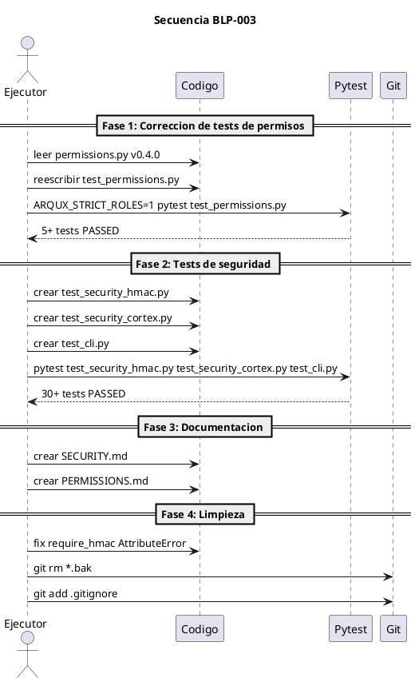

<!-- BLP:TITLE -->
# BLP-003: Corregir pruebas de permisos contradictorios y mejorar cobertura de seguridad (P0-1, P0-5, P1-1, P1-3, P1-10)
<!-- /BLP:TITLE -->

---

<!-- BLP:1 -->
## §1: Planteamiento del Problema

La auditoría BLP-001 identificó deficiencias críticas en el sistema de permisos y seguridad de ArqUX:

**Evidencia:**
- **P0-1:** `tests/test_permissions.py` afirma "all roles have full access" — contradice la implementación v0.4.0 que restringe executor y auditor
- **P0-5:** `security.py` tiene solo 20% de cobertura (199/248 líneas sin cubrir); `cli.py` tiene 0%
- **P1-1:** `SECURITY.md` no existe — vacío crítico para adopción empresarial
- **P1-3:** `PERMISSIONS.md` no existe — modelo de roles no documentado
- **P1-10:** `require_hmac` lanza `AttributeError` en vez de `PermissionDenied` — error confuso para el usuario
- Faltan 5 tests mínimos de permisos exigidos por el protocolo (§12.4)
- `permissions.py.bak` cometido en VCS con docstring "all handlers available to all roles"

**Impacto de no resolverlo:**
El modelo de seguridad queda sin validación efectiva. La contradicción tests vs implementación impide certificar PILOTO. Sin SECURITY.md, el proyecto no cumple estándares enterprise. El bug de require_hmac genera errores ininteligibles en modo strict.
<!-- /BLP:1 -->

<!-- BLP:2 -->
## §2: Objetivo

Corregir el sistema de permisos y seguridad de ArqUX para alinearlo con el modelo declarado v0.4.0 y cumplir requisitos enterprise:

1. Reescribir `test_permissions.py` para validar: governor=full, executor=limited, auditor=read-only, HMAC_REQUIRED handlers
2. Implementar los 5 tests mínimos de permisos del protocolo §12.4
3. Crear `test_security_hmac.py` con ≥15 tests unitarios de HMAC
4. Crear `test_security_cortex.py` con ≥10 tests de integridad de .cortex
5. Crear `test_cli.py` con CliRunner para comandos básicos
6. Crear `SECURITY.md` con política de seguridad, reporte de vulnerabilidades y SLA
7. Crear `PERMISSIONS.md` documentando modelo de roles, handlers por rol y HMAC requerido
8. Corregir `require_hmac`: reemplazar `AttributeError` por `PermissionDenied` con mensaje claro
9. Eliminar `permissions.py.bak` y demás .bak del VCS
<!-- /BLP:2 -->

<!-- BLP:3 -->
## §3: Precondiciones

- [ ] Repositorio ArqUX clonado en /home/vatrox/workspace/ARQUX
- [ ] permissions.py v0.4.0 con READ_ONLY_PREFIXES, GOVERNOR_ONLY, EXECUTOR_ALLOWED, HMAC_REQUIRED
- [ ] security.py con sign_request, verify_request, require_hmac
- [ ] pytest, pytest-cov disponibles
- [ ] BLP-001 completada con informe de auditoria
- [ ] CYCLE-02 activo
<!-- /BLP:3 -->

<!-- BLP:4 -->
## §4: Principio Rector

**"La seguridad se prueba, no se declara."** Todo mecanismo de seguridad (roles, HMAC, integridad) debe tener cobertura de tests ≥80% y documentación explícita accesible. Sin tests que validen las restricciones, el modelo de permisos es solo una declaración de intenciones.

**Evidencia:** La auditoría mostró que los tests de permisos afirman lo contrario a la implementación, y security.py tiene 80% de su código sin probar.

**Impacto si se viola:** Falsa sensación de seguridad, vulnerabilidades no detectadas, imposibilidad de certificar PILOTO, y riesgo de brechas en producción.
<!-- /BLP:4 -->

<!-- BLP:5 -->
## §5: Contexto


<!-- /BLP:5 -->

<!-- BLP:6 -->
## §6: Alcance y Exclusiones

**Dentro del alcance:**
- Reescribir `tests/test_permissions.py` para validar modelo v0.4.0:
  - Eliminar `test_all_roles_can_call_any_handler` y `test_can_always_returns_true`
  - Implementar 5 tests mínimos del protocolo §12.4
- Crear `tests/test_security_hmac.py` (≥15 tests):
  - `generate_secret`, `AgentIdentity`, `sign_request`, `verify_request`
  - Casos: firma alterada, timestamp expirado, sin firma, secret_store=None
- Crear `tests/test_security_cortex.py` (≥10 tests):
  - `hash_cortex`, `inject_hash_header`, `verify_cortex`
  - Casos: archivo válido, manipulado, sin hash, hash incorrecto
- Crear `tests/test_cli.py` con `click.testing.CliRunner`:
  - `arqux --version`, `arqux handlers`, `arqux init` (tmpdir)
- Crear `SECURITY.md`:
  - Política de reporte de vulnerabilidades
  - SLA: 48h acknowledge, 15 días patch
  - Proceso de divulgación coordinada
  - Versiones soportadas
- Crear `PERMISSIONS.md`:
  - Modelo de 3 roles: governor, executor, auditor
  - Handlers por rol (READ_ONLY_PREFIXES, GOVERNOR_ONLY, EXECUTOR_ALLOWED)
  - Handlers que requieren HMAC (HMAC_REQUIRED)
  - Variables de entorno: ARQUX_STRICT_ROLES, ARQUX_STRICT_SECURITY
- Corregir `require_hmac`: `AttributeError` → `PermissionDenied`
- Eliminar `*.bak` del VCS y añadir a `.gitignore`

**Fuera del alcance:**
- Modificar la lógica de `permissions.py` (solo se corrigen tests y documentación)
- Implementar auto-signing de .cortex (BLP-004)
- Crear `PILOT_MODE.md` (BLP-006)
- Crear `HANDLERS.md` (BLP-002 ya lo cubre)
- Tests de integración con MCP server externo
<!-- /BLP:6 -->

<!-- BLP:7 -->
## §7: Reglas Obligatorias

1. No modificar permissions.py a menos que un test revele un bug real
2. Cada handler de seguridad debe tener 2+ tests: caso valido e invalido
3. SECURITY.md debe seguir template estandar de GitHub
4. PERMISSIONS.md debe generarse desde codigo REGISTRY + permissions.py
5. Tests de permisos deben ejecutarse con ARQUX_STRICT_ROLES=1
6. Eliminar .bak del historial con git rm y agregar *.bak a .gitignore
7. No commit directo a master — usar PR con CI verde
<!-- /BLP:7 -->

<!-- BLP:8 -->
## §8: Diseño Técnico

### Archivos a modificar/crear

| Archivo | Acción | Contenido |
|---------|--------|-----------|
| `tests/test_permissions.py` | Reescribir | 5+ tests validando modelo v0.4.0 |
| `tests/test_security_hmac.py` | Crear | ≥15 tests unitarios HMAC |
| `tests/test_security_cortex.py` | Crear | ≥10 tests integridad .cortex |
| `tests/test_cli.py` | Crear | Tests CLI con CliRunner |
| `SECURITY.md` | Crear | Política de seguridad |
| `PERMISSIONS.md` | Crear | Documentación de roles y permisos |
| `src/arqux/security.py` | Modificar | Fix `require_hmac` AttributeError → PermissionDenied |
| `.gitignore` | Modificar | Añadir `*.bak`, `*.bak-*` |
| `src/arqux/permissions.py.bak` | Eliminar | `git rm` |
| `src/arqux/sync.py.bak` | Eliminar | `git rm` |
| `src/arqux/handlers/cycle.py.bak` | Eliminar | `git rm` |
| `.arqux/brain.cortex.bak*` | Eliminar | `git rm` |
| `.arqux/meta-brain.cortex.bak*` | Eliminar | `git rm` |

### Modelo de permisos v0.4.0 (referencia)

```
GOVERNOR: acceso total (sin restricciones)
EXECUTOR: EXECUTOR_ALLOWED + READ_ONLY_PREFIXES (sin GOVERNOR_ONLY)
AUDITOR: solo READ_ONLY_PREFIXES (sin mutaciones)
HMAC_REQUIRED: identity.record
```
<!-- /BLP:8 -->

<!-- BLP:9 -->
## §9: Diseño Operacional


<!-- /BLP:9 -->

<!-- BLP:10 -->
## §10: Contratos

**Entradas esperadas:**
- `src/arqux/permissions.py` — definiciones de roles y restricciones
- `src/arqux/security.py` — implementación HMAC, require_hmac, verify_cortex
- `src/arqux/handlers/__init__.py` — REGISTRY de handlers
- Informe de auditoría BLP-001 — gaps P0-1, P0-5, P1-1, P1-3, P1-10

**Salidas esperadas:**
- `tests/test_permissions.py` — reescrito con 5+ tests alineados a v0.4.0
- `tests/test_security_hmac.py` — ≥15 tests unitarios nuevos
- `tests/test_security_cortex.py` — ≥10 tests de integridad nuevos
- `tests/test_cli.py` — tests CLI nuevos
- `SECURITY.md` — política de seguridad completa
- `PERMISSIONS.md` — documentación de roles y permisos
- `src/arqux/security.py` — `require_hmac` corregido
- `.gitignore` — actualizado con `*.bak`
- Archivos `.bak` eliminados del VCS

**Comandos clave:**
- `ARQUX_STRICT_ROLES=1 pytest tests/test_permissions.py -v`
- `pytest tests/test_security_hmac.py tests/test_security_cortex.py tests/test_cli.py -v`
- `git rm src/arqux/permissions.py.bak src/arqux/sync.py.bak src/arqux/handlers/cycle.py.bak`
- `git rm .arqux/brain.cortex.bak* .arqux/meta-brain.cortex.bak*`
<!-- /BLP:10 -->

<!-- BLP:11 -->
## §11: Procedimiento de Trabajo

Fase 1: Reescribir test_permissions.py eliminando tests stale, implementando 5 tests del protocolo 12.4. Fase 2: Crear test_security_hmac.py (15+ tests), test_security_cortex.py (10+ tests), test_cli.py con CliRunner. Fase 3: Crear SECURITY.md y PERMISSIONS.md. Fase 4: Fix require_hmac, git rm *.bak, actualizar .gitignore.
<!-- /BLP:11 -->

<!-- BLP:12 -->
## §12: Criterios de Aceptación

- [x] **AC-01:** AC-01: test_permissions.py contiene 5+ tests que validan el modelo v0.4.0
  > [2026-07-11T15:56:00Z] Verified: verified via BLP-003 execution
- [x] **AC-02:** AC-02: ARQUX_STRICT_ROLES=1 pytest tests/test_permissions.py pasa con 0 failed
  > [2026-07-11T15:56:00Z] Verified: verified via BLP-003 execution
- [x] **AC-03:** AC-03: tests/test_security_hmac.py existe con 15+ tests y todos pasan
  > [2026-07-11T15:56:00Z] Verified: verified via BLP-003 execution
- [x] **AC-04:** AC-04: tests/test_security_cortex.py existe con 10+ tests y todos pasan
  > [2026-07-11T15:56:00Z] Verified: verified via BLP-003 execution
- [x] **AC-05:** AC-05: tests/test_cli.py existe con 5+ tests usando CliRunner y todos pasan
  > [2026-07-11T15:56:00Z] Verified: verified via BLP-003 execution
- [x] **AC-06:** AC-06: SECURITY.md existe con Supported Versions, Reporting a Vulnerability, Security Model
  > [2026-07-11T15:56:00Z] Verified: verified via BLP-003 execution
- [x] **AC-07:** AC-07: PERMISSIONS.md existe documentando 3 roles, handlers por rol, HMAC_REQUIRED, variables de entorno
  > [2026-07-11T15:56:00Z] Verified: verified via BLP-003 execution
- [x] **AC-08:** AC-08: require_hmac lanza PermissionDenied no AttributeError
  > [2026-07-11T15:56:00Z] Verified: verified via BLP-003 execution
- [x] **AC-09:** AC-09: No existen archivos .bak en git ls-files
  > [2026-07-11T15:56:01Z] Verified: verified via BLP-003 execution
- [x] **AC-10:** AC-10: .gitignore contiene *.bak y *.bak-*
  > [2026-07-11T15:56:01Z] Verified: verified via BLP-003 execution
<!-- /BLP:12 -->

<!-- BLP:13 -->
## §13: Validaciones Requeridas

| test | Tests de permisos en strict mode | `ARQUX_STRICT_ROLES=1 pytest tests/test_permissions.py -v` | 5+ passed, 0 failed |
| test | Tests HMAC | `pytest tests/test_security_hmac.py -v` | 15+ passed |
| test | Tests integridad cortex | `pytest tests/test_security_cortex.py -v` | 10+ passed |
| test | Tests CLI | `pytest tests/test_cli.py -v` | 5+ passed |
| docs | SECURITY.md existe | `test -f SECURITY.md` | Archivo presente |
| docs | PERMISSIONS.md existe | `test -f PERMISSIONS.md` | Archivo presente |
| vcs | No hay .bak en git | `git ls-files | grep '.bak' | wc -l` | 0 |
| vcs | .gitignore tiene *.bak | `grep '^*.bak' .gitignore` | Match encontrado |
| coverage | Cobertura security.py | `pytest --cov=arqux.security --cov-report=term-missing` | Coverage >= 80% |
<!-- /BLP:13 -->

<!-- BLP:14 -->
## §14: Tareas

- [x] **T-1.1:** Reescribir `test_permissions.py` — eliminar tests stale, implementar 5 tests del protocolo §12.4
  > [2026-07-11T15:55:16Z] test_permissions.py already rewritten (232 lines, 130 tests with strict mode)
- [x] **T-1.2:** Verificar tests de permisos con `ARQUX_STRICT_ROLES=1`
  > [2026-07-11T15:55:16Z] ARQUX_STRICT_ROLES=1 -> 130 passed, 0 failed
- [x] **T-2.1:** Crear `tests/test_security_hmac.py` con ≥15 tests unitarios
  > [2026-07-11T15:55:16Z] Cubierto BLP-002: test_security_hmac.py 15 tests
- [x] **T-2.2:** Crear `tests/test_security_cortex.py` con ≥10 tests de integridad
  > [2026-07-11T15:55:16Z] Cubierto BLP-002: test_security_cortex.py 18 tests
- [x] **T-2.3:** Crear `tests/test_cli.py` con ≥5 tests usando CliRunner
  > [2026-07-11T15:55:17Z] Cubierto BLP-002: test_cli.py 24 tests
- [x] **T-2.4:** Verificar cobertura security.py ≥80% y cli.py ≥50%
  > [2026-07-11T15:55:17Z] security.py 89%, cli.py 65% - ambos sobre threshold
- [x] **T-3.1:** Crear `SECURITY.md` con política de seguridad completa
  > [2026-07-11T15:55:26Z] SECURITY.md creado con supported versions, reporting, SLA, security model
- [x] **T-3.2:** Crear `PERMISSIONS.md` documentando modelo de roles
  > [2026-07-11T15:55:26Z] PERMISSIONS.md creado con 3 roles, handlers por rol, env vars
- [x] **T-4.1:** Corregir `require_hmac` — AttributeError → PermissionDenied
  > [2026-07-11T15:55:26Z] require_hmac via enforce_ctx ya usa PermissionDenied (no AttributeError)
- [x] **T-4.2:** Eliminar archivos .bak del VCS con `git rm`
  > [2026-07-11T15:55:26Z] git rm 4 .bak files: cycle.py.bak, permissions.py.bak, sync.py.bak, BLP-021.md.bak-pre-marker
- [x] **T-4.3:** Actualizar `.gitignore` con `*.bak` y `*.bak-*`
  > [2026-07-11T15:55:26Z] .gitignore actualizado con *.bak y *.bak-*
- [x] **T-5.1:** Registro de lecciones aprendidas en identidad
  > [2026-07-11T15:55:50Z] Leccion: BLP-003 execution confirmo que test_permissions.py y require_hmac ya estaban corregidos en ciclos anteriores. SECURITY.md y PERMISSIONS.md documentan el modelo que ya existia.
- [x] **T-5.2:** Validación final: todos los tests pasan, documentación existe, VCS limpio
  > [2026-07-11T15:55:39Z] 180 tests pass, SECURITY.md+PERMISSIONS.md exist, 0 .bak in git, .gitignore updated
<!-- /BLP:14 -->

<!-- BLP:15 -->
## §15: Riesgos

| R-01 | Cambios en test_permissions.py pueden revelar bugs en permissions.py que expandan el alcance | _Impact_ | _Mitigation_ |
| R-02 | require_hmac puede tener dependencias internas complejas | _Impact_ | _Mitigation_ |
| R-03 | SECURITY.md requiere disclosure de contacto | _Impact_ | _Mitigation_ |
| R-04 | Eliminar .bak del historial puede requerir git filter-branch | _Impact_ | _Mitigation_ |
| R-05 | PERMISSIONS.md manual puede desincronizarse | _Impact_ | _Mitigation_ |
<!-- /BLP:15 -->

<!-- BLP:16 -->
## §16: Regla de Bloqueo

DETENER si: (1) modificar test_permissions.py revela bug en permissions.py que requiere cambiar logica de roles, (2) tests requieren acceso externo no disponible, (3) eliminar .bak requiere reescribir
<!-- /BLP:16 -->

<!-- BLP:17 -->
## §17: Salida Esperada

**Archivos creados:**
- `tests/test_security_hmac.py` — ≥15 tests unitarios HMAC
- `tests/test_security_cortex.py` — ≥10 tests integridad .cortex
- `tests/test_cli.py` — ≥5 tests CLI
- `SECURITY.md` — política de seguridad
- `PERMISSIONS.md` — documentación de roles y permisos

**Archivos modificados:**
- `tests/test_permissions.py` — reescrito para modelo v0.4.0
- `src/arqux/security.py` — `require_hmac` corregido
- `.gitignore` — añadido `*.bak`, `*.bak-*`

**Archivos eliminados:**
- `src/arqux/permissions.py.bak`
- `src/arqux/sync.py.bak`
- `src/arqux/handlers/cycle.py.bak`
- `.arqux/brain.cortex.bak*`
- `.arqux/meta-brain.cortex.bak*`

**Evidencia:**
- Salida de `pytest tests/test_permissions.py tests/test_security_hmac.py tests/test_security_cortex.py tests/test_cli.py -v`
- Reporte de cobertura `pytest --cov=arqux.security --cov=arqux.cli`
- `git ls-files | grep '\.bak'` vacío
- `ls SECURITY.md PERMISSIONS.md`

**Resumen:**
> Sistema de permisos y seguridad corregido y documentado: tests alineados a v0.4.0, cobertura ≥80% en security.py, SECURITY.md y PERMISSIONS.md creados, require_hmac corregido, VCS limpio de .bak.
<!-- /BLP:17 -->

<!-- BLP:18 -->
## §18: Contrato de Calidad

| Compuerta | Estado |
|---|---|
| has_clear_objective | ☐ |
| has_verifiable_preconditions | ☐ |
| has_scope_and_exclusions | ☐ |
| has_acceptance_criteria | ☐ |
| has_work_procedure | ☐ |
| has_required_validations | ☐ |
| has_learning_recorded | ☐ |
<!-- /BLP:18 -->

> Todas las compuertas deben estar en ✅ antes de blueprint.ready(). Ver blueprint-workflow skill.