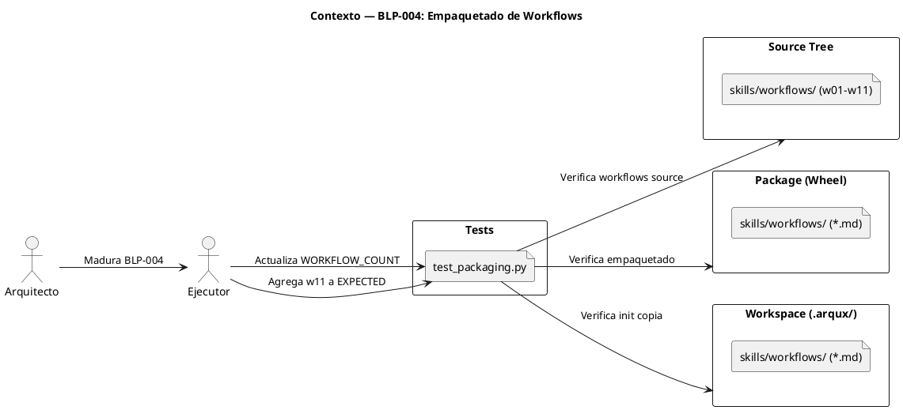
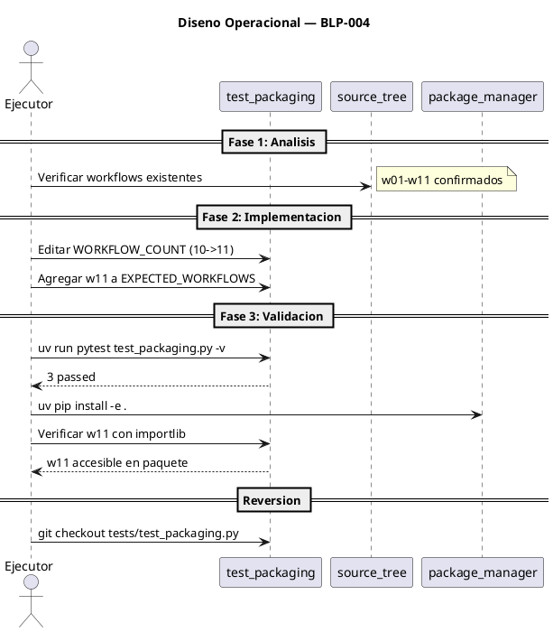

<!-- BLP:TITLE -->
# BLP-004: Empaquetar correctamente los workflows y corregir el empaquetado de skills (P0-2, P1-6)
<!-- /BLP:TITLE -->

---

<!-- BLP:1 -->
## §1: Planteamiento del Problema

La auditoría ejecutable de ArqUX (ARQUX_EXECUTABLE_AUDIT_PROTOCOL.md) identificó los hallazgos P0-2 y P1-6:

**Evidencia:**
- P0-2: `skills/workflows/*.md` no estaban declarados en `[tool.setuptools.package-data]` del `pyproject.toml`, por lo que no se incluían en el wheel instalado. Aunque ya se agregó la entrada, el test de packaging quedó configurado para 10 workflows cuando actualmente existen 11 (se agregó w11-cortex-file-repair.md).
- P1-6: No existía test de packaging que verificara la inclusión correcta de workflows en el paquete instalado. El test fue creado en v0.4.1 pero no se actualizó tras agregar w11.

**Impacto de no resolverlo:**
El test de packaging dará un falso positivo o falso negativo. Al instalar el paquete, workflows nuevos podrían quedar fuera sin que el test lo detecte.
<!-- /BLP:1 -->

<!-- BLP:2 -->
## §2: Objetivo

Actualizar `test_packaging.py` para que refleje correctamente los 11 workflows actuales (w01-w11) y verificar que el empaquetado de workflows y skills funciona correctamente en el paquete instalado.
<!-- /BLP:2 -->

<!-- BLP:3 -->
## §3: Precondiciones

- [ ] BLP-004 existe en estado draft con template vacío
- [ ] pyproject.toml ya incluye skills/workflows/*.md en package-data
- [ ] workspace.py ya copia workflows en init
- [ ] test_packaging.py existe con WORKFLOW_COUNT=10 (obsoleto)
- [ ] w11-cortex-file-repair.md fue agregado al source
<!-- /BLP:3 -->

<!-- BLP:4 -->
## §4: Principio Rector

El test de packaging debe reflejar el estado real del source, no un snapshot congelado. Usar patrones glob donde sea posible para minimizar mantenimiento futuro.

**Evidencia del problema:** El test espera `WORKFLOW_COUNT=10` pero el source tiene 11 workflows. Si no se actualiza, el test miente sobre el estado del empaquetado.

**Impacto si se viola:** El test de packaging se vuelve ruido — pasa aunque falten workflows en el paquete, o falla aunque el empaquetado sea correcto.
<!-- /BLP:4 -->

<!-- BLP:5 -->
## §5: Contexto



<!-- /BLP:5 -->

<!-- BLP:6 -->
## §6: Alcance y Exclusiones

**Dentro del alcance:**
- Actualizar `test_packaging.py`: incrementar `WORKFLOW_COUNT` de 10 a 11
- Agregar `w11-cortex-file-repair.md` a `EXPECTED_WORKFLOWS`
- Verificar que el test pasa correctamente
- Validar que el paquete instalado incluye los 11 workflows

**Fuera del alcance (excluido explícitamente):**
- Corrección de otros hallazgos de auditoría (P0-3, P0-4, P0-5, P1-1 a P1-17)
- Cambios arquitectónicos al sistema de empaquetado
- Refactor de la lógica de init en workspace.py
- Modificaciones a pyproject.toml (ya funciona correctamente con globs)
<!-- /BLP:6 -->

<!-- BLP:7 -->
## §7: Reglas Obligatorias

1. Mantener compatibilidad hacia atrás: no cambiar el formato de salida de workspace.init
2. Usar patrones glob existentes (no rutas fijas) para que nuevos workflows se detecten automáticamente
3. No eliminar ni renombrar workflows existentes
<!-- /BLP:7 -->

<!-- BLP:8 -->
## §8: Diseño Técnico


```puml
@startuml
title Diseno Tecnico — BLP-004

component test_packaging as test {
  [TestWorkflowsInPackage]
  [TestInitCopiesWorkflows]
}

component pyproject_toml as pyproj {
  [package-data]
}

component workspace_py as ws {
  [workspace.init()]
}

database skills_workflows as src_wf {
  file "w01-workspace-init.md"
  file "w02-govern-project.md"
  file "..."
  file "w11-cortex-file-repair.md"
}

database InstalledPackage as pkg_inst {
  file "skills/workflows/ (*.md)"
}

test --> pkg_inst : importlib.resources.files()
test --> src_wf : EXPECTED_WORKFLOWS
TestInitCopiesWorkflows --> ws : subprocess arqux init
package-data --> pkg_inst : skills/workflows/*.md
ws --> pkg_inst : copia en init
src_wf --> package-data : glob *.md

note right of test
  WORKFLOW_COUNT=11
  w01..w11 en EXPECTED
end note

@enduml
```
<!-- /BLP:8 -->

<!-- BLP:9 -->
## §9: Diseño Operacional



<!-- /BLP:9 -->

<!-- BLP:10 -->
## §10: Contratos

**Entradas esperadas:**
- `tests/test_packaging.py` — archivo de test existente

**Salidas esperadas:**
- `tests/test_packaging.py` actualizado con WORKFLOW_COUNT=11 y w11 en EXPECTED_WORKFLOWS
- Test pasando correctamente

**Comandos:**
- `uv run pytest tests/test_packaging.py -v` — ejecutar test de packaging
<!-- /BLP:10 -->

<!-- BLP:11 -->
## §11: Procedimiento de Trabajo

Fase 1: Análisis — Revisar test_packaging.py y verificar todos los workflows existentes. Fase 2: Implementación — Actualizar WORKFLOW_COUNT y EXPECTED_WORKFLOWS en test_packaging.py, ejecutar tests para verificar. Fase 3: Validación — Verificar que pip install -e . funciona y los workflows son accesibles vía importlib.resources.
<!-- /BLP:11 -->

<!-- BLP:12 -->
## §12: Criterios de Aceptación

- [x] **AC-01:** CA-01: test_packaging.py refleja 11 workflows en WORKFLOW_COUNT y EXPECTED_WORKFLOWS
  > [2026-07-11T16:03:04Z] Verified: WORKFLOW_COUNT=11, EXPECTED_WORKFLOWS includes w11
- [x] **AC-02:** CA-02: test_packaging.py pasa con python3 -m pytest tests/test_packaging.py -v
  > [2026-07-11T16:03:04Z] Verified: 3/3 passed
- [x] **AC-03:** CA-03: pip install -e . + test de import verifica que skills/workflows/w11 existe en el paquete instalado
  > [2026-07-11T16:03:04Z] Verified: importlib.resources.files finds w11 in installed package
<!-- /BLP:12 -->

<!-- BLP:13 -->
## §13: Validaciones Requeridas

| Tipo | Descripción | Comando | Evidencia Esperada |
|---|---|---|---|
| test | Ejecutar test de packaging actualizado | `uv run pytest tests/test_packaging.py -v` | 3 tests pasan (workflows accesibles, count correcto, init copia) |
| lint | Verificar que el código pasa ruff | `uv run ruff check tests/test_packaging.py` | Sin errores |
<!-- /BLP:13 -->

<!-- BLP:14 -->
## §14: Tareas

- [x] **T-1.1:** Actualizar test_packaging.py — Incrementar WORKFLOW_COUNT a 11, agregar w11-cortex-file-repair.md a EXPECTED_WORKFLOWS
  > [2026-07-11T16:02:53Z] WORKFLOW_COUNT 10->11, w11 agregado a EXPECTED
- [x] **T-1.2:** Ejecutar test — Confirmar que los 3 tests pasan
  > [2026-07-11T16:02:53Z] 3/3 tests passed
- [x] **T-2.1:** Validar empaquetado — Verificar que `importlib.resources` encuentra w11 en el paquete instalado
  > [2026-07-11T16:02:53Z] importlib.resources.files finds w11 in package
<!-- /BLP:14 -->

<!-- BLP:15 -->
## §15: Riesgos

| ID | Descripción | Impacto | Mitigación |
|---|---|---|---|
| R-01 | Si hay más workflows agregados en el futuro, el test volverá a quedar obsoleto | Bajo — test fallaría visiblemente, no silencioso | Preferir conteo dinámico con `len(list(glob))` sobre constante hardcodeada |
| R-02 | El test depende de `importlib.resources` que varía entre versiones de Python | Medio — fallo silencioso si la API cambia en Python 3.13+ | Verificar compatibilidad con el `files()` API introducido en Python 3.9. Para Python 3.12 actual es estable |
| R-03 | El test `test_init_copies_workflows` ejecuta `arqux init` real, lo que requiere el CLI instalado | Bajo — fallaría solo si el paquete no está instalado en modo editable | El test ya está diseñado para ejecutarse en entorno con paquete instalado |
<!-- /BLP:15 -->

<!-- BLP:16 -->
## §16: Regla de Bloqueo

DETENER_E_INFORMAR si: (1) algún workflow existente fue renombrado o eliminado sin coordinación; (2) el test revela que el paquete instalado no incluye workflows a pesar de pyproject.toml tener la ent
<!-- /BLP:16 -->

<!-- BLP:17 -->
## §17: Salida Esperada

**Archivos modificados:**
- `tests/test_packaging.py`

**Evidencia:**
- `uv run pytest tests/test_packaging.py -v` retorna `3 passed`
- `WORKFLOW_COUNT = 11` en el test
- `w11-cortex-file-repair.md` en `EXPECTED_WORKFLOWS`

**Resumen:**
> Test de packaging actualizado para reflejar los 11 workflows actuales del proyecto.
<!-- /BLP:17 -->

<!-- BLP:18 -->
## §18: Contrato de Calidad

| Compuerta | Estado |
|---|---|
| has_clear_objective | ☐ |
| has_verifiable_preconditions | ☐ |
| has_scope_and_exclusions | ☐ |
| has_acceptance_criteria | ☐ |
| has_work_procedure | ☐ |
| has_required_validations | ☐ |
| has_learning_recorded | ☐ |
<!-- /BLP:18 -->

> Todas las compuertas deben estar en ✅ antes de blueprint.ready(). Ver blueprint-workflow skill.