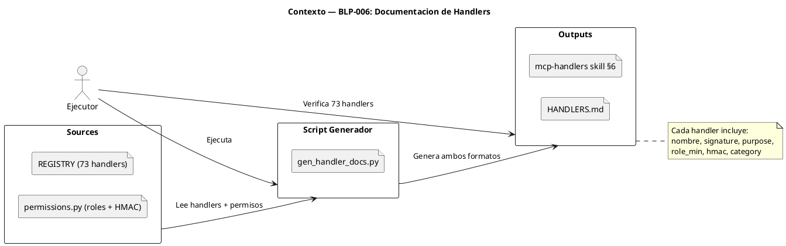

<!-- BLP:TITLE -->
# BLP-006: Crear documentación automática de handlers (HANDLERS.md) generada desde REGISTRY
<!-- /BLP:TITLE -->

---

<!-- BLP:1 -->
## §1: Planteamiento del Problema

La auditoria identifico P1-2: no existe HANDLERS.md. Sin embargo, la skill mcp-handlers ya documenta los 73 handlers en su §6 (Quick Reference), pero: (a) se mantiene manualmente, (b) no incluye rol minimo, HMAC requerido ni categoria, (c) no hay HANDLERS.md para lectura humana.

**Evidencia:**
- P1-2: No existe HANDLERS.md
- mcp-handlers skill §6 contiene 73 HDL entries con firma y proposito, pero sin permisos ni categoria
- La skill se edita manualmente y puede desincronizarse del REGISTRY

**Impacto de no resolverlo:**
Documentacion duplicada o desactualizada. Agentes y desarrolladores no tienen referencia de permisos por handler. Cada nuevo handler requiere editar la skill manualmente.
<!-- /BLP:1 -->

<!-- BLP:2 -->
## §2: Objetivo

Crear un script que genere automaticamente la seccion §6 de la skill mcp-handlers (con nombre, firma, proposito, rol minimo, HMAC requerido y categoria) y ademas genere HANDLERS.md como referencia humana legible, todo desde el REGISTRY y permissions.py como fuentes unicas de verdad.
<!-- /BLP:2 -->

<!-- BLP:3 -->
## §3: Precondiciones

- [ ] 73 handlers registrados en REGISTRY (src/arqux/handlers/__init__.py)
- [ ] HandlerSpec tiene name, fn, description, input_schema
- [ ] permissions.py define GOVERNOR_ONLY, EXECUTOR_ALLOWED, READ_ONLY_PREFIXES, HMAC_REQUIRED
- [ ] La skill mcp-handlers existe en src/arqux/skills/mcp-handlers.skill.md y en .arqux/skills/
- [ ] La skill §6 contiene HDL entries con formato: HDL:handler{ signature:..., purpose:... }
<!-- /BLP:3 -->

<!-- BLP:4 -->
## §4: Principio Rector

El REGISTRY y permissions.py son las fuentes unicas de verdad. La documentacion (skill + HANDLERS.md) son vistas derivadas generadas automaticamente. Nunca editar la documentacion manualmente.

**Evidencia del problema:** La skill mcp-handlers §6 se edito manualmente y no incluye permisos. Sin automatizacion, cada cambio en REGISTRY o permissions requiere edicion manual de la skill.

**Impacto si se viola:** Editar la documentacion manualmente causa divergencia con el REGISTRY real. Los agentes obtienen informacion incorrecta sobre permisos y handlers disponibles.
<!-- /BLP:4 -->

<!-- BLP:5 -->
## §5: Contexto

<!-- /BLP:5 -->

<!-- BLP:6 -->
## §6: Alcance y Exclusiones

**Dentro del alcance:**
- Crear scripts/gen_handler_docs.py que lea REGISTRY + permissions y genere:
  (a) La seccion §6 de la skill mcp-handlers.skill.md con HDL entries enriquecidas
  (b) HANDLERS.md como referencia humana con tabla markdown
- Cada handler documentado con: nombre, signature, purpose, role_min, hmac, category

**Fuera del alcance (excluido explicitamente):**
- Modificar REGISTRY, HandlerSpec o permissions.py
- Modificar otras secciones de la skill mcp-handlers ($0-$5, $7)
- Actualizar README.md u otros archivos de documentacion
<!-- /BLP:6 -->

<!-- BLP:7 -->
## §7: Reglas Obligatorias

1. No modificar REGISTRY, HandlerSpec ni permissions.py
2. El script debe ser idempotente: ejecutarlo N veces produce el mismo resultado
3. La skill §6 se regenera completa — no se edita manualmente
4. HANDLERS.md se regenera completo — no se edita manualmente
5. Usar solo biblioteca estandar + acceso a REGISTRY y permissions.py
<!-- /BLP:7 -->

<!-- BLP:8 -->
## §8: Diseno Tecnico

El script gen_handler_docs.py opera en dos modos:

1. **Skill mode**: genera las HDL entries para §6 de mcp-handlers.skill.md
   - Formato: HDL:<handler>{ signature:\"<params>\", purpose:\"<desc>\", role:\"<min_role>\", hmac:\"<yes/no>\", category:\"<governance|utility>\" }
   
2. **Markdown mode**: genera HANDLERS.md como tabla markdown
   - Columnas: Handler | Descripcion | Rol Minimo | HMAC | Categoria

Logica de inferencia:
- **Rol minimo**: revisa GOVERNOR_ONLY, EXECUTOR_ALLOWED, READ_ONLY_PREFIXES en permissions.py
- **HMAC**: revisa HMAC_REQUIRED set
- **Categoria**: governance si el prefijo es workspace/project/cycle/blueprint/skill/protocol/identity; utility si es cortex/session/evidence/task/setup

Salida: escribe directamente en src/arqux/skills/mcp-handlers.skill.md (§6) y en HANDLERS.md
<!-- /BLP:8 -->

<!-- BLP:9 -->
## §9: Diseno Operacional

@startuml
title Diseno Operacional — BLP-006

actor Ejecutor as exec
participant gen_handler_docs as script
participant REGISTRY as reg
participant permissions as perms
participant mcp_handlers_skill as skill
participant HANDLERS_MD as output

== Fase 1: Analisis ==
exec -> reg : list_handlers() + HandlerSpec
exec -> perms : GOVERNOR_ONLY, HMAC_REQUIRED, etc.
exec -> skill : Leer formato actual de HDL entries

== Fase 2: Implementacion ==
exec -> script : Crear gen_handler_docs.py
script -> reg : importar REGISTRO
script -> perms : importar reglas
exec -> script : Aniadir logica de inferencia (rol, HMAC, categoria)

== Fase 3: Validacion ==
exec -> script : uv run python scripts/gen_handler_docs.py
script --> skill : §6 actualizada con HDL entries enriquecidas
script --> output : HANDLERS.md generado
exec -> reg : Verificar 73 handlers en skill
exec -> reg : Verificar 73 handlers en HANDLERS.md
exec -> perms : Verificar que rol minimo y HMAC son correctos

== Reversion ==
exec -> git : git checkout scripts/ HANDLERS.md src/arqux/skills/mcp-handlers.skill.md

@enduml
<!-- /BLP:9 -->

<!-- BLP:10 -->
## §10: Contratos

**Entradas esperadas:**
- REGISTRY en src/arqux/handlers/__init__.py
- permissions.py con GOVERNOR_ONLY, EXECUTOR_ALLOWED, READ_ONLY_PREFIXES, HMAC_REQUIRED
- src/arqux/skills/mcp-handlers.skill.md (skill existente)

**Salidas esperadas:**
- scripts/gen_handler_docs.py
- src/arqux/skills/mcp-handlers.skill.md (§6 actualizada con HDL entries enriquecidas)
- HANDLERS.md

**Comandos:**
- uv run python scripts/gen_handler_docs.py
<!-- /BLP:10 -->

<!-- BLP:11 -->
## §11: Procedimiento de Trabajo

### Fase 1: Analisis
1. Analizar estructura de REGISTRY y HandlerSpec en __init__.py
2. Analizar permissions.py: GOVERNOR_ONLY, EXECUTOR_ALLOWED, READ_ONLY_PREFIXES, HMAC_REQUIRED
3. Analizar formato actual de HDL entries en mcp-handlers skill §6
4. Diseniar formato enriquecido: HDL:<h>{ signature, purpose, role, hmac, category }

### Fase 2: Implementacion
1. Escribir scripts/gen_handler_docs.py:
   - Importar REGISTRY, list_handlers() desde arqux.handlers
   - Importar reglas de permisos desde permissions.py
   - Logica de inferencia de rol minimo y HMAC
   - Logica de clasificacion governance vs utility
   - Generar y escribir §6 en la skill mcp-handlers
   - Generar y escribir HANDLERS.md

### Fase 3: Validacion
1. Ejecutar: uv run python scripts/gen_handler_docs.py
2. Verificar que la skill §6 tiene 73 HDL entries con los 5 campos
3. Verificar que HANDLERS.md tiene 73 handlers documentados
4. Verificar suite de tests intacta

> **Reversion:** git checkout scripts/ HANDLERS.md src/arqux/skills/mcp-handlers.skill.md
<!-- /BLP:11 -->

<!-- BLP:12 -->
## §12: Criterios de Aceptacion

- [ ] **AC-01:** scripts/gen_handler_docs.py existe y es ejecutable
- [ ] **AC-02:** La skill mcp-handlers §6 contiene 73 HDL entries con: signature, purpose, role, hmac, category
- [ ] **AC-03:** HANDLERS.md generado lista los 73 handlers con nombre, descripcion, rol minimo, HMAC, categoria
- [ ] **AC-04:** Ambos archivos se regeneran con: uv run python scripts/gen_handler_docs.py
- [ ] **AC-05:** No hay cambios en REGISTRY, permissions.py ni otras secciones de la skill
<!-- /BLP:12 -->

<!-- BLP:13 -->
## §13: Validaciones Requeridas

| Tipo | Descripcion | Comando | Evidencia Esperada |
|---|---|---|---|
| script | Ejecutar script generador | uv run python scripts/gen_handler_docs.py | Exit code 0 |
| count | Verificar 73 handlers en skill | grep -c "^HDL:" src/arqux/skills/mcp-handlers.skill.md | 73 |
| count | Verificar 73 handlers en HANDLERS.md | grep -c "^|" HANDLERS.md | 73 |
| fields | Verificar campos enriquecidos | grep "role:" src/arqux/skills/mcp-handlers.skill.md | 73 entries con role |
| regression | Suite de tests intacta | uv run pytest -q --tb=no | 483 passed |
<!-- /BLP:13 -->

<!-- BLP:14 -->
## §14: Tareas

- [ ] **T-1.1:** Analizar REGISTRY, permissions.py y formato actual de skill mcp-handlers §6
- [ ] **T-1.2:** Implementar scripts/gen_handler_docs.py con logica de inferencia
- [ ] **T-1.3:** Ejecutar script, validar skill §6 actualizada y HANDLERS.md generado
<!-- /BLP:14 -->

<!-- BLP:15 -->
## §15: Riesgos

| ID | Descripcion | Impacto | Mitigacion |
|---|---|---|---|
| R-01 | permissions.py no expone API publica para consultar rol minimo por handler | Medio | Usar las variables existentes (GOVERNOR_ONLY, EXECUTOR_ALLOWED, READ_ONLY_PREFIXES, HMAC_REQUIRED) e inferir por prefijo |
| R-02 | La skill mcp-handlers existe en dos lugares (src/ y .arqux/skills/) que deben ser identicos | Medio | El script solo escribe en src/; luego sync manual o skill.edit para replicar a .arqux/ |
| R-03 | El formato de HDL entries en la skill puede cambiar | Bajo | El script lee y reescribe §6 completo, no parcha |
<!-- /BLP:15 -->

<!-- BLP:16 -->
## §16: Regla de Bloqueo

1. El script necesita modificar REGISTRY o HandlerSpec para funcionar
2. La skill §6 o HANDLERS.md contienen menos de 73 handlers
3. La ejecucion del script rompe tests existentes
4. La skill generada no incluye role, hmac o category en las HDL entries

**Accion:** DETENER_E_INFORMAR
**Escalar a:** Arquitecto
<!-- /BLP:16 -->

<!-- BLP:17 -->
## §17: Salida Esperada

**Archivos creados:**
- scripts/gen_handler_docs.py
- HANDLERS.md

**Archivos modificados:**
- src/arqux/skills/mcp-handlers.skill.md (§6 regenerada)

**Evidencia:**
- uv run python scripts/gen_handler_docs.py retorna exit code 0
- grep -c "^HDL:" src/arqux/skills/mcp-handlers.skill.md = 73
- grep -c "^|" HANDLERS.md = 73
- Cada HDL entry contiene role, hmac y category

**Resumen:**
> Documentacion automatica de handlers: skill mcp-handlers §6 enriquecida con permisos + HANDLERS.md generado desde REGISTRY.
<!-- /BLP:17 -->

<!-- BLP:18 -->
## §18: Contrato de Calidad

| Compuerta | Estado |
|---|---|
| has_clear_objective | ☐ |
| has_verifiable_preconditions | ☐ |
| has_scope_and_exclusions | ☐ |
| has_acceptance_criteria | ☐ |
| has_work_procedure | ☐ |
| has_required_validations | ☐ |
| has_learning_recorded | ☐ |
<!-- /BLP:18 -->

> Todas las compuertas deben estar en ✅ antes de blueprint.ready(). Ver blueprint-workflow skill.