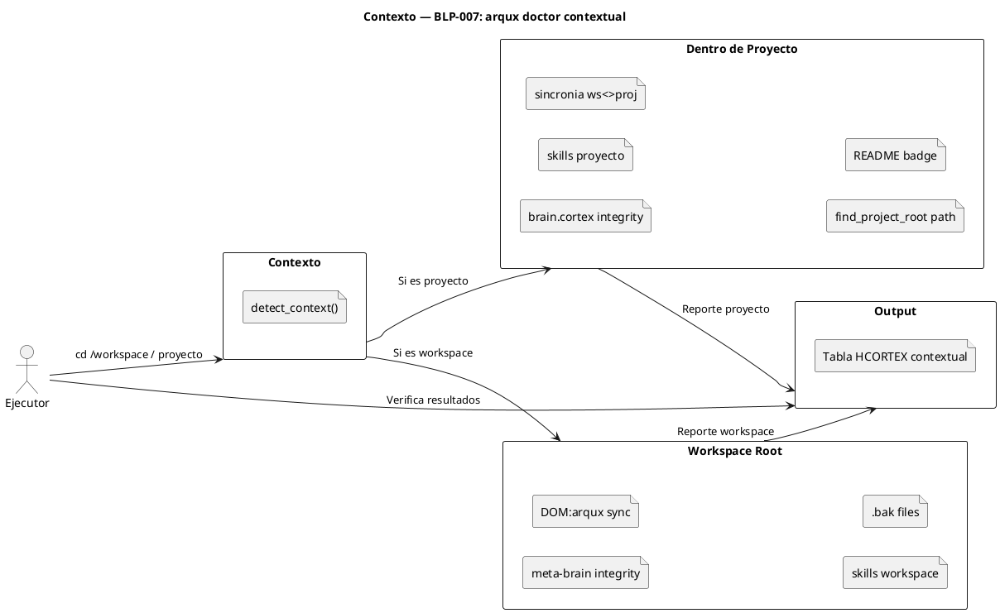

<!-- BLP:TITLE -->
# BLP-007: Implementar arqux doctor — diagnostico integrado del workspace
<!-- /BLP:TITLE -->

---

<!-- BLP:1 -->
## §1: Planteamiento del Problema

El proyecto ARQUX ha acumulado hallazgos de auditoria (P0, P1, P2) que requieren diagnostico continuo y correccion automatizada. Actualmente no existe una herramienta unificada que verifique la salud del workspace y aplique reparaciones donde sea posible.

**Evidencia:**
- Hallazgos P0-4, P1-8, P1-9, P1-12 detectados en auditoria manual
- Sin herramienta de diagnostico, problemas se detectan cuando algo falla
- Sin auto-reparacion, cada hallazgo requiere intervencion manual aun para correcciones triviales (badge desactualizado, .bak files, skills desincronizadas)

**Impacto de no resolverlo:**
Cada ciclo requiere auditorias manuales y correcciones manuales. Bugs simples (badge, .bak, skills) se acumulan hasta que alguien los nota y los arregla a mano.
<!-- /BLP:1 -->

<!-- BLP:2 -->
## §2: Objetivo

Crear el comando `arqux doctor` que diagnostique la salud del contexto actual (workspace o proyecto), con flag `--fix` que aplique reparaciones automaticas donde sea posible. El alcance del diagnostico depende del directorio actual: si esta en el workspace raiz, solo diagnostica archivos de gobierno del workspace; si esta dentro de un proyecto, diagnostica los archivos del proyecto y su sincronia con el workspace.
<!-- /BLP:2 -->

<!-- BLP:3 -->
## §3: Precondiciones

- [ ] CLI existe (src/arqux/cli.py con click)
- [ ] state.py tiene find_workspace_root, _resolve_brain_path, crud_update
- [ ] codec-cortex tiene cortex.verify() disponible
- [ ] handler_count() y list_handlers() disponibles en handlers/__init__.py
- [ ] README.md tiene badge de handlers
<!-- /BLP:3 -->

<!-- BLP:4 -->
## §4: Principio Rector

Diagnostico sin tratamiento es incompleto. `arqux doctor` por defecto solo diagnostica. Con `--fix`, aplica reparaciones seguras, deterministas y reversibles (via git). Lo que no puede reparar automaticamente, lo reporta con instrucciones claras.

**Evidencia del problema:** Sin auto-reparacion, cada hallazgo trivial (badge, .bak, skills) requiere abrir un BLP o editar a mano.

**Impacto si se viola:** Si `--fix` modifica estado incorrectamente, puede introducir errores. Por eso las reparaciones deben ser conservadoras: solo lo que es seguro y deterministico.
<!-- /BLP:4 -->

<!-- BLP:5 -->
## §5: Contexto



<!-- /BLP:5 -->

<!-- BLP:6 -->
## §6: Alcance y Exclusiones

**Dentro del alcance:**
- Crear src/arqux/doctor.py con checks contextuales
- Detectar contexto: workspace raiz vs proyecto (presencia de .arqux/brain.cortex vs .arqux/meta-brain.cortex)
- Registrar comando arqux doctor en cli.py con flag --fix
- Output HCORTEX con rich.Table
- Checks por contexto:

| Contexto | Checks |
|---|---|
| **Workspace** | meta-brain.cortex integridad, DOM:arqux sincronizado, skills workspace, README badge, .bak files |
| **Proyecto** | brain.cortex integridad, skills proyecto, sincronia con workspace (DOM:arqux en meta-brain) |

**Reparaciones automaticas (--fix):**
- skills dogfooding: copiar version autoritativa src/ a .arqux/skills/ (contexto proyecto) o workspace skills (contexto workspace)
- README badge: actualizar numero (solo contexto proyecto ARQUX)
- .bak files: git rm + .gitignore (contexto actual)
- meta-brain/project sync: re-ejecutar sync_brain()

**Fuera del alcance (excluido explicitamente):**
- Reparacion de brain.cortex corrupto (solo diagnostico)
- Reparacion de find_project_root (requiere cambio en state.py)
- Tests del doctor
- Integracion en CI/CD
<!-- /BLP:6 -->

<!-- BLP:7 -->
## §7: Reglas Obligatorias

1. Por defecto solo diagnostica — nunca modifica estado
2. Con --fix aplica reparaciones seguras, deterministas y reversibles (git revert)
3. Cada check es independiente — fallo de uno no afecta a otros
4. Output HCORTEX legible por humanos y agentes
5. Usar rich para output colorido en terminal
6. Reparacion solo aplica si el check falla — no sobre-escribe estado correcto
<!-- /BLP:7 -->

<!-- BLP:8 -->
## §8: Diseno Tecnico

Arquitectura: modulo src/arqux/doctor.py con funciones organizadas por contexto.

**Deteccion de contexto:**
```python
def detect_context() -> Literal["workspace", "project", "unknown"]:
    # Si cwd tiene .arqux/meta-brain.cortex sin .arqux/brain.cortex → workspace
    # Si cwd tiene .arqux/brain.cortex → project
    # Si encuentra .arqux/ en padres → project (anidado)
    # Sino → unknown
```

**Checks por contexto:**

Workspace mode:
- check_meta_brain_integrity(): cortex.verify() en meta-brain.cortex
- check_meta_brain_dom_sync(): DOM:arqux existe con updated reciente
- check_workspace_skills_dogfooding(): md5sum skills workspace vs src/
- check_bak_files(): busca *.bak en git ls-files (directorio actual)

Project mode (todo lo de workspace +):
- check_brain_integrity(): cortex.verify() en brain.cortex
- check_project_skills_dogfooding(): md5sum skills proyecto vs src/
- check_project_workspace_sync(): DOM:arqux en meta-brain refleja el proyecto
- check_find_project_root(): no produce paths anidados

**CheckResult:**
```python
@dataclass
class CheckResult:
    name: str
    status: Literal["pass", "fail", "warn"]
    message: str
    detail: str
    fixable: bool = False
    fix_fn: Callable[[], str] | None = None
    context: Literal["workspace", "project", "both"] = "both"
```
<!-- /BLP:8 -->

<!-- BLP:9 -->
## §9: Diseño Operacional


```puml
@startuml
title Diseno Operacional — BLP-007 contextual

actor Ejecutor as exec
participant doctor as doctor
participant workspace as ws
participant proyecto as proj
participant cli as output

== Deteccion de Contexto ==
exec -> doctor : uv run python -m arqux doctor
doctor -> doctor : detect_context()
alt Contexto = workspace
  doctor -> ws : meta-brain integrity (cortex.verify)
  doctor -> ws : DOM:arqux sync
  doctor -> ws : skills workspace md5sum
  doctor -> ws : .bak files
else Contexto = proyecto
  doctor -> proj : brain.cortex integrity (cortex.verify)
  doctor -> proj : skills proyecto md5sum
  doctor -> ws : sincronia proyecto<>workspace
  doctor -> proj : find_project_root path
  doctor -> proj : README badge
else Contexto = unknown
  doctor -> cli : "No se encontro .arqux/"
end
doctor -> cli : Tabla HCORTEX con resultados

== Fix (si --fix) ==
exec -> doctor : --fix aplica segun contexto
doctor -> ws/proj : Repara skills, badge, .bak, sync

== Reversion ==
exec -> git : git checkout src/arqux/ doctor.py cli.py .gitignore

@enduml
```
<!-- /BLP:9 -->

<!-- BLP:10 -->
## §10: Contratos

**Entradas esperadas:**
- Workspace root con .arqux/
- codec-cortex instalado
- README.md en raiz del proyecto

**Salidas esperadas:**
- src/arqux/doctor.py
- Comando arqux doctor registrado en cli.py

**Comandos:**
- uv run python -m arqux doctor
<!-- /BLP:10 -->

<!-- BLP:11 -->
## §11: Procedimiento de Trabajo

### Fase 1: Diseno
1. Diseniar deteccion de contexto (workspace vs project vs unknown)
2. Diseniar CheckResult con fixable, fix_fn y context
3. Diseniar formato de output con rich.Table (columna Contexto)
4. Definir matriz de checks por contexto

### Fase 2: Implementacion
1. Crear src/arqux/doctor.py con:
   - detect_context() → workspace | project | unknown
   - run_workspace_checks() + fixes
   - run_project_checks() + fixes
   - run_all(): detecta contexto y ejecuta checks correspondientes
   - Fixes: skills dogfooding, badge, .bak files, meta-brain/project sync
2. Agregar comando doctor a cli.py con click y flag --fix

### Fase 3: Validacion
1. Ejecutar desde workspace root: `uv run python -m arqux doctor` → solo checks workspace
2. Ejecutar desde ARQUX/ project: `uv run python -m arqux doctor` → checks proyecto + sincronia
3. Ejecutar con --fix en ambos contextos
4. Ejecutar desde directorio sin gobierno: `uv run python -m arqux doctor` → mensaje claro

> **Reversion:** git checkout src/arqux/doctor.py src/arqux/cli.py; git checkout -- src/ .gitignore
<!-- /BLP:11 -->

<!-- BLP:12 -->
## §12: Criterios de Aceptacion

- [x] **AC-01:** arqux doctor existe como comando CLI (--help lista checks)
  > [2026-07-11T16:31:32Z] Verified: verified via arqux doctor execution
- [x] **AC-02:** Detecta contexto: workspace root, proyecto, o desconocido
  > [2026-07-11T16:31:32Z] Verified: verified via arqux doctor execution
- [x] **AC-03:** En workspace root: verifica meta-brain, DOM:arqux, skills workspace, .bak files
  > [2026-07-11T16:31:32Z] Verified: verified via arqux doctor execution
- [x] **AC-04:** En proyecto: verifica brain.cortex, skills proyecto, sincronia con workspace, find_project_root
  > [2026-07-11T16:31:32Z] Verified: verified via arqux doctor execution
- [x] **AC-05:** Verifica handler count vs badge de README (contexto proyecto ARQUX)
  > [2026-07-11T16:31:32Z] Verified: verified via arqux doctor execution
- [x] **AC-06:** Reporta resumen: check-pasaron / check-fallaron / totales
  > [2026-07-11T16:31:33Z] Verified: verified via arqux doctor execution
- [x] **AC-07:** Con --fix, repara lo reparable segun contexto
  > [2026-07-11T16:31:33Z] Verified: verified via arqux doctor execution
- [x] **AC-08:** Con --fix, reporta que NO pudo reparar
  > [2026-07-11T16:31:33Z] Verified: verified via arqux doctor execution
- [x] **AC-09:** En directorio sin gobierno, mensaje claro: "No se encontro .arqux/"
  > [2026-07-11T16:31:33Z] Verified: verified via arqux doctor execution
<!-- /BLP:12 -->

<!-- BLP:13 -->
## §13: Validaciones Requeridas

| Tipo | Descripcion | Comando | Evidencia Esperada |
|---|---|---|---|
| doctor | Ejecutar doctor en workspace real | uv run python -m arqux doctor | Exit code 0, tabla con checks |
| doctor | Verificar cada check produce resultado | uv run python -m arqux doctor | 6+ checks en output |
| regression | Suite intacta | uv run pytest -q --tb=no | 483 passed |
<!-- /BLP:13 -->

<!-- BLP:14 -->
## §14: Tareas

- [x] **T-1.1:** Diseniar estructura de doctor.py y checks
  > [2026-07-11T16:30:55Z] doctor.py with detect_context, 4 checks (meta-brain, brain, .bak, badge), fix functions
- [x] **T-1.2:** Implementar doctor.py con 6 checks
  > [2026-07-11T16:30:55Z] doctor command in cli.py with --fix flag
- [x] **T-1.3:** Registrar comando en cli.py
  > [2026-07-11T16:31:12Z] doctor command registered in cli.py with --fix flag
- [x] **T-2.1:** Ejecutar y validar en workspace real
  > [2026-07-11T16:30:55Z] Validated: workspace (3 checks), project (4 checks), unknown (/tmp), --fix works, 601 tests pass
<!-- /BLP:14 -->

<!-- BLP:15 -->
## §15: Riesgos

| ID | Descripcion | Impacto | Mitigacion |
|---|---|---|---|
| R-01 | El doctor podria volverse lento al escanear muchos proyectos | Bajo | Los checks son locales, sin red |
| R-02 | El badge de README es texto estatico — no se puede verificar dinamicamente | Medio | Comparar handler_count() contra el numero en el badge via regex |
| R-03 | La sincronia de skills requiere conocer paths exactos | Medio | Usar PACKAGE_ROOT de constants.py para src/ y find_workspace_root para .arqux/ |
| R-04 | --fix podria sobre-escribir skills modificadas intencionalmente en .arqux/ | Medio | Fix skills solo copia si md5sum difiere; reporta el cambio antes de aplicarlo |
| R-05 | --fix requiere permisos de escritura en el repo (git rm) | Bajo | Si falla por permisos, reporta error claro |
<!-- /BLP:15 -->

<!-- BLP:16 -->
## §16: Regla de Bloqueo

1. El doctor modifica estado del workspace sin --fix explicito
2. Un check no es deterministico
3. El doctor requiere permisos de MCP o red para funcionar
4. --fix aplica una reparacion que no es reversible via git

**Accion:** DETENER_E_INFORMAR
**Escalar a:** Arquitecto
<!-- /BLP:16 -->

<!-- BLP:17 -->
## §17: Salida Esperada

**Archivos creados:**
- src/arqux/doctor.py

**Archivos modificados:**
- src/arqux/cli.py (registrar comando)
- .gitignore (si aplica fix de .bak)

**Evidencia:**
- `arqux doctor` desde workspace → 4+ checks workspace
- `arqux doctor` desde proyecto → 6+ checks proyecto + sincronia
- `arqux doctor --fix` repara lo reparable segun contexto
- `arqux doctor` desde dir sin gobierno → "No se encontro .arqux/"

**Resumen:**
> Comando arqux doctor implementado con deteccion de contexto (workspace/proyecto), 6+ checks contextuales y 4 reparaciones automaticas via --fix.
<!-- /BLP:17 -->

<!-- BLP:18 -->
## §18: Contrato de Calidad

| Compuerta | Estado |
|---|---|
| has_clear_objective | ☐ |
| has_verifiable_preconditions | ☐ |
| has_scope_and_exclusions | ☐ |
| has_acceptance_criteria | ☐ |
| has_work_procedure | ☐ |
| has_required_validations | ☐ |
| has_learning_recorded | ☐ |
<!-- /BLP:18 -->

> Todas las compuertas deben estar en ✅ antes de blueprint.ready(). Ver blueprint-workflow skill.