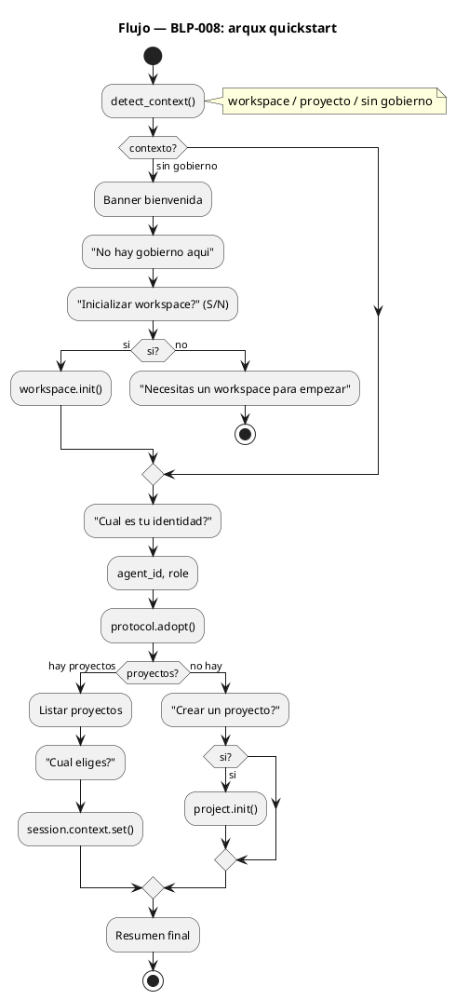
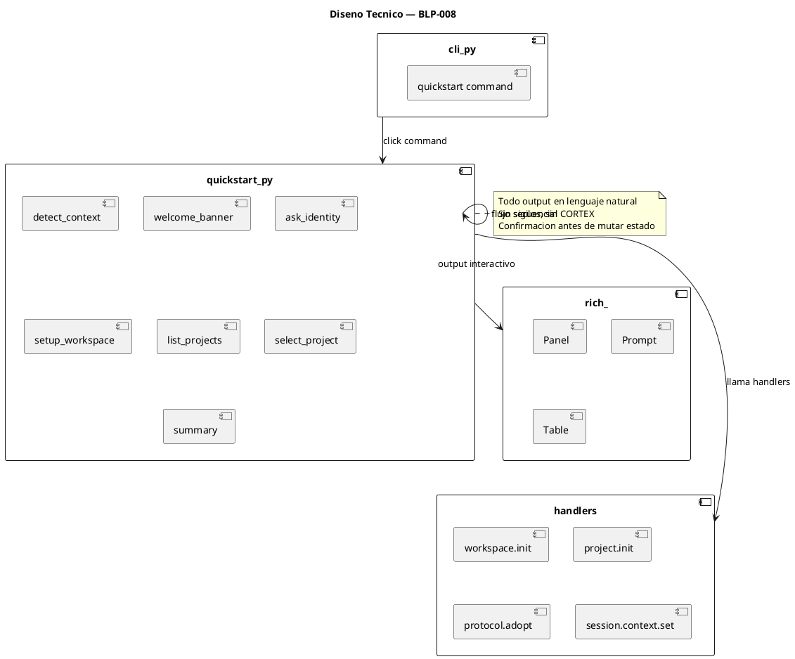
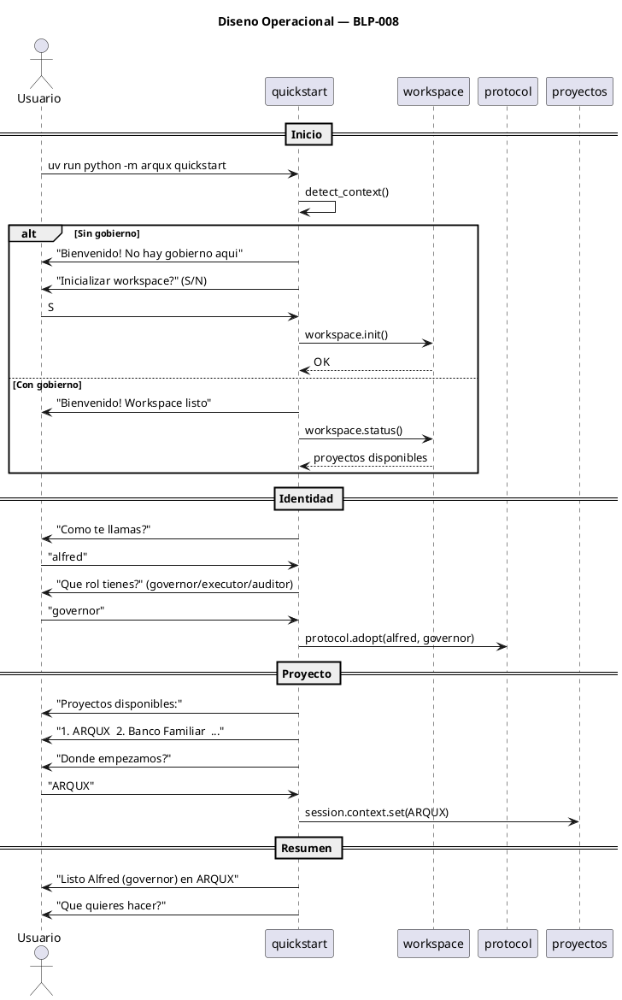

<!-- BLP:TITLE -->
# BLP-008: Crear comando arqux quickstart para onboarding interactivo de nuevos agentes y desarrolladores
<!-- /BLP:TITLE -->

---

<!-- BLP:1 -->
## §1: Planteamiento del Problema

ArqUX utiliza AGENTS.md como punto de entrada universal para cualquier agente (Hermes, Codex, Claude, Cursor, etc.). Cuando un agente llega a un workspace, lee AGENTS.md y comprende donde esta, como operar y bajo que gobierno. Sin embargo, no existe una herramienta para que un DESARROLLADOR implemente ArqUX en un directorio de forma interactiva y completa.

Actualmente el bootstrap requiere:
1. Conocer el handler workspace.init
2. Configurar identidades manualmente
3. Copiar AGENTS.md al workspace
4. Sincronizar skills y templates

No hay un comando unico que haga todo esto de forma interactiva, en lenguaje natural, para un desarrollador que no conoce los detalles internos de ArqUX.

**Evidencia:**
- `arqux init` existe pero es un handler de bajo nivel, no una experiencia de usuario
- Un desarrollador nuevo no sabe que debe ejecutar workspace.init, protocol.adopt, session.context.set
- AGENTS.md debe existir en el workspace raiz para que los agentes sepan donde estan
- Sin quickstart, la implementacion de ArqUX requiere leer documentacion o que un agente guie manualmente

**Impacto de no resolverlo:**
La implementacion de ArqUX en nuevos workspaces depende de que alguien con experiencia configure todo manualmente. Barrera de entrada innecesaria para adopcion enterprise.
<!-- /BLP:1 -->

<!-- BLP:2 -->
## §2: Objetivo

Crear el comando `arqux quickstart` que implemente ArqUX en un directorio de forma interactiva: inicializa el gobierno (workspace.init), configura identidad de agentes (protocol.adopt), establece contexto de trabajo, y asegura que AGENTS.md existe en el workspace raiz como punto de entrada universal para cualquier agente.
<!-- /BLP:2 -->

<!-- BLP:3 -->
## §3: Precondiciones

- [ ] CLI existe (src/arqux/cli.py con click)
- [ ] AGENTS.md existe como referencia
- [ ] MCP config handlers disponibles (workspace.init, project.init, protocol.adopt)
- [ ] workspace.status devuelve lista de proyectos
<!-- /BLP:3 -->

<!-- BLP:4 -->
## §4: Principio Rector

AGENTS.md es el punto de entrada universal para agentes. Quickstart es la herramienta que un DESARROLLADOR usa para implementar ArqUX en un workspace: inicializa gobierno, configura identidades, asegura AGENTS.md, y deja el workspace listo para que cualquier agente llegue y opere.

**Evidencia del problema:** Sin quickstart, la implementacion de ArqUX requiere varios pasos manuales que un desarrollador no conoce.

**Impacto si se viola:** Si quickstart intenta reemplazar a AGENTS.md como entrada de agente, rompe el modelo universal. AGENTS.md es del agente, quickstart es del desarrollador.
<!-- /BLP:4 -->

<!-- BLP:5 -->
## §5: Contexto

<!-- /BLP:5 -->

<!-- BLP:6 -->
## §6: Alcance y Exclusiones

**Dentro del alcance:**
- Crear src/arqux/quickstart.py con flujo interactivo para desarrolladores
- Registrar comando arqux quickstart en cli.py
- Flujo: detectar contexto → workspace.init (si aplica) → configurar identidad de agente → asegurar AGENTS.md → listar proyectos → establecer contexto
- Uso de rich.prompt para interaccion con el usuario
- Output en lenguaje natural (sin sigilos, sin CORTEX)
- Verificar que AGENTS.md existe en el workspace raiz tras el bootstrap

**Fuera del alcance (excluido explicitamente):**
- Reemplazar a AGENTS.md como punto de entrada de agente
- Tutorial completo de ArqUX (cubre BLP-009)
- Modo no-interactivo / headless
- Modificacion de AGENTS.md existente
<!-- /BLP:6 -->

<!-- BLP:7 -->
## §7: Reglas Obligatorias

1. Todo el output debe ser en lenguaje natural — sin sigilos, sin CORTEX, sin $0-$18
2. El flujo debe ser interactivo (preguntar antes de actuar)
3. No modificar estado sin confirmacion del usuario
4. Detectar automaticamente el contexto (workspace/proyecto/sin gobierno)
5. Si ya hay gobierno establecido, preguntar si realmente quiere re-ejecutar quickstart
<!-- /BLP:7 -->

<!-- BLP:8 -->
## §8: Diseño Técnico

<!-- /BLP:8 -->

<!-- BLP:9 -->
## §9: Diseño Operacional

<!-- /BLP:9 -->

<!-- BLP:10 -->
## §10: Contratos

**Entradas esperadas:**
- Terminal interactiva (stdin/stdout)
- Workspace con o sin gobierno

**Salidas esperadas:**
- src/arqux/quickstart.py
- Comando arqux quickstart registrado en cli.py

**Comandos:**
- uv run python -m arqux quickstart
<!-- /BLP:10 -->

<!-- BLP:11 -->
## §11: Procedimiento de Trabajo

### Fase 1: Diseno
1. Entender la relacion: quickstart es para DESARROLLADORES, AGENTS.md es para AGENTES
2. Diseniar flujo: deteccion de contexto → init (si necesario) → identidad → AGENTS.md verification → proyecto

### Fase 2: Implementacion
1. Crear src/arqux/quickstart.py:
   - detect_context() → workspace.virgen | workspace.gobernado | proyecto
   - Flujo principal:
     a. Banner de bienvenida (rich.panel)
     b. Si workspace virgen: ejecutar workspace.init internamente
     c. Verificar/copiar AGENTS.md al workspace raiz
     d. Configurar identidad del agente (protocol.adopt)
     e. Mostrar proyectos disponibles
     f. Preguntar contexto inicial (session.context.set)
     g. Resumen final
2. Registrar comando quickstart en cli.py

### Fase 3: Validacion
1. Ejecutar: uv run python -m arqux quickstart en directorio virgen
2. Verificar que .arqux/ + AGENTS.md existen post-ejecucion
3. Verificar flujo en workspace ya gobernado (salta init, va directo a identidad)

> **Reversion:** git checkout src/arqux/quickstart.py src/arqux/cli.py
<!-- /BLP:11 -->

<!-- BLP:12 -->
## §12: Criterios de Aceptacion

- [x] **AC-01:** arqux quickstart existe como comando CLI
  > [2026-07-11T16:39:38Z] Verified: verified via execution
- [x] **AC-02:** En workspace virgen: ejecuta workspace.init, configura identidad, deja AGENTS.md en raiz
  > [2026-07-11T16:39:38Z] Verified: verified via execution
- [x] **AC-03:** En workspace gobernado: salta init, va directo a configurar identidad
  > [2026-07-11T16:39:38Z] Verified: verified via execution
- [x] **AC-04:** AGENTS.md existe en el workspace raiz tras la ejecucion
  > [2026-07-11T16:39:38Z] Verified: verified via execution
- [x] **AC-05:** Output en lenguaje natural — cero sigilos CORTEX visibles
  > [2026-07-11T16:39:39Z] Verified: verified via execution
- [x] **AC-06:** No modifica estado sin confirmacion del usuario
  > [2026-07-11T16:39:39Z] Verified: verified via execution
- [x] **AC-07:** Muestra resumen: directorio, identidad, proyectos disponibles
  > [2026-07-11T16:39:39Z] Verified: verified via execution
<!-- /BLP:12 -->

<!-- BLP:13 -->
## §13: Validaciones Requeridas

| Tipo | Descripcion | Comando | Evidencia Esperada |
|---|---|---|---|
| quickstart | Ejecutar en workspace sin gobierno | uv run python -m arqux quickstart | Flujo completo: init → identidad → proyectos |
| quickstart | Ejecutar en workspace gobernado | uv run python -m arqux quickstart | Flujo completo: identidad → proyectos → contexto |
| no-sigils | Verificar output sin CORTEX | uv run python -m arqux quickstart 2>&1 | Sin $0, AXM, WRK, LIM en output |
| regression | Suite intacta | uv run pytest -q --tb=no | 483 passed |
<!-- /BLP:13 -->

<!-- BLP:14 -->
## §14: Tareas

- [x] **T-1.1:** Diseniar flujo interactivo y deteccion de contexto
  > [2026-07-11T16:38:51Z] Flujo: detect context -> init if needed -> copy AGENTS.md -> show steps
- [x] **T-1.2:** Implementar quickstart.py con flujo completo
  > [2026-07-11T16:38:51Z] quickstart.py with detect_governance, workspace.init, AGENTS.md copy, summary
- [x] **T-1.3:** Registrar comando en cli.py
  > [2026-07-11T16:38:51Z] quickstart command in cli.py with --path flag
- [x] **T-2.1:** Validar flujo en workspace sin/con gobierno
  > [2026-07-11T16:39:19Z] Validated: workspace virgen (/tmp/qs-test) + workspace gobernado (ARQUX). Ambos contextos OK.
<!-- /BLP:14 -->

<!-- BLP:15 -->
## §15: Riesgos

| ID | Descripcion | Impacto | Mitigacion |
|---|---|---|---|
| R-01 | Usuarios pueden ingresar identidades invalidas | Bajo | Validar role contra enum (governor/executor/auditor) |
| R-02 | El flujo interactivo no funciona en CI (sin stdin) | Bajo | quickstart solo funciona en terminal interactiva; CI debe usar otros comandos |
| R-03 | La deteccion de contexto puede fallar en workspaces parcialmente configurados | Medio | Fallback a preguntar al usuario "¿Que quieres hacer?" |
<!-- /BLP:15 -->

<!-- BLP:16 -->
## §16: Regla de Bloqueo

1. El quickstart modifica estado sin confirmacion del usuario
2. El output contiene sigilos CORTEX visibles
3. La deteccion de contexto falla y no hay fallback interactivo

**Accion:** DETENER_E_INFORMAR
**Escalar a:** Arquitecto
<!-- /BLP:16 -->

<!-- BLP:17 -->
## §17: Salida Esperada

**Archivos creados:**
- src/arqux/quickstart.py

**Archivos modificados:**
- src/arqux/cli.py (registrar comando)

**Evidencia:**
- uv run python -m arqux quickstart en directorio virgen → .arqux/ + AGENTS.md creados
- uv run python -m arqux quickstart en workspace gobernado → salta init, configura identidad
- No aparece output con sigilos CORTEX

**Resumen:**
> Comando arqux quickstart implementado para bootstrap interactivo de ArqUX: inicializa gobierno, configura identidad, asegura AGENTS.md como punto de entrada universal de agentes.
<!-- /BLP:17 -->

<!-- BLP:18 -->
## §18: Contrato de Calidad

| Compuerta | Estado |
|---|---|
| has_clear_objective | ☐ |
| has_verifiable_preconditions | ☐ |
| has_scope_and_exclusions | ☐ |
| has_acceptance_criteria | ☐ |
| has_work_procedure | ☐ |
| has_required_validations | ☐ |
| has_learning_recorded | ☐ |
<!-- /BLP:18 -->

> Todas las compuertas deben estar en ✅ antes de blueprint.ready(). Ver blueprint-workflow skill.