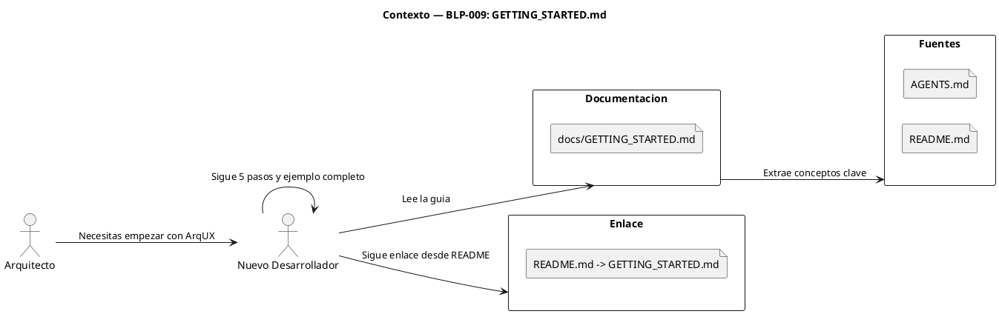

<!-- BLP:TITLE -->
# BLP-009: Crear GETTING_STARTED.md como documentacion humana de ArqUX en lenguaje natural
<!-- /BLP:TITLE -->

---

<!-- BLP:1 -->
## §1: Planteamiento del Problema

ArqUX tiene dos audiencias con diferentes puntos de entrada: los AGENTES leen AGENTS.md para entender donde estan y como operar, mientras que los DESARROLLADORES necesitan documentacion humana que explique el modelo. Actualmente los desarrolladores no tienen una guia que puentee desde "que es ArqUX" hasta "como implementarlo con quickstart".

**Evidencia:**
- AGENTS.md usa sigilos CORTEX que un humano normal no entiende
- Las skills estan optimizadas para lectura por agentes, no por personas
- No existe una guia que explique: "ArqUX para desarrolladores — desde cero hasta tu primer BLP"
- El comando quickstart (BLP-008) existe pero sin documentacion que explique cuando y por que usarlo

**Impacto de no resolverlo:**
Los desarrolladores no entienden el modelo de ArqUX ni saben que herramientas usar (quickstart para implementar, AGENTS.md para agentes). La adopcion enterprise requiere documentacion humana que conecte todos los puntos.
<!-- /BLP:1 -->

<!-- BLP:2 -->
## §2: Objetivo

Crear docs/GETTING_STARTED.md como guia humana para desarrolladores: que es ArqUX, como se relacionan AGENTS.md (para agentes) y quickstart (para desarrolladores), y 5 pasos para implementarlo desde cero. Lenguaje natural, ejemplos concretos, cero sigilos.
<!-- /BLP:2 -->

<!-- BLP:3 -->
## §3: Precondiciones

- [ ] docs/ directory existe en el proyecto
- [ ] ArqUX framework funcional (v0.4.1+)
- [ ] AGENTS.md, skills, y templates disponibles como referencia
- [ ] README.md existe (para enlazar desde ahi)
<!-- /BLP:3 -->

<!-- BLP:4 -->
## §4: Principio Rector

Hay tres puntos de entrada en ArqUX, cada uno para una audiencia diferente: AGENTS.md es para agentes que llegan al workspace, quickstart es para desarrolladores que implementan gobierno, GETTING_STARTED.md es para desarrolladores que quieren entender el modelo completo. La guia debe explicar esta distincion claramente.

**Evidencia del problema:** Sin GETTING_STARTED.md, un desarrollador no sabe si debe leer AGENTS.md, ejecutar quickstart, o llamar a un handler.

**Impacto si se viola:** Si la guia no distingue entre audiencias (agente vs desarrollador), el lector se confunde sobre que herramienta usar y cuando.
<!-- /BLP:4 -->

<!-- BLP:5 -->
## §5: Contexto

<!-- /BLP:5 -->

<!-- BLP:6 -->
## §6: Alcance y Exclusiones

**Dentro del alcance:**
- Crear docs/GETTING_STARTED.md con:
  - Que es ArqUX (3 parrafos, lenguaje natural)
  - Los 3 puntos de entrada: AGENTS.md (agentes), quickstart (desarrolladores), GETTING_STARTED.md (esta guia)
  - 5 pasos para implementar ArqUX: (1) instalar, (2) ejecutar quickstart, (3) crear proyecto, (4) abrir ciclo, (5) crear y ejecutar BLP
  - Glosario humano: Workspace, Proyecto, Ciclo, Blueprint, Agente, Rol
  - Ejemplo completo: "Como implementar ArqUX en tu proyecto"
- Agregar enlace en README.md

**Fuera del alcance (excluido explicitamente):**
- Documentacion de API de handlers (cubierto por BLP-006)
- Documentacion de skills
- Traducciones a otros idiomas
- Video tutoriales o screencasts
<!-- /BLP:6 -->

<!-- BLP:7 -->
## §7: Reglas Obligatorias

1. Cero sigilos CORTEX en el texto — ni $0, ni AXM, ni WRK
2. Cero terminologia de agentes — usar "tu" en lugar de "el agente"
3. Explicar cada concepto la primera vez que aparece
4. Incluir ejemplos de comandos reales (con $, como en terminal)
5. La guia debe ser util sin conexion (sin enlaces a docs externos como unica fuente)
<!-- /BLP:7 -->

<!-- BLP:8 -->
## §8: Diseño Técnico

_Arquitectura esperada: componentes, flujo de datos, capas. Esto es lo que construye el ejecutor. Debe ser inequívoco — un agente leyendo esto debe entender exactamente qué crear._

<!-- /BLP:8 -->

<!-- BLP:9 -->
## §9: Diseño Operacional

_Diagrama de secuencia que muestra el FLUJO DE EJECUCIÓN EXACTO: paso a paso, quién hace qué, en qué orden. Un agente ejecutor sigue esto como un guión._

<!-- /BLP:9 -->

<!-- BLP:10 -->
## §10: Contratos

**Entradas esperadas:**
- README.md para agregar enlace
- AGENTS.md, skills, templates como referencia de contenido

**Salidas esperadas:**
- docs/GETTING_STARTED.md

**Comandos:**
- (solo creacion de archivo, sin script)
<!-- /BLP:10 -->

<!-- BLP:11 -->
## §11: Procedimiento de Trabajo

### Fase 1: Estructura
1. Definir secciones del documento alineadas con la arquitectura BLP-008
2. Redactar "Que es ArqUX" explicando las dos audiencias

### Fase 2: Redaccion
1. Escribir docs/GETTING_STARTED.md con:
   - Introduccion: "ArqUX es un framework de gobierno para equipos de agentes IA..."
   - "Como funciona": AGENTS.md es para agentes, quickstart es para desarrolladores
   - Instalacion: pip install, uv sync
   - 5 pasos: (1) instalar, (2) ejecutar quickstart, (3) crear proyecto, (4) abrir ciclo, (5) crear BLP
   - Glosario humano: Workspace, Proyecto, Ciclo, Blueprint, Agente, Rol
   - Ejemplo completo: "De cero a tu primer BLP en 10 minutos"
2. Agregar enlace en README.md

### Fase 3: Validacion
1. Leer como si fueras un desarrollador que no conoce ArqUX
2. Verificar que no hay sigilos ni terminologia CORTEX
3. Verificar que la distincion agente/desarrollador es clara

> **Reversion:** git checkout docs/GETTING_STARTED.md README.md
<!-- /BLP:11 -->

<!-- BLP:12 -->
## §12: Criterios de Aceptacion

- [x] **AC-01:** docs/GETTING_STARTED.md existe
  > [2026-07-11T16:42:17Z] Verified: verified via file check
- [x] **AC-02:** Explica que es ArqUX en 3 parrafos o menos (lenguaje natural, sin sigilos)
  > [2026-07-11T16:42:17Z] Verified: verified via file check
- [x] **AC-03:** Distingue claramente: AGENTS.md (agentes), quickstart (desarrolladores), GETTING_STARTED.md (esta guia)
  > [2026-07-11T16:42:17Z] Verified: verified via file check
- [x] **AC-04:** Guia de 5 pasos para implementar ArqUX con comandos reales
  > [2026-07-11T16:42:17Z] Verified: verified via file check
- [x] **AC-05:** Incluye glosario en lenguaje natural (sin CORTEX, sin $, sin sigilos)
  > [2026-07-11T16:42:17Z] Verified: verified via file check
- [x] **AC-06:** Incluye ejemplo completo: de instalacion a primer BLP
  > [2026-07-11T16:42:17Z] Verified: verified via file check
- [x] **AC-07:** README.md tiene enlace a GETTING_STARTED.md
  > [2026-07-11T16:42:17Z] Verified: verified via file check
- [x] **AC-08:** Cero ocurrencias de sigilos CORTEX en el texto
  > [2026-07-11T16:42:18Z] Verified: verified via file check
<!-- /BLP:12 -->

<!-- BLP:13 -->
## §13: Validaciones Requeridas

| Tipo | Descripcion | Comando | Evidencia Esperada |
|---|---|---|---|
| contenido | Verificar sin sigilos CORTEX | grep -c '\$[0-9]\|AXM\|WRK\|LNG' docs/GETTING_STARTED.md | 0 |
| contenido | Verificar 5 pasos | grep -c 'Paso' docs/GETTING_STARTED.md | 5 |
| enlace | Verificar enlace en README | grep 'GETTING_STARTED' README.md | 1 |
<!-- /BLP:13 -->

<!-- BLP:14 -->
## §14: Tareas

- [x] **T-1.1:** Definir estructura y secciones del documento
  > [2026-07-11T16:41:59Z] Structure: intro, 3 docs, 5 steps, glossary, example
- [x] **T-1.2:** Redactar docs/GETTING_STARTED.md completo
  > [2026-07-11T16:41:59Z] docs/GETTING_STARTED.md with full content
- [x] **T-1.3:** Agregar enlace en README.md y validar sin sigilos
  > [2026-07-11T16:41:59Z] README badge + link. Zero CORTEX sigils in doc.
<!-- /BLP:14 -->

<!-- BLP:15 -->
## §15: Riesgos

| ID | Descripcion | Impacto | Mitigacion |
|---|---|---|---|
| R-01 | El documento puede quedar muy tecnico o muy basico | Medio | Tono: "colega desarrollador explicandote el framework", ni formal ni infantil |
| R-02 | Los comandos de ejemplo pueden desactualizarse | Bajo | Usar comandos estables (arqux call, no internos) |
| R-03 | El glosario puede ser incompleto | Bajo | Incluir solo terminos esenciales para empezar |
<!-- /BLP:15 -->

<!-- BLP:16 -->
## §16: Regla de Bloqueo

1. El documento contiene sigilos CORTEX visibles ($0, AXM, WRK, etc.)
2. El ejemplo completo no es ejecutable con comandos reales
3. La guia asume conocimiento previo de ArqUX o CORTEX

**Accion:** DETENER_E_INFORMAR
**Escalar a:** Arquitecto
<!-- /BLP:16 -->

<!-- BLP:17 -->
## §17: Salida Esperada

**Archivos creados:**
- docs/GETTING_STARTED.md

**Archivos modificados:**
- README.md (enlace a la guia)

**Evidencia:**
- grep -c '\$[0-9]\|AXM\|WRK\|LNG' docs/GETTING_STARTED.md = 0
- grep 'GETTING_STARTED' README.md = 1

**Resumen:**
> Guia humana de ArqUX: que es, 5 pasos para empezar, glosario, ejemplo completo. Cero sigilos CORTEX.
<!-- /BLP:17 -->

<!-- BLP:18 -->
## §18: Contrato de Calidad

| Compuerta | Estado |
|---|---|
| has_clear_objective | ☐ |
| has_verifiable_preconditions | ☐ |
| has_scope_and_exclusions | ☐ |
| has_acceptance_criteria | ☐ |
| has_work_procedure | ☐ |
| has_required_validations | ☐ |
| has_learning_recorded | ☐ |
<!-- /BLP:18 -->

> Todas las compuertas deben estar en ✅ antes de blueprint.ready(). Ver blueprint-workflow skill.