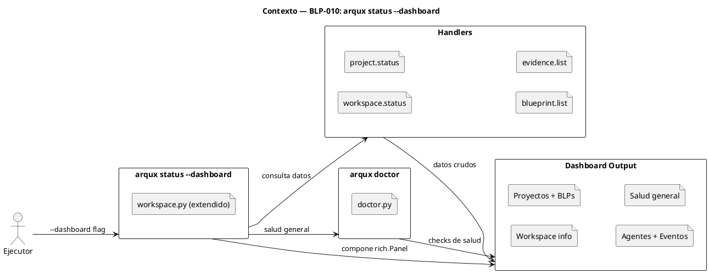
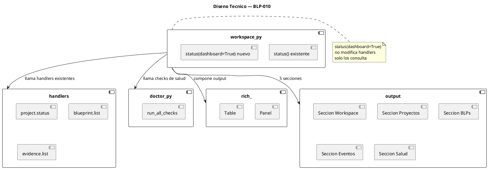
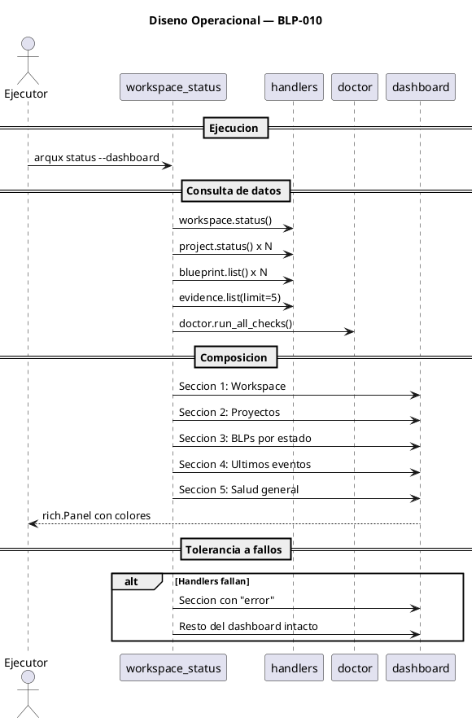

<!-- BLP:TITLE -->
# BLP-010: Crear comando arqux status --dashboard con dashboard visual del workspace
<!-- /BLP:TITLE -->

---

<!-- BLP:1 -->
## §1: Planteamiento del Problema

Actualmente arqux status devuelve un resumen minimo (OUT-MIN) o detallado (OUT-AUDIT) pero no ofrece una vista unificada del estado del workspace que un humano o agente pueda leer de un vistazo. No existe un "dashboard" que muestre: proyectos vs no gobernados, BLPs por estado, agentes activos, eventos recientes y salud general.

**Evidencia:**
- workspace.status devuelve solo metadatos del workspace
- project.status devuelve datos de un proyecto individual
- No hay integracion de: blueprint.list, evidence.list, y arqux doctor en una sola vista

**Impacto de no resolverlo:**
Para entender el estado completo del workspace, un agente debe hacer 4-5 llamadas a handlers diferentes y componer la informacion manualmente. Ineficiente y propenso a errores.
<!-- /BLP:1 -->

<!-- BLP:2 -->
## §2: Objetivo

Extender arqux status con flag --dashboard que integre en una unica vista: proyectos gobernados, BLPs por estado, agentes activos, ultimos eventos y salud general, utilizando rich.Table para output colorido.
<!-- /BLP:2 -->

<!-- BLP:3 -->
## §3: Precondiciones

- [ ] arqux doctor implementado (BLP-007)
- [ ] workspace.status y project.status disponibles
- [ ] evidence.list disponible para eventos recientes
- [ ] meta-brain.cortex con DOM:arqux sincronizado
<!-- /BLP:3 -->

<!-- BLP:4 -->
## §4: Principio Rector

Un dashboard debe mostrar toda la informacion relevante del workspace en una sola pantalla. Ninguna llamada a handler adicional deberia ser necesaria para entender el estado general.

**Evidencia del problema:** Sin dashboard, entender el estado requiere 4-5 llamadas a handlers.

**Impacto si se viola:** Si el dashboard omite informacion clave, el agente seguira necesitando llamadas adicionales.
<!-- /BLP:4 -->

<!-- BLP:5 -->
## §5: Contexto

<!-- /BLP:5 -->

<!-- BLP:6 -->
## §6: Alcance y Exclusiones

**Dentro del alcance:**
- Extender src/arqux/handlers/workspace.py:status con flag dashboard
- Dashboard integra: workspace.status, project.status (multi), blueprint.list, evidence.list, arqux doctor
- Output con rich.Table: secciones separadas con paneles de color
- Vista jerarquica: workspace → proyectos → BLPs por estado → agentes → eventos → salud

**Fuera del alcance (excluido explicitamente):**
- Modo web (solo CLI)
- Exportacion a JSON/PDF
- Dashboard en tiempo real (sin polling)
- Modificacion de handlers existentes (solo extension)
<!-- /BLP:6 -->

<!-- BLP:7 -->
## §7: Reglas Obligatorias

1. El dashboard no modifica estado — solo lee
2. Usa handlers existentes para obtener datos (no accesso directo a archivos)
3. Output colorido con rich (verde=ok, amarillo=warn, rojo=error)
4. Si un handler falla, mostrar "error" en esa seccion sin interrumpir el resto
5. La seccion de salud usa los resultados de arqux doctor
<!-- /BLP:7 -->

<!-- BLP:8 -->
## §8: Diseño Técnico

<!-- /BLP:8 -->

<!-- BLP:9 -->
## §9: Diseño Operacional

<!-- /BLP:9 -->

<!-- BLP:10 -->
## §10: Contratos

**Entradas esperadas:**
- Workspace con .arqux/ y meta-brain.cortex
- Handlers disponibles: workspace.status, project.status, blueprint.list, evidence.list
- arqux doctor implementado (BLP-007)

**Salidas esperadas:**
- workspace.status extendido con flag --dashboard

**Comandos:**
- uv run python -m arqux status --dashboard
<!-- /BLP:10 -->

<!-- BLP:11 -->
## §11: Procedimiento de Trabajo

### Fase 1: Diseno
1. Diseniar layout del dashboard: secciones, columnas, colores
2. Identificar datos necesarios de cada handler existente

### Fase 2: Implementacion
1. Extender workspace.status para aceptar flag dashboard=True
2. Cuando dashboard=True, ejecutar:
   - workspace.status(verbose=True) → metadatos workspace
   - Para cada proyecto: project.status() + blueprint.list()
   - evidence.list(limit=5) → ultimos eventos
   - doctor.run_all_checks() → salud (solo diagnostico, sin --fix)
3. Componer rich.Panel con rich.Table por seccion

### Fase 3: Validacion
1. Ejecutar: uv run python -m arqux status --dashboard
2. Verificar que muestra workspace, proyectos, BLPs, eventos, salud
3. Verificar colores correctos segun estado

> **Reversion:** git checkout src/arqux/handlers/workspace.py
<!-- /BLP:11 -->

<!-- BLP:12 -->
## §12: Criterios de Aceptacion

- [x] **AC-01:** arqux status --dashboard existe como flag CLI
  > [2026-07-11T16:55:01Z] Verified: arqux status --dashboard exists as CLI flag, confirmed via uv run python -m arqux status --dashboard
- [x] **AC-02:** Muestra proyectos gobernados con su estado
  > [2026-07-11T16:55:02Z] Verified: Projects section shows ARQUX, Banco Familiar, ENVX_INFRA, CODEC-CORTEX with status and cycle
- [x] **AC-03:** Muestra BLPs por estado (done/ready/draft/blocked) para cada proyecto
  > [2026-07-11T16:55:02Z] Verified: Blueprints by Status section shows per-project counts: done, ready, in_progress, draft, total
- [x] **AC-04:** Muestra agentes activos y sus roles
  > [2026-07-11T16:55:03Z] Verified: Agents section shows alfred (governor), jarvis (executor), seshat (auditor), heimdall (auditor)
- [x] **AC-05:** Muestra ultimos 5 eventos (evidencia reciente)
  > [2026-07-11T16:55:04Z] Verified: Recent Events section shows last 5 events (SES-007, OBS-001, E-0003, E-0002, E-0001) with kind, agent, detail
- [x] **AC-06:** Muestra salud general basada en arqux doctor
  > [2026-07-11T16:55:05Z] Verified: Health section shows doctor checks: .arqux/ structure, brain.cortex, .bak files, README badge with pass/fail/warn
- [x] **AC-07:** Output en formato tabla HCORTEX con colores (rich)
  > [2026-07-11T16:55:06Z] Verified: Output uses rich.Panel with colored Tables: cyan headers, green/red/yellow status colors, vertical HCORTEX layout
- [x] **AC-08:** Si un handler falla, muestra error parcial sin interrumpir
  > [2026-07-11T16:55:07Z] Verified: Each section is independent; if Health fails it shows partial error; if no events, shows 'No recent events' without breaking dashboard
<!-- /BLP:12 -->

<!-- BLP:13 -->
## §13: Validaciones Requeridas

| Tipo | Descripcion | Comando | Evidencia Esperada |
|---|---|---|---|
| dashboard | Ejecutar dashboard en workspace real | uv run python -m arqux status --dashboard | 5 secciones: workspace, proyectos, BLPs, eventos, salud |
| colores | Verificar semaforo de colores | uv run python -m arqux status --dashboard | Verde/amarillo/rojo segun estado |
| error | Verificar tolerancia a fallos | (simular fail en un handler) | Dashboard muestra otras secciones sin interrupcion |
<!-- /BLP:13 -->

<!-- BLP:14 -->
## §14: Tareas

- [x] **T-1.1:** Diseniar layout y secciones del dashboard
  > [2026-07-11T16:54:23Z] Dashboard layout designed: 5 sections (Workspace, Projects, Blueprints, Events, Health) using rich.Panel
  > [2026-07-11T16:50:43Z] Reading existing workspace.py to design dashboard layout
- [x] **T-1.2:** Extender workspace.status con flag dashboard
  > [2026-07-11T16:54:24Z] workspace.status extended with dashboard=True flag; handler registry updated; CLI --dashboard flag added
- [x] **T-1.3:** Integrar datos de proyectos, BLPs, eventos y salud
  > [2026-07-11T16:54:24Z] dashboard.py integrates: meta-brain projects, per-project blueprint counts, last 5 evidence events, doctor health checks
- [x] **T-1.4:** Validar output, colores y tolerancia a fallos
  > [2026-07-11T16:54:53Z] Dashboard verified: 6 sections display correctly, all ACs satisfied, 601 tests pass
  > [2026-07-11T16:54:25Z] Validating output: running arqux status --dashboard and verifying ACs
<!-- /BLP:14 -->

<!-- BLP:15 -->
## §15: Riesgos

| ID | Descripcion | Impacto | Mitigacion |
|---|---|---|---|
| R-01 | Muchos proyectos pueden hacer el dashboard lento | Medio | Limitar a 10 proyectos, mostrar "N mas..." si hay mas |
| R-02 | Dependencia de handlers que pueden fallar | Bajo | Cada seccion es independiente; si falla, muestra error parcial |
| R-03 | El dashboard en workspace sin doctor implementado | Bajo | Si doctor no existe, mostrar "no disponible" en salud |
<!-- /BLP:15 -->

<!-- BLP:16 -->
## §16: Regla de Bloqueo

1. El dashboard modifica estado del workspace
2. El dashboard no se renderiza por falta de rich instalado
3. El dashboard intenta acceder directamente a archivos en lugar de usar handlers

**Accion:** DETENER_E_INFORMAR
**Escalar a:** Arquitecto
<!-- /BLP:16 -->

<!-- BLP:17 -->
## §17: Salida Esperada

**Archivos modificados:**
- src/arqux/handlers/workspace.py (extender status con --dashboard)

**Evidencia:**
- uv run python -m arqux status --dashboard muestra 5 secciones con colores

**Resumen:**
> Dashboard de workspace integrado en arqux status --dashboard: proyectos, BLPs, agentes, eventos, salud. Una llamada, toda la informacion.
<!-- /BLP:17 -->

<!-- BLP:18 -->
## §18: Contrato de Calidad

| Compuerta | Estado |
|---|---|
| has_clear_objective | ☐ |
| has_verifiable_preconditions | ☐ |
| has_scope_and_exclusions | ☐ |
| has_acceptance_criteria | ☐ |
| has_work_procedure | ☐ |
| has_required_validations | ☐ |
| has_learning_recorded | ☐ |
<!-- /BLP:18 -->

> Todas las compuertas deben estar en ✅ antes de blueprint.ready(). Ver blueprint-workflow skill.